## { data-background-color="black"}

<span style="color:red; font-weight:bold; font-size:110px">D</span><span style="color:white; font-weight:bold; font-size:110px">ata </span>
<span style="color:red; font-weight:bold; font-size:110px">V</span>
<span style="color:white; font-weight:bold; font-size:110px">isualization</span>

<br>
Columbia University<br>
Spring 2020<br>
Thomas Brambor  
<br>

<span style="color:white; font-weight:bold; font-size:60px">1 - Getting Started with ggplot2</span>


# Visualization: Why, what, how?

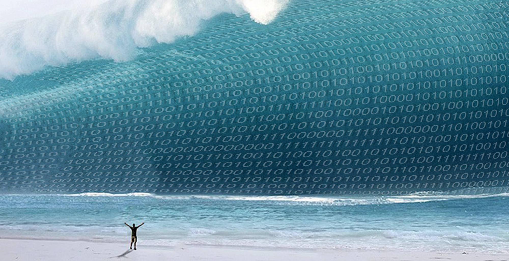


## Data Growth


<small>
* In 1984, the planet had roughly 20 million gigabytes (GB) of data stored digitally.  
* A zettabyte is 1 trillion gigabytes, or equal to the storage capacity of almost 4 billion iPhones (256GB model).  
See: https://medium.com/microsoft-design/big-data-have-you-afraid-youre-not-alone-1a26b65742fe
</small>

## {.centered}
 
> If we take all the data generated in the world between the beginning of time and 2008, the same amount of data will soon be generated **every minute**. (Bernard Marr)

## {data-background=#000000}

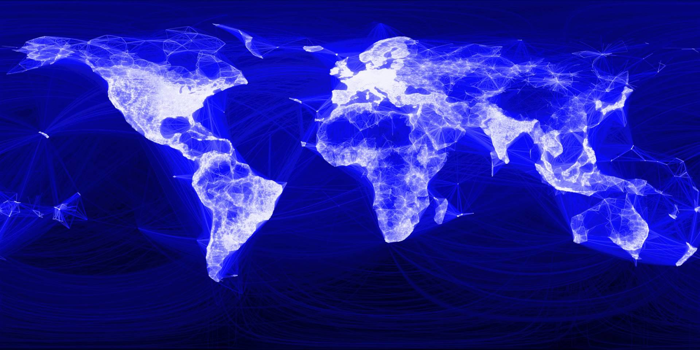

## {data-background=#000000}

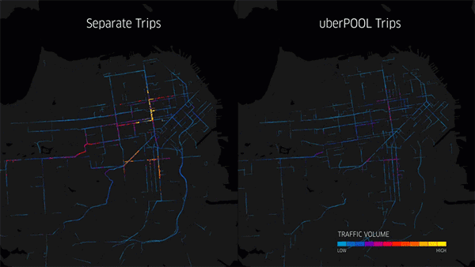

## {data-background=#000000}

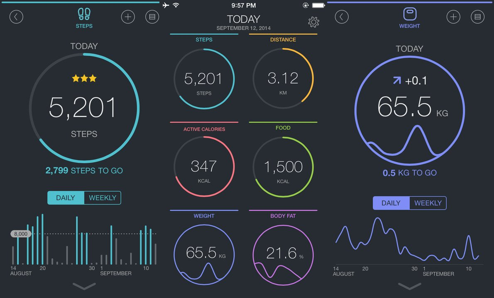

## {data-background=#000000}

<iframe  title="Twitter Pulse" width="800" height="800" src="http://twistori.com/#i_wish" frameborder="0" allowfullscreen align="right"></iframe>

## 

> “What information consumes is rather obvious:
it consumes the attention of its recipients.
Hence a wealth of information creates a poverty
of attention, and a need to allocate that
attention efficiently among the overabundance of
information sources that might consume it.”


<small> Herb Simon 
(as quoted by Hal Varian, Scientific American, September 1995)
</small>

# What is visualization?

## 

<span style="color:red; font-weight:bold; font-size:110px">visualization, _n._</span>

1. The action or fact of visualizing; the power or process of forming a mental picture or vision of something not actually present to the sight; a picture thus formed.

2. The action or process of rendering visible.

<small>Source: [oed.com](oed.com)</small>

## 

> Transformation of the symbolic into the geometric

[McCormick et al. 1987]

> ... finding the artificial memory that best supports
our natural means of perception.

[Bertin 1967]

>The use of computer-generated, interactive, visual 
representations of data to amplify cognition.

[Card, Mackinlay, & Shneiderman 1999]

## Visualization to Record Information


## Visualization to Analyze


<small>Source: https://truth-and-beauty.net/projects/peakspotting by Moritz Stefaner </small>

## Visualization to Present


<small>Source: Tynan DeBold and Dov Friedman of the [Wall Street Journal](http://graphics.wsj.com/infectious-diseases-and-vaccines/)</small>

## 

> Data, Data, Everywhere, and Not a Drop to Drink?


## 

> The ability to take data—to be able to **understand** it, to
**process** it, to **extract value** from it, to **visualize** it, to
**communicate** it — that’s going to be a hugely important skill
in the next decades, … because now we really do have
**essentially free and ubiquitous data**. So the
complimentary scarce factor is the ability to understand
that data and extract value from it.

<small>Hal Varian, Google’s Chief Economist
The McKinsey Quarterly, Jan 2009 </small>

# Intro to the Course

## Course Outline

* Part 1: Introduction and Plotting with ggplot2
* Part 2: Working with Spatial Data. Visualizing Maps
* Part 3: Text Analysis and Visualization
* Part 4: Networks 
* Part 5: More Dynamic and Interactive Visuals 

## Part 1: Introduction and Plotting with ggplot2


## Part 1: Intro to ggplot2

* Week 1
    + Intro. Setting up RStudio and ggplot2. 
    + Some basics of data visualizations. 
    + Starting with ggplot2: concepts, data, aesthetics, geometries.
* Week 2
    + Statistics, coordinates, facets, themes 
    + Best practices. Case study. 
* Week 3
    + Refining plots, themes, publication-ready.
    + Advanced plots and ggplot2 internals.
* Week 4: 
    + Making ggplot interative.
    + Using plot.ly

## Part 2: Working with Spatial Data

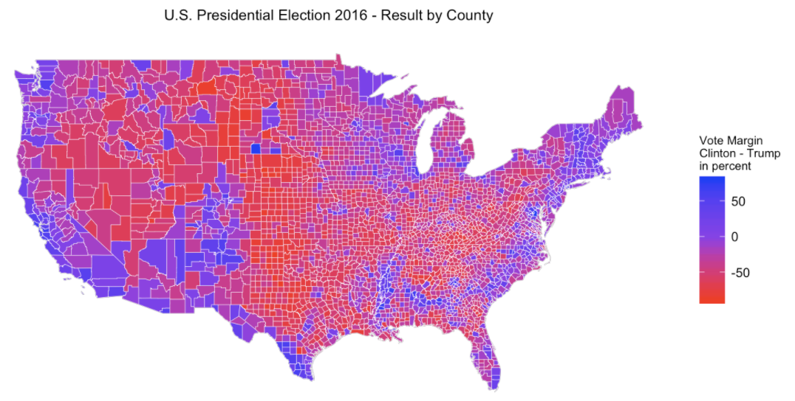

## Part 2: Working with Spatial Data


## Part 3: Text as Data


## Part 3: Text as Data

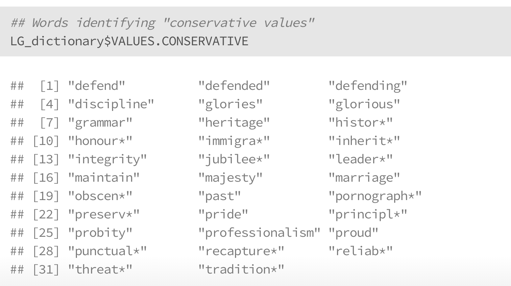

## Part 4: Networks

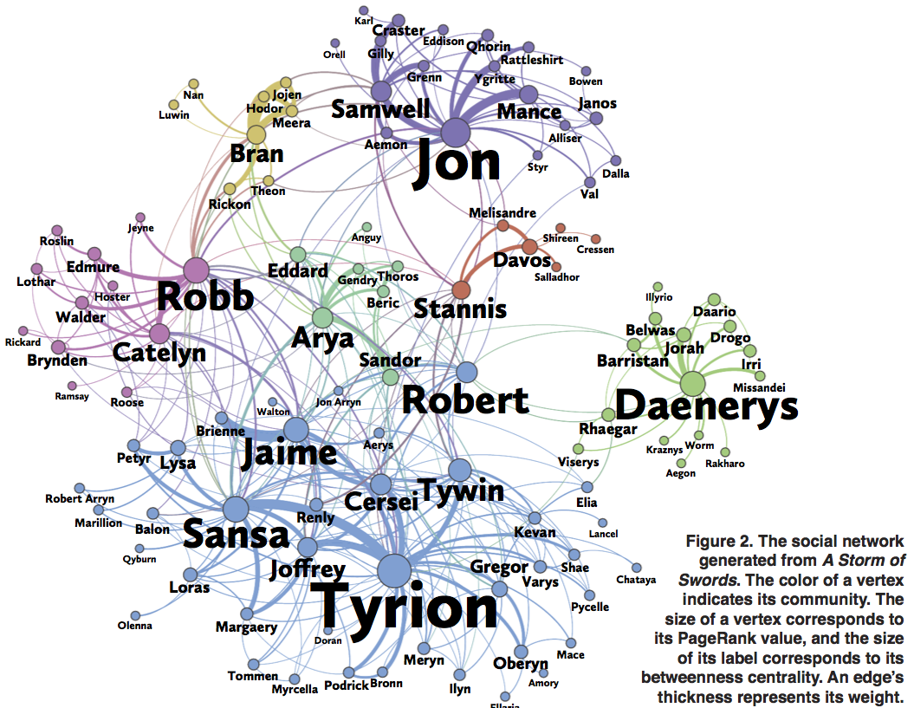

## Part 5: More Interactivity


## Part 5: More Interactivity

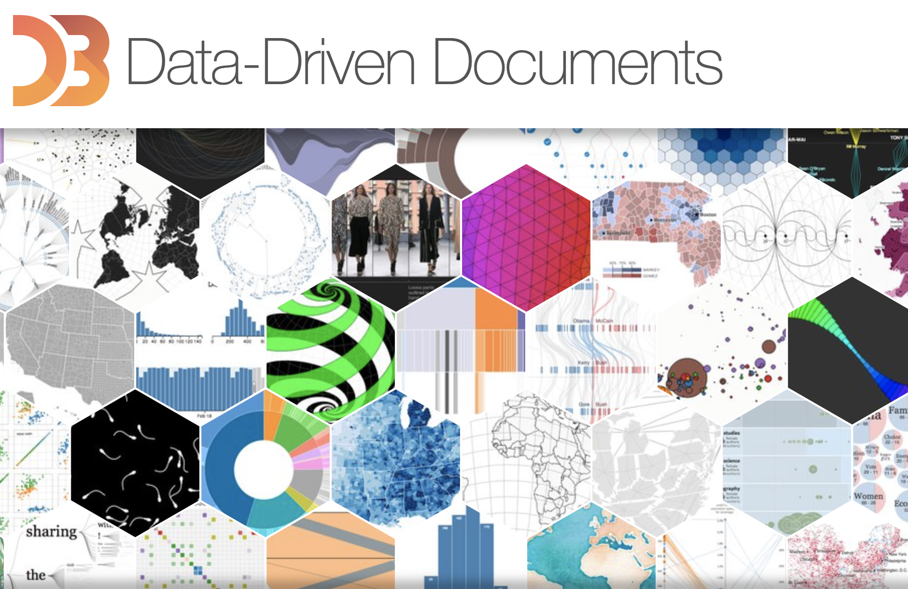

## The teaching team

**Instructor: Thomas Brambor**  
**[thomas.brambor@columbia.edu](thomas.brambor@columbia.edu)**  
**IAB 509E Mon 4.50 - 5.50pm**  

TA1: Yue (Eugene) Ji [yue.ji@columbia.edu](yue.ji@columbia.edu)  
Office Hours TBA IAB 270J 

TA1: Binqian Wang [bw2649@columbia.edu](bw2649@columbia.edu)  
Office Hours TBA IAB 270J  

TA2: Jiaxi Yang [jy2710@tc.columbia.edu](jy2710@tc.columbia.edu)  
Office Hours TBA IAB 270J  

## { data-background-color="black"}

{ width=100% }

## Communication

We are using a campuswire class forum to communicate.

{ width=40% }

Please refrain from email. For questions that seem only pertinent to you, just use a private question.

## Who are you?

>- Background / Discipline: Economics, History, Political Science, Psychology, Sociology, CS, Statistics, Other?
>- in QMSS / other program?
>- Just off the boat, or here second year?
>- used R before this course? Before QMSS?
>- used other programming language(s) before, e.g. Python, C++, SAS, MATLAB, SQL, Java etc.?
>- used R Markdown?
>- used GitHub?
>- familiarity with data visualization? ggplot2? 

## Data Viz as a Skill

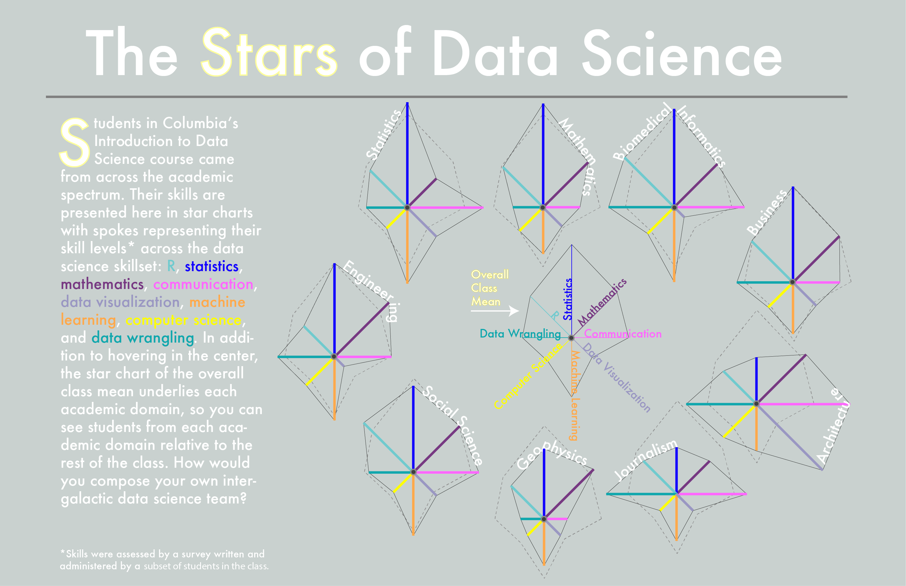{ width=100% }
<!---Survey conducted in “Introduction to Data Science” at Columbia, taught by Rachel Schutt-->

## Lectures

Mondays. 6.10 - 8pm

Don’t be late (it disrupts class and concentration). 

Bring a laptop if available. 
(*but check your facebook at home).

{ width=60% }

## Books & Readings

- No required text book. Yay!
- Several recommended books (available in the bookstore this week). All of the books are also on [reserve](https://www1.columbia.edu/sec-cgi-bin/cul/respac/respac?CRSE=20181qmss5063g001) in the library. 

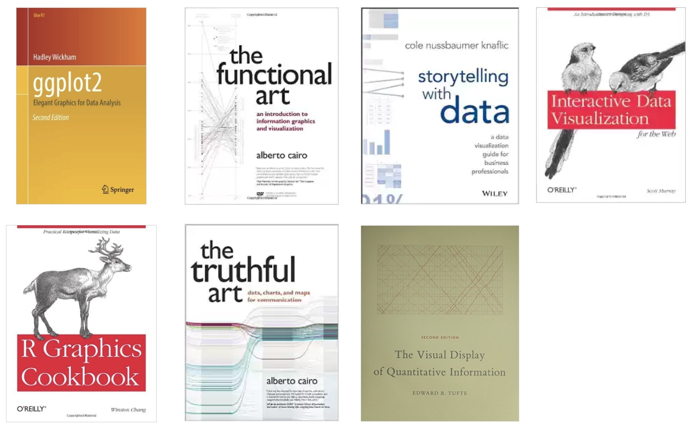{width=80%}

## <span style="color:white;">Taking Notes</span> { data-background-color="black"}

{width=50%}

## Taking Notes

- In class there will be a lot of back and forth between general explanatory material, bits of code, comments to ourselves, and other stuff

- My suggestion: take notes in [RStudio](www.rstudio.com) using R Markdown notebooks or a simple R Markdown file

- I suggest the same for assignments (more on that later).

- More info here: http://rmarkdown.rstudio.com/


## Why R Markdown?

PRO:

- Reproducible. For others and your later (forgetful) self.

- Live document. Combining code and output. Changes to your data or code will immediately update.

- supports numerous static and dynamic output formats including HTML, PDF, MS Word, Beamer, slides, shiny applications

- able to run different languages in one document

CON: 

- Typesetting not as detailed as Latex [R Markdown is designed for HTML, Latex for PDFs]

## {data-background-iframe="http://rmarkdown.rstudio.com/gallery.html"} 

## R Studio - Let’s do a quick intro

- Create a new project. 
- Create a new notebook file.

<br><br>

- For later: make some folders (Lectures / Exercises / Final Project etc.) to keep order.  
- If unfamiliar with R Markdown, work through http://rmarkdown.rstudio.com/ or similar tutorials to get going. 

## Course Website

- Piazza for discussion forum, announcements. Make sure to set your notification settings right.

- All lectures slides, in-class exercises, homework, code etc. will be made available here: https://github.com/QMSS-G5063-2020/course_materials

- Brief introduction to GitHub next week.

## Assignments 

- Final report (30%): A final group project in the form of a website and (if time allows) an in-class presentation.

- Assignments (60%): 4 individual assignments.

- Class participation (off line and online) & commentary on other student project (10%)

## Student Groups

- Final report is a group project with 3-4 students in each group.
- Try to find a group as soon as you can. Join groups set up on campuswire site.
- Will need to agree on a dataset to analyze (eiter choose from my suggestions or one of your own).
- These groups will also be one of your resources to master the course material.

## To Do for you

- Get R. Get R Studio. Bring laptop to class if you can.

- Install packages: 
ggplot2 / data.table / tidyverse  \& any others that are used in exercises

- Get to know your fellow students to form a group.

# What makes for good data visualization?
## Types of Visualizations

{ width=100% }

## Let's look at some graphs to warm up...

Which values are presented here?

{ width=70% }

## Did you guess right?

{ width=100% }

## Mmhh! Pie

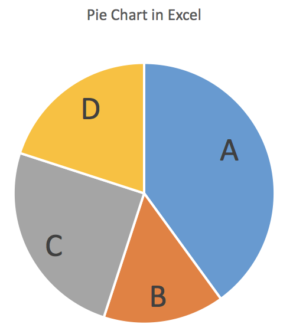{ width=50% }

## Got it right this time?

{ width=80% }

## What makes these graphs (or other figures) not work very well?

- **Misleading** -- The information provided is difficult to obtain or even misleading. Why?
- **Wrong form** -- To allow comparison, the viewer needs to be able to make comparison quickly and accurately.
- **Too much, or too little** Not all information is provided to make an assessment, or too much information that clouds the important stuff.
- **Poor design** -- Information may be provided, but the figure is ugly.

## Circles are rarely good choices for comparison

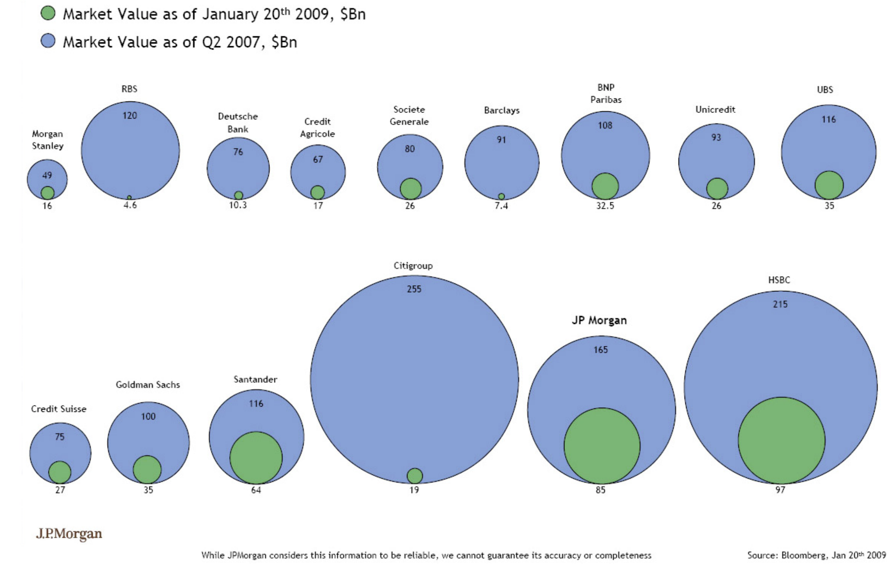{ width=80% }

## Same information -- much more readable

{ width=65% }
^[From: http://www.perceptualedge.com/articles/visual_business_intelligence/our_fascination_with_all_things_circular.pdf]

## A good visualization 

1. It is **truthful**: reliable information from honest research
2. It is **functional**: organized in a way that enables at least some exploration, when it’s appropriate
3. It is **beautiful**: attractive, intriguing, and even aesthetically pleasing
4. It is **insightful**:  reveals evidence that we would have a hard time seeing otherwise

\quote[Albert Cairo. 2016. “The Truthful Art: Data, Charts, and Maps for Communication"]

## 

<br>
<br>
“The greatest value of a picture is when it forces us to notice what we never expected to see.

**— John W. Tukey, Exploratory Data Analysis**

## Focus on the message you want to convey
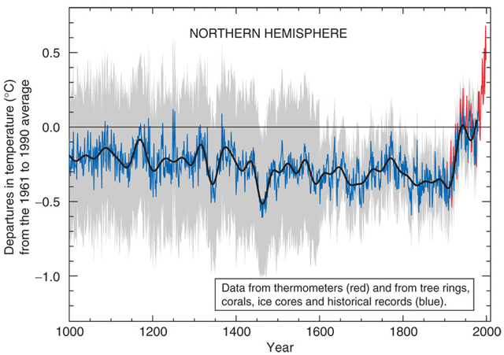{ width=70% }^[For more info, see https://en.wikipedia.org/wiki/Hockey_stick_graph]

## Other principles of data visualization
- each week, we will add a few guidelines or principles of data visualization 
- with examples from others or our own, we will learn what works and what does not
- **Lessons from today**: 3D and circular displays of information are rarely good ideas (and we will learn exactly why in the next data viz principles section)
- for now, let's get to practice actually making graphs a bit

# Let's get started with ggplot2
## An example: GDP and Life Expectancy


```r
library(ggplot2)
library(gapminder)  # 'gapminder' package contains the data
gapminder           # Let's take a look at the data
```

```
## # A tibble: 1,704 x 6
##    country     continent  year lifeExp      pop gdpPercap
##    <fct>       <fct>     <int>   <dbl>    <int>     <dbl>
##  1 Afghanistan Asia       1952    28.8  8425333      779.
##  2 Afghanistan Asia       1957    30.3  9240934      821.
##  3 Afghanistan Asia       1962    32.0 10267083      853.
##  4 Afghanistan Asia       1967    34.0 11537966      836.
##  5 Afghanistan Asia       1972    36.1 13079460      740.
##  6 Afghanistan Asia       1977    38.4 14880372      786.
##  7 Afghanistan Asia       1982    39.9 12881816      978.
##  8 Afghanistan Asia       1987    40.8 13867957      852.
##  9 Afghanistan Asia       1992    41.7 16317921      649.
## 10 Afghanistan Asia       1997    41.8 22227415      635.
## # … with 1,694 more rows
```

## Another look at the data frame


```r
str(gapminder)      # str() is a good way to look at the data frame
```

```
## Classes 'tbl_df', 'tbl' and 'data.frame':	1704 obs. of  6 variables:
##  $ country  : Factor w/ 142 levels "Afghanistan",..: 1 1 1 1 1 1 1 1 1 1 ...
##  $ continent: Factor w/ 5 levels "Africa","Americas",..: 3 3 3 3 3 3 3 3 3 3 ...
##  $ year     : int  1952 1957 1962 1967 1972 1977 1982 1987 1992 1997 ...
##  $ lifeExp  : num  28.8 30.3 32 34 36.1 ...
##  $ pop      : int  8425333 9240934 10267083 11537966 13079460 14880372 12881816 13867957 16317921 22227415 ...
##  $ gdpPercap: num  779 821 853 836 740 ...
```

## Simple Scatterplot


```r
ggplot(gapminder, aes(x = gdpPercap, y = lifeExp)) # nothing to plot yet!
```

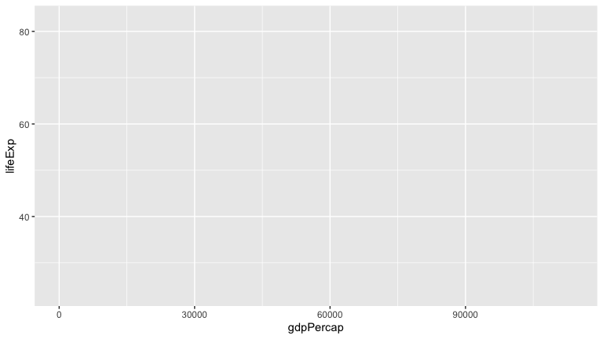

## Simple Scatterplot

We can make the graph into an object to alter and add stuff later:

```r
p <- ggplot(data = gapminder, aes(x = gdpPercap, y = lifeExp)) 
```

* we create an object p, containing the pieces of information that we are interested in plotting with ggplot
* x = gdpPercap and y = lifeExp define what will go in the x and y axes
* they are "aesthetic mappings" connecting pieces of data with the visibles in the plot

## Simple Scatterplot


```r
p + geom_point()   # Now we tell ggplot that we want a satter plot
```


## Simple Scatterplot


```r
ggplot( data = gapminder, aes(x = gdpPercap, y = lifeExp)) +
        geom_point()   
```

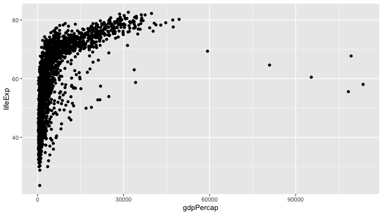

```r
  # Of course, we can write that in one swoop
```

## Log Transformation


```r
ggplot(gapminder, aes(x = log10(gdpPercap), y = lifeExp)) +
  geom_point() +
  scale_x_log10()
```

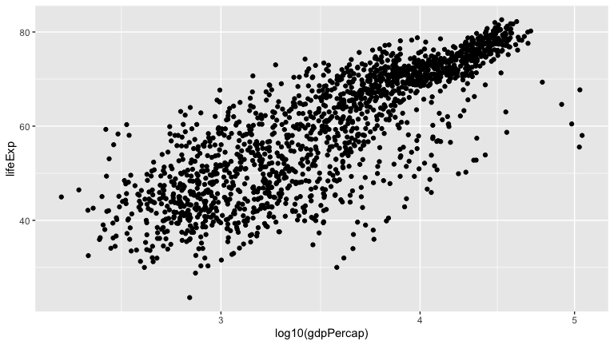

## Let's keep that scale setting


```r
p <- p + scale_x_log10()
```

## **Map** continent variable to aesthetic color

```r
p + geom_point(aes(color = continent))
```


## To recap: full plot command thus far


```r
ggplot(gapminder, aes(x = gdpPercap, y = lifeExp)) +
  geom_point(aes(color = continent)) + scale_x_log10() 
```


<small> Note, we put the aes() in the geom_point() element. We will see in a bit why. </small>

## Reduce overplotting 

```r
p + geom_point(aes(color = continent), alpha = 0.3, size=3)  
```

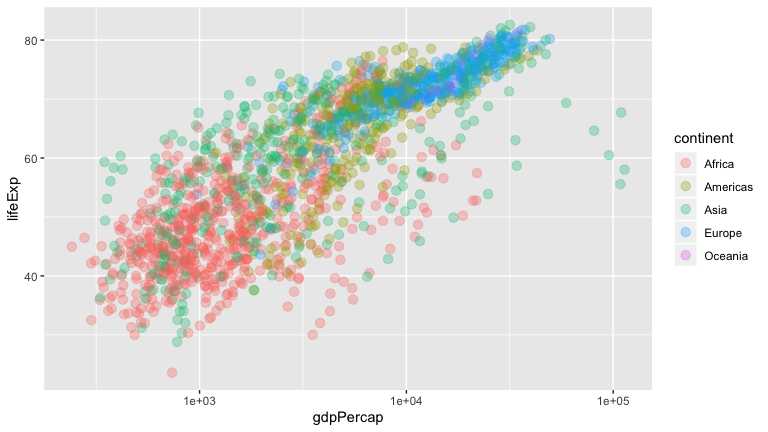

```r
  # Setting transparency of points
```

## Adding fitted curve

```r
p + geom_point(aes(color = continent)) + geom_smooth()  
```

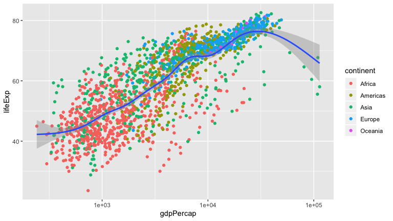

```r
  # by default, adds a loess fit
```

## Adding fitted curve

```r
p + geom_point(aes(color = continent)) + 
  geom_smooth(color="black", lwd=2, se=FALSE)  
```


```r
   # removing the confidence intervals
```

## We could exchange the order of the layers


```r
p + geom_smooth(color="black", lwd=2, se=FALSE) + 
  geom_point(aes(color = continent)) 
```


## Use a linear fit instead

```r
p + geom_point(aes(color = continent)) + geom_smooth(method="lm")  
```

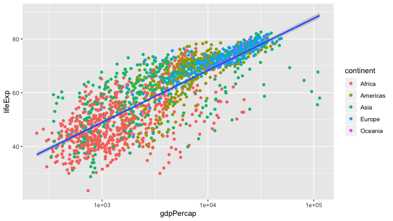

## Smooth fit by continent


```r
p + geom_point(aes(color = continent)) +
  geom_smooth(lwd = 2, se = FALSE, aes(color = continent))
```

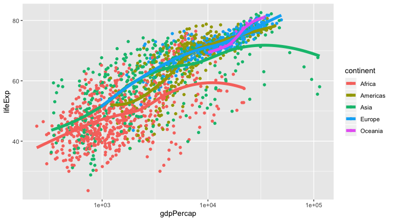

## Now all layers use the continent grouping


```r
# We could add the aes() grouping to the overall graph p
p <- p + aes(color = continent)
p + geom_point() +
  geom_smooth(lwd = 2, se = FALSE)
```


## Why another color=continent?


```r
# Our original plot command:
ggplot(gapminder, aes(x = gdpPercap, y = lifeExp)) +
  geom_point() + scale_x_log10() 

# A single smoothed line through all points:
ggplot(gapminder, aes(x = gdpPercap, y = lifeExp)) +
  geom_point() + scale_x_log10() + geom_smooth()

# Using the color aesthetic for the smoothing as well as the scatter points
ggplot(gapminder, aes(x = gdpPercap, y = lifeExp, color = continent)) +
  geom_point() + scale_x_log10() + geom_smooth(lwd=2, se=FALSE)

# Still single smoothed line but now points are colored by continent:
ggplot(gapminder, aes(x = gdpPercap, y = lifeExp, color = continent)) +
  geom_point(aes(color = continent)) + scale_x_log10() +
  geom_smooth(color="black")
```

# Grammar of Graphics
## The Grammar of Graphics

- ggplot is based on a "grammar" of graphics, an idea originated with Wilkinson (2005)

{width=30%}

## Main principles

* there are few main principles:
    + Graphics = distinct layers of grammatical elements (or grammar rules) that map pieces of data to geometric objects (like lines and points) and attributes (like color and size)
    + if necessary some additional rules about scales, projections in a coordinate system, and data transformations are possible
    + Plots arise through aesthetic mapping
* The grammar produces “sentences” (mappings of data to objects) but they can easily be garbled if you define poor mappings.

## Three key grammatical elements

| Element | Description | 
|------:|:-----:|
| **Data** | The dataset being plotted. |
| **Aes**thetics | The scales onto which we map our data. |
| **Geom**etries | The visual elements used for our data. | 

- every ggplot2 plot has these three key components

## All seven grammatical elements

| Element | Description | 
|------:|:-----:|
| **Data** | The dataset being plotted. |
| **Aes**thetics | The scales onto which we map our data. |
| **Geom**etries | The visual elements used for our data. | 
| **Facet**s | Plotting subsets of the data. | 
| **Stat**istics | Statistical representations of our data to aid understanding. | 
| **Coord**inates | The space on which the data will be plotted. | 
| **Theme**s | All non-data ink. | 

## A diagram of the graphical elements

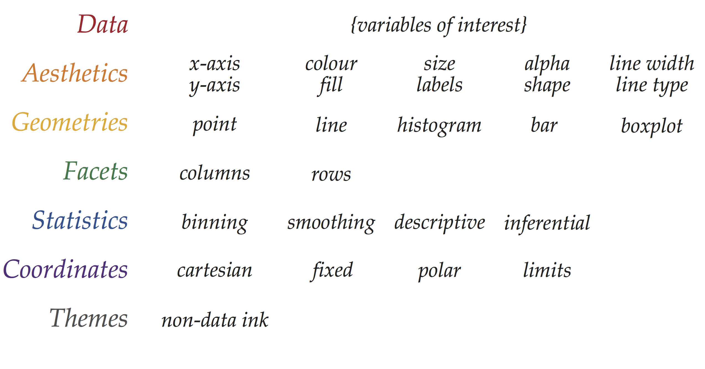{width=100%}

## ggplot2 layers: data 
<br><br><br><br><br><br><br><br>
{width=50%}


## ggplot2 layers: data 


```r
gapminder
```

```
## # A tibble: 1,704 x 6
##    country     continent  year lifeExp      pop gdpPercap
##    <fct>       <fct>     <int>   <dbl>    <int>     <dbl>
##  1 Afghanistan Asia       1952    28.8  8425333      779.
##  2 Afghanistan Asia       1957    30.3  9240934      821.
##  3 Afghanistan Asia       1962    32.0 10267083      853.
##  4 Afghanistan Asia       1967    34.0 11537966      836.
##  5 Afghanistan Asia       1972    36.1 13079460      740.
##  6 Afghanistan Asia       1977    38.4 14880372      786.
##  7 Afghanistan Asia       1982    39.9 12881816      978.
##  8 Afghanistan Asia       1987    40.8 13867957      852.
##  9 Afghanistan Asia       1992    41.7 16317921      649.
## 10 Afghanistan Asia       1997    41.8 22227415      635.
## # … with 1,694 more rows
```

## ggplot2 layers: aesthetics 

<br><br><br><br><br><br><br>
{width=50%}

## ggplot2 layers: aesthetics 


```r
ggplot(gapminder, aes(x = gdpPercap, y = lifeExp))
```
<br>


| country | continent | year | lifeExp | pop | gdpPercap |
|:-------|:---------|:----|:-------|:---|:---------|
|        |           |      |    y    |     |     x |

## ggplot2 layers: geometries

<br><br><br><br><br><br>
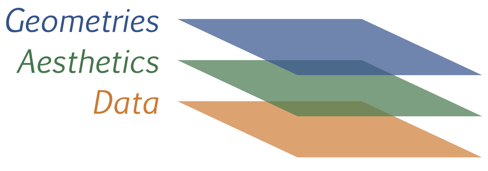{width=50%}

## ggplot2 layers: geometries


```r
ggplot(gapminder, aes(x = gdpPercap, y = lifeExp, color = continent)) +
        geom_point(alpha=0.5, size=3)
```

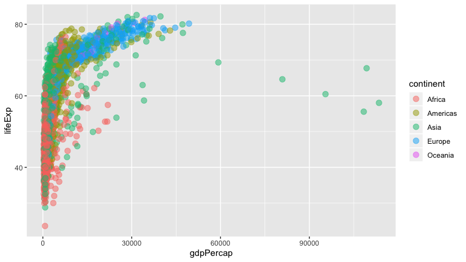

## ggplot2 layers: facets

<br><br><br><br><br>
{width=50%}

## ggplot2 layers: facets

```r
ggplot(gapminder, aes(x = gdpPercap, y = lifeExp, color = continent)) +
        geom_point(alpha=0.5, size=3) + 
        facet_grid( . ~ continent)
```

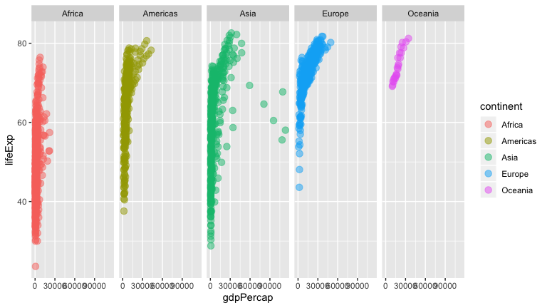

## ggplot2 layers: statistics

<br><br><br><br>
{width=50%}


## ggplot2 layers: statistics

```r
ggplot(gapminder, aes(x = gdpPercap, y = lifeExp, color = continent)) +
        geom_point(alpha=0.5, size=3) + 
        facet_grid( . ~ continent) + 
        geom_smooth(color="black", lwd=1, se=TRUE)  
```

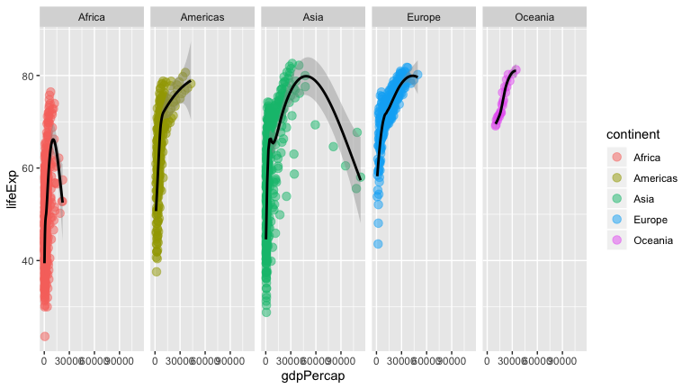

## ggplot2 layers: coordinates

<br><br><br>
{width=50%}

## ggplot2 layers: coordinates

```r
ggplot(gapminder, aes(x = gdpPercap, y = lifeExp, color = continent)) +
        geom_point(alpha=0.5, size=3) + 
        facet_grid( . ~ continent) + 
        geom_smooth(color="black", lwd=1, se=TRUE) + 
        scale_x_log10("GDP per Capita") +
        scale_y_continuous("Life Expectancy in Years")
```

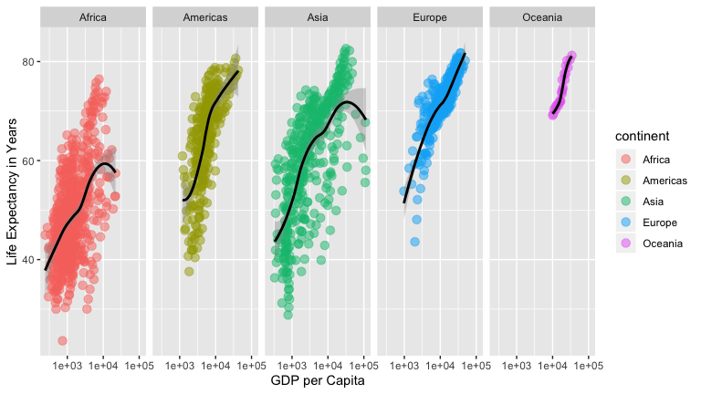

## ggplot2 layers: theme

<br><br>
{width=50%}

## ggplot2 layers: theme

```r
library(ggthemes)
ggplot(gapminder, aes(x = gdpPercap, y = lifeExp, color = continent)) +
        geom_point(alpha=0.5, size=3) + 
        facet_grid( . ~ continent) + 
        geom_smooth(color="black", lwd=1, se=TRUE) + 
        scale_x_log10("GDP per Capita") +
        ylab("Life Expectancy in Years") + 
        theme_tufte() + theme(legend.position="none")
```

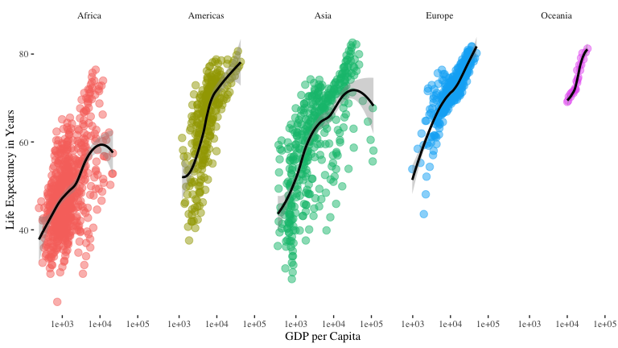

## ggplot2 layers: theme

```r
library(ggthemes)
ggplot(gapminder, aes(x = gdpPercap, y = lifeExp, color = continent)) +
        geom_point(alpha=0.5, size=3) + 
        facet_grid( . ~ continent) + 
        geom_smooth(color="black", lwd=1, se=TRUE) + 
        scale_x_log10("GDP per Capita", 
                      labels = scales::trans_format("log10", 
                      scales::math_format(10^.x))) + 
        ylab("Life Expectancy in Years") + 
        theme_economist() + 
        theme(legend.position="none") + 
        ggtitle("The relationship between wealth and longevity")
```

## ggplot2 layers: theme
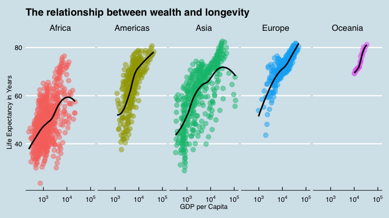

# On your own

## To Do at Home

- Get R Studio. Do R markdown tutorial.
- Sign up for Github (if you do not have an account yet.) Clone or fork the course material repository.

## Baby name exercise

Go through lecture notes and the babynames exercise to get started with ggplot2. 


