## { data-background-color="black"}

<span style="color:red; font-weight:bold; font-size:110px">D</span><span style="color:white; font-weight:bold; font-size:110px">ata </span>
<span style="color:red; font-weight:bold; font-size:110px">V</span>
<span style="color:white; font-weight:bold; font-size:110px">isualization</span>

<br>
Columbia University<br>
Spring 2020<br>
Thomas Brambor  
<br>

<span style="color:white; font-weight:bold; font-size:60px">2 - Data Visualization Principles and ggplot2 continued </span>


## Roadmap for Today

- Data Visualization Principles II 
- Continue with learning ggplot2
- On your own: Markdown and GitHub

<!-- 

# Dataviz in the News

## Be careful where your data goes...

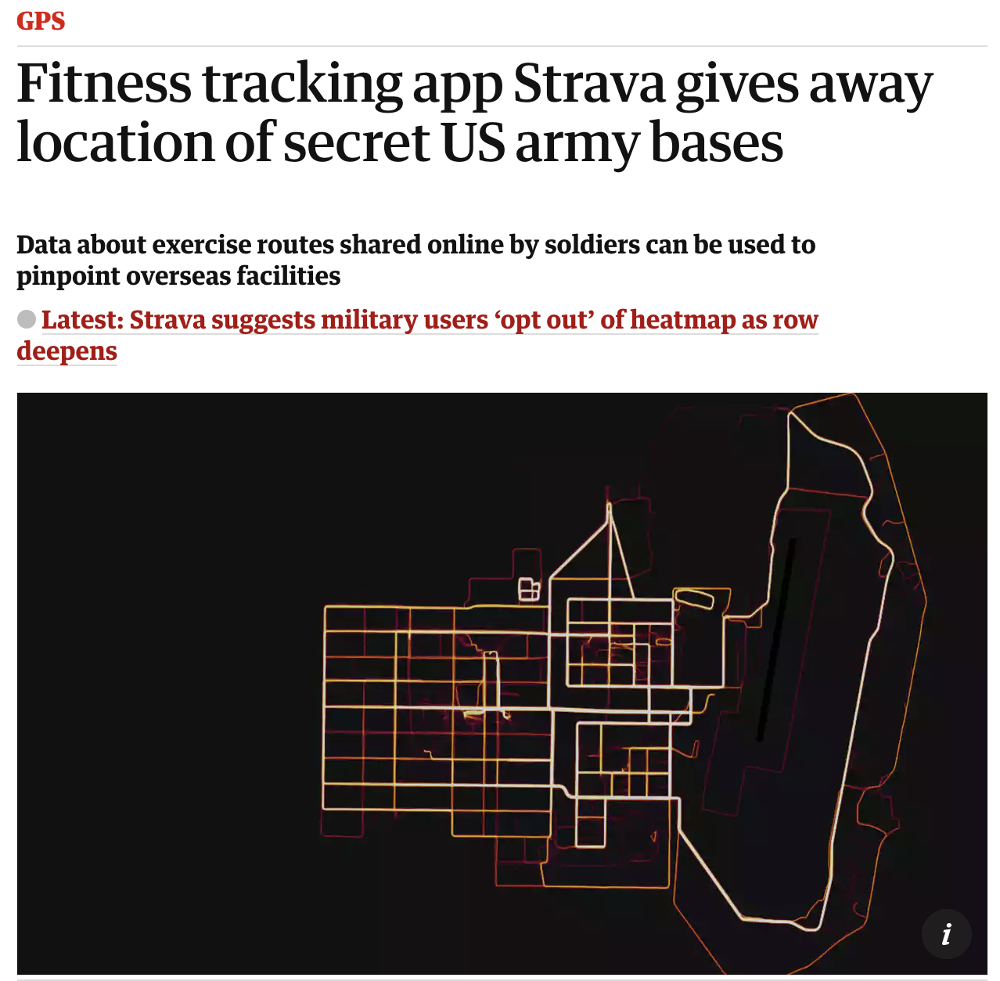{ width=70% }

<small>Source: https://www.theguardian.com/world/2018/jan/28/fitness-tracking-app-gives-away-location-of-secret-us-army-bases </small>

## `ggplot2` used by the BBC


<small>Source: https://medium.com/bbc-visual-and-data-journalism/how-the-bbc-visual-and-data-journalism-team-works-with-graphics-in-r-ed0b35693535 </small>

--> 

## Github

+ Signed up? If not: [http://bit.ly/signup_dataviz2020]( http://bit.ly/signup_dataviz2020)

+ You are encouraged to share all non-graded exercises! I added a repository called **sandbox** for which everyone has Git write access rights.

{ width=50% }


## { data-background-color="black"}

<br>
<br>
<span style="color:white; font-weight:bold; font-size:110px">Questions ?</span>


# Data Visualization Principles II

## { data-background-color="black"}

{ width=50% }

Beautiful. Knowledge?

## { data-background-color="black"}

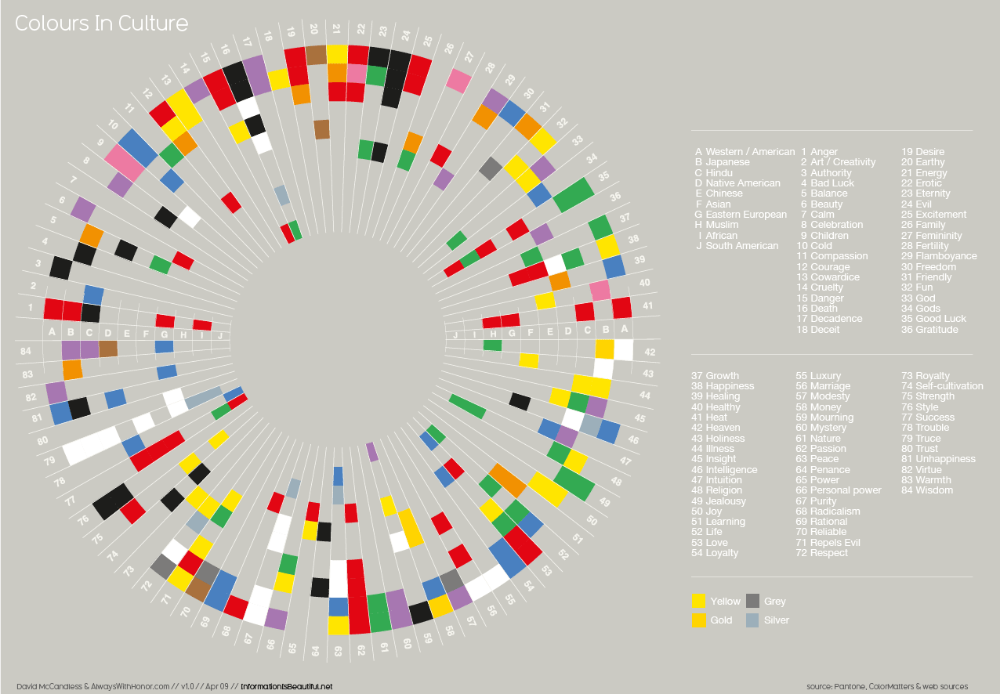{width=100%}

## { data-background-color="black"}

<span style="color:white; font-weight:bold; font-size:60px">
Test the **functionality** of your visualization.
</span>

<br> 

<span style="color:gray; font-weight:bold; font-size:40px">
Find the color for _**mourning**_ for _**Native Americans**_</span>

## { data-background-color="black"}

{width=100%}

## Function First

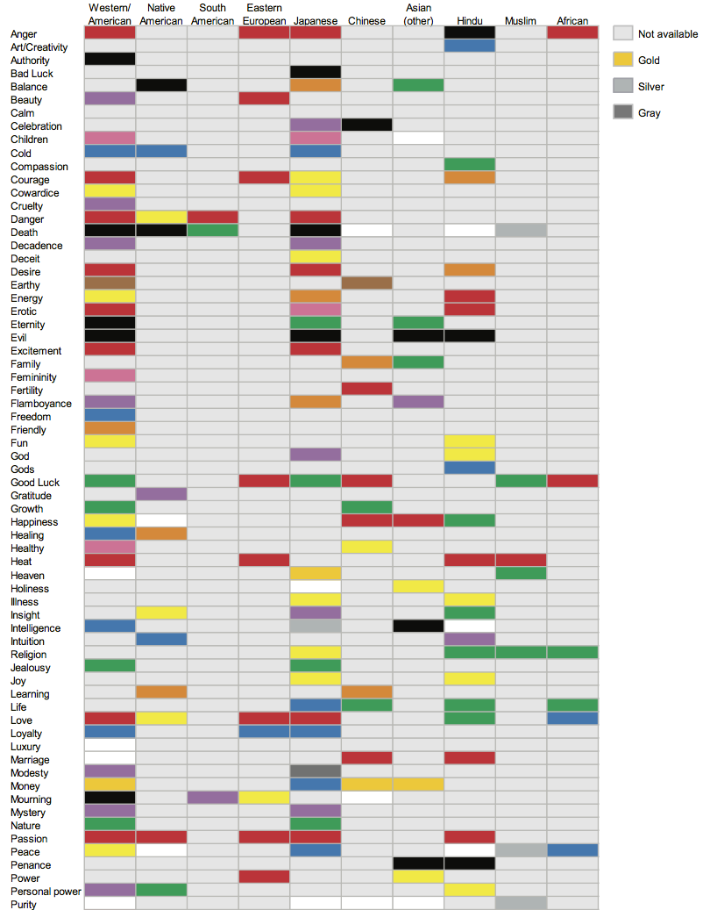{width=50%}

<small><small>"Our Irresistible Fascination with All Things Circular" Stephen Few, Perceptual Edge. Visual Business Intelligence Newsletter. March/April/May 2010</small></small>

## What is missing?

* Visualization should be: 

    [1] Truthful, [2] Functional, [3] Beautiful, [4] Insightful

* Which of the qualities does the original graphic have? Which ones does it lack?

{width=40%}

## Contrary views

> <small> The second example is what I call a temporal visualization. In this, we represent time by spiral. Spirals, I think, are very good ways of representing time-based events because they show you the frequency of data… </small>

<small>[Q&A: Data Visualization Offers Rich Views”, Linda L. Briggs. April 14, 2010](https://esj.com/Articles/2010/04/14/Data-Visualization.aspx)</small>

What do you think? 

{width=35%}

##  { data-background-color="black"}

{width=70%}

## Form follows function

> All things in nature have a shape, that is to say, a form, an outward semblance, that tells us what they are, that distinguishes them from ourselves and from each other. [..] they are so characteristic, so recognizable, that we say, simply, it is “natural” it should be so. [..] It is the pervading law of all things [..] that the life is recognizable in its expression, that **form ever follows function**. This is the law.

<small>[Louis H. Sullivan, “The Tall Office Building Artistically Considered.” Lippincott’s Magazine 57 (March 1896) pp 403-09](http://www.giarts.org/article/tall-office-building-artistically-considered-excerpt)</small>

## Legibility

> _Shall we, then, daily violate this law in our art? Are we so decadent, so imbecile, so utterly weak of eyesight, that we cannot perceive this truth so simple, so very simple?_

* **Functional** - We want to have legible, functional graphs that provide the correct information easily to the interested reader and allow exploration.  
* **Insightful** - We want to reveal evidence that was otherwise hard to see.


<span style="color:red; font-weight:bold">We need to understand the basic principles of visual perception.</span>

 

## Contrary Views: Information visualization and Statistical Graphs

> Can the **aesthetic elements of a data-visualization be considered as important as the data itself** in getting readers interested about a topic, leading them to shape an understanding of it and triggering their curiosity to explore more?

Giorgia Lupi, Information designer at Accurat, artist, and author

<small> https://medium.com/accurat-studio/beautiful-reasons-c1c6926ab7d7
</small>

## { data-background-color="black"}

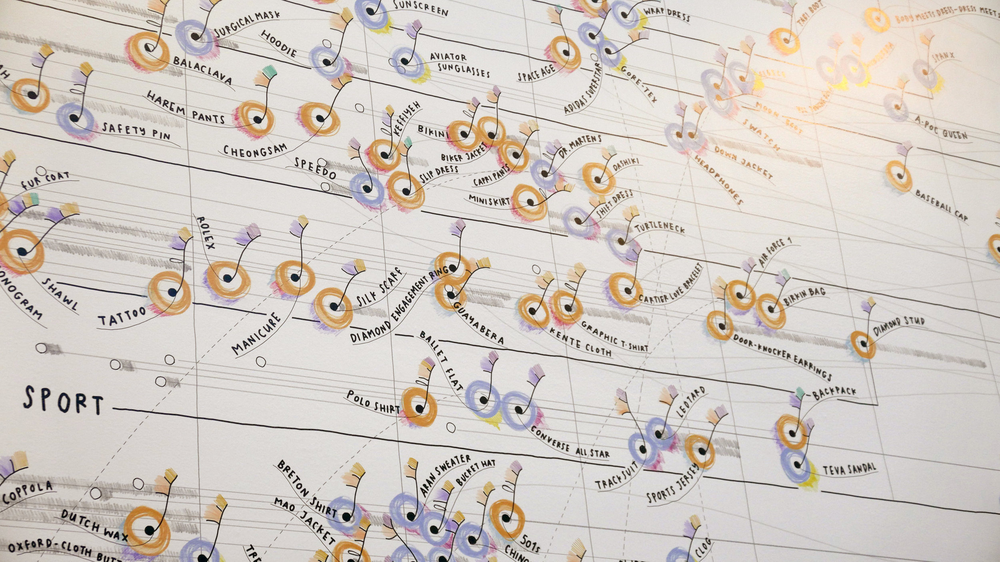{width=100%}

<small> Giorgia Lupi. [Data ITEMS: A Fashion Landscape 2017.](http://giorgialupi.com/work#/data-items-a-fashion-landscape-at-the-museum-of-modern-art/) </small>

## { data-background-color="black"}

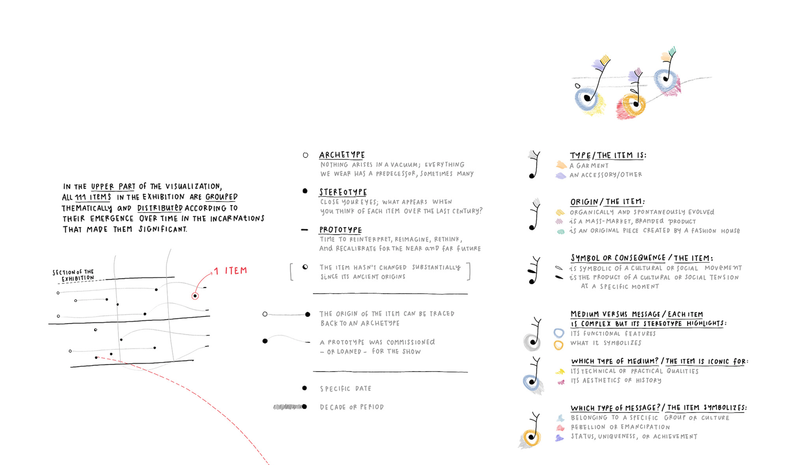{width=100%}

<small> Giorgia Lupi. [Data ITEMS: A Fashion Landscape 2017.](http://giorgialupi.com/work#/data-items-a-fashion-landscape-at-the-museum-of-modern-art/) </small>

## { data-background-color="black"}

{width=90%}

<small>[Giorgia Lupi and Kaki King on the value of beauty in design](https://www.youtube.com/watch?v=Rhx83zC0cD4)</small>

# Some principles of visual perception
## Perception

>- We more easily see **edges, contrasts, and movement**.
>- We judge **relative differences** rather than absolute values.
>- We process visual information using **preattentive attributes and patterns**.
>- We use **gestalt principles** to group individual elements into groups and differentiate between patterns. (_next week_)
>- We can estimate information from graphs differently depending on the **elementary perceptual task** involved.

## Edges

{width=60%}

## Edges

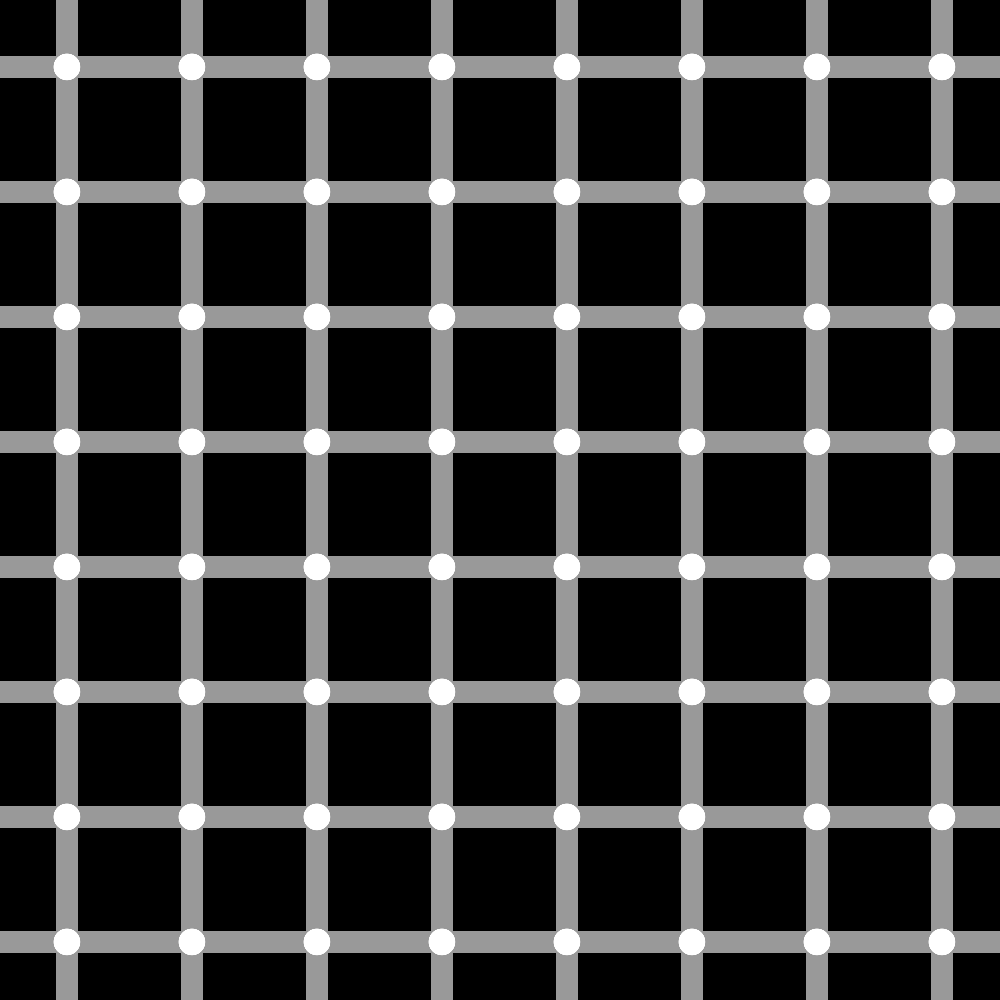{width=40%}

<small>[See more info on the Hermann grid effect](https://www.wikiwand.com/en/Grid_illusion)</small>

## Cornsweet Effect

{width=30%}
  
  
{width=30%}


<small>[Cornsweet Effect](https://en.wikipedia.org/wiki/Cornsweet_illusion) </small>

## Contrast

{width=70%} 


- relative differences between foreground and background matter
- color of foreground and background interact (see [Law of Simulatenous Contrast](https://www.wikiwand.com/en/Contrast_effect))

## Color adds complexity

{width=100%}

- We can easily see objects that are different in color and shape, or that are in motion.
- relative rather than absolute differences matter

## Tonal vs. color contrast

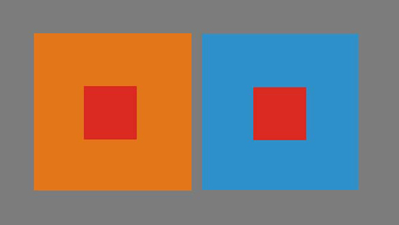{width=70%}

- Contrasting colors adds emphasis.
- Color contrast is another tool of emphasis when tonal contrast (light and dark) is hard to achieve.

## Fore- and Background Colors

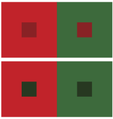{width=35%}

- The surrounding colors affect our perception of area sizes as well as our impression of the colors themselves. 
- The inner squares are identical but perceived differently due to background colors.

<small><small>Meirelles, I. (2013). Design for Information: An Introduction to the Histories, Theories, and Best Practices Behind Effective Information Visualizations. Rockport Publishers.
</small></small>

## { data-background-color="black"}

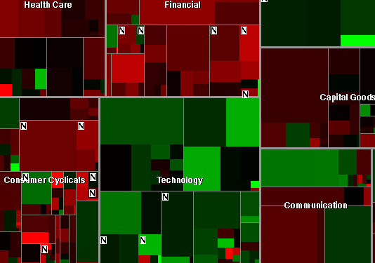{width=100%}


# Preattentive visual properties

## 

> We can easily see patterns presented in certain ways, but if they are presented in other ways, they become invisible [..] If we can understand how perception works, our knowledge can be translated into rules for displaying information. Following perception-based rules, we can present our data in such a way that the important and informative patterns stand out. If we disobey the rules, our data will be incomprehensible or misleading.

Colin Ware, _Information Visualization_

<small><small>From Ware, C. (2012). Information Visualization, Third Edition: Perception for Design (3 edition). Waltham, MA: Morgan Kaufmann.; Introduction</small></small>

## Preattentive visual proporties

- A **preattentive visual property** is processed in spatial memory without our conscious action (but we do need to be attentive).  
- fast: < 500 milliseconds for the eye and the brain to process 
- color and contrast between features matters most

## Preattentive visual properties

**Count the 3s!**

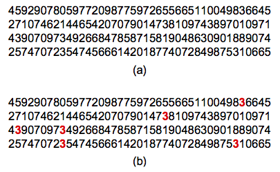{width=65%}

- Color is a preattentive property and helps to process the information in (b) faster.

<small><small>From Ware, C. (2012). Information Visualization, Third Edition: Perception for Design (3 edition). Waltham, MA: Morgan Kaufmann.; p.152</small></small>


{width=70%}

## Use preattentive properties to make better graphs

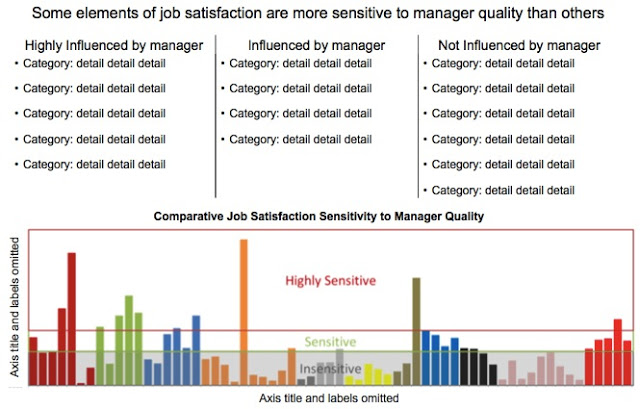{width=100%}

## Use preattentive properties to make better graphs

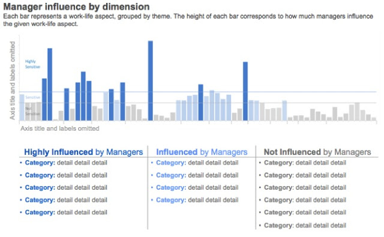{width=100%}


## Use preattentive properties to make better graphs

{width=40%}
{width=42%}

<small><small> http://www.storytellingwithdata.com/blog/2011/10/google-example-preattentive-attributes </small></small>


## Preattentive examples

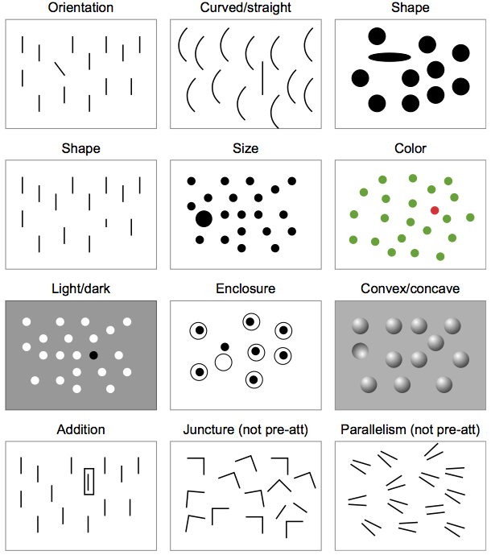{width=55%}

<small><small>From Ware, C. (2012). p.154</small></small>

## Which side has the outlier? 

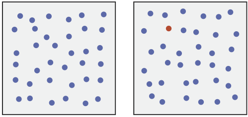{width=100%}

<small><small>From Healey, C., & Enns, J. (2012)</small></small>

## Which side has the outlier? 

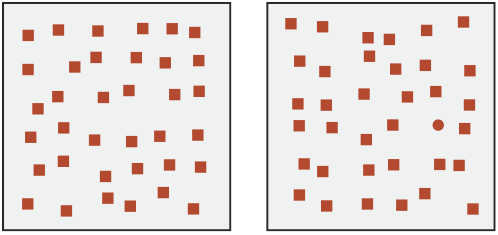{width=100%}

<small><small>From Healey, C., & Enns, J. (2012)</small></small>


## Which side has the outlier? 

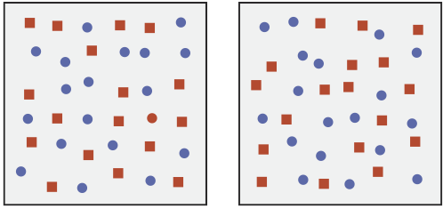{width=100%}

- Don't use two channels in conjunction.

<small><small>From Healey, C., & Enns, J. (2012)</small></small>


## Using Preattentive Attributes

>- Not all preattentive effects are equally strong: strongest effects are based on color, orientation, size, and contrast. 
>- Do not use multiple preattentive channels for competing information.
>- For highlighting, use whatever feature dimension is used least in other parts of the design.

## Making things stand out

- using these insights we can design plots to emphasize particular pieces of information

**Takeaways**

* Use color and shape sparingly to make the important information pop out.
* Maximize the contrast with the background if the outlines of shapes are important.

# Emphasis in a scatter plot
## Picking Out a Data Point


## Pick it out by Shape?

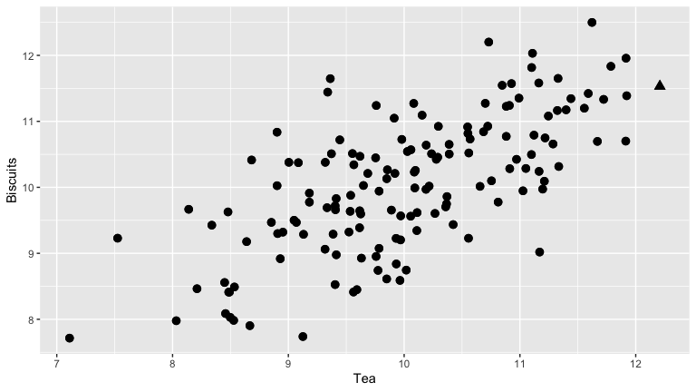

- Highlight by shape


## Pick it out by Color?

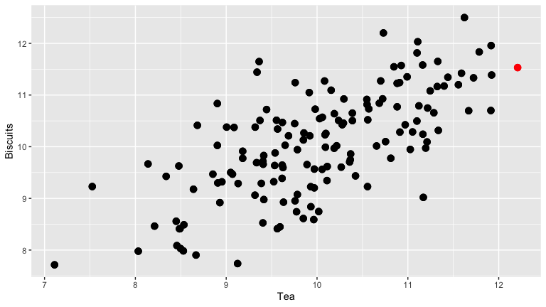

- Highlight by color


## Pick it out by Size?

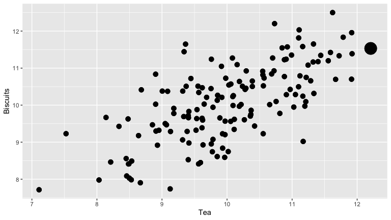

- Highlight by size

## How about all three?

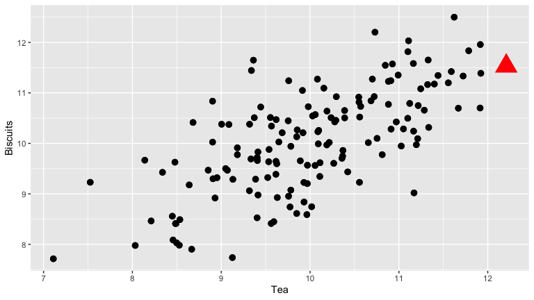

- Highlight by all three


## Multiple channels of comparison become uninterpretable very fast

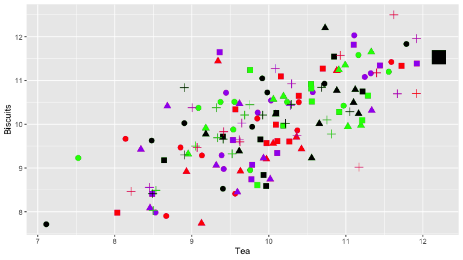


## Unless your data has a lot of structure


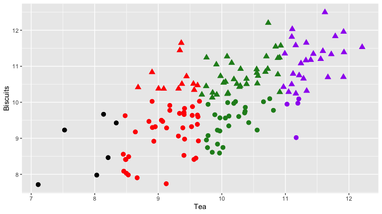

<small>
The data on the graph are the reason for the existence of the graph.
-- Cleveland (1994, 25) </small>

## Takeaway: Symbols

- Make symbols as distinct from each other as possible (and from their backgrounds). Redundant properties (color and shape) can be helpful.

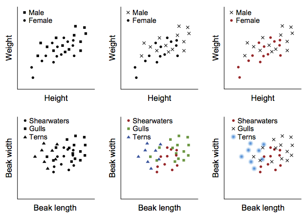{width=60%}

<small><small>From Ware, C. (2012). p.151</small></small>


# Elementary Perceptual Tasks
## Some visual estimations are more easily carried out than others.

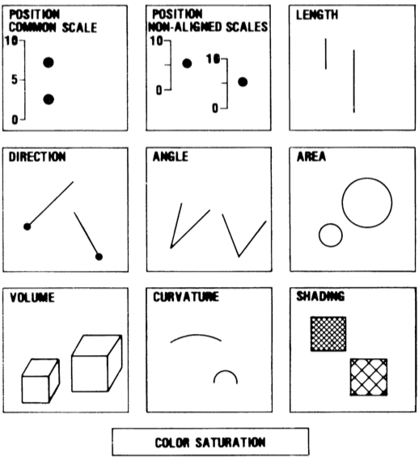{width=40%}

<small><small>Cleveland, W. S., & McGill, R. (1984). Graphical Perception: Theory, Experimentation, and Application to the Development of Graphical Methods. Journal of the American Statistical Association, 79(387), 531–554. https://doi.org/10.2307/2288400
</small></small>


## Make it easier for your audience

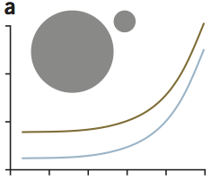{width=50%}
<small><small> Wong, B. (2010). </small></small>

<small> It is tough to accurately judge the differences between two curves: The disparity is actually constant but our perceptual system is attuned to detecting minimal distances so the divergence appears to decrease. 
</small>

<small> Our ability to accurately judge relative area is poor. The larger circle is 14 times larger than the smaller circle. This is the reason bubble charts are usually bad to provide accurate info!
</small>

## Make it easier for your audience

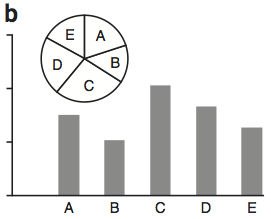{width=50%}

<small> Most readers will judge angle when extracting information from pie charts, but they could also compare areas and arc length of the slices. Each of these perceptual tasks ranks low in efficiency and accuracy. </small> 

<small> The same info in a bar chart is more effective and accurate. </small> 

## Make it easier for your audience

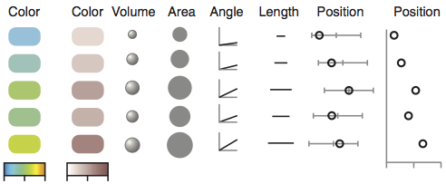{width=100%}

<small> Graph plots the same five values using different encodings. Perceptual information processing gets easier from left to right.</small>

## Takeaways: Elementary Perceptual Tasks

We want to avoid displays of data that are misleading or difficult to discern.

- **Common scales** are better than non-aligned scales.
- Length judgements are easier with a **common baseline**.
- Angles are often misjudged. Angles >90° are often overestimated, angles <90° often underestimated.
- Area judgments are less accurate than length judgments or position judgments.
- Volumes are misjudged even more. This is one reason 3-D charts are usually terrible.
- Slopes and changes in slope are prone to misjudgement.
- **Colors** are best reserved for **displaying categories**. 

## Further Reading

<small>

- Wong, B. (2010a). Points of view: Design of data figures. Nature Methods, 7(9), 665–665. https://doi.org/10.1038/nmeth0910-665

- Wong, B. (2010b). Points of View: Gestalt principles (Part 1). Nature Methods, 7(11), 863–863. https://doi.org/10.1038/nmeth1110-863

- Wong, B. (2010c). Points of View: Gestalt principles (Part 2). Nature Methods, 7(12), 941–941. https://doi.org/10.1038/nmeth1210-941

- Cleveland, W. S., & McGill, R. (1984). Graphical Perception: Theory, Experimentation, and Application to the Development of Graphical Methods. Journal of the American Statistical Association, 79(387), 531–554. https://doi.org/10.2307/2288400

- Ware, C. (2012). Information Visualization, Third Edition: Perception for Design (3rd edition). Waltham, MA: Morgan Kaufmann.

- Healey, C., & Enns, J. (2012). Attention and Visual Memory in Visualization and Computer Graphics. IEEE Transactions on Visualization and Computer Graphics, 18(7), 1170–1188. https://doi.org/10.1109/TVCG.2011.127

</small>

# The Plot-Making Process in ggplot

## Understanding the layers of ggplot2

Recall: the three key grammatical elements:

| Element | Description | 
|------:|:-----:|
| **Data** | The dataset being plotted. |
| **Aes**thetics | The scales onto which we map our data. |
| **Geom**etries | The visual elements used for our data. | 

Let's take a closer look at these now.

## Recall: Aesthetic vs. Attributes 

- an attribute is simply a setting of things like color, shape, size etc. independent of what the data looks like
- in contrast, in the aesthetics layer, we **map** features of the data onto visible aesthetics

## Recall: Setting Attributes

Here we set three attributes of the points: alpha, size, color

```r
library(ggplot2)
library(gapminder)
ggplot(gapminder, aes(x = gdpPercap, y = lifeExp)) + 
        scale_x_log10() +
        geom_point(alpha=0.5, size=3, color="red")
```

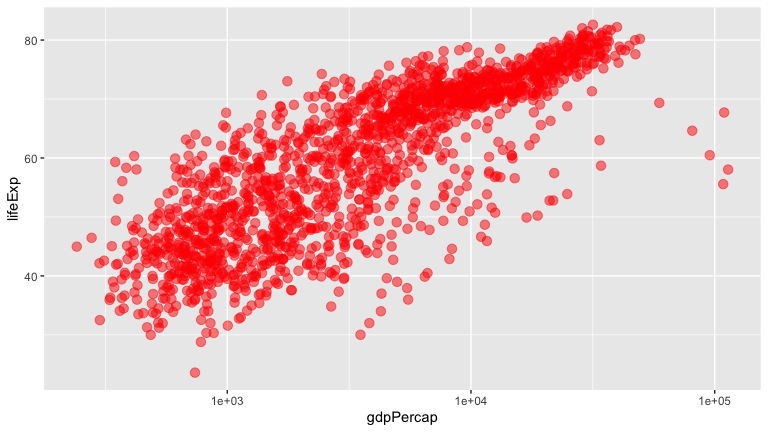

## Recall: Mapping onto color

Now, we **map** color onto continent.

```r
ggplot(gapminder, aes(x = gdpPercap, y = lifeExp, color=continent)) +
        geom_point() + scale_x_log10()
```

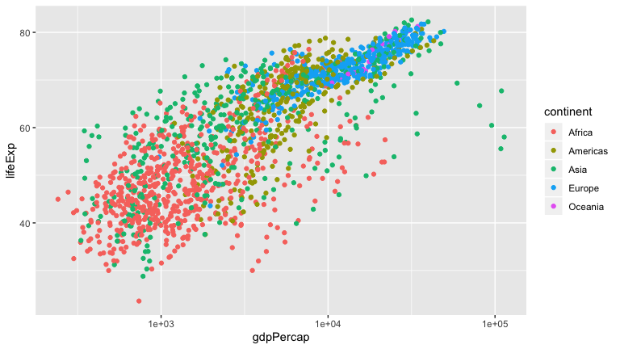

## Recall: Mapping onto color

Here we mistakingly overwrite our mapping with an attribute later.

```r
ggplot(gapminder, aes(x = gdpPercap, y = lifeExp, color=continent)) +
        geom_point(color="red") + scale_x_log10() 
```

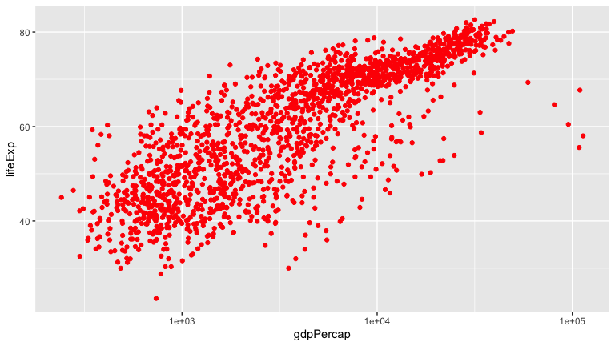

## Recall: Mapping onto shape


```r
ggplot(gapminder, aes(x = gdpPercap, y = lifeExp, shape=continent)) + 
        geom_point(size=3, alpha=0.3) + scale_x_log10()
```

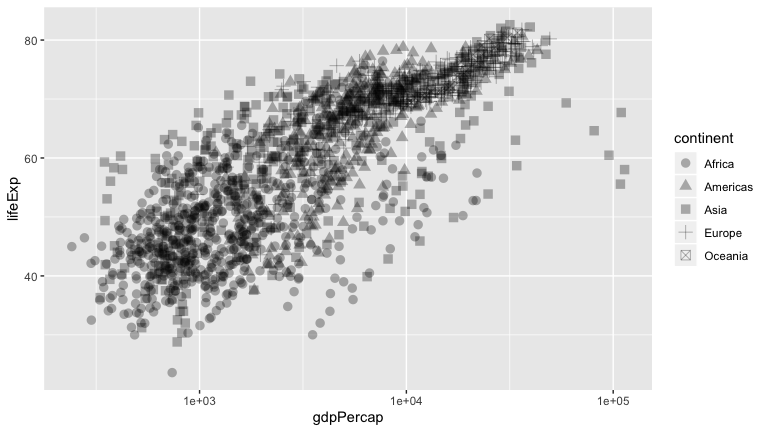

## Recall: Mapping onto size


```r
ggplot(gapminder, aes(x = gdpPercap, y = lifeExp, size=pop)) + 
        scale_x_log10() +
        geom_point(alpha=0.3)
```

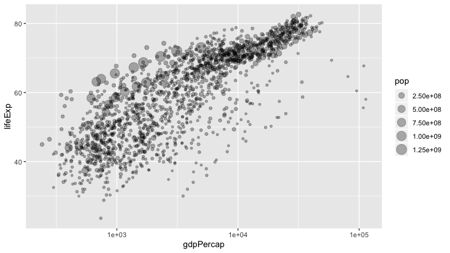

## Recall: Mapping onto size


```r
ggplot(gapminder, aes(x = gdpPercap, y = lifeExp, size=pop/10^6)) + 
        scale_x_log10() + geom_point(alpha=0.3) +
        scale_size_continuous(name="pop", breaks = c(10,100,250,1000))
```

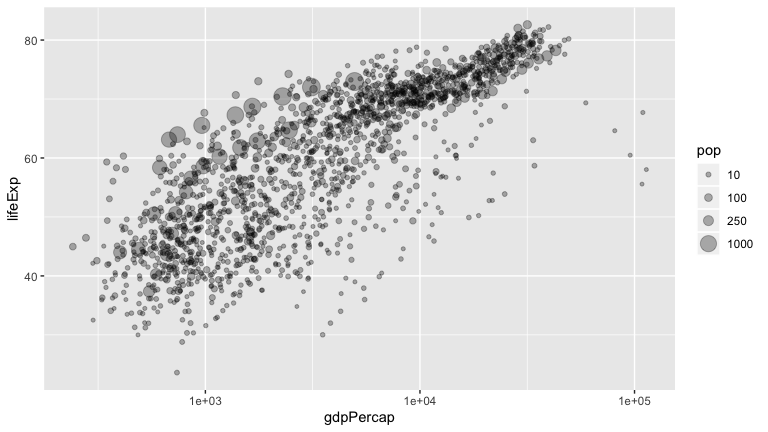

## Recall: Combining mappings


```r
ggplot(subset(gapminder, continent %in% c("Americas","Europe")), 
       aes(x = gdpPercap, y = lifeExp, size=year, 
           color=continent, shape=continent)) + 
       scale_x_log10() + geom_point(alpha=0.3)
```

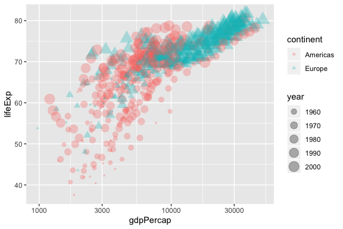

## Typical aesthetics

| Aesthetic | Description | 
|------:|:-----:|
| x | X axis position |
| y | Y axis position |
| colour | Colour of dots, outlines of other shapes |
| fill | Fill colour |
| size | Diameter of points, thickness of lines |
| alpha | Transparency |
| linetype | Line dash pattern |
| labels | Text on a plot or axes |
| shape | Shape |

## Aesthetics and Geoms

- each `geom()` layer allows you to set the aesthetics that make sense for the particular plot `geom()`
- for example, `geom_point` understands the following aesthetics: x, y, alpha, color, fill, group, shape, size, stroke. For `geom_point()` the aesthetics x and y are required.
- some aesthetics are limited to continous variables, others to categorical variables

## Aesthetics - Continuous Variables

| Aesthetic | Description | 
|------:|:-----:|
| x | X axis position |
| y | Y axis position |
| colour | Colour of dots, outlines of other shapes |
| fill | Fill colour |
| size | Diameter of points, thickness of lines |
| alpha | Transparency |
| ~~linetype~~ | Line dash pattern |
| ~~labels~~ | Text on a plot or axes |
| ~~shape~~ | Shape |

## Aesthetics - Continuous Variables


```r
ggplot(filter(gapminder,year==2007), 
  aes(x = gdpPercap, y = lifeExp, size=pop)) +
  scale_x_log10() + geom_point(alpha=0.3) + 
  scale_size_continuous(name="pop", range = c(1,20))
```

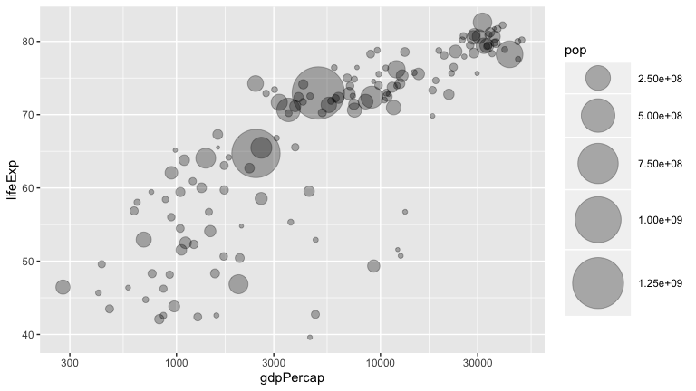

## Aesthetics - Continuous Variables


```r
d <- filter(gapminder, year %in% c(1967,1977,1987,1997,2007))
ggplot(d, aes(x = gdpPercap, y = lifeExp, color=pop)) + 
  scale_x_log10() + geom_point(alpha=0.3, size=3)
```

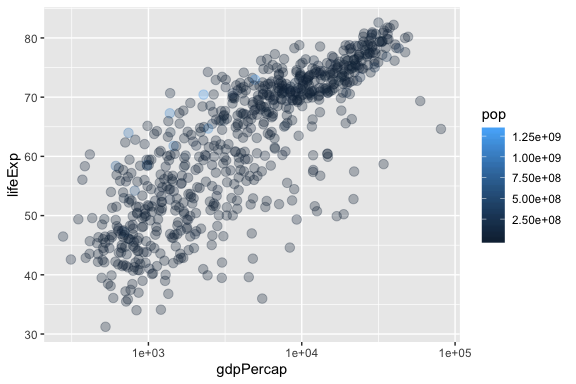

## Aesthetics - Continuous Variables

- size works clearly better than color in this case
- there are general guides about which types of aesthetics work better for which kind of variables -- these are rooted in our understanding of **visual perception** as we have seen earlier.

## Aesthetics - Categorical Variables - Mapping onto shape


```r
ggplot(d, aes(x = gdpPercap, y = lifeExp, shape=continent)) +
  scale_x_log10() + geom_point(alpha=0.3, size=4)
```

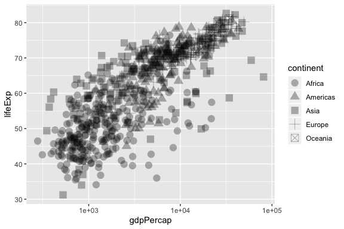

## Adding redundant channel to emphasize


```r
ggplot(d, aes(x = gdpPercap, y = lifeExp, shape=continent)) +
  scale_x_log10() + geom_point(alpha=0.3, size=4) +
  geom_point(data=filter(d, continent=="Americas"), 
   color="red", alpha=0.5, size=4) + theme(legend.position="none")
```

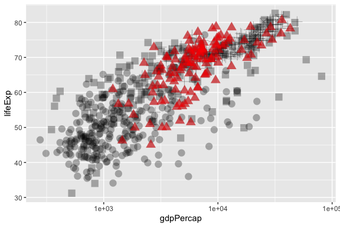


# On your own

The following slides provides some additional info on R Markdown and Github. 

If there is interest, I am happy to capture some or all of these sections in lecture.

# R Markdown

## R Markdown
- I asked everyone to familiarize themselves with R Markdown.
- Success?
- Use the R Markdown [cheat sheet](https://www.rstudio.com/wp-content/uploads/2016/03/rmarkdown-cheatsheet-2.0.pdf) for a nice overview on Markdown in RStudio.

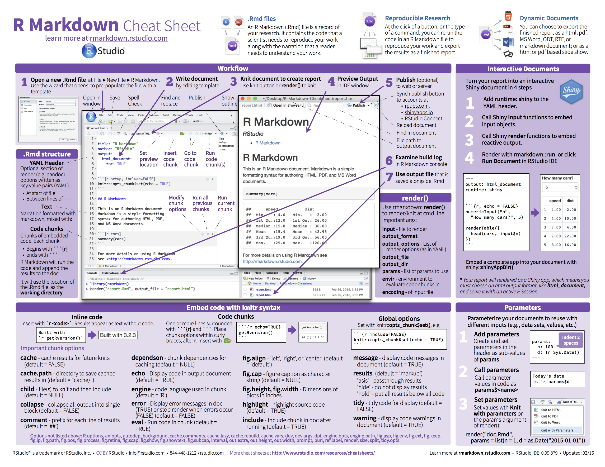{width=40%}
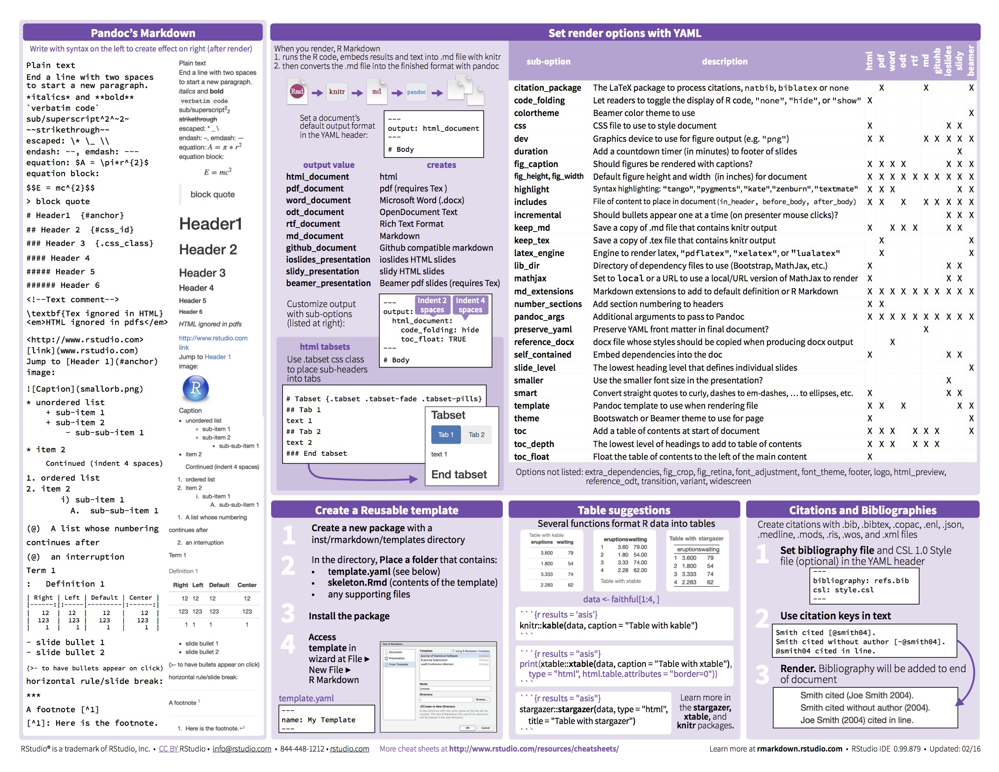{width=40%}

## Markdown and GitHub

* GitHub has a few [special Markdown commands](https://guides.github.com/features/mastering-markdown/)
    - special syntax highlighting
    - task lists -- useful for your projects
    - Links to issues and pull requests within a repository
    - Username @mentions: Typing an @ symbol, followed by a username, will notify that person to come and view the comment.
    
# Git and GitHub

## Why Git?

* Git
    - version control is good (for many reasons)
    - master-branch workflow
    - distributed (rather than centralized) version control
    - pull requests to manage/discuss updates
    - de facto standard on version control

* GitHub
    - Github is like facebook for programmers. Everyone’s on there. 
    - open source
    - lowers the barriers to collaboration

## Resources to get started with Git and GitHub

* Git
    - [Official git command line and GUI clients, official documentation](https://git-scm.com/)
* Clients
    - [Desktop Client for Mac and Windows](https://desktop.github.com/)
    - [Sourcetree - another free visual Git](https://www.sourcetreeapp.com/)
* Tutorials
    - [Setting up git](https://help.github.com/articles/set-up-git/)
    - [Try.github](https://try.github.io)
    - [Hello World - GitHub for the non-programming beginner.](https://guides.github.com/activities/hello-world/)
    - [Guides at GitHub](https://guides.github.com/)
    - [Pro Git - a full book with lots of details](https://git-scm.com/book/en/v2)

## Intro Git - version control

* **Version control** 
    - VC is a great way to keep track of changes in code, manuscripts, presentations, and data analysis projects.
    - Allows you to save and annotate all changes to your code and files.
    - No need to rename files as "analysis_v1.R",  "analysis_with second graph.R",  "analysis_Mike update.R"

    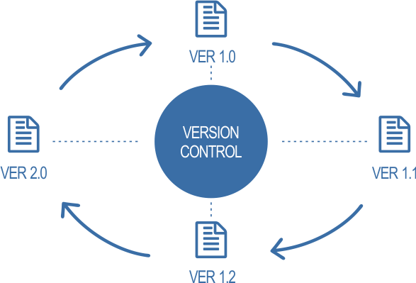{width=40%}

## Intro Git - Local vs. Shared Repository

{width=30%}

## Intro Git - Master-Branch

{width=50%}

## Intro Git - Centralized vs. Distributed Version Control

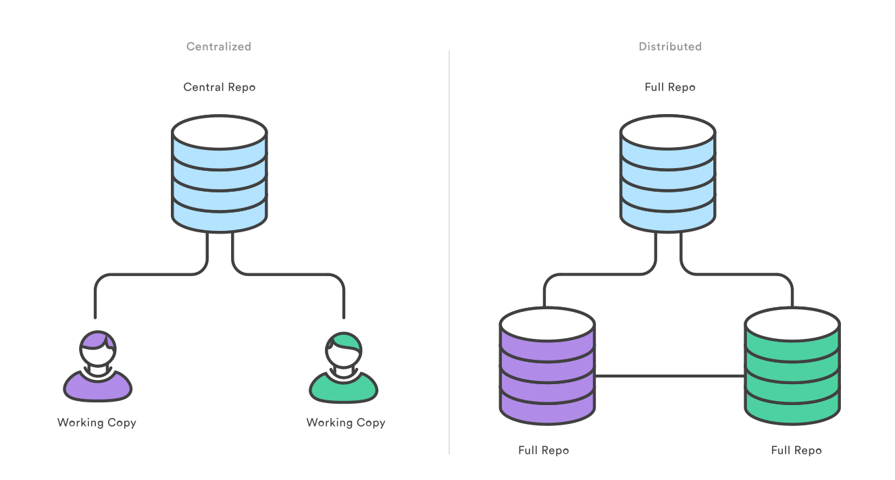{width=80%}

## Intro Git - Popularity

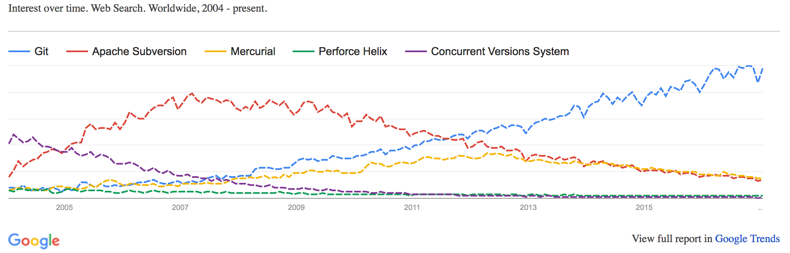{width=100%}
<small><small>[Google Trends Comparison](https://www.google.com/trends/explore?date=all&q=%2Fm%2F05vqwg,%2Fm%2F012ct9,%2Fm%2F08441_,%2Fm%2F08w6d6,%2Fm%2F09d6g&hl=en-US)
</small></small>

## Intro GitHub

* single largest host for Git repositories, and is the central point of collaboration for millions of developers and projects
* Free. Allows easy open source hosting. Private repositories available with your .edu email address.
* While Git is a command line tool, GitHub provides a web-based graphical interface.
* Provides access control and several collaboration features, such as a wikis and basic task management tools for every project.

## Why / For what should you use GitHub?

- Use GitHub for your **homework** .
- Use GitHub for your **final group project**.
- Get the **class material and resources** on GitHub. 
- Find useful repositories, packages, data, code, and tutorials: e.g. [ggplot2 book](https://github.com/hadley/ggplot2-book), [Murray book code examples${](https://github.com/alignedleft/d3-book) etc.

## Using Github for your group project

- Your group project will involve lots of back and forth.
- Trying out changes to the code, new visualizations etc. becomes hazard free.
- All things are documented.
- Makes it easier to evaluate who did the work and who slacked off (for you and for us, the teaching team).

## Github Flow - Create a branch

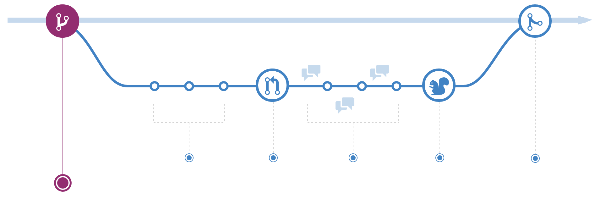{width=80%}

- Try out ideas for your project by creating a branch.
- Changes you make on a branch don't affect the master branch, so you're free to experiment and commit changes.

## Github Flow - Add commits

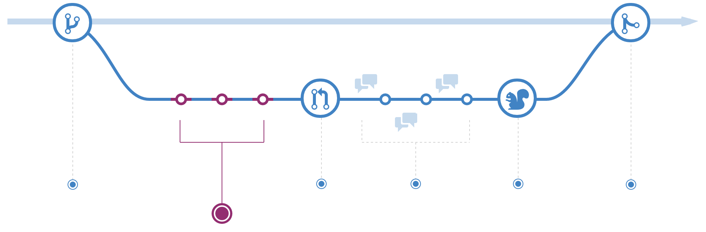{width=80%}

- Whenever you add, edit, or delete a file, you're making a commit, and adding them to your branch. 
- Keeps track of your progress as you work on a branch.
- Transparent history of your work with associated commit message (i.e a description of your change).
- Allows you to roll back if things go awry. 

## Github Flow - Pull Request

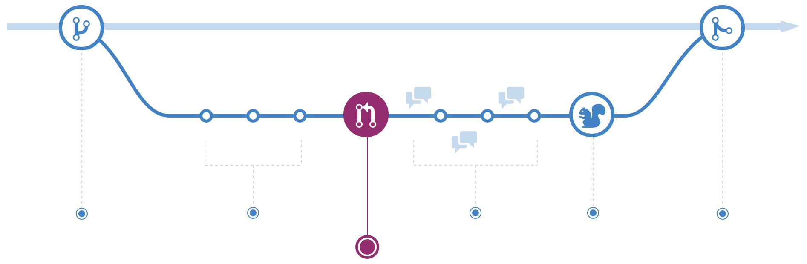{width=80%}

- Pull Requests initiate discussion about your commits. 
- Anyone can see exactly what changes would be merged if they accept your request.
- Using GitHub's @mention system in your Pull Request message to ask for feedback from your team.

## Github Flow - Discuss and Review

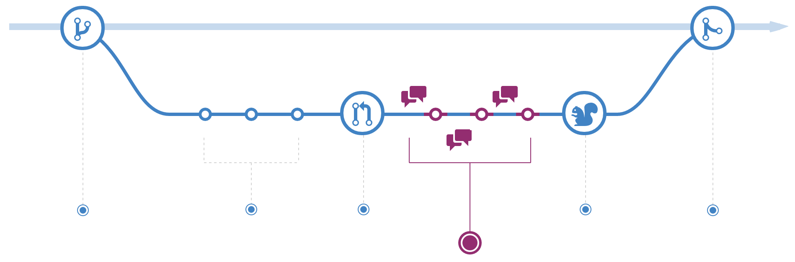{width=80%}

- Discuss and review the changes. 
- Continue to fix code and push up the change with new commits.
- GitHub will show your new commits and any additional feedback you may receive in the unified Pull Request view.

## Github Flow - Deploy

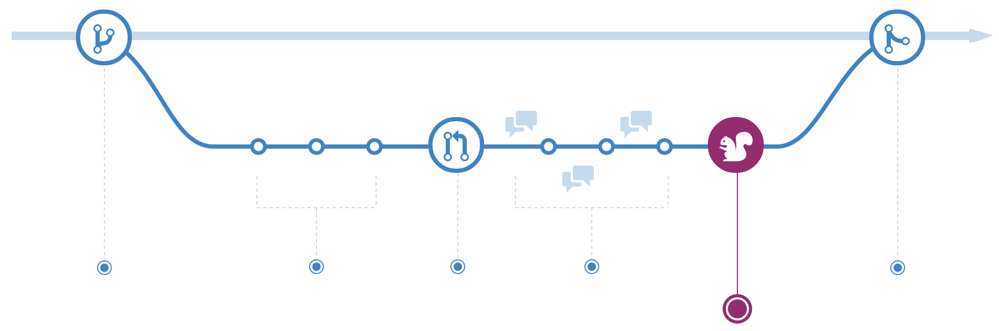{width=80%}

- Check your branch to verify it works.
- If your branch causes issues, you can roll it back by deploying the existing master again.

## Github Flow - Merge

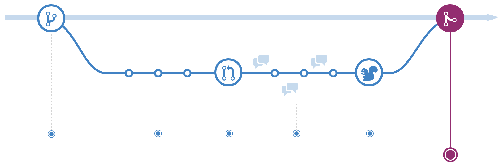{width=80%}

- Merge your code into the master branch.
- Pull Requests preserve a record of the historical changes to your code. Because they're searchable, they let anyone go back in time to understand why and how a decision was made.

## To Do By Yourself

* GitHub
    - Sign up to GitHub. 
    - Provide your github info so I can add you to the class repository.  
    - Familiarize yourself with the setup. Download a client if you don't like the terminal commands.
    - Start a new repository for this week's class notes or exercise.  
* Markdown
    - Keep at it. If you did not try, do some tutorial I linked to.
