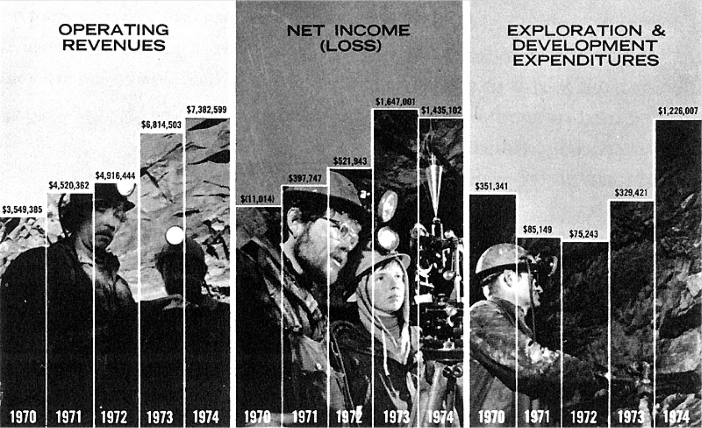

class: left, bottom
background-image: url(images/road_fall.jpg)
background-size: 100%
background-position: 0% 0%


```{r packages, message = FALSE, warning = FALSE, echo=FALSE}
## Run / Install before executing slides
 
# Load packages.
packages <- c("devtools", "tidyverse", "ggplot2", "ggthemes",
              "psych", "RCurl", "readr", "grid", "gapminder")

packages <- lapply(packages, FUN = function(x) {
  if(!require(x, character.only = TRUE)) {
    install.packages(x)
  library(x, character.only = TRUE)
  }
}
)
```

```{r setup, include=FALSE}
library("knitr")
knitr::opts_chunk$set(echo = TRUE, eval=TRUE, message=FALSE, warning = FALSE,
fig.height=4.5, cache = TRUE) 
options(htmltools.dir.version = FALSE)
```
 
# Roadmap for Today

1. _Gestalt principles_ - Grouping items in a visualization

2. gplot2 - applying Gestalt principles

3. some design principles from Tufte with application in ggplot2

4. full example of re-making a plot from the economist
 
---

class: inverse, bottom, middle
background-image: url(images/cat_computer.jpg)

# Some Administrative Stuff

---

# Assignment 1

- Assignement 1 will be up this week and due **on Monday, February 24 at 5pm**. 

- You will be asked to use `ggplot2()` commands for some exploratory and explanatory graphs and add some simple interactivity to these graphs (_lecture next week_)

- First stop for **general coding questions** should be [stackoverflow](http://stackoverflow.com/questions/tagged/ggplot2) + [ggplot manual](http://docs.ggplot2.org/) (online) + and the campuswire class forum

- Next stop: the TAs and my office hours.

- Submission via GitHub

---

class: bottom, middle
background-image: url(images/near_empty_lecture_hall.jpg)
background-size: 100%
background-position: 50% -150%

# Sandbox Github repository

Hope you are trying the non-graded exercises. **Let's try this again**.

---

class: inverse, left, middle
background-image: url(images/final_project_movie.jpg)
background-size: 50%
background-position: 50% 0%

---

class: left
background-image: url(images/above_the_clouds.jpg)
background-size: 120%
background-position: 0% 0%


# Final Project - Description

_From the syllabus:_

> Final group project (30%): A final **group project (3-4 students)** presented in the form of a **website** and accompanying **project book**. You will analyze data of your own choosing and report the results using (one or more of)
  1. static images based on `ggplot2`,
  2. maps using geospatial data, 
  3. visualizations of text analyses
  4. network visualizations 

--

  > AND 
  
  > prepare a **hosted, interactive display of some of your visualizations**. 

---

background-image: url(images/data-management-cartoon.png)
background-size: 48%
background-position: 100% 100%


# Final Project - Data

For the final project, your data should:

1. be a **larger dataset to allow analysis in different forms** 
2. contain at best one (or more) of the following elements 
    * some geographic identifiers (cities, addresses. lat-long etc.) to allow mapping
    * some text to allow simpe text analyses
    * contain a network matrix (or item relationships) to plot visual networks

--

Preference is for data that you either   
put together yourself from existing datasets,   
and/or using some API to collect the data you   
need from an online source (e.g. Twitter).

---

background-image: url(images/data-visualization-example-graph.png)
background-size: 70%
background-position: 100% 100%


# Final Project - Output

- final output should be something that you could (if you choose to) use as a portfolio for job applications etc. to show your skills
- for that, it needs to be visually appealing, informative, and (partially) interactive.

---

# Final Project - Hypothetical Example

- **Title:** Unhealthy habits - Bad diets are the root of the obesity epidemic
- **Abstract:** obesity epidemic in the U.S. ... bad diets are to blame ... explore how have diets changed over time ... how are diets related to socio-economic factors etc.
- **Data**:
    - adult and changed obesity rates in the [U.S.(CDC)](https://www.cdc.gov/obesity/data/adult.html) and the [World (WHO)](http://www.who.int/gho/ncd/risk_factors/overweight/en/)
    (pair with geographic info for mapping) 
    - Pew Research Center’s [surveys on food and nutrition attitudes](http://www.pewinternet.org/2016/12/01/the-new-food-fights/) and how [diets have changed](http://www.pewresearch.org/fact-tank/2016/12/13/whats-on-your-table-how-americas-diet-has-changed-over-the-decades/)
    - Content of Recipes changed over time (text analysis of recipes, extracting measures)
    - [Spread of Obesity in a Large Social Network](http://www.nejm.org/doi/full/10.1056/NEJMsa066082#t=article)

---

class: center

# Final Project - Hypothetical Example

```{r, echo=FALSE, out.width = "95%"}

```

---

class: center

# Final Project - Hypothetical Example


```{r, echo=FALSE, out.width = "65%"}

```

---

class: center, middle

# Final Project - Hypothetical Example


```{r, echo=FALSE, out.width = "100%"}

```

---

class: left

# Final Project - Process Book

Part of the project is a **process book** in which you note (as you go along) how your thinking developed, perhaps including some plots that you later discarded, some (handwritten) sketches of how you imagine the final design etc.

```{r, echo=FALSE, out.width = "100%"}

```

---

background-image: url(images/team_4.jpg) 
background-size: 70%
background-position: 100% 100%

# Final Project on GitHub

As with remaining assignments, I want you to **use GitHub for working on and submitting the assignment**. 

In fact, since multiple people will be working in a group, this will be the ideal way to **keep track of your work** and allow the teaching staff to interact with you easily on suggestions, improvements, and coding issues.

Note: There is a **maximum of 4 members in a group**.

---

background-image: url(images/project_trump_tweets_02.png) 
background-size: 50%
background-position: 50% 95%

# Great example for a succesful project

+ [Language and the 2016 US Presidential Election](https://thebestdatavisualizationproject.shinyapps.io/team_america/)
by Mike Jaron, Sam Gass, Jack Holder & Brandon Wolff

---

# Great example for a succesful project

.pull-left[

```{r, echo=FALSE, out.width = "100%"}

```

```{r, echo=FALSE, out.width = "100%"}

```

]

.pull-right[

<br> 
<br> 
<br> 

```{r, echo=FALSE, out.width = "100%"}

``` 
]


---

class: inverse
background-image: url(images/whisper.jpg) 
background-size: 50%
background-position: 100% 100%

# Did you know? Slides in R markdown

- [ioslides](http://rmarkdown.rstudio.com/ioslides_presentation_format.html) are HTML5 slides. Really simple format but also somewhat limited in terms of cusomization.

- [Xaringan](https://slides.yihui.name/xaringan/) based on remark.js. Especially great for picture rich slides. The slides for **todays lecture** are made that way. Currently my favorite of the options.

- The [reveal.js](https://revealjs.com/) package offers good locking slides, snazzy slide transitions, and lots of customization. The slides for the **lectures in week 1 and 2** were created that way.

- Used to Latex? There is [Beamer](http://rmarkdown.rstudio.com/beamer_presentation_format.html) for slides in R Markdown as well.

---

class: inverse, bottom, center
background-image: url(images/gestalt_logostyle.jpeg)
background-size: 150%
background-position: 50% 0%

# Gestalt Principles

???
Source: https://medium.muz.li/gestalt-principles-in-ui-design-6b75a41e9965

---

# What are Gestalt Principles?

Gestalt principles describe **how our mind organizes individual elements into groups.**

--

.pull-left[  

### ge·stalt, _n._ [ɡəˈʃtalt] = shape/form (German).

> An organized whole that is perceived as more than the sum of its parts.

]

.pull-right[ 

```{r, echo=FALSE, out.width = "100%"}

```

]

---

background-image: url(images/gestalt_icon_simplicity.png) 
background-size: 25%
background-position: 95% 5%


# Simplicity

The **human brain loves simplicity** and it tends to process simple patterns -- patterns that are regular, even, and orderly -- faster than patterns that are more complex.

```{r, echo=FALSE, out.width = "100%"}

```


---

background-image: url(images/gestalt_icon_similarity.png) 
background-size: 25%
background-position: 95% 5%

# Similarity

In German: _Prägnanz_ (german: pithiness) = brief, forceful, and meaningful in expression

```{r, echo=FALSE, out.width = "70%"}

```
<small><small>Ware, C. (2012)</small></small>

--

Facilitate comprehension by ensuring that **associated items in your graphics have similar properties and a common structure**.

**Arrange data logically and systematically** whenever possible.

When using a grid layout, **consider using color and texture to "connect" the rows**.

---

background-image: url(images/gestalt_icon_proximity.png) 
background-size: 25%
background-position: 95% 5%


# Proximity

Elements **close to each other** are perceived as part of **one group**.

```{r, echo=FALSE, out.width = "100%"}

```

<small><small>Ware, C. (2012)</small></small>

--

Place **symbols and text representing related information close together**.

---

background-image: url(images/gestalt_icon_connectedness.png) 
background-size: 15%
background-position: 95% 5%


# Connectedness

When elements are connected by a line, it is easy to see they belong together. 

```{r, echo=FALSE, out.width = "50%"}

```
<small><small>Ware, C. (2012)</small></small>


To show **relationships between things**, consider **linking** graphical representations of data objects using **lines, arrows, or ribbons of color**.

---

background-image: url(images/gestalt_icon_continuity.png) 
background-size: 15%
background-position: 95% 5%

# Continuity

Objects that are presented in a continuous pattern are grouped together by the mind. Smooth lines help to make a unified figure.


<small><small>Ware, C. (2012)</small></small>

--

Use **visual elements that are smooth and continuous**, rather than ones that contain abrupt changes in direction, in order **to construct visual entities out of visual elements**.

---

background-image: url(images/gestalt_icon_continuity.png) 
background-size: 15%
background-position: 95% 5%

# Continuity


<small><small>
Wong, B. (2010). Points of view: Design of data figures. Nature Methods, 7(9), 665–665. https://doi.org/10.1038/nmeth0910-665
</small></small>

(1): Graphics and text used as vertices and edges of geometric shapes.  
(2/3): Geometric and curvilinear shapes used as flexible guides to align content.

---

background-image: url(images/gestalt_icon_closure.png) 
background-size: 15%
background-position: 95% 5%

# Completion


.pull-left[  

```{r, echo=FALSE, out.width = "100%"}

```

<small><small> Wong, B. (2010). </small></small>

]

.pull-right[ 

We automatically and spontaneously **perceive a full circle behind the square**.

We **fill in voids with visual cues found elsewhere on the page**. This means every element on a page affects how we perceive every other element.

]

---

background-image: url(images/gestalt_icon_closure.png) 
background-size: 15%
background-position: 95% 5%


# Completion


.pull-left[  

```{r, echo=FALSE, out.width = "100%"}

```

<small><small> Wong, B. (2010). </small></small>

]

.pull-right[ 

<br>
<br>

**Use our tendency to visually complete shapes to forgo the extraneous** lines, boxes, bullets and other **graphical elements that tend to clutter our presentations**. [see also Tufte's recommendations here]

]


---

background-image: url(images/gestalt_icon_figureground.png) 
background-size: 15%
background-position: 95% 5%

# Figure - Ground


```{r, echo=FALSE, out.width = "50%"}
knitr::include_graphics("images/gestalt_figure_ground_maps.jpg")
```

A **_figure_** is something objectlike that is **perceived as being in the foreground**. <br><br>
The **_ground_ is whatever lies behind the figure**. 
<br><br>
In general, smaller components of a pattern tend to be perceived as objects.

---

background-image: url(images/gestalt_icon_figureground.png) 
background-size: 15%
background-position: 95% 5%

# Figure - Ground

.pull-left[  

```{r, echo=FALSE, out.width = "100%"}

```

]

--

.pull-right[ 

<br>
<br>

When **figure and ground are about equally matched, we don't know what to focus on.**
]


---

background-image: url(images/gestalt_icon_commonfate.png) 
background-size: 15%
background-position: 95% 5%

# Common Fate

Humans perceive **visual elements that move in the same speed and/or direction as parts of a single group** (think a flock of birds). 

```{r, echo=FALSE, out.width = "95%"}

```

---

class: inverse
background-image: url(images/gestalt_principles_overview.png) 
background-size: 75%
background-position: 50% 0%

???

Source: https://www.designcontest.com/blog/designing-with-gestalt-principles/

---

# Gestalt Principles Overview

- **similarity**: things that look like each other (size, color,
shape) are related
- **proximity**: things that are visually close to each other
are related
- **connection**: things that are visually connected are
related
- **continuity**: we complete hidden objects into simple,
familiar shapes
- **closure**: we see incomplete shapes as complete
- **figure / ground**: elements are perceived as either
figures or background
- **common fate**: elements with the same moving
direction are perceived as a unit

---

# Takeaways: Gestalt principles

We can use these Gestalt principles to highlight patterns that are important, and downplay other patterns. 

- **Similarity**: Keep it simple. Arrange data logically wherever possible. Use similar characteristics (color, size, shape, etc.) to establish relationships and to encourage groupings of objects.
- **Proximity**: Know what your chart’s information priority is, and then create groupings through proximity to support that priority.
- **Connection**: Use connected lines, shapes, and color regions as visual guides.
- **Continuity**: Arrange objects in a line to facilitate grouping and comparison.
- **Completion**: Use our tendency to visually complete shapes to reduce clutter. 
- **Figure/Ground**: Ensure there is enough contrast between your foreground and background so that charts and graphs are more legible.
- **Common Fate**: Use direction and/or movement to establish or negate relationships.

<!--- Advice partially from: http://sixrevisions.com/usability/data-visualization-gestalt-laws/ -->

---

# Further Reading

[_Gestalt principles in UI design_](https://medium.muz.li/gestalt-principles-in-ui-design-6b75a41e9965) by Eleana Gkogka

Wong, B. (2010a). Points of View: Gestalt principles (Part 1). Nature Methods, 7(11), 863–863. https://doi.org/10.1038/nmeth1110-863

Wong, B. (2010b). Points of View: Gestalt principles (Part 2). Nature Methods, 7(12), 941–941. https://doi.org/10.1038/nmeth1210-941

Ware, C. (2012). Information Visualization, Third Edition: Perception for Design (3 edition). Waltham, MA: Morgan Kaufmann. pp. 181--198

---

class: inverse, bottom, middle
background-image: url(images/ggplot2_pencil.jpg)

# Back to ggplot2

---

# Encircle to emphasize 
```{r, echo=FALSE}
d <- filter(gapminder, year %in% c(1967,1977,1987,1997,2007))

previousplot <- ggplot(d, aes(x = gdpPercap, y = lifeExp, shape=continent)) +
  scale_x_log10() + geom_point(alpha=0.3, size=2) +
  geom_point(data=filter(d, continent=="Americas"), 
   color="red", alpha=0.5, size=2) + theme(legend.position="none")
```


```{r, fig.width=6, fig.height=4}
# ggalt() includes the encircle() function
# devtools::install_github("hrbrmstr/ggalt", force=FALSE)
library(ggalt)
previousplot + geom_encircle(data=filter(d, country=="United States"), 
                expand=0.05, color="blue", linetype=2, size=2)

```

---


# Connect to emphasize 

```{r, echo=TRUE, fig.width=12, fig.height=8, eval=FALSE}
library(ggthemes)
ggplot(d, aes(x = gdpPercap, y = lifeExp, shape=continent)) +
  scale_x_log10() + 
  geom_path(data=filter(d, country=="United States"), 
            color="light blue", linetype=1, size=6) +
  geom_path(data=filter(d, country=="Venezuela"), 
            color="light green", linetype=1, size=6) +
  geom_path(data=filter(d, country=="Haiti"), 
            color="orange", linetype=1, size=6) +
  geom_point(alpha=0.3, size=4) +
  geom_point(data=filter(d, continent=="Americas"), 
              color="red", alpha=0.5, size=4) + 
  theme(legend.position="none") +
  annotate("text", x = c(40000), y = c(73), family="serif", size=6, 
           color="dark blue", label = c("United States")) +
  annotate("text", x = c(13000), y = c(63), family="serif", size=6, 
           color="dark green", label = c("Venezuela")) +
  annotate("text", x = c(1200), y = c(62), family="serif", size=6, 
           color="dark orange", label = c("Haiti")) + theme_tufte()
```

---

# Connect to emphasize 


```{r, echo=FALSE, fig.width=12, fig.height=8}
library(ggthemes)
ggplot(d, aes(x = gdpPercap, y = lifeExp, shape=continent)) +
  scale_x_log10() + 
  geom_path(data=filter(d, country=="United States"), 
            color="light blue", linetype=1, size=6) +
  geom_path(data=filter(d, country=="Venezuela"), 
            color="light green", linetype=1, size=6) +
  geom_path(data=filter(d, country=="Haiti"), 
            color="orange", linetype=1, size=6) +
  geom_point(alpha=0.3, size=4) +
  geom_point(data=filter(d, continent=="Americas"), 
   color="red", alpha=0.5, size=4) + theme(legend.position="none") +
  annotate("text", x = c(40000), y = c(73), family="serif", size=6, color="dark blue",
           label = c("United States")) +
  annotate("text", x = c(13000), y = c(63), family="serif", size=6, color="dark green",
           label = c("Venezuela")) +
  annotate("text", x = c(1200), y = c(62), family="serif", size=6, color="dark orange",
           label = c("Haiti")) + theme_tufte()
```

---

# Box plots and Dot Plots

- For some plots we have a specific `geom()`. E.g. box plots are created with `geom_boxplot`.
- For other plots we can use the geoms we already know. E.g. for dot plots we can use `geom_point()`
- overall 37 geoms, but good to know a few. Use the [ggplot2 cheat sheet](https://www.rstudio.com/wp-content/uploads/2016/11/ggplot2-cheatsheet-2.1.pdf).

---

# Examples: Geoms and Type of Plot

Name of Plot  | Geom | Other Features |
--------------|-------|--------------
scatterplot   | point |  |
bubblechart   | point | size mapped to a variable |
barchart      | bar   | |
box-and-whisker plot | boxplot |
line chart    | line | |

---

# Box plots and Dot Plots

- For some plots we have a specific `geom()`. E.g. box plots are created with `geom_boxplot`.
- For other plots we can use the geoms we already know. E.g. for dot plots we can use `geom_point()`
- overall 37 geoms, but good to know a few. Use the [ggplot2 cheat sheet](https://www.rstudio.com/wp-content/uploads/2016/11/ggplot2-cheatsheet-2.1.pdf).

---

# Examples: Geoms and Type of Plot

Name of Plot  | Geom | Other Features |
--------------|-------|--------------
scatterplot   | point |  |
bubblechart   | point | size mapped to a variable |
barchart      | bar   | |
box-and-whisker plot | boxplot |
line chart    | line | |

---

# Recall: A New Dataset - Organ Donors


```{r, get-organdata, echo= TRUE}
organs <- read_csv("data/organ_donors.csv")

dim(organs)
head(organs)

## For convenience, let R know year is a time measure.
organs$year <- as.Date(strptime(organs$year, format="%Y"))

```

???

<!--- 
organs.url <- "https://raw.githubusercontent.com/socviz/soc880/gh-pages/data/organ-procurement.csv"
organs.data <- read.csv(url(organs.url), row.names=1)
-->

---

# Recall: Average by group

```{r}
by.country <- organs %>% 
  group_by(consent.law, country) %>%
  summarize(donors=mean(donors, na.rm = TRUE))
by.country
```

---

# Ordered dotplot

We know that order helps visual perception. Get your factors (the categorical variable) in order when it makes sense.


```{r}
p <- ggplot(by.country, aes(x=donors, y=reorder(country, donors), 
                            color=consent.law))
p + geom_point(size=3)

```


---

# Improve the labels

```{r}
p + geom_point(size=3) +
    labs(x="Donor Procurement Rate (per million population)",
         y="", color="Consent Law") +
    theme(legend.position="top")
```

---

# Dotplots


.pull-left[

- dotplots are useful to get a summary of one-dimensional categorical data
- Often better than bar or column charts.
- Keeping the categories on the y-axis is often a good idea.
- They work also well to summarize model results with error ranges.

]

.pull-right[


```{r, echo=FALSE, out.width = "100%"}

```

]


---

# Boxplot

```{r}
ggplot(data=organs, aes(x=country,y=donors)) +
  geom_boxplot() + #<<
  coord_flip() +   #<<
  labs(x="", y="Donor Procurement Rate")
```

---

# Boxplot - Order helps

```{r}
ggplot(data=organs, 
       aes(x=reorder(country, donors, na.rm=TRUE), #<<
                y=donors)) +
  geom_boxplot() + coord_flip() +
  labs(x="", y="Donor Procurement Rate")
```

---

# Boxplot

```{r}
ggplot(data=organs,aes(x=reorder(country, donors, na.rm=TRUE),y=donors)) +
  geom_boxplot(aes(fill=consent.law)) + #<<
  coord_flip() + labs(x = "", y = "Donor Procurement Rate")
```

---

# Boxplot - and some jitter (too much?)

```{r}
ggplot(data=organs,aes(x=reorder(country, donors, na.rm=TRUE),y=donors)) + 
 geom_boxplot(aes(fill=consent.law), outlier.colour = "transparent", 
               alpha=0.3) +
 coord_flip() + labs(x= "", y= "Donor Procurement Rate") +
 geom_jitter(shape=21, aes(fill=consent.law), color="black", #<<
              position = position_jitter(w=0.1)) #<<
```

---

# 1-D point summaries

```{r}
p <- ggplot(data=organs, aes(x=reorder(country, donors, na.rm=TRUE), y=donors)) 
p + 
  geom_point(aes(color=consent.law)) + #<<
  coord_flip() + labs(x="", y="Donor Procurement Rate")
```

---

# Add a little jitter

```{r}

ggplot(data=organs,aes(x=reorder(country, donors, na.rm=TRUE), y=donors)) +
  geom_jitter(aes(color=consent.law)) + #<<
  coord_flip() + labs(x="", y="Donor Procurement Rate")
```

---

# Fine-tune the jittering

```{r}
ggplot(data=organs,aes(x=reorder(country, donors,na.rm=TRUE),y=donors)) +
  geom_jitter(aes(color=consent.law),
              position = position_jitter(width=0.15)) + #<<
    coord_flip() +
    labs(x="", y="Donor Procurement Rate") +
    theme(legend.position="top")
```

---

# A few more useful geoms

```{r, echo=FALSE}
df <- data.frame(
  x = c(3, 1, 5),
  y = c(2, 4, 6),
  label = c("a","b","c"))
p <- ggplot(df, aes(x, y, label = label)) +
  labs(x = NULL, y = NULL) + # Hide axis label
theme(plot.title = element_text(size = 12)) # Shrink plot title p + geom_point() + ggtitle("point")
```


```{r, eval=FALSE}
p + geom_point() + ggtitle("point")
p + geom_text() + ggtitle("text")
p + geom_bar(stat = "identity") + ggtitle("bar") 
p + geom_tile() + ggtitle("raster")
p + geom_line() + ggtitle("line")
p + geom_area() + ggtitle("area")
p + geom_path() + ggtitle("path")
p + geom_polygon() + ggtitle("polygon")
```

```{r, echo=FALSE, out.width = "60%"}

```
```{r, echo=FALSE, out.width = "60%"}

```

Familiarize yourself with these options in `ggplot2()`.

---

# Bar charts - Position Adjustments

* We already learned some adjustment to postions, namely `position_jitter()` for points
* For bar graphs, these position adjustments are important as well:
    - `position_stack()`: stack overlapping bars (or areas) on top of each other. 
    - `position_fill()`: stack overlapping bars, scaling so the top is always at 1.
    - `position_dodge()`: place overlapping bars (or boxplots) side-by-side.


---

# Bar charts - Position Adjustments

Try these out yourself.

```{r, eval=FALSE}
library(ggthemes)
dplot <- ggplot(diamonds, aes(color, fill = cut)) + 
  xlab(NULL) + ylab(NULL) + theme(legend.position = "none")
# position stack is the default for bars, so `geom_bar()` 
# is equivalent to `geom_bar(position = "stack")`.
dplot + geom_bar()
dplot + geom_bar(position = "fill")
dplot + geom_bar(position = "dodge")
```

```{r, echo=FALSE, out.width = "100%"}
knitr::include_graphics("images/barcharts_position.png")
```

Which one is the easiest to digest for a viewer? (re: elementary perceptual tasks)

---

class: inverse, bottom, center
background-image: url(images/minard_no_box.png)
background-size: 100%
background-position: 0% 30%

# Channeling Edward Tufte

---

class: top, right
background-image: url(images/tufte_drawing.png)
background-size: 60%
background-position: 0% 100%

# Clutter and confusion are not attributes of information, they are failures of design.

**Edward Tufte**

---

# 

```{r, echo=FALSE, out.width = "100%"}
knitr::include_graphics("images/monstrous_costs.jpg")
```

---

class: center, middle

# But: Which is really better?

```{r, echo=FALSE, out.width = "50%"}
knitr::include_graphics("images/monstrous_costs.jpg")
```
```{r, echo=FALSE, out.width = "49%"}

```

???
Source: Nigel Holmes. "Useful Junk? The Effects of Visual Embellishment on Comprehension and Memorability of Charts".

http://hci.usask.ca/publications/view.php?id=173

---

class: center, middle

# Tufte’s Integrity (and Design) Principles
```{r, echo=FALSE, out.width = "10%"}

```

## Strive for **graphical integrity**. Visual representations of data must tell the **truth**.

---

class: center
background-image: url(images/tip.png)
background-size: 10%
background-position: 0% 0%

## The **size of the graphics effect** should be directly **proportional** to the **numerical quantities**.

```{r, echo=FALSE, out.width = "100%"}
knitr::include_graphics("images/Tufte2001_p57_fueleconomy.png")
```

???

First principle: The representation of numbers, as physically measured on the surface of the graph itself, should be directly proportional to the numerical quantities represented.

<small><small>Tufte (2001), p.57</small></small>

---

class: center
background-image: url(images/tip.png)
background-size: 10%
background-position: 0% 0%

## **Clear, detailed, and thorough labeling and approriate scales.**

.pull-left[
```{r, echo=FALSE, out.width = "90%"}

```
]

--

.pull-right[

```{r, echo=FALSE, out.width = "100%"}

```
]

???

Second principle: Clear, detailed and thorough labeling should be used to defeat graphical distortion and ambiguity. Write out explanations of the data on the graph itself. Label important events in the data.

---

class: center
background-image: url(images/tip.png)
background-size: 10%
background-position: 0% 0%

# **Show data variation**, not design variation.

```{r, echo=FALSE, out.width = "100%"}

```

???

Third Principle: Show data variation, not design variation. 

<small>Tufte (2001), p.61</small>

---

class: center
background-image: url(images/tip.png)
background-size: 10%
background-position: 0% 0%

## In time-series displays of money, **deflated and standardized units of monetary measurement** are nearly always better than nominal units.


```{r, echo=FALSE, out.width = "75%"}

```

???

Fourth Principle: In time-series displays of money, deflated and standardized units of monetary measurement are nearly always better than nominal units.

Fifth Principle: The number of information carrying (variable) dimensions depicted should not exceed the number of dimensions in the data. Graphics must not quote data out of context. 

---

class: center
background-image: url(images/tip.png)
background-size: 10%
background-position: 0% 0%

## **Maximize the data-ink ratio.**

```{r, echo=FALSE, out.width = "100%"}

```

---

class: center
background-image: url(images/tip.png)
background-size: 10%
background-position: 0% 0%

## **Maximize the data-ink ratio.**

```{r, echo=FALSE, out.width = "100%"}
knitr::include_graphics("images/tufte_data_ink.jpg")
```

---

class: center
background-image: url(images/tip.png)
background-size: 10%
background-position: 0% 0%

## **Maximize the data-ink ratio.**

```{r, echo=FALSE, out.width = "100%"}

```

---

class: center
background-image: url(images/tip.png)
background-size: 10%
background-position: 0% 0%

## **Avoid chart junk **

.pull-left[
```{r, echo=FALSE, out.width = "80%"}

```
]

.pull-right[

This is according to Tufte possibly the **worst graph ever**: 

_“A series of weird three-dimensional displays appearing in the magazine of American Education in the 1970’s delighted the connoisseurs of the graphically preposterous.  Here five colors report, almost by happenstance, only 5 pieces of data (since the division within each adds to 100%).  This may well be the worst graphic ever to find its way into print.”_


<small>**chart junk**: The excessive and unnecessary use of graphical effects in graphs used to demonstrate the graphic ability of the designer rather than display the data.</small>
]


---

class: center, middle
background-image: url(images/tip.png)
background-size: 10%
background-position: 0% 0%

## **Increase data density.**

### The proportion of the total size of the graph that is dedicated displaying data.

```{r, echo=FALSE, out.width = "100%"}

```

---

class: center, middle
background-image: url(images/tip.png)
background-size: 10%
background-position: 0% 0%

## **Increase data density.**

```{r, echo=FALSE, out.width = "34%"}

```
```{r, echo=FALSE, out.width = "65%"}

```


---

class: center, middle
background-image: url(images/abela_what_would_you_like_to_show.jpg)
background-size: 80%
background-position: 50% 50%
background-color: #EAEBED 


???

Chart by Andrew Abela
Source: https://seec.areavoices.com/2017/05/08/spring-data-clean-up/


---

class: inverse, bottom, center
background-image: url(images/Tufte_black_sample_plot.png)
background-size: 80%
background-color: #000000 
background-position: 50% 20%

# Applying Tufte's Principles with ggplot2

???
Source: 

See data below. Black version of graph used for background.

```{r eval=FALSE}
theme_black = function(base_size = 12, base_family = "") {
 
  theme_grey(base_size = base_size, base_family = base_family) %+replace%
 
    theme(
      # Specify axis options
      axis.line = element_blank(),  
      axis.text.x = element_text(size = base_size*0.8, color = "white", lineheight = 0.9),  
      axis.text.y = element_text(size = base_size*0.8, color = "white", lineheight = 0.9),  
      axis.ticks = element_line(color = "white", size  =  0.2),  
      axis.title.x = element_text(size = base_size, color = "white", margin = margin(0, 10, 0, 0)),  
      axis.title.y = element_text(size = base_size, color = "white", angle = 90, margin = margin(0, 10, 0, 0)),  
      axis.ticks.length = unit(0.3, "lines"),   
      # Specify legend options
      legend.background = element_rect(color = NA, fill = "black"),  
      legend.key = element_rect(color = "white",  fill = "black"),  
      legend.key.size = unit(1.2, "lines"),  
      legend.key.height = NULL,  
      legend.key.width = NULL,      
      legend.text = element_text(size = base_size*0.8, color = "white"),  
      legend.title = element_text(size = base_size*0.8, face = "bold", hjust = 0, color = "white"),  
      legend.position = "right",  
      legend.text.align = NULL,  
      legend.title.align = NULL,  
      legend.direction = "vertical",  
      legend.box = NULL, 
      # Specify panel options
      panel.background = element_rect(fill = "black", color  =  NA),  
      panel.border = element_rect(fill = NA, color = "white"),  
      panel.grid.major = element_line(color = "grey35"),  
      panel.grid.minor = element_line(color = "grey20"),  
      panel.margin = unit(0.5, "lines"),   
      # Specify facetting options
      strip.background = element_rect(fill = "grey30", color = "grey10"),  
      strip.text.x = element_text(size = base_size*0.8, color = "white"),  
      strip.text.y = element_text(size = base_size*0.8, color = "white",angle = -90),  
      # Specify plot options
      plot.background = element_rect(color = "black", fill = "black"),  
      plot.title = element_text(size = base_size*1.2, color = "white"),  
      plot.margin = unit(rep(1, 4), "lines")
 
    )
}

ggplot(d, aes(x,y)) + geom_line(color="white") + geom_point(size=3, color="white") + 
  theme_black() + 
  theme(axis.title=element_blank(),
        panel.grid.major = element_blank(), 
        panel.grid.minor = element_blank(),
        panel.border = element_blank()) + 
  geom_hline(yintercept = c(5,6), lty=2, color="white") + 
  scale_y_continuous(breaks=seq(1, 6, 1), label=sprintf("$%s",seq(300,400,20))) +
  scale_x_continuous(breaks=x,label=x) +
  annotate("text", x = c(1977,1977.2), y = c(1.5,5.5), 
           adj=1,  family="serif",
           label = c("Per capita\nbudget expenditures\nin constant dollars", "5%"), color="white")

ggsave("Tufte_black_sample_plot.png")
```

---

class: center

# How to make a nice looking graph in ggplot2

.pull-left[
 
```{r, echo=FALSE, out.width = "95%"}
knitr::include_graphics("images/nice-vol-pic1.jpg")
```

]

.pull-right[

```{r, echo=FALSE, out.width = "95%"}

```

]

## Focus, hard work, and learning by doing.

---

class: center

# How to implement all of Tufte's suggestions in ggplot2 ...

.pull-left[

```{r, echo=FALSE, out.width = "95%"}

```

]

--

.pull-right[

```{r, echo=FALSE, out.width = "95%"}

```

]

## sometimes you just cannot avoid tricks or hacks

---

# Line Plot

```{r, echo=FALSE, out.width = "49%"}

```
```{r, echo=FALSE, out.width = "49%"}

```

<small>Tufte re-creates the bar chart as a line graph, taking population growth and inflation into account. </small>

---

# Line Plot

```{r}
x <- 1967:1977
y <- c(0.5,1.8,4.6,5.3,5.3,5.7,5.4,5,5.5,6,5)
d <- data.frame(x, y)
ggplot(d, aes(x,y)) + geom_line()
```

---

# **Minimal** Line Plot

```{r fig.height=3.2}
ggplot(d, aes(x,y)) + geom_line() + geom_point(size=3) + 
  theme_tufte(base_size = 15) + theme(axis.title=element_blank()) + 
  geom_hline(yintercept = c(5,6), lty=2) + 
  scale_y_continuous(breaks=seq(1, 6, 1), 
                     label=sprintf("$%s",seq(300,400,20))) + 
  scale_x_continuous(breaks=x,label=x) +
  annotate("text", x = c(1977,1977.2), y = c(1.5,5.5), 
           adj=1, family="serif", label = c(
          "Per capita\nbudget expenditures\nin constant dollars", 
          "5%"))
```

---

# Bar Plot

```{r, eval=TRUE, echo=FALSE}
#install_version("psych", version = "1.8.12", repos = "http://cran.us.r-project.org")
library(psych)
```

```{r}
dat <- colMeans(msq[,c(2,7,34,36,42,43,46,55,68)], na.rm = T)*10

d <- tibble(trait = names(dat), value = dat)
ggplot(d, aes(x=trait, y=value)) + 
  geom_bar(stat = "identity")
```

---

# **Minimal** Bar Plot

```{r fig.height=4}
ggplot(d, aes(x=trait, y=value)) + 
  theme_tufte(base_size=14, ticks=F) + theme(axis.title=element_blank()) +
  geom_bar(width=0.25, fill="gray", stat = "identity") + 
  scale_y_continuous(breaks=seq(1, 5, 1)) + 
  geom_hline(yintercept=seq(1, 5, 1), col="white", lwd=1) +
  annotate("text", x = 3.5, y = 5, adj=1,  family="serif",
  label = c("Average scores\non negative emotion traits
          from 3896 participants\n(Watson et al., 1988)"))
```

---

# Boxplot

```{r}
ggplot(quakes, aes(factor(mag),stations)) +
  geom_boxplot()
```

---

# **Minimal** Boxplot

```{r}
ggplot(quakes, aes(factor(mag),stations)) + theme_tufte() +
  geom_tufteboxplot(outlier.colour="transparent") + 
  theme(axis.title=element_blank()) +
  annotate("text", x = 8, y = 120, adj=1,  family="serif",
  label = c("Number of stations \nreporting 
            Richter Magnitude\nof Fiji earthquakes (n=1000)"))
```

---

# Slopegraph

.pull-left[

```{r, echo=FALSE, out.width = "100%"}

```

]

--

.pull-right[

```{r, echo=FALSE, out.width = "100%"}

``` 

]

???

Source: Hermann Brenner, "Long-term survival rates of cancer patients achieved by the end of the 20th century: a period analysis," The Lancet, 360 (October 12, 2002), 1131-1135.


---

background-image: url(images/slopegraph_tufte.png)
background-size: 37%
background-position: 85% 0%

# Slopegraph


```{r, echo=FALSE, out.width = "47%"}

```


---

# Slopegraph

```{r}
library(RCurl)
# Get some functions for the slope graph
source_url("https://raw.githubusercontent.com/jkeirstead/r-slopegraph/master/slopegraph.r")
# The data is here
d <- read.csv(text = getURL("https://raw.githubusercontent.com/jkeirstead/r-slopegraph/master/cancer_survival_rates.csv"))
head(d)
```

---

# Slopegraph

```{r, eval=FALSE}
# Using James Keirstead’s GitHubs functions
# https://github.com/jkeirstead/r-slopegraph
## Convert raw data to right format

df <- build_slopegraph(d, x="year", y="value", 
                       group="group", method="tufte", 
                       min.space=0.04)
df$x <- df$variable
df$y <- df$value
df <- transform(df, x=factor(x, levels=c(5,10,15,20), 
         labels=c("5 years","10 years","15 years","20 years")), 
         y=round(y))
```

---

# Slopegraph

```{r, eval=FALSE, echo=FALSE}
sg <- plot_slopegraph(df) + labs(title="Estimates of % survival rates") +
  theme_tufte(base_size=16, ticks=F) + theme(axis.title=element_blank())

w <- 6  	# width in inches
h <- 1.6*w	# height in inches
dpi <- 150  	# resolution for png
ggsave("images/slopegraph_ggplot.png",sg,w=w,h=h,dpi=dpi)
```


.pull-left[

```{r, eval=FALSE, echo=TRUE}
plot_slopegraph(df) + 
  labs(title = "Estimates 
       of % survival rates") +
  theme_tufte(base_size=16, 
              ticks=F) + 
  theme(axis.title = 
          element_blank())
```

]

.pull-right[

```{r, echo=FALSE, out.width = "100%"}

```

]

---

# Sparklines

```{r, echo=FALSE, out.width = "100%"}

```


--

.pull-left[

```{r, echo=FALSE, out.width = "70%"}

```

]

--
.pull-right[

```{r, echo=FALSE, out.width = "100%"}

```


]


---

# Sparklines

```{r, eval=TRUE, echo=FALSE}
library(tidyverse)
library(ggthemes)
library(RCurl)
```

```{r}
# Read in Data
d <- read_csv("data/us_nr_of_crimes_1960_2014.csv")
d <- tidyr::gather(d, "Crime.Type", "Crime.Rate", "Total":"Vehicle-Theft")

# Get summary statistics we want to highlight in Sparkline Graph
d$Crime.Rate <- round(d$Crime.Rate,0)
mins <- group_by(d, Crime.Type) %>% slice(which.min(Crime.Rate))
maxs <- group_by(d, Crime.Type) %>% slice(which.max(Crime.Rate))
ends <- group_by(d, Crime.Type) %>% filter(Year == max(Year))
```


---

# Sparklines

```{r, eval=TRUE}
## Get quartile ranges for plot
d <- d %>% group_by(Crime.Type) %>%
  mutate(quart1 = quantile(Crime.Rate, probs = 0.25),
         quart2 = quantile(Crime.Rate, probs = 0.75))
d
```

---

# Sparklines

```{r, echo=TRUE, eval=FALSE}
# Lot's of options - that is the "hacky" part
ggplot(d, aes(x=Year, y=Crime.Rate)) + 
  facet_grid(Crime.Type ~ ., scales = "free_y") + 
  geom_ribbon(aes(ymin = quart1, max = quart2), fill = 'grey90') +
  geom_line(size=0.3) +
  geom_point(data = mins, col = 'red') +
  geom_point(data = maxs, col = 'blue') +
  geom_text(data = mins, aes(label = Crime.Rate), vjust = -1) +
  geom_text(data = maxs, aes(label = Crime.Rate), vjust = 2.5) +
  geom_text(data = ends, aes(label = Crime.Rate), 
            hjust = 0, nudge_x = 1) +
  geom_text(data = ends, aes(label = Crime.Type), 
            hjust = 0, nudge_x = 5) +
  expand_limits(x = max(d$Year) + 
                  (0.25 * (max(d$Year) - min(d$Year)))) +
  scale_x_continuous(breaks = seq(1960, 2010, 10)) +
  scale_y_continuous(expand = c(0.1, 0)) +
  theme_tufte(base_size = 15, base_family = "Helvetica") +
  theme(axis.title=element_blank(), axis.text.y = element_blank(), 
        axis.ticks = element_blank(), strip.text = element_blank())
```

---

# Sparklines

```{r, echo=FALSE, eval=TRUE, fig.width = 8, fig.height = 6}
ggplot(d, aes(x=Year, y=Crime.Rate)) + 
  facet_grid(Crime.Type ~ ., scales = "free_y") + 
  geom_ribbon(aes(ymin = quart1, max = quart2), fill = 'grey90') +
  geom_line(size=0.3) +
  geom_point(data = mins, col = 'red') +
  geom_point(data = maxs, col = 'blue') +
  geom_text(data = mins, aes(label = Crime.Rate), vjust = -1) +
  geom_text(data = maxs, aes(label = Crime.Rate), vjust = 2.5) +
  geom_text(data = ends, aes(label = Crime.Rate), hjust = 0, nudge_x = 1) +
  geom_text(data = ends, aes(label = Crime.Type), hjust = 0, nudge_x = 5) +
  expand_limits(x = max(d$Year) + (0.25 * (max(d$Year) - min(d$Year)))) +
  scale_x_continuous(breaks = seq(1960, 2010, 10)) +
  scale_y_continuous(expand = c(0.1, 0)) +
  theme_tufte(base_size = 15, base_family = "Helvetica") +
  theme(axis.title=element_blank(), axis.text.y = element_blank(), 
        axis.ticks = element_blank(), strip.text = element_blank())
```

---

class: center, bottom, inverse
background-image: url(images/economist_corruption.png)
background-size: 70%
background-position: 50% 25%

# Tutorial: Re-creating an [Economist Graph](http://www.economist.com/node/21541178)

???

Let's try to re-create [this graph](http://www.economist.com/node/21541178) using ggplot2:

---

# Get the data

The data for the exercises is available in the `data/EconomistData.csv` file. Read it in with

```{r}
library(readr)
data <- read_csv("data/economistdata.csv")
```

<small><small>
Original sources for these data are

<http://www.transparency.org/content/download/64476/1031428> 

<http://hdrstats.undp.org/en/indicators/display_cf_xls_indicator.cfm?indicator_id=103106&lang=en>

</small></small>

These data consist of *Human Development Index* and *Corruption Perception Index* scores for several countries.

---

background-image: url(images/economist_corruption.png)
background-size: 20%
background-position: 98% 2%

# Scatter plot

```{r}
library(ggplot2)
  ggplot(data, aes(x = CPI, y = HDI)) +
    geom_point()
```

---

background-image: url(images/economist_corruption.png)
background-size: 20%
background-position: 98% 2%

# Color scatter by region

```{r}
pc1 <- ggplot(data, aes(x = CPI, y = HDI, color = Region))
pc1 + geom_point()
```

---

background-image: url(images/economist_corruption.png)
background-size: 20%
background-position: 98% 2%

# Adding a trend line

```{r}
  (pc2 <- pc1 +
     geom_smooth(aes(group = 1),
                 method = "lm",
                 formula = y ~ log(x),
                 se = FALSE,
                 color = "red")) +
     geom_point()
```

Notice that we put the `geom_line` layer first so that it will be plotted underneath the points, as was done on the original graph.

---

background-image: url(images/economist_corruption.png)
background-size: 20%
background-position: 98% 2%

# Use open points

We can change the shape with the `shape` argument, what what value do we set shape to? The example shown in `?shape` can help us:

```{r}
  ## A look at all 25 symbols
  df2 <- data.frame(x = 1:5 , y = 1:25, z = 1:25)
  s <- ggplot(df2, aes(x = x, y = y))
  s + geom_point(aes(shape = z), size = 4) + scale_shape_identity()
  ## While all symbols have a foreground colour, symbols 19-25 also take a
  ## background colour (fill)
  s + geom_point(aes(shape = z), size = 4, colour = "Red") +
    scale_shape_identity()
```

---

background-image: url(images/economist_corruption.png)
background-size: 20%
background-position: 98% 2%

# Which shape allows fill?

```{r}
  s + geom_point(aes(shape = z), size = 4, colour = "Red", fill = "Black") +
    scale_shape_identity()
```

---

background-image: url(images/economist_corruption.png)
background-size: 20%
background-position: 98% 2%

# Use *shape 1* in the scatter

```{r}
  pc2 +
    geom_point(shape = 1, size = 4)
```

---

background-image: url(images/economist_corruption.png)
background-size: 20%
background-position: 98% 2%

# Make stroke around the shape thicker

Pretty good, but the size of the line around the points is much narrower than on the original.

```{r}
  (pc3 <- pc2 +
    geom_point(shape = 1, size = 4, stroke=2))
```

---

background-image: url(images/economist_corruption.png)
background-size: 20%
background-position: 98% 2%

# Labelling points

There is no attribute in the data that separates points that should be labelled from points that should not be. So the first step is to identify those points.

```{r}
pointsToLabel <- c("Russia", "Venezuela", "Iraq", "Myanmar", "Sudan",
                   "Afghanistan", "Congo", "Greece", "Argentina", 
                   "Brazil", "India", "Italy", "China", 
                   "South Africa", "Spain", "Botswana", "Cape Verde", 
                   "Bhutan", "Rwanda", "France", "United States", 
                   "Germany", "Britain", "Barbados", "Norway", 
                   "Japan", "New Zealand", "Singapore")
```

Now we can label these points using `geom_text`.

---

background-image: url(images/economist_corruption.png)
background-size: 20%
background-position: 98% 2%

# Labelling points

```{r}
library(dplyr)
pc3 + geom_text(aes(label = Country),
              color = "gray20", size = 6,
              data = filter(data, Country %in% pointsToLabel))
```

---

background-image: url(images/economist_corruption.png)
background-size: 20%
background-position: 98% 2%

# Prevent overlapping points

```{r}
library(ggrepel)
 (pc4 <- pc3 +
    geom_text_repel(aes(label = Country),
              color = "gray20", size = 6,
              data = filter(data, Country %in% pointsToLabel),
              force = 10))
# Not perfect, but will do.
```

---

background-image: url(images/economist_corruption.png)
background-size: 20%
background-position: 98% 2%

# Correct region labels and order

Comparing our graph to the original we notice that the labels and order of the Regions in the color legend differ. 

```{r}
# To correct the labels and order of the Region variable, 
# we can use the `factor` function.
data$Region <- factor(data$Region,
                       levels = c("EU W. Europe",
                                  "Americas",
                                  "Asia Pacific",
                                  "East EU Cemt Asia",
                                  "MENA",
                                  "SSA"),
                       labels = c("OECD",
                                  "Americas",
                                  "Asia &\nOceania",
                                  "Central &\nEastern Europe",
                                  "Middle East &\nnorth Africa",
                                  "Sub-Saharan\nAfrica"))
```

---

background-image: url(images/economist_corruption.png)
background-size: 20%
background-position: 98% 2%

# Correct region labels and order

```{r}
  pc4$data <- data
  pc4
```

---

background-image: url(images/economist_corruption.png)
background-size: 20%
background-position: 98% 2%

# Add title and format axes

The next step is to add the title and format the axes. We do that using the `scales` system in ggplot2.

```{r, eval=FALSE}
library(grid)
  (pc5 <- pc4 +
    scale_x_continuous(name = "Corruption Perceptions Index, 
                       2011 (10=least corrupt)",
                       limits = c(.9, 10.5),
                       breaks = 1:10,
                       expand = c(0, 0)) +
    scale_y_continuous(name = "Human Development Index, 
                       2011 (1=Best)",
                       limits = c(0.2, 1.0),
                       breaks = seq(0.2, 1.0, by = 0.1),
                       expand = c(0, 0)) +
    scale_color_manual(name = "",
                       values = c("#24576D", "#099DD7",
                                  "#28AADC", "#248E84",
                                  "#F2583F", "#96503F")) + 
    ggtitle("Corruption and human development"))
```

---

background-image: url(images/economist_corruption.png)
background-size: 20%
background-position: 98% 2%

# Add title and format axes

```{r, echo=FALSE, fig.width = 9, fig.height = 5}
library(grid)
  (pc5 <- pc4 +
    scale_x_continuous(name = "Corruption Perceptions Index, 2011 (10=least corrupt)",
                       limits = c(.9, 10.5),
                       breaks = 1:10,
                       expand = c(0, 0)) +
    scale_y_continuous(name = "Human Development Index, 2011 (1=Best)",
                       limits = c(0.2, 1.0),
                       breaks = seq(0.2, 1.0, by = 0.1),
                       expand = c(0, 0)) +
    scale_color_manual(name = "",
                       values = c("#24576D", "#099DD7",
                                  "#28AADC", "#248E84",
                                  "#F2583F", "#96503F")) + 
    ggtitle("Corruption and human development"))
```

--

Our graph is almost there. To finish up, we need to adjust some of the theme elements, and label the axes and legends. 

---

background-image: url(images/economist_corruption.png)
background-size: 20%
background-position: 98% 2%

# Theme tweaks

```{r, eval=FALSE}
library(grid) # for the 'unit' function
  (pc6 <- pc5 +
    theme_minimal() + # start with a minimal theme and add what we need
    guides(colour = guide_legend(nrow = 1)) +  # single row for legend
    theme(text = element_text(color = "gray20"),
          legend.position = c("top"), # position the legend in the upper left 
          legend.direction = "horizontal",
          legend.justification = 0.05, # anchor point for legend.position.
          legend.text = element_text(size = 11, color = "gray10"),
          legend.key.height=unit(1,"line"),
          legend.key.width=unit(3,"line"),
          axis.text = element_text(face = "italic"),
          axis.title.x = element_text(vjust = -1), # move title away from axis
          axis.title.y = element_text(vjust = 2), # move away for axis
          axis.ticks.y = element_blank(), # element_blank() is how we remove elements
          axis.line = element_line(color = "gray40", size = 0.5),
          axis.line.y = element_blank(),
          panel.grid.major = element_line(color = "gray50", size = 0.5),
          panel.grid.major.x = element_blank(),
          plot.margin = margin(t = 0, r = 0, b = 40, l = 5, unit = "pt"),
          plot.title = element_text(face = "bold", color = "black", size = 25)
          ))
```


---

background-image: url(images/economist_corruption.png)
background-size: 20%
background-position: 98% 2%

# Theme tweaks

```{r,echo=FALSE, fig.width = 12, fig.height = 7}
library(grid) # for the 'unit' function
  (pc6 <- pc5 +
    theme_minimal() + # start with a minimal theme and add what we need
    guides(colour = guide_legend(nrow = 1,  # single row for legend
                                 keywidth=1.7)) +  
    theme(text = element_text(color = "gray20"),
          legend.position = c("top"), # position the legend in the upper left 
          legend.direction = "horizontal",
          legend.justification = 0.05, # anchor point for legend.position.
          legend.text = element_text(size = 15, color = "gray10"),
          legend.key.height=unit(1,"line"),
          legend.key.width=unit(3,"line"),
          axis.text = element_text(size = 15),
          axis.title = element_text(face = "italic", size = 14),
          axis.title.x = element_text(vjust = -1), # move title away from axis
          axis.title.y = element_text(vjust = 2), # move away for axis
          axis.ticks.y = element_blank(), # element_blank() is how we remove elements
          axis.line = element_line(color = "gray40", size = 0.5),
          axis.line.y = element_blank(),
          panel.grid.major = element_line(color = "gray50", size = 0.5),
          panel.grid.major.x = element_blank(),
          plot.margin = margin(t = 0, r = 0, b = 40, l = 5, unit = "pt"),
          plot.title = element_text(face = "bold", color = "black", size = 25)
          ))
```

---

background-image: url(images/economist_corruption.png)
background-size: 20%
background-position: 98% 2%

# Add model R<sup>2</sup> and source note

The last bit of information that we want to have on the graph is the variance explained by the model represented by the trend line. Lets fit that model and pull out the R<sup>2</sup> first, then think about how to get it onto the graph.

```{r}
  (mR2 <- summary(lm(HDI ~ log(CPI), data = data))$r.squared)
```

ggplot2 has an `annotate` function, but this is not convenient for adding elements outside the plot area. The `grid` package has nice functions for doing this, so we'll use those.

And here it is, our final version!

---

# Final Version

```{r, eval=FALSE, echo=FALSE, messages=FALSE, warning=FALSE}
  library(grid)
  png(file = "images/economist_scatter.png", width = 800, height = 600)
  pc6
  # Source Text
  grid.text("Sources: Transparency International; UN Human Development Report",
           x = .01, y = .03,
           just = "left",
           draw = TRUE)
  # Line before R-Squared
  grid.segments(x0 = 0.88, x1 = 0.905,
                y0 = 0.92, y1 = 0.92,
                gp = gpar(col = "red", lwd = 3),
                draw = TRUE)
  # R-Squared
  grid.text(paste0("R² = ",
                   as.integer(mR2*100),
                   "%"),
            x = 0.915, y = 0.92,
            gp = gpar(col = "gray20", fontsize = 15),
            draw = TRUE, just = "left")
  dev.off()
```


```{r, echo=FALSE, out.width = "90%"}

``` 

---


# Final Version - compare to original

```{r, echo=FALSE, out.width = "44%"}

```
```{r, echo=FALSE, out.width = "49%"}
knitr::include_graphics("images/Economist_corruption.png")
```


Comparing it to the original suggests that we've got most of the important elements, though of course the two graphs are not identical.

---

# ggplot2 extensions

[www.ggplot2-exts.org](http://www.ggplot2-exts.org/gallery/) provides extension packages for ggplot2. 

* Here a few good ones:
  - [`ggalt()`](https://github.com/hrbrmstr/ggalt) has `geom_encircle()` to encircle points automatically.
  - [`ggthemes()`](https://github.com/jrnold/ggthemes) We have use this before. Adds pre-defined themes to change the look of your plots.
  - [`ggally()`](http://ggobi.github.io/ggally/) Allows to combine graphs in a matrix, provides simple coefficient plots, and some nice network maps.
  - [`ggrepel`](https://github.com/slowkow/ggrepel) Repel overlapping text labels away from each other.
  - [`patchwork`](https://github.com/thomasp85/patchwork) is not listed on the site but a great recent edition to combine separate ggplots into the same graphic. 
  
* ggedit() - A GUI to control ggplot2. Install from GitHub with  `devtools::install_github("metrumresearchgroup/ggedit",subdir="ggedit")` if interested.


