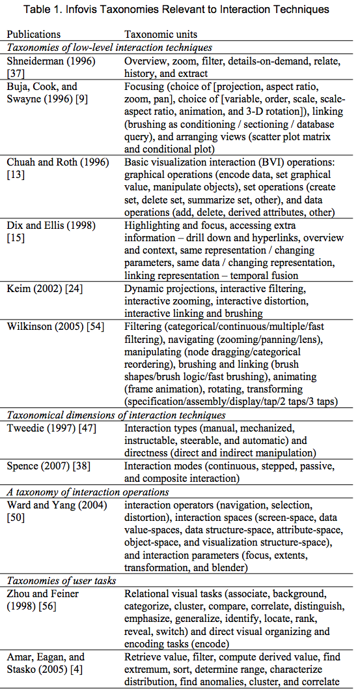

class: left, bottom
background-image: url(images/road_fall.jpg)
background-size: 100%
background-position: 0% 0%


```{r packages, message = FALSE, warning = FALSE, echo=FALSE}
## Run / Install before executing slides
 
# Load packages.
packages <- c("devtools", 
              "tidyverse",
              "stringr",
              "lubridate",
              "usethis",
              "ggthemes",
              "plotly", 
              "DT", 
              "highcharter",
              "gapminder", 
              "rwars",
              "quantmod")

packages <- lapply(packages, FUN = function(x) {
  if(!require(x, character.only = TRUE)) {
    install.packages(x)
  library(x, character.only = TRUE)
  }
}
)
```

```{r setup, include=FALSE}
library("knitr")
knitr::opts_chunk$set(echo = TRUE, eval=TRUE, message=FALSE, warning = FALSE,
fig.height=4.5, cache = TRUE) 
options(htmltools.dir.version = FALSE)
```

class: top, center, inverse
background-image: url(images/train_reverse_direction.gif)
background-size: 100%
background-position: 0% 110%

### Change the direction of this train - with your mind!

---

class: right

background-image: url(images/roadmap_numbers.jpg)
background-size: 110%
background-position: 0% 0%

# Roadmap

Some GitHub and  
R Markdown tips


**Interactive  
Data Visualization   
in R**

  Where are we in the course?  
  Where are we going?  
  Why interactive? Challenges?  
  Types of software and packages  

**Getting started with   
interactive visualization**

  DT  
  plotly  
  highcharter  

---

background-image: url(images/student_debt_help.jpg)
background-size: 135%
background-position: 20% 0%

# Assignment 1

$\color{white}{\text{- Posted on Github. Due next week.}}$
$\color{white}{\text{- Submission guidelines on Github as well.}}$

---

background-image: url(images/github_logo.jpg)
background-size: 30%
background-position: 84% 0%

# Submitting Assignment on 

## Create private Github repository 

  - Create a __private__ GitHub repository named `Lastname_Firstname` (exactly!) for assignments in the class organization.
  - You need to be a member to create a repository in the organization and submit your homework.
  - Add the prof and TAs as administrators to your __private__ GitHub repository
  
--

## Submit

  * Make a top-level directory for each assignment, e.g. `hw01` and `hw02` and so on.
  * Compile your homework to html (file extension should be `nb.html`) from `html_notebook` format. 


---

background-image: url(images/gangnam_github.png)
background-size: 40%
background-position: 80% 100%

# Some tips on GitHub / RMarkDown

Please send questions / suggestions on campuswire!

If useful to you, I am happy to spend a few minutes in each lecture to address "plumbing issues" with data wrangling, general coding, and publishing.

---

# RMarkdown: Setting the Output

You can render your R Markdown file (.Rmd) into [different outputs](http://rmarkdown.rstudio.com/lesson-9.html).

```{r, echo=FALSE, out.width = "100%"}

```

---

# RMarkdown: Setting the Output

You can render your R Markdown file (.Rmd) into [different outputs](http://rmarkdown.rstudio.com/lesson-9.html).

```{r, echo=FALSE, out.width = "70%"}

```

---

# RMarkdown: Setting the Output

- Documents
    - [html_document](http://rmarkdown.rstudio.com/html_document_format.html) - HTML document w/ Bootstrap CSS
    - [pdf_document](http://rmarkdown.rstudio.com/pdf_document_format.html) - PDF document (via LaTeX template)
    - [word_document](http://rmarkdown.rstudio.com/word_document_format.html) - Microsoft Word document (docx)
    - [github_document](http://rmarkdown.rstudio.com/github_document_format.html) - GitHub Flavored Markdown document
- Presentations (slides)
    - [ioslides_presentation](http://rmarkdown.rstudio.com/ioslides_presentation_format.html) - HTML presentation with ioslides
    - [beamer_presentation](http://rmarkdown.rstudio.com/beamer_presentation_format.html) - PDF presentation with LaTeX Beamer

---

# RMarkdown: Setting the Output

- you can customize the output by passing arguments to the function as sub-values of the `output` field

```
---
title: "My GitHub Document"
output:
  github_document:
    toc: true
    toc_depth: 2
---
```

---

# GitHub: Adding images/plots

- Some reported difficulties with controlling the size of included images.
- The `out.width` function is one option to set the output size of a plot - whether generated in R or already on the hard drive.
- benefit of this way of adding images is that the width argument is used in a large variety of outputs, including .md, ioslides, and PDF

```
{r, out.width = "70%"}
knitr::include_graphics("images/image1.png")
```

- Or set the size of figures for the entire output document as an added option:

```
output:
  html_document:
    fig_width: 5
    fig_height: 5
```

---

class: bottom, center, inverse
background-image: url(images/corona_tennis.jpg)
background-size: 150%
background-position: 0% 0%

# DataViz - The bigger picture

---

class: center 

# DataViz - The bigger picture

```{r, echo=FALSE, out.width = "100%"}
knitr::include_graphics("images/dataviz_chart_Page_1.png")
```

---

class: center 

# DataViz - The bigger picture

```{r, echo=FALSE, out.width = "100%"}
knitr::include_graphics("images/dataviz_chart_Page_2.png")
``` 

---

class: center 

# DataViz - The bigger picture

```{r, echo=FALSE, out.width = "100%"}

```

---

class: center 

# DataViz - The bigger picture

```{r, echo=FALSE, out.width = "100%"}

```

---

class: center 

# DataViz - The bigger picture

```{r, echo=FALSE, out.width = "100%"}

```

---

class: center 

# DataViz - The bigger picture

```{r, echo=FALSE, out.width = "100%"}

```

---

# Why interactive?

- **Pan/zoom**: Allow the user to navigate to area of interest.
- **Query**: What is this point? Get more info.
- **Linked brushing**: Connect multiple graphics. Get past 2D.

Plus many other specialized features and tools - We will discuss a few.

---

class: left, top
background-image: url(images/facebook_nytimes.gif)
background-size: 100%
background-position: 50% 102%

## An example: Facebook IPO coverage in the   [NYTimes](http://www.nytimes.com/interactive/2012/05/17/business/dealbook/how-the-facebook-offering-compares.html)

---

background-image: url(images/design_head.jpg)
background-size: 100%
background-position: 50% 150%

# Rules of the Game

The basic ideas about perception and data visualization principles (covered in lectures 1-3) remain the same.


But: We need to think about a few issues about **how people interact with computers and digital displays**.

---

class: center
background-image: url(images/infovis_Page_01.png)
background-size: 90%
background-position: 100% 50%

# Information Visualization

---

class: center
background-image: url(images/infovis_Page_02.png)
background-size: 90%
background-position: 100% 50%

# Information Visualization

---

class: center
background-image: url(images/infovis_Page_03.png)
background-size: 90%
background-position: 100% 50%

# Information Visualization

---

# Taxonomies of Interaction

```{r, echo=FALSE, out.width = "100%"}

```

<small> Yi, J. S., ah Kang, Y., & Stasko, J. (2007). Toward a deeper understanding of the role of interaction in information visualization. IEEE Transactions on Visualization and Computer Graphics, 13(6), 1224–1231. </small>

---

# Taxonomies of Interaction

.pull-left[

```{r, echo=FALSE, out.width = "65%"}

```

]

.pull-right[

Yi, J. S., ah Kang, Y., & Stasko, J. (2007). [Toward a deeper understanding of the role of interaction in information visualization](https://doi.org/10.1109/TVCG.2007.70515). IEEE Transactions on Visualization and Computer Graphics, 13(6), 1224–1231. 

]


---

background-image: url(images/user_interaction.png)
background-size: 30%
background-position: 110% 0%

# What does the user want to achieve?

- **Select**: Mark something as interesting.  

--

- **Explore**: Show me something else. Enable users to examine
a different subset of data cases.  

--

- **Reconfigure**: Show me a different arrangement. E.g. sorting tables, change perspective etc.  

--

- **Encode**: Show me a different representation. Changing how the data is visually represented (e.g., changing a pie chart to a histogram) or mapping into attributes (e.g., color, size, and shape). 

--

- **Abstract/Elaborate**: Show me more or less detail. Alter the representation from an overview down to details of individual data cases and often many levels in-between.

--

- **Filter**: Show me something conditionally. Users specify a range or condition, so that only data items meeting those criteria are presented.

--

- **Connect**: Show me related items. _Brushing_ technique to highlight the representation of a selected data item in the other views being displayed.

---

background-image: url(images/interaction_numbers_i_care.jpg)
background-size: 60%
background-position: 70% 100%

# Questions to ask yourself:

## 1. What is the **goal of the visualization**? 

---

background-image: url(images/interaction_audience.jpg)
background-size: 70%
background-position: 70% 100%

# Questions to ask yourself:

## 1. What is the **goal of the visualization**? Who is the **audience**?

---

background-image: url(images/interaction_paper.jpg)
background-size: 60%
background-position: 70% 100%

# Questions to ask yourself:

## 2. What kind of **interactivity do we want to add** for the user? 

---

background-image: url(images/interaction_mantra.jpeg)
background-size: 60%
background-position: 100% 100%

# Questions to ask yourself:

## 2. What kind of **interactivity do we want to add** for the user? 

--

.pull-left[

<small>
Shneiderman, Ben. 1996. [The Eyes Have It: A Task by Data Type Taxonomy for Information Visualizations.](https://www.cs.umd.edu/~ben/papers/Shneiderman1996eyes.pdf) VL Proceedings of IEEE on Visual Languages, January, 1–9.

Shneiderman, B., Plaisant, C., Cohen, M., Jacobs, S., and Elmqvist, N., [Designing the User Interface: Strategies for Effective Human-Computer Interaction](http://www.cs.umd.edu/hcil/DTUI6): Sixth Edition, Pearson (May 2016) 

The [eight golden rules  
of interface design](https://www.cs.umd.edu/users/ben/goldenrules.html).

</small>
]

.pull-right[

]


---

background-image: url(images/interaction_explore.jpg)
background-size: 60%
background-position: 70% 100%

# Questions to ask yourself:

## 2. What kind of **interactivity do we want to add** for the user? What does the user **gain** by having these tools?

---

background-image: url(images/interaction_journalism.jpg)
background-size: 60%
background-position: 100% 100%

# Questions to ask yourself:

## 3. How can we **adapt the visualization** to support these interactive operations?

<br><br><br><br>
<br><br><br><br>
<br><br><br><br>
Amanda Cox  
[Change by Design](https://www.youtube.com/watch?time_continue=500&v=chJA-E_pyVc)  
[Slides](https://www.slideshare.net/openjournalism/amanda-cox-visualizing-data-at-the-new-york-times)


---


class: center, top, inverse
background-image: url(images/fidget_spinner.gif)
background-size: 100%
background-position: 50% 20%

## ... But remember: interactions can be distracting

???

Piston-Hawks game, February 11, 2018
pic.twitter.com/3Q6Ic7kZCX

---


class: center, bottom, inverse
background-image: url(images/plotly_line_graph.gif)
background-size: 45%
background-position: 50% 20%

# Interactive graphics in R

---

# Interactive graphics in R

.pull-left[

```{r, echo=FALSE, out.width = "100%"}
knitr::include_graphics("images/plotly_line_graph.gif")
```

]

.pull-right[

- We will pick up from our previous graphs and maps.
- **Add some interactivity** with **small changes to the code we already know**.
- Easy to to do, but the **limitations will become obvious** at times.
- Have to move further away from static graph code to expand what we can do. Let's see how far we can go in this course.


]

---

class: left

# Quick survey: Languages and Technologies

## How many people know?

--

```{r, echo=FALSE, out.width = "24%"}
knitr::include_graphics("images/html_logo.jpg")
```
```{r, echo=FALSE, out.width = "24%"}
knitr::include_graphics("images/css_logo.png")
```
```{r, echo=FALSE, out.width = "24%"}
knitr::include_graphics("images/js_logo.png")
```
```{r, echo=FALSE, out.width = "24%"}
knitr::include_graphics("images/svg_logo.png")
```

???

<!--
Removed these slides for now.

----

# Interactive graphics in R

```{r, echo=FALSE, out.width = "100%"}

```

----

# Interactive graphics in R

```{r, echo=FALSE, out.width = "100%"}

```

-->

---

background-image: url(images/GoogleChrome_Car.jpg)
background-size: 100%
background-position: 50% 100%

# Where should computation happen?

- **In R**? Can do anything you can do in R & you don’t need to learn a new language.
- **In Javascript**? Computation done closer to rendering, so latency is lower.
- **A mix**? Can you have the best of both worlds?

---

class: center

# Interactive Data Visualization with `htmlwidgets`

.pull-left[

```{r, echo=FALSE, out.width = "100%"}

```

```{r, echo=FALSE, out.width = "100%"}
knitr::include_graphics("images/htmlwidgets_plotly.gif")
```

]

.pull-right[

```{r, echo=FALSE, out.width = "100%"}

```

```{r, echo=FALSE, out.width = "70%"}

```

]

---

# HTML Widgets and Javascript

- interactivity through javascript  
- `htmlwidgets` allows creation of links to existing java script libraries  
- created by RStudio

# Install package

```{r, eval=FALSE}
install.packages("htmlwidgets")

# You can alternatively install the development version of htmlwidgets from GitHub as follows:

devtools::install_github('ramnathv/htmlwidgets')
```

Most html widgets available on CRAN. Some on Github. Often good to choose developer versions on Github.

---

# Which HTML widget to choose?

Currently 116 htmlwidgets featured on http://www.htmlwidgets.org/  


```{r, echo=FALSE, out.width = "85%"}

```

Several htmlwidgets allow to **make the same type of graph** (say a bar chart) **with different underlying javascript libraries** (allowing different styles and interactivity)  


---

background-image: url(images/wordcloud_r.png)
background-size: 8%
background-position: 55% 9%

# Interactive graphics in R

From the simple to the involved.  
Our (approximate) road map for the course:

**TODAY**  
  - [`DT`](https://rstudio.github.io/DT/) for data tables  
  - [`plot.ly`](https://plot.ly/r/), [`higcharter`](http://jkunst.com/highcharter/) (and some other options) for charts  
  
--

**Maps**: [`leaflet`](https://rstudio.github.io/leaflet/), [tmap](https://github.com/mtennekes/tmap) (also  `plotly` / `highcharter`)  

**Networks**: [`visnetwork`](http://datastorm-open.github.io/visNetwork/), [`networkD3`](http://christophergandrud.github.io/networkD3/)

**On-demand computation in R**: [`shiny`](https://shiny.rstudio.com/) + `ggplot2` 

**Custom graphics in the browser**: [`D3.js`](https://d3js.org/) and other supporting [javascript libraries](http://selection.datavisualization.ch)

---

# Popularity Compared

Google Trends Popularity of Plotly, Shiny, and D3.js

```{r, echo=FALSE, out.width = "100%"}

```

<!-- https://trends.google.com/trends/explore?date=2010-01-01%202020-02-16&q=plotly,shiny%20R,d3.js ---> 

---

# Plotly

.pull-left[

-  [R package for plotly](https://plot.ly/r/getting-started/), a high-level interface to the open source JavaScript graphing library [`plotly.js`](https://plot.ly/javascript/).
- Plotly for R runs locally in your web browser or in the R Studio viewer
- Can publish charts to the web with plotly's web service.

]

.pull-right[

```{r, echo=FALSE, out.width = "100%"}
knitr::include_graphics("images/plotly_logo.png")
```

]

---

# Install Plotly

```{r, message=FALSE, warning=FALSE}
# library(devtools)
# devtools::install_github("ropensci/plotly")
library(plotly)
```

While you can provide the API keys directly in the code, it is more efficient to store them in the `.Renviron` file which is loaded during `R`'s startup. It is also safer to keep it secret if you share code (as you may in a assignment/group work). Get your [plotly API key here](https://plot.ly/settings/api).

```{r, eval=FALSE, message=FALSE, warning=FALSE}
# Find your R Home directory
R.home(component = "home")
# The R_ENVIRON should be here: ‘R_HOME/etc/Renviron.site’
# Or open directly:
usethis::edit_r_environ()
# Add plotly API Key
Sys.setenv("plotly_username"="ThomasBrambor")
Sys.setenv("plotly_api_key"="CJDJEkkk797d....")
```

---

# Scatter Plot

```{r, eval=TRUE, message=FALSE, warning=FALSE}
# Plot from Lecture 1
library(ggthemes)
library(gapminder)
plot1 <- ggplot(gapminder, 
        aes(x = gdpPercap, y = lifeExp, color = continent)) +
        geom_point(alpha=0.5, size=2) + 
        geom_smooth(color="black", lwd=1, se=FALSE) + 
        scale_x_log10("GDP per Capita") + 
        ylab("Life Expectancy in Years") + 
        theme_economist() + 
        theme(legend.position="none") + 
        ggtitle("The relationship between wealth and longevity")
```

---

# Scatter Plot

```{r, eval=TRUE, echo=FALSE, message=FALSE, warning=FALSE}
plot1
```

---

background-image: url(images/wow_glasses.gif)
background-size: 22%
background-position: 100% 0%

# Scatter Plot - Interactive

```{r, message=FALSE, warning=FALSE}
library(plotly)
ggplotly(plot1) #<<
```


---
 
# Adding Legend to Allow **Exploring**

```{r eval=FALSE, echo=TRUE, message=FALSE, warning=FALSE}
plot2 <- ggplot(gapminder, 
        aes(x = gdpPercap, y = lifeExp, 
            color = continent)) +        
        geom_point(alpha=0.5, size=2) + 
        geom_smooth(color="black", lwd=1, se=FALSE) + 
        scale_x_log10("GDP per Capita") + 
        ylab("Life Expectancy in Years") + 
        theme_economist() + 
        # theme(legend.position="none") + 
        theme(legend.title = element_blank()) + #<<
        ggtitle("The relationship between wealth and longevity")
ggplotly(plot2)
```

---

# Adding legend to allow **Exploring**

```{r echo=FALSE, fig.width=10, fig.height=6, message=FALSE, warning=FALSE}
plot2 <- ggplot(gapminder, 
        aes(x = gdpPercap, y = lifeExp, 
            color = continent)) +        
        geom_point(alpha=0.5, size=2) + 
        geom_smooth(color="black", lwd=1, se=FALSE) + 
        scale_x_log10("GDP per Capita") + 
        ylab("Life Expectancy in Years") + 
        theme_economist() + 
        # theme(legend.position="none") + 
        theme(legend.title = element_blank()) + 
        ggtitle("The relationship between wealth and longevity")
ggplotly(plot2)
```

---

# Changing the info box

```{r, eval=FALSE, message=FALSE, warning=FALSE}
plot3 <- ggplot(gapminder, 
        aes(x = gdpPercap, y = lifeExp, 
            color = continent, label = country)) +  # Label added #<<
        geom_point(alpha=0.5, size=2) + 
        geom_smooth(color="black", lwd=1, se=FALSE) + 
        scale_x_log10("GDP per Capita") + 
        ylab("Life Expectancy in Years") + 
        theme_economist() + 
        theme(legend.title = element_blank()) +
        ggtitle("The relationship between wealth and longevity")
ggplotly(plot3)
```

---

# Changing the info box

```{r echo=FALSE, fig.width=10, fig.height=6, message=FALSE, warning=FALSE}
plot3 <- ggplot(gapminder, 
        aes(x = gdpPercap, y = lifeExp, 
            color = continent, label=country)) +  # Label added
        geom_point(alpha=0.5, size=2) + 
        geom_smooth(color="black", lwd=1, se=FALSE) + 
        scale_x_log10("GDP per Capita") + 
        ylab("Life Expectancy in Years") + 
        theme_economist() + 
        theme(legend.title = element_blank()) +
        ggtitle("The relationship between wealth and longevity")
ggplotly(plot3, 
         tooltip = c("country","gdpPercap", "lifeExp"))
```

---

# Facets

```{r echo=TRUE, eval=TRUE, fig.width=10, fig.height=6, message=FALSE, warning=FALSE}
plot4 <- ggplot(gapminder, 
         aes(x = year, y = lifeExp, 
             color = continent,
             text = paste("country:",country))) + 
     geom_point() + theme(legend.position="none") +
     facet_wrap(~ continent) + 
     ggtitle("Life Expectancy Across Continents")
```

---

# Facets

```{r echo=FALSE, eval=TRUE, fig.width=10, fig.height=6, message=FALSE, warning=FALSE}
plot5 <- plot4 +
         theme(
      axis.text=element_text(size=6),
      axis.title=element_text(size=6, 
         margin = margin(t = 20, b = 5)), 
      strip.text.x = element_text(size = 6,
        colour = "dark blue")) +
      ylab("Life Expectancy") + 
        xlab("")
  
ggplotly(plot5)
```

---

# Example: Organs Data

```{r}
organs <- read.csv("data/organ_donors.csv")
organs$year <- as.Date(strptime(organs$year, format="%Y"))

# Average by group
by.country <- organs %>% group_by(consent.law, country) %>%
    summarize(donors=mean(donors, na.rm = TRUE))
by.country
```

---

# Boxplot (with Jitter)

```{r, eval=TRUE, message=FALSE, warning=FALSE}
plot6 <- ggplot(data=organs,
    aes(x=reorder(country, donors, na.rm=TRUE),
        y=donors)) + 
  geom_boxplot(aes(fill=consent.law), 
               outlier.colour="transparent", 
               alpha=0.3) +
  coord_flip() + 
  labs(x="", y="Donor Procurement Rate") +
  geom_jitter(shape=21, 
              aes(fill=consent.law), 
              color="black",
              position = position_jitter(w = 0.1)) 
```

---

# Boxplot (with Jitter) - static

```{r echo=FALSE, eval=TRUE, fig.width=10, fig.height=6, message=FALSE, warning=FALSE}
plot6 
```

---

# Boxplot (with Jitter) - interactive

```{r echo=FALSE, eval=TRUE, fig.width=10, fig.height=6, message=FALSE, warning=FALSE}
ggplotly(plot6)
```

---

# Changing the info box

```{r, echo=TRUE, message=FALSE, warning=FALSE}
ggplotly(plot6, 
         tooltip = c("consent.law", 
                     "donors"))
```

---

# ggplot2 -> Plotly 

The **`ggplotly()` function translates most things that you can do in `ggplot2`**, but not quite everything. 

To help demonstrate the coverage, there is a [plotly version of the ggplot2 docs](http://ropensci.github.io/plotly/ggplot2/).

`ggplotly` works by serializing ggplot2 figures into plotly's universal graph JSON.

We can **interact with the intermediate built** - i.e. after `ggplot2` but before `ggplotly` to adjust graph details as well


---

# Adjusting ggplotly graphs

```{r}
p <- plotly_build(plot3)
str(p, max.level = 1)
```

This is often **somewhat cumbersome** because of the translation from ggplot2 to plotly. But we can **build plotly objects natively right away**.

---

# Graphing directly in `plotly` - "Hello World"

```{r, message=FALSE, warning=FALSE}
library(plotly)
plot_ly(x = rnorm(1000), y = rnorm(1000), mode = 'markers' )
```

---

# Data as a plotly object 

```{r echo=TRUE, eval=TRUE, fig.width=8, fig.height=5, message=FALSE, warning=FALSE}
allCities <- txhousing %>%
  group_by(city) %>%
  plot_ly(x = ~date, y = ~median) %>%
  add_lines(alpha = 0.2, 
            name = "Texan Cities", hoverinfo = "none")
allCities
```

---

# Chain operators to change the plot object
 
```{r echo=TRUE, eval=FALSE, message=FALSE, warning=FALSE}
allCities %>%
  filter(city == "Houston") %>%
  add_lines(name = "Houston") 
```

```{r echo=FALSE, eval=TRUE, fig.width=10, fig.height=6, message=FALSE, warning=FALSE}
allCities <- txhousing %>%
  group_by(city) %>%
  plot_ly(x = ~date, y = ~median) %>%
  add_lines(alpha = 0.2, 
            name = "Texan Cities", hoverinfo = "none")

allCities %>%
  filter(city == "Houston") %>%
  add_lines(name = "Houston") 
```

--- 

# Bar Chart

```{r echo=TRUE, eval=FALSE, fig.width=10, fig.height=6, message=FALSE, warning=FALSE}
data(diamonds)
plot_ly(diamonds, x = ~cut, color = ~clarity) %>%
  add_histogram()
```

---

# Plotly cheat sheet for R

- Plot.ly provides a cheat sheet on how to get started with [plotting in R](https://images.plot.ly/plotly-documentation/images/r_cheat_sheet.pdf)
- Setup is similar to `ggplot2` but not the same.
- Need to weigh the limitations from the ggplot to plotly conversion vs. the need to learn to how to make graphs in plotly

```{r, echo=FALSE, out.width = "70%"}

``` 

---

# Boxplot in `plotly`

```{r, message=FALSE, warning=FALSE}
p <- plot_ly(organs, y = ~country, x = ~donors, type = "box")
p
```

Sometimes labels and margins are poorly allocated. Need to fix.

---

# Boxplot in `plotly`

```{r, eval= TRUE, message=FALSE, warning=FALSE}
# Setting margins
m <- list(l = 150, r = 100, b = 100, t = 10, pad = 10) #<<

plot7 <- plot_ly(organs, y = ~country, x = ~donors, 
             color= ~consent.law,
             type = "box") %>%
  layout(autosize = F, width = 600, height = 400, 
         margin = m, #<<
         yaxis = list(title = "", showticklabels = TRUE), 
         xaxis = list(title = "Organ Donors"))
```

---

# Boxplot in `plotly`

```{r, eval= TRUE, echo=FALSE, message=FALSE, warning=FALSE}
plot7
```


---

# Other plot types: Bubble Charts

```{r}
gapminder$logpop <- log(gapminder$pop)
plot_ly(gapminder, y = ~lifeExp, x = ~gdpPercap, 
             color= ~continent, size=~logpop,
             type = "scatter", mode='markers')
```

???

REMOVED FOR NOW - already line plot above

# Other plot types: Line Plot

```{r, message=FALSE, warning=FALSE}
plot_ly(organs, y = ~donors, x = ~year, 
             color= ~country, 
             type = "scatter", mode='lines')
```


---

# Other plot types: Heat Map

Volcano Data: Mount Eden is a volcano in the Auckland volcanic field. The **volcano dataset** gives topographic information for Mount Eden on a **10m by 10m grid**. 

```{r, echo=TRUE, message=FALSE, warning=FALSE}
data(volcano)
# The heatmap
plot_ly(z = ~volcano, type = "heatmap")
```

---

# 3d surface map: Volcano Data

```{r echo=TRUE, eval=TRUE, fig.width=10, fig.height=6, message=FALSE, warning=FALSE}
# The 3D Surface Map
plot_ly(z = ~volcano, type = "surface")
```


---

# General Figure Setup in Plotly

```{r, eval=FALSE, message=FALSE, warning=FALSE}
plot_ly ( )
  data = data.frame
  add_trace = list()
  x,y,z, = c()
  color, text, size = c() 
  colorscale ‘string’ or c()
  marker = list() 
    color = ‘string’ 
    symbol = list()
  line = list() 
    color ‘string’ 
    width 123
    
layout()
  title ‘string’
  xaxis, yaxis = list() 
  geo list()
legend = list() 
annotations = list()
```

---

# Publishing Plots on Plot.ly

You can **publish** your charts to the web with **Plotly's web service**. You will need to **set up a free account** to do so.

## Publishing Plots on Plot.ly

1. Create a free [Plotly](plot.ly) account.
2. Find your [authentication API keys](https://plot.ly/settings/api) in your online settings. 3. Save your authentication credentials and set them in your R session with:
```
Sys.setenv("plotly_username"="your_plotly_username")
Sys.setenv("plotly_api_key"="your_api_key")
```
4. R Profile
Best to save these commands in your `.Rprofile` or `.Renviron`  file to be run every time you start R.
5. Publish your graphs to Plotly with `api_create`

---

# Publishing Plots on Plot.ly

```{r, eval=FALSE, message=TRUE, warning=TRUE}
library(plotly)
data(diamonds)
p <- plot_ly(midwest, x = ~percollege, color = ~state, type = "box")
api_create(p, filename = "midwest-boxplots")
```

```{r, echo=FALSE, out.width = "50%"}

```

---

# Online Plot Privacy

- Plots can be set to three different type of privacies: 
    - public
    - private
    - secret
- **By default all plots are set to public**. Users with the **free account have the permission to keep one private plot**.

---

class: bottom, center, inverse
background-image: url(images/DT_example.png)
background-size: 70%
background-position: 50% 15%

# DataTable package `DT`

---

# DataTable package `DT`

The R package `DT` provides an R interface to the JavaScript library `DataTables.js`. 

R **data objects** (matrices or data frames) can be **displayed as tables on HTML pages**. 

DataTables provides **filtering, pagination, sorting, and many other features** in the tables.

```{r, echo=FALSE, out.width = "70%"}

```

---

# Datatable `DT`

```{r include=FALSE}
options(DT.options = list(pageLength = 5))
```


<small><small>

```{r , warning = FALSE, echo=FALSE, fig.height=20}
datatable(gapminder)
```
 
</small></small>

```{r, echo=TRUE, eval=FALSE}
library(DT)
datatable(gapminder)
```

---

# Datatable `DT` 

<small><small>

```{r , warning = FALSE, echo=FALSE, fig.height=20}
datatable(gapminder) %>%
    formatStyle('country',  color = 'white', 
                backgroundColor = 'blue', fontWeight = 'bold')
```
 
</small></small>

```{r, echo=TRUE, eval=FALSE}
datatable(gapminder) %>%
    formatStyle('country',  color = 'white', 
                backgroundColor = 'blue', fontWeight = 'bold')
```

---

# Fixing Column Labels


<small><small>

```{r}
transport_data <- read_csv("data/transport.csv")
datatable(transport_data)
```
 
</small></small>


---

# Fixing Column Labels

```{r, eval=FALSE}
pretty_headers <- 
  gsub("[.]", " ", colnames(transport_data)) %>%
  str_to_title()

transport_data %>%
  datatable(
    rownames = FALSE,
    colnames = pretty_headers,
    filter = list(position = "top"),
    options = list(language = list(sSearch = "Filter:"))
  )
```

---

# Fixing Column Labels

<small><small>

```{r, echo=FALSE}
pretty_headers <- 
  gsub("[.]", " ", colnames(transport_data)) %>%
  str_to_title()

transport_data %>%
  datatable(
    rownames = FALSE,
    colnames = pretty_headers,
    filter = list(position = "top"),
    options = list(language = list(sSearch = "Filter:"))
  )
```
 
</small></small>


---

# Adding Selection Fields and Sliders

<small><small>

```{r, echo=FALSE}
transport_data %>%
  datatable(
    rownames = FALSE,
    colnames = pretty_headers,
    filter = list(position = "top"),
    options = list(
      dom = "Bfrtip",
      buttons = I("colvis"),
      language = list(sSearch = "Filter:")
    ),
    extensions = c("Buttons", "Responsive")
  )
```
 
</small></small>


---

class: bottom, center, inverse
background-color: #000000

# `highcharter` package

```{r, echo=FALSE}
library(tidyverse)
library(rwars)

swmovies <- get_all_films()

swdata <- map_df(swmovies$results, function(x){
  data_frame(
    movie = x$title,
    species = length(x$species),
    planets = length(x$planets),
    characters = length(x$characters),
    vehicles = length(x$vehicles),
    release = x$release_date
  )
}) 

swdata <- gather(swdata, key, number, -movie, -release) %>% 
  arrange(release)

hchart(swdata, "line", hcaes(x = movie, y = number, group = key),
       color = c("#e5b13a", "#4bd5ee", "#4AA942", "#FAFAFA")) %>% 
  hc_title(
    text = "Diversity in <span style=\"color:#e5b13a\"> STAR WARS</span> movies",
    useHTML = TRUE) %>% 
  hc_tooltip(table = TRUE, sort = TRUE) %>% 
  hc_credits(
    enabled = TRUE,
    text = "Source: SWAPI via rwars package",
    href = "https://swapi.co/") %>% 
  hc_add_theme(
    hc_theme_flatdark(
      chart = list(
        backgroundColor = "transparent",
        divBackgroundImage = "http://www.wired.com/images_blogs/underwire/2013/02/xwing-bg.gif"
      )
    )
  )
```

---

# The `highcharter` package

.pull-left[

```{r, echo=TRUE, eval=FALSE}
data(mpg, package = "ggplot2")
hchart(mpg, "scatter", 
       hcaes(x = displ, 
             y = hwy, 
             group = class))
```

]

--

.pull-right[

```{r, echo=FALSE, eval=TRUE}
data(mpg, package = "ggplot2")
hchart(mpg, "scatter", 
       hcaes(x = displ, y = hwy, group = class))
```

]

---

# Bubble charts compared

<small>

.pull-left[

## ggplot2

```{r, eval=FALSE}
plot_ly(gapminder, 
        
        x = ~gdpPercap, 
        y = ~lifeExp, 
        size=~pop,
        color= ~continent, 
        type = "scatter", 
        mode='markers') %>%
layout(xaxis = list(type="log"))
```

]

.pull-right[

## highcharter

```{r, eval=FALSE}
hchart(gapminder,
       type = "bubble",
  hcaes(x = gdpPercap,
        y = lifeExp,
        size = pop,
        group = continent)) %>%
  
  
  hc_xAxis(type = "logarithmic")
```

]

<small>


---

# plotly vs. highcharter

<small>

.pull-left[

## plotly

```{r, echo=FALSE}
plot_ly(gapminder, 
        y = ~lifeExp, 
        x = ~gdpPercap, 
        color= ~continent, 
        size=~pop,
        type = "scatter", 
        mode='markers') %>%
layout(xaxis = 
         list(type = "log"))
```

]

.pull-right[

## highcharter

```{r, echo=FALSE}
hchart(gapminder,
       type = "bubble",
  hcaes(x = gdpPercap,
        y = lifeExp,
        size = pop,
        group = continent)
      ) %>%
  hc_xAxis(type = "logarithmic")
```

]

<small>

---


background-image: url(images/tufte_happy.jpg)
background-size: 17%
background-position: 100% 0%

# Themes

.pull-left[

```{r eval=FALSE}
# Let's make our old 
# friend Tufte happy

values <- 1 + abs(rnorm(12))

highchart() %>%
  hc_chart(
    type = "column") %>%
  hc_add_series(
    data = values) %>%
  hc_xAxis(
    categories = month.abb) %>%
  hc_add_theme(
    hc_theme_tufte2())
```

]

.pull-right[

```{r echo=FALSE}
values <- 1 + abs(rnorm(12))

highchart() %>%
  hc_chart(type = "column") %>%
  hc_add_series(data = values) %>%
  hc_xAxis(categories = month.abb) %>%
  hc_add_theme(hc_theme_tufte2())
```

]


---

## Chart Junk? (or graph on "Fires in California"?)

```{r echo=FALSE}
highchart() %>% 
  hc_chart(backgroundColor = "#") %>% 
  hc_title(text = "Chart color gradient it's on fire", style = list(color = "#CCC")) %>% 
  # hc_xAxis(categories = month.abb) %>% 
  hc_yAxis(labels = list(style = list(color = "#CCC")),
           gridLineColor = "#111111") %>% 
  hc_series(
    list(
      data =  abs(rnorm(100)) + 1,
      type = "areaspline",
      marker = list(enabled = FALSE),
      color =  list(
        linearGradient = list(x1 = 0, y1 = 1, x2 = 0, y2 = 0),
        stops = list(
          list(0, "transparent"),
          list(0.33, "yellow"),
          list(0.66, "red"),
          list(1, "#ccc")
        )
      ),
      fillColor = list(
        linearGradient = list(x1 = 0, y1 = 1, x2 = 0, y2 = 0),
        stops = list(
          list(0, "transparent"),
          list(0.1, "yellow"),
          list(0.5, "red"),
          list(1, "black")
          )
        )
      )
    ) %>% 
  hc_add_theme(hc_theme_null())
```

---

# Financial Graphs with `highstock`

```{r, echo=FALSE}
library("quantmod")

SPY <- getSymbols("SPY", from = Sys.Date() - lubridate::years(1), auto.assign = FALSE)
SPY <- adjustOHLC(SPY)

SPY.SMA.10 <- SMA(Cl(SPY), n = 5)
SPY.SMA.200 <- SMA(Cl(SPY), n = 100)
SPY.RSI.14 <- RSI(Cl(SPY))
SPY.RSI.SellLevel <- xts(rep(70, NROW(SPY)), index(SPY))
SPY.RSI.BuyLevel <- xts(rep(30, NROW(SPY)), index(SPY))

highchart(type = "stock") %>% 
  # create axis :)
  hc_yAxis_multiples(
    create_yaxis(3, height = c(2, 1, 1), turnopposite = TRUE)
  ) %>% 
  # series :D
  hc_add_series(SPY, yAxis = 0, name = "SPY") %>% 
  hc_add_series(SPY.SMA.10, yAxis = 0, name = "Fast MA") %>% 
  hc_add_series(SPY.SMA.200, yAxis = 0, name = "Slow MA") %>% 
  hc_add_series(SPY$SPY.Volume, color = "gray", yAxis = 1, name = "Volume", type = "column") %>% 
  hc_add_series(SPY.RSI.14, yAxis = 2, name = "Osciallator", color = hex_to_rgba("green", 0.7)) %>%
  hc_add_series(SPY.RSI.SellLevel, color = hex_to_rgba("red", 0.7),
                yAxis = 2, name = "Sell level") %>% 
  hc_add_series(SPY.RSI.BuyLevel, color = hex_to_rgba("blue", 0.7),
                yAxis = 2, name = "Buy level") 
```

---

# Which tool is the best for me?

The [chartmaker directory](http://chartmaker.visualisingdata.com/) on Andy Kirk's website [visualisingdata.com](https://www.visualisingdata.com/) allows you to find the right tool for the job.

```{r, echo=FALSE, out.width = "100%"}

```


