class: left, top
background-image: url(images/compass_map.jpg)
background-size: 115%
background-position: 0% 0%


```{r packages, message = FALSE, warning = FALSE, echo=FALSE}
## Run / Install before executing slides
 
# Load packages.
packages <- c("devtools","knitr","tidyverse","broom", "DT","ggmap", "ggthemes", "maps", "ggcounty", "statebins", "cdcfluview", "OpenStreetMap", "plyr", "readr","maptools","mapproj","rgeos","rgdal","RColorBrewer","stringr","scales","tidyverse","readxl","statebins","RJSONIO","XML","RCurl", "xaringan", "bindrcpp", "tmap", "rnaturalearth")

packages <- lapply(packages, FUN = function(x) {
  if(!require(x, character.only = TRUE)) {
    install.packages(x)
  library(x, character.only = TRUE)
  }
}
)

# devtools::install_github("hrbrmstr/cdcfluview")
# devtools::install_github("hrbrmstr/ggcounty")
# devtools::install_github("cwickham/geospatial")

```

```{r setup, include=FALSE}
library("knitr")
knitr::opts_chunk$set(echo = TRUE, eval=TRUE, 
                      message=FALSE, warning = FALSE,
                      fig.height=5, fig.width=9, cache = TRUE) 
options(htmltools.dir.version = FALSE)
```  

```{r theme-map, include=FALSE}
theme_simplemap <- function(base_size = 9, base_family = "") {
  theme_bw(base_size = base_size, base_family = base_family) %+replace%
    theme(axis.line = element_blank(),
          axis.text = element_blank(),
          axis.ticks = element_blank(),
          axis.title = element_blank(),
          panel.background = element_blank(),
          panel.border = element_blank(),
          panel.grid = element_blank(),
          panel.spacing = unit(0, "lines"),
          plot.background = element_blank(),
          legend.position = "none")
}
```  


## Roadmap for Today

- Mapping the 2016 presidential elections:  
  - What have others done?

- Projections

- Mapping the 2016 presidential elections ourselves:
  - shaded statemaps
  - county level maps
  - cartograms

- The `ggmap()` package

Next Lecture:   
  - Shape files vs. data frames  
  - The `tmap()` package


---

class: top, left, inverse
background-image: url(images/megaphone_guy.png)
background-size: 50%
background-position: 90% 90%

# Announcements

---

background-image: url(images/final_project_dataviz.jpg)
background-size: 100%
background-position: 100% 140%

# Final Project

- Who has found a group? Who is still looking? 
  - **Recall**: 3-4 students per group.
- I will assign group letters today. 
- Add a private Github project in the class organization. 
    - Repo name: Group\_**Group Letter**\_**Very short title**, e.g. _Group_C_Healthcare_
    - add all group members AND the instructor team as admins
    - add a `.readme` file to the repo with a group title, brief description, the names and the emails of all members. 

---

# Exercise this week

- Added the weekly non-mandatory assignment:
    - World Map of Health Care Expenditures
    - Fortune 500 companies: 
        - make shaded polygon map
        - geocode addresses of headquarters and add to the map

---

class: bottom, center, inverse
background-image: url(images/election_2016_NYTimes.png)
background-size: 80%
background-position: 50% 30%

# U.S. electoral results on different maps

---

background-image: url(images/educational-attainment-in-manhattan.gif)
background-size: 48%
background-position: 100% 0%

# Choropleth maps

.pull-left[

- **Choropleth maps** are maps in which areas are **shaded or patterned in proportion to the measurement** of the statistical variable being displayed on the map.
- Choropleth maps are visually appealing, but can also be misleading. 

.small[
- **Example**: election results in the U.S. The fundamental issue in these maps is always that people vote, not places. So we are presenting _areas that are not congruent to votes_.
]

]

.pull-right[

]


---

# 2016 U.S. Election, Winner by State

```{r, echo=FALSE, out.width = "100%"}
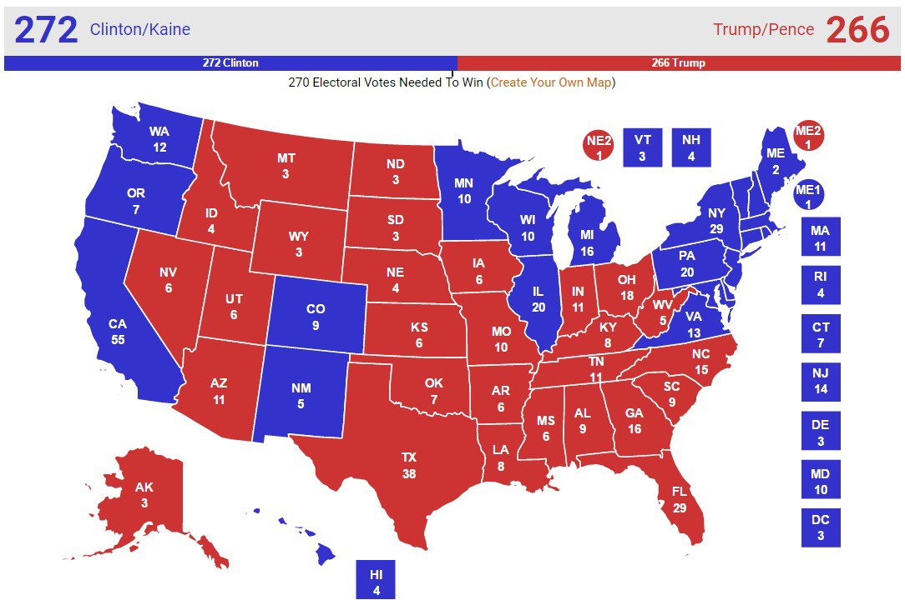
```

---

# 2016 U.S. Election, Winner by County

```{r, echo=FALSE, out.width = "100%"}
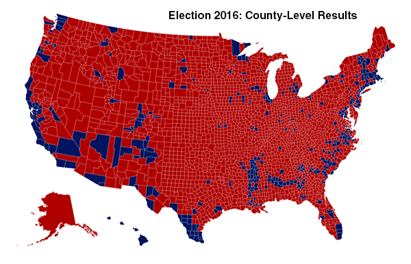
```

---

# 2016 U.S. Election, Winner by County

Zooming improves the issue (maybe) but not sufficiently. Now it looks like Hillary got barely any votes. But she won the popular vote!

 - The map is still somewhat misleading because **we have colored every county either red or blue, as if every voter voted the same way**. 
- This is of course not realistic: all counties contain both Republican and Democratic supporters and in **using just the two colors on our map we lose any information about the balance between them**. 
- There is no way to tell whether a particular county went strongly for one candidate or the other or whether it was relatively evenly split.

---

## 2016 U.S. Election, Winner by County Share

County share grades the **color scale by the winning margin**. This improves the picture somewhat but leaves the majority of the map shaded in red. 

```{r, echo=FALSE, out.width = "95%"}
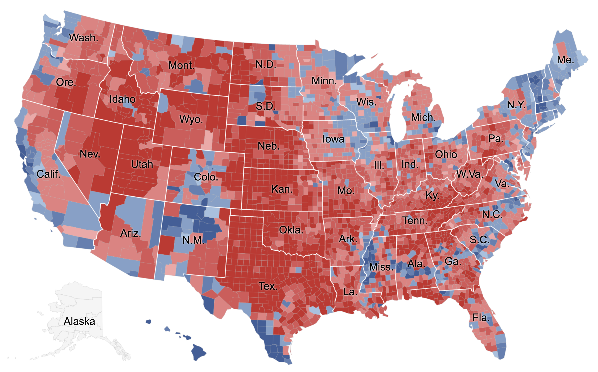
```

---

# 2016 U.S. Election, Color-Centered

.small[

Reveal **more nuance** in the vote is to use not just two colors, red and blue, but to use **red, blue, and shades of purple** in between to indicate percentages of votes. 
]

```{r, echo=FALSE, out.width = "90%"}
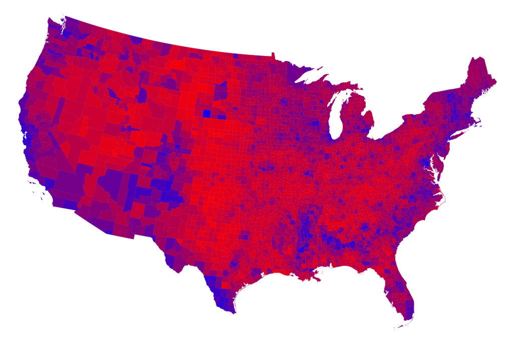
```

<small><small>Mark Newman. 2016. http://www-personal.umich.edu/~mejn/election/2016/</small></small>
</small></small>

---

# 2016 U.S. Election, Cartogram

.small[
The issue remains the **incorrect mapping between area and number of votes**.


A **cartogram map** deforms the shape of each state/county so that **each area is sized proportional to its population**.
]

```{r, echo=FALSE, out.width = "80%"}
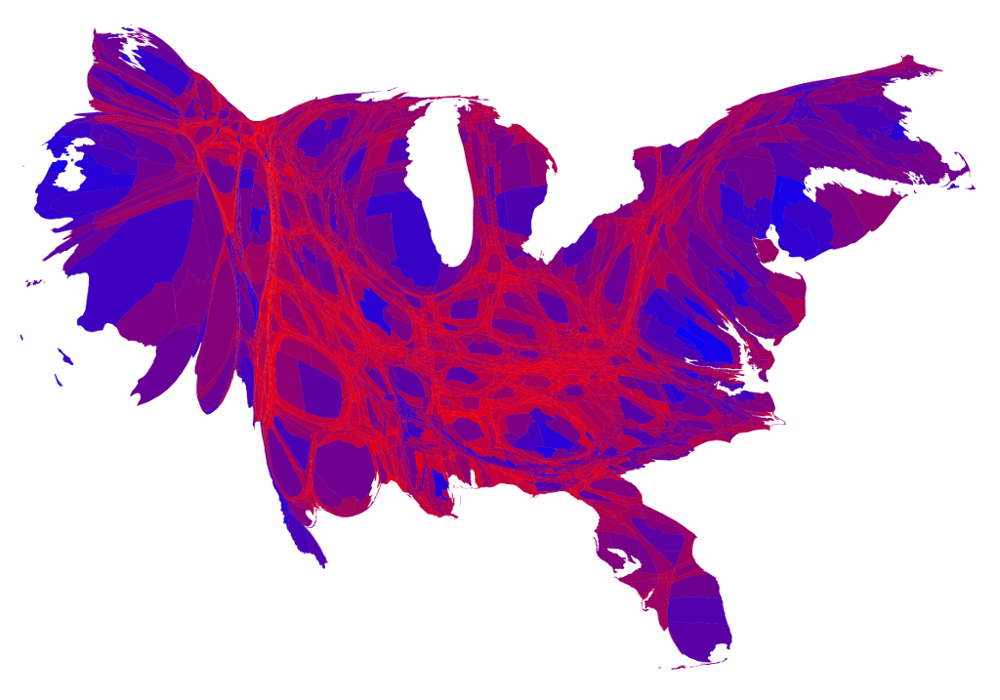
```

<small><small>Mark Newman. 2016. http://www-personal.umich.edu/~mejn/election/2016/</small></small>
</small></small>

---

# 2016 U.S. Election, Cartogram

.small[
The map below uses a **spectrum of colors**, rather than just red and blue, to show how close the vote was in each county.


But **cartograms have shortcomings**: the shapes can become **unfamiliar**, making it difficult to recognize what the different areas are.
]

```{r, echo=FALSE, out.width = "80%"}

```

---

# 2016 U.S. Election, tiled cartogram

.small[
Tiled cartograms **try to preserve the sense of geographical space** while building the "map" from equally-sized blocks, with the number of blocks used to construct each unit varying by some quantity of interest, like population.
]

```{r, echo=FALSE, out.width = "80%"}
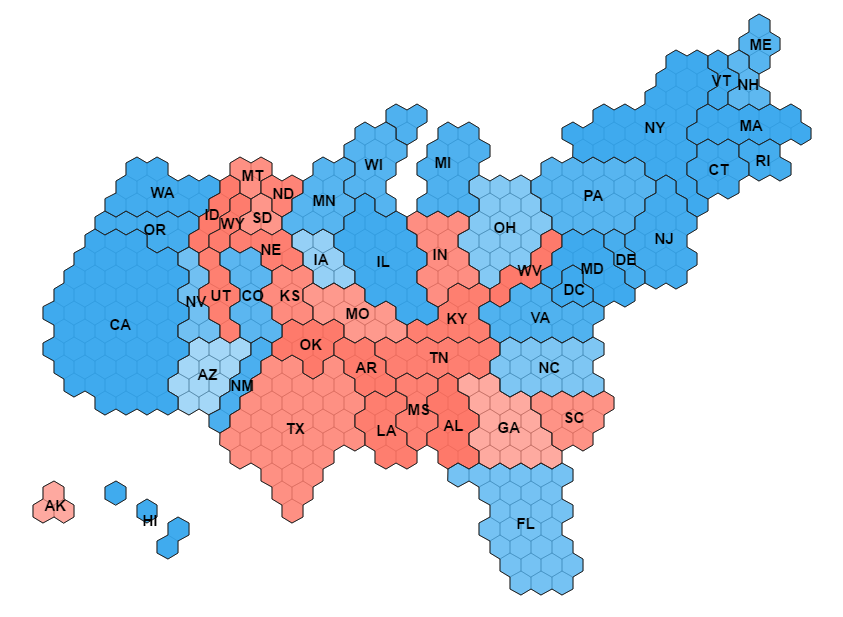
```

<small><small>http://blog.revolutionanalytics.com/2016/10/tilegrams-in-r.html
</small></small>

---

# 2016 U.S. Election, prism map

.small[
And yes, it is, of course, possible to use a third dimension to show the population distribution - with the usual caveats we had for using 3D displays.
]

```{r, echo=FALSE, out.width = "80%"}
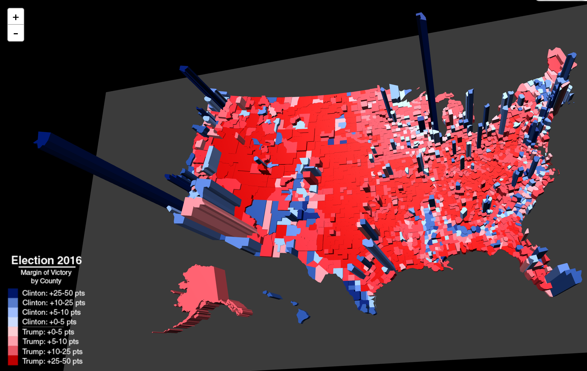
```

<small><small>http://metrocosm.com/election-2016-map-3d/
</small></small>

---

# Other ways to skin the cat

.small[
Take a look here. The good people at the NYTimes have proposed many different presentations of the electoral results:

.small[
https://www.nytimes.com/interactive/2016/11/01/upshot/many-ways-to-map-election-results.html]
]

--

```{r, echo=FALSE, out.width = "100%"}
knitr::include_graphics("images/election2014_shift_vote_margin.gif")
```

---

class: center
background-image: url(images/electoral_maps.png)
background-size: 95%
background-position: 50% 100%

# What do you want to map?

???

https://lisacharlotterost.github.io/2016/10/19/election-map/


---

class: bottom, center, inverse
background-image: url(images/projection_face.png)
background-size: 60%
background-position: 50% 30%

# Projections


???

https://archive.org/stream/cu31924003898271#page/n58/mode/1up


---

# Projections 

.small[
A **map projection** is a systematic transformation of the latitudes and longitudes of locations on the surface of a sphere into locations on a plane. 


We need to use map projections to **create 2D maps of our 3D earth**.

All map projections **distort** the surface in some fashion.
]

```{r, echo=FALSE, out.width = "100%"}
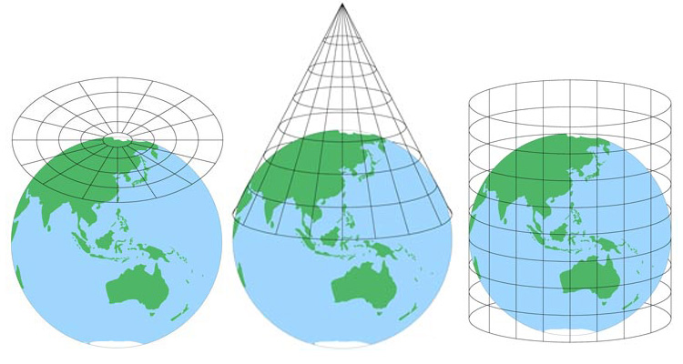
```


???

Picture from:
https://www.atlasandboots.com/map-projections/

---

# Mercator

.small[
Meridians are mapped to **equally spaced vertical lines and circles of latitude** (parallels) are mapped to horizontal lines.

Mercator projection **distorts the size** of objects as the latitude **increases from the Equator to the poles**. 
]

```{r, echo=FALSE, out.width = "100%"}
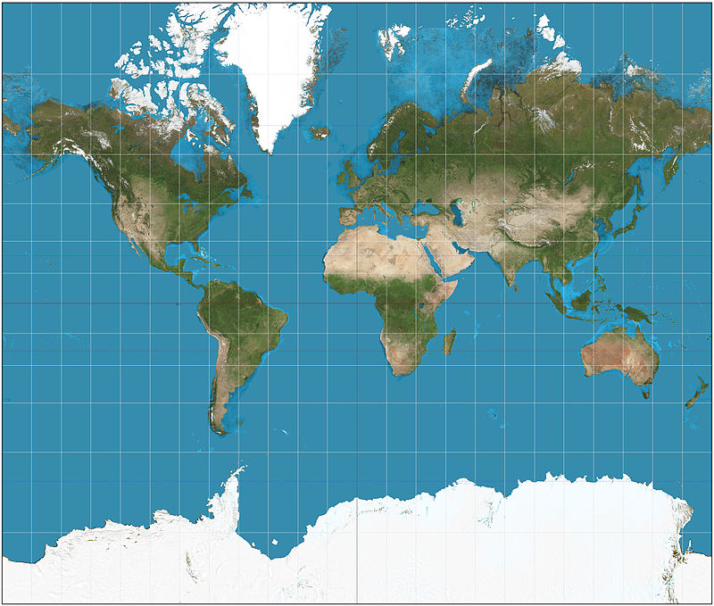
```

---

background-image: url(images/africa_true_size.png)
background-size: 55%
background-position: 100% 50%


# Mercator


.pull-left[

**Mercator projection is commonly used**, for example on google maps.

.small[

**But:** landmasses such as Greenland and Antarctica appear much larger than they actually are relative to land masses near the equator, such as Central Africa.

Try [thetruesize.com](https://thetruesize.com/) to "correct your vision".
]

]

.pull-right[

]

---

# Will the Real U.S. Please Stand Up?

```{r, echo=FALSE, out.width = "95%"}
knitr::include_graphics("images/proj-usa-four-ways.jpg")
```

.footnotesize[

**Top Left:** Mercator; Note the straight border to Canada. Most common.  
**Bottom Left:** U.S. National Atlas. Optimized for U.S. map (wide East-West, shorter North-South)   
**Top Right:** UTM (Universal Transverse Mercator, not the same as a Mercator, confusingly). Good for measuring distances between two points (in small areas)  
**Bottom Right:** A specific mapping system. There are tons of them, e.g. Google maps uses "EPSG:3857.WGS84"  
]

???

https://source.opennews.org/articles/choosing-right-map-projection/  


---

background-image: url(images/Londoners_label_the_map.jpg)
background-size: 70%
background-position: 50% 20%

class: inverse, bottom, center

# Our [own](https://www.wimp.com/british-people-hilariously-label-a-map-of-the-united-states/) map of the 2016 Elections

---

# Let's start with a simple state map

```{r, eval=TRUE} 
us.states <- ggplot2::map_data("state")
ggplot() + geom_polygon(data = us.states, aes(x=long,y=lat,group=group), 
                        color = "grey", fill = NA)
```

---

# Projections can be easily added
  
```{r, eval=TRUE, message=FALSE, warning=FALSE}
library(maps)
# See the `‘mapproj’` package for a list of projections
us.states <- map_data("state")
ggplot() + geom_polygon( data = us.states, 
                         aes(x = long, y = lat, group=group), 
                         color = "grey", fill = NA) +
  coord_map(projection = "azequidistant")
# Equal spaced parallels, true distances from pole
```

---

## Prepare to merge the state map and electoral data
  
```{r, eval=TRUE, message=FALSE, warning=FALSE}
library(maps)
library(dplyr)
library(tidyverse)  

# The maps package has geographic information on all U.S states
us.states <- map_data("state")
us.states <- as_data_frame(us.states)
us.states <- dplyr::rename(us.states, state = region)
us.states$subregion = NULL
us.states$state <- str_to_title(us.states$state)

us.states
```

---

## Prepare to merge the state map and electoral data

```{r, eval=TRUE, message=FALSE, warning=FALSE}
# Add State Abbreviations and Centers
statenames <- as_data_frame(
  cbind(state=state.name, state.abb = state.abb, 
        state.center.x = state.center$x, 
        state.center.y = state.center$y))
statenames <- statenames %>% mutate_each_(funs(as.numeric), 
                 vars=c("state.center.x","state.center.y"))
us.states <- left_join(us.states, statenames)
str(us.states)
```

---

# State level electoral results
  
```{r, eval=TRUE}
# Data from David Leip's Election Atlas http://uselectionatlas.org/
library(readxl)
elecstate <- 
 read_excel("data/US_Presidential_Results_by_State_1828-2016.xlsx",
            sheet=2, col_names=FALSE)
# Drop election results 1828-2012 and regional results
elecstate <- elecstate[c(4:54),c(1:3)]  
elecstate <- dplyr::rename(elecstate, 
               state = "...1", Clinton = "...2", Trump = "...3")

elecstate <- elecstate %>% mutate_each_(funs(as.numeric), 
                                        vars=c("Trump","Clinton"))
elecstate <- mutate(elecstate, R.D = ifelse(Trump > 50, "R", "D"))
elecstate
```

---

# Merge Electoral Data and Map
  
```{r, message = TRUE, warning = FALSE}
# Merge the data
elecstate.merged = left_join(elecstate, us.states)
```

.footnotesize[
```{r, echo=FALSE}
head(elecstate.merged)
```
]

---

# Plot the map (1)

```{r}
(winstatesmap <- ggplot(elecstate.merged, 
    aes(x = long, y = lat, group=group)) + 
    geom_polygon(aes(fill = R.D), color="white"))
```

---

# Plot the map (2) - Add appropriate colors

```{r}
(winstatesmap <- winstatesmap + 
  scale_fill_manual(values = c("steel blue","firebrick"))) 
```

---

# Plot the map (3) - Add state codes

```{r}
(winstatesmap <- winstatesmap +   
  geom_text(data=statenames, inherit.aes = FALSE,   
              aes(label=state.abb,   
                  x=state.center.x, y=state.center.y),  
                  colour="white"))  
```

---

# Plot the map (4) - Add theme / projection

```{r}
(winstatesmap <- winstatesmap + 
    theme_map() + 
    coord_map(projection = "mercator"))
```

---

# Plotting Vote Margins

```{r, eval=FALSE}
ggplot(elecstate.merged, 
       aes(x = long, y = lat, group=group, label=state)) + 
  geom_polygon(aes(fill = Trump-Clinton)) + #<<
  scale_fill_gradientn(colours=c("red","purple2","blue")) + #<<
  geom_text(data=statenames, inherit.aes = FALSE, 
            aes(label=state.abb, x=state.center.x, 
                y=state.center.y), colour="white") +
  theme_map() + coord_map(projection = "mercator")
```

---

# Plotting Vote Margins

```{r, echo=FALSE}
ggplot(elecstate.merged, 
       aes(x = long, y = lat, group=group, label=state)) + 
  geom_polygon(aes(fill = Trump-Clinton)) + #<<
  scale_fill_gradientn(colours=c("red","purple2","blue")) + #<<
  geom_text(data=statenames, inherit.aes = FALSE, 
            aes(label=state.abb, x=state.center.x, 
                y=state.center.y), colour="white") +
  theme_map() + coord_map(projection = "mercator")
```

---

# County-Level Electoral Results
  
Let's now turn to county-level results.

Data for the county-level comes from [Tony McGovern](https://github.com/tonmcg/County_Level_Election_Results_12-16
) on GitHub.

```{r, eval=FALSE}
# Import Data from Github
url = "https://raw.githubusercontent.com/tonmcg/County_Level_Election_Results_12-16/master/US_County_Level_Presidential_Results_12-16.csv"
eleccounty <- read_csv(url)
eleccounty$X1 <- NULL
```

```{r, eval=TRUE}
# Import Data from Data Folder in Lecture Material
eleccounty <- read_csv("data/US_County_Level_Election_Results_2016/US_County_Level_Presidential_Results_12-16.csv")
eleccounty$X1 <- NULL
```

Next, let's merge on county and state names

---

# Getting U.S. County maps
  
There are several ways to get U.S. county maps:
  
- `ggplot2` contains county maps
- `urbnmapr` is package with county shape files
- and the [U.S. Census Bureau](https://www.census.gov/geo/maps-data/data/cbf/cbf_counties.html) provides the shape files as well

&rarr; I will use the `urbnmapr` package for the example. We will return on how to import shapefiles from any source later.

---

# Getting U.S. county maps
  
```{r, warnings=FALSE}
# devtools::install_github("UrbanInstitute/urbnmapr")
library(urbnmapr)
# Returns a ggplot2 object with a geom_map of the the lower 
# 48 states (plus Hawaii & Alaska reset on the bottom) 
uscounties_sf <- get_urbn_map("counties", sf = TRUE)
str(uscounties_sf)
```

---

# Plotting the shape file directly

```{r}
ggplot(uscounties_sf) + geom_sf() + theme_map()
```


---

# Plot election data (as a data frame)


```{r}
elec_data <- left_join(eleccounty, counties, by = c("FIPS" = "county_fips"))
(gg <- elec_data %>%
  ggplot(aes(long, lat, group = group, 
             fill = per_point_diff_2016*100)) +
  geom_polygon(color = "white", size=0.125) +
  scale_fill_gradientn(colours=c("red","purple2","blue"), 
           name="Vote Margin \nClinton - Trump \nin percent")) + theme_map()
```

---

# Changing legend, adding title
  
```{r}
(gg <- gg + theme(legend.position="right") + 
  ggtitle("U.S. Presidential Election 2016 - Result by County") +
   theme_map() + theme(plot.title = element_text(hjust = 0.5, size=20),
        legend.title = element_text(size=10)) )
```

---

# Highlighting state borders

```{r}
(gg + geom_polygon(data = urbnmapr::states, 
                  mapping = aes(x = long, y = lat, group = group),
                  fill = NA, color = "white", size=1))
```


---

# Cartogram: State-Bins
  
Abstracting the map helps to break the association between area of the place and importance in the display.

```{r, eval=TRUE}
library(statebins)
# Prepare the data
elecstate.bin <- elecstate.merged[c("state.abb", "R.D", "Trump")]
elecstate.bin <- group_by(elecstate.bin, state.abb) %>% slice(1)
elecstate.bin$state <- elecstate.bin$state.abb
elecstate.bin <- elecstate.bin[is.na(elecstate.bin$state.abb)==F,]
elecstate.bin$value <- ifelse(elecstate.bin$Trump>50, "Trump", "Clinton") 
```

---

# Cartogram: State-Bins
  
```{r,echo=TRUE,eval=TRUE, warning=FALSE}
statebins(
  elecstate.bin, 
  font_size = 4, dark_label = "white", light_label = "white",
  ggplot2_scale_function = scale_fill_manual, 
  name = "Winner", values = c(Clinton = "#2166ac", Trump = "#b2182b")
) + theme_statebins()
```

---

# Cartogram: State-Bins
  
```{r}
# We can more precise with the vote margin here as well.
statebins(elecstate.bin, state_col="state.abb", value_col="Trump",
  palette="RdBu", round=TRUE) +
  theme_statebins(legend_position="right")
```

---

# Cartogram and Facets

```{r, echo=FALSE, out.width = "100%"}
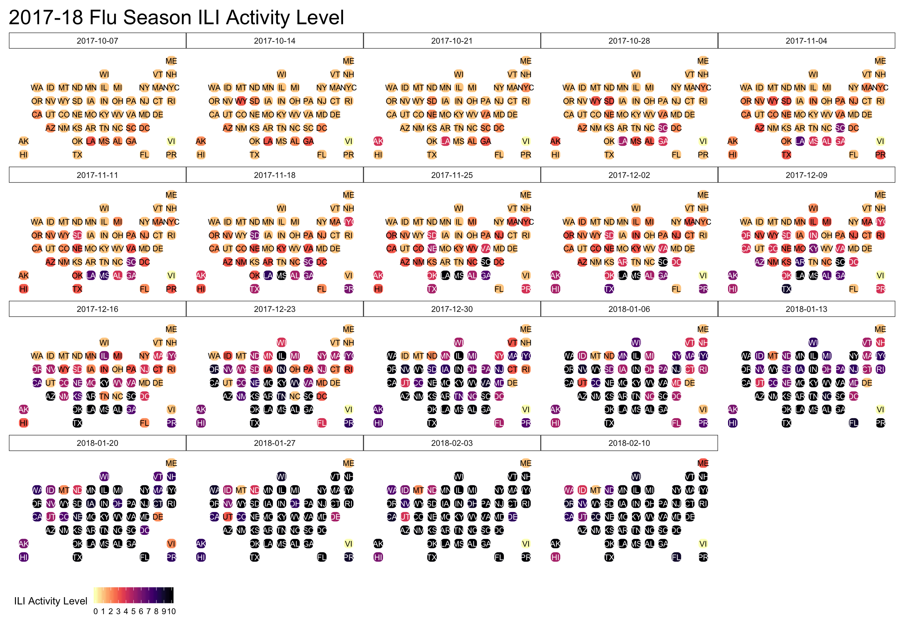
```

```{r, echo=FALSE, eval=FALSE}
library(cdcfluview)
flu <- ili_weekly_activity_indicators(2017)
flu$weekend_factor <- as.factor(flu$weekend)

ggplot(flu, aes(state=statename, fill=activity_level)) +
  geom_statebins() +
  coord_equal() +
  viridis::scale_fill_viridis(
    name = "ILI Activity Level  ", limits=c(0,10), breaks=0:10, option = "magma", direction = -1
  ) +
  facet_wrap(~weekend_factor) +
  labs(title="2017-18 Flu Season ILI Activity Level") +
  theme_statebins() +
  theme(plot.title=element_text(size=22, hjust=0)) +
  theme(plot.margin = margin(30,30,30,30)) 
```

---

class: bottom, left 
background-image: url(images/stamen_watercolor_nyc.png)
background-size: 100%
background-position: 50% 50%

# Raster Maps with ggmap

`ggmap` is a package that uses the ggplot2 syntax as a template to create maps with raster map tiles taken from map servers such as Google Maps, OpenStreetMap, or Stamen Maps.

---

# Google Maps

  <!--- 
  Source: Jiayi (Jason) Liu
https://rstudio-pubs-static.s3.amazonaws.com/59317_9906f6e5167943a08f3e511849eb8831.html -->
  
```{r, echo=FALSE, eval=FALSE}
library(ggmap)
#' create map slices
make.map<-function(map, frame){
  mname <- names(map)
  stopifnot(frame[1]*frame[2]==length(mname))
  sq <- as.numeric(attr(map[[mname[1]]],"bb"))
  sq <- t(matrix(sq,2,2))
  sq <- data.frame(sq)
  colnames(sq)<-c("lon","lat")
  width = (sq[2,1]-sq[1,1])/frame[2]
  height = (sq[2,2]-sq[1,2])/frame[1]
  wsize = floor(ncol(map[[mname[1]]])/frame[2])
  hsize = floor(nrow(map[[mname[1]]])/frame[1])
  p <- ggplot(aes(x=lon,y=lat),data=sq) + geom_point(alpha=0)
  ii <- 0
  for (i in 1:frame[2]-1)
    for (j in 1:frame[1]-1){
      ii <- ii+1
      p <- p + annotation_raster(map[[mname[ii]]][(1+j*hsize):((j+1)*hsize),(1+i*wsize):((i+1)*wsize)],xmin=sq[1,1]+i*width,xmax=sq[1,1]+(i+1)*width,ymin=sq[1,2]+height*j,ymax=sq[1,2]+(j+1)*height)
      p <- p + annotate("text",x=sq[1,1]+(i+0.35)*width, y=sq[1,2]+(j+0.1)*height,label=mname[ii],col="red",size=6)
      #p <- p + geom_text(data = NULL,x=sq[1]+(i-0.7)*width, y=sq[2],label=mname[i])
    }
  p+xlab("Long.") + ylab("Lat.")
}

# Preview the five types of map from google map api.

map <- list()
source = "google"
map$base <- get_map("New York City", source=source)
map$roadmap <- get_map("New York City",maptype='roadmap', source=source)
map$hybird <- get_map("New York City",maptype='hybrid', source=source)
map$satellite <- get_map("New York City",maptype='satellite', source=source)
map$terrain <- get_map("New York City",maptype='terrain', source=source)
make.map(map,c(1,5))
```

```{r, echo=FALSE, out.width = "100%"}
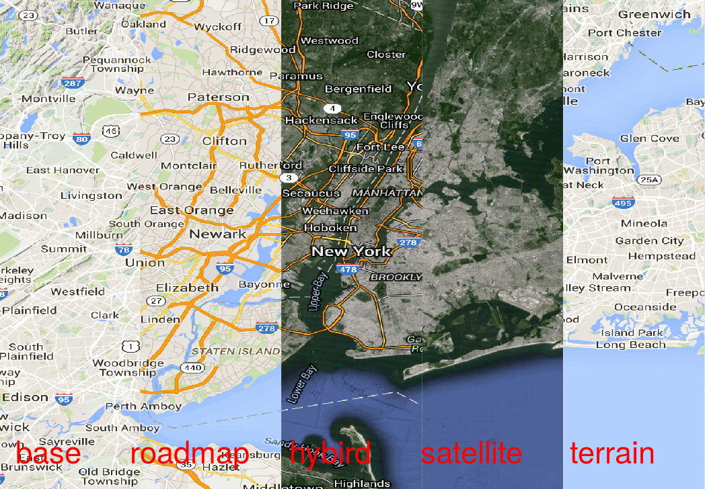
```

---

# Google Maps
  
.small[
`ggmap` provides easy access to maps from different providers with its `get_map()` function.]
 
```{r}
library(ggmap)
map_CU_gm <- get_googlemap("Columbia University", zoom=18, 
                     source="google", maptype="hybrid")
ggmap(map_CU_gm)
```

---

# Set API key

Google unfortunately now requires a credit card to set up an API key.
  - Get started here: https://cloud.google.com/maps-platform/
  - You get **$200 monthly equivalent free usage**. That translates to  to 100,000 static map calls or 40,000 routing calls. See [here](https://cloud.google.com/maps-platform/pricing/sheet/) for details.

It's easy to add the API key to your `.renviron` file:

```{r, eval=FALSE}
# this sets your google map permanently
register_google(key = "[your key]", write = TRUE)
```

which will add a line to your `.renviron` file:

```
GOOGLE_MAPS_API_KEY=AJDSJFNEH933KSFK
```

---

# Geo code location
  
We can also **find and re-use latitude/longitude location information through `geocode`**. 

Helpful, if we have addresses in our data. In fact, `get_map()` uses this command if you use a lazy geographic input.

```{r}
geocode("the white house")
```

---

# Reverse Geocode 
  
We can use Google's API for reverse geocoding through `revgeocode()` as well.


```{r}
revgeocode(c(-0.1277395, 51.5033943), output="all")
```

---

# Map Styles

We already saw the five different familiar map types Google provides: base, terrain (default), satellite, roadmap, and hybrid.

Style is where **Stamen** Maps really shine. Stamen Maps has three available tile sets: terrain, watercolor, and toner.


???

Stamen tile set options:
"toner", "watercolor", "terrain-labels", "terrain-lines",
  "toner-2010", "toner-2011", "toner-background", "toner-hybrid",
  "toner-labels", "toner-lines", "toner-lite"

---

# Stamen Maps - watercolor

```{r}
# Stamen Maps
map_NYC_st <- get_map("New York City", zoom=14, 
source="stamen", maptype="watercolor")
ggmap(map_NYC_st)
```


---

# Stamen Maps - toner

```{r}
# Stamen Maps
map_SF_st <- get_map("San Francisco", zoom=10, 
source="stamen",maptype="toner-lite")
ggmap(map_SF_st)
```

---

# ggplot and ggmap

- Once `get_map` has grabbed the map of interest, `ggmap`
is ready to plot it. 
- Importantly, **`ggmap` returns a `ggplot` object**. 
- That means the product of **ggmap** can itself **act as a base layer in** the **ggplot2**
framework. Really useful!

```{r}
mapSF <- ggmap(map_SF_st)
class(mapSF)
```


---

class: inverse, bottom, center
background-image: url(images/nypd_complaint_example.png)
background-size: 90% 
background-color: #000000
background-position: 50% 15%


# Mapping NYPD Complaint Data

---

# Get the data

We get the data from the NYC Open Data Site here:
.footnotesize[https://data.cityofnewyork.us/Public-Safety/NYPD-Complaint-Map-Year-to-Date-/2fra-mtpn]

> This dataset includes **all valid felony, misdemeanor, and violation crimes reported to the New York City Police Department** (NYPD) for all complete quarters so far this year (2018). Offenses occurring at intersections are represented at the X Coordinate and Y Coordinate of the intersection. Crimes occurring anywhere other than an intersection are geo-located to the middle of the block. 

```{r, echo=FALSE, eval=FALSE}
library(readr)
nypd <- read_csv("data/NYPD_complaint_map/NYPD_Complaint_Data_Current__Year_To_Date_.csv")

## Select a subset, rename the variables
# Convert date
nypd$compl_year  <- substring(nypd$CMPLNT_FR_DT,7,10)
nypd$compl_month <- substring(nypd$CMPLNT_FR_DT,4,5)
nypd$compl_day   <- substring(nypd$CMPLNT_FR_DT,1,2)

# 250,000 obs is a bit much to play. Let's subset
nypd <- dplyr::filter(nypd, 
               BORO_NM=="MANHATTAN", 
               compl_year=="2018", 
               compl_month=="06")

## Rename a few variables
nypd <- dplyr::rename(nypd,  complnum = CMPLNT_NUM,
                      date = RPT_DT,
                      code1 = KY_CD,
                      code2 = PD_CD,
                      offense_desc1 = OFNS_DESC,
                      offense_desc2 = PD_DESC,
                      crimesuccess = CRM_ATPT_CPTD_CD,
                      crimelevel = LAW_CAT_CD,
                      jurisdic = JURIS_DESC,
                      loc_desc = LOC_OF_OCCUR_DESC,
                      premise_type = PREM_TYP_DESC,
                      park = PARKS_NM)

# Drop other vars
nypd <- nypd %>% dplyr::select(-CMPLNT_TO_TM,-CMPLNT_FR_DT,-CMPLNT_FR_TM,-CMPLNT_TO_DT,-BORO_NM,-ADDR_PCT_CD,-HADEVELOPT,-X_COORD_CD,-Y_COORD_CD)
write.csv(nypd, "data/NYPD_complaint_map/NYPD_Complaint_2018-06_Manhattan.csv")
write.csv(nypd, "data/NYPD_Complaint_2018-06_Manhattan.csv")
```

```{r, message=FALSE, warning=FALSE}
# This is a subset of the data for 06/2018 and Manhattan only
library(readr)
nypd <- read_csv("data/NYPD_Complaint_2018-06_Manhattan.csv")
```

---

# Get a map

```{r}
map_Manhattan_st <- get_map("Manhattan", zoom=12, 
    source="stamen", maptype="toner-background")
ggmap(map_Manhattan_st)
```

---

# Map the complaint locations
  
```{r, warning=FALSE, message=FALSE}
g <- ggmap(map_Manhattan_st) 
g + geom_point(data=nypd, aes(x=Longitude,y=Latitude),
                    size=0.3, alpha=0.3, color="red")
```

---

## Zooming in 
  
.small[Crime everywhere? Hard to tell from this map where the hotspots are.]

```{r, warning=FALSE, message=FALSE}
map_TS_st1 <- get_map("Times Square", zoom=14, 
                      source="stamen",maptype="toner-background")
ggmap_TS_st1 <- ggmap(map_TS_st1) 
ggmap_TS_st1 + geom_point(aes(x=Longitude,y=Latitude),data=nypd, 
                    size=1, alpha=0.9, color="red") 
```

---

## Zooming in a bit more

.small[Crimes are coded to intersections and the middle of the block.]

```{r, warning=FALSE, message=FALSE}
map_TS_st2 <- get_map("Times Square", zoom=16, 
                      source="stamen",maptype="toner-background")
ggmap_TS_st2 <- ggmap(map_TS_st2) 
ggmap_TS_st2 + geom_point(aes(x=Longitude,y=Latitude),
                    data=nypd, size=2, alpha=0.9, color="red") 
```

---

## High Density Areas - Contours
  
We can plot the **2D-Density** like a topographic map using contour layers.

```{r, warning=FALSE}
ggmap_TS_st1 + geom_density_2d(aes(x=Longitude,y=Latitude, 
  color="red"), data=nypd, size=1) + theme_simplemap()
```

---

## High Density Areas - Shaded Density
  
.small[With `stat_density2d`, we can **shade high crime areas**. Times Square looks like trouble.]

```{r, warnings=FALSE}
ggmap_TS_st1 + stat_density2d(data = nypd, geom = "polygon",
  aes(x = Longitude, y = Latitude, fill=..level..,alpha=..level..)) + 
  scale_fill_gradient(low = "yellow", high = "red") + theme_simplemap()
```

---

## Combine Contour and Density

```{r, warning=FALSE, message=FALSE}
ggmap_TS_st1 + geom_density2d(aes(x=Longitude,y=Latitude), 
  data=nypd, color="blue", size=1, bins=12) +
  stat_density2d(aes(x=Longitude,y=Latitude,
    fill = ..level.., alpha = ..level..),
    data=nypd, geom = 'polygon', bins=12) +
  scale_fill_gradient2(low = "green", mid="yellow", high = "red") +
  scale_alpha(range = c(0.00, 0.5)) + theme_simplemap()
```


---

# High Density Areas - Annotate
  
```{r, echo=FALSE}
g <- ggmap_TS_st1 + stat_density2d(aes(x=Longitude,y=Latitude, fill=..level.., alpha = ..level..), data=nypd,geom="polygon")
g <- g + scale_alpha(range = c(0.00, 0.5), guide=FALSE) + theme_simplemap()
g <- g + scale_fill_gradient(low = "yellow", high = "red")
```

```{r, warning=FALSE}
# As before, we can add annotation to ggplot figures
(g <- g + annotate("text",x=-73.987325, y=40.758899, label="Times Square",
                   color="Dark Blue",fontface=2, size=5) +
    annotate("text",x=-73.988898, y=40.7493349, label="Herald Square",
             color="Dark Blue",fontface=2, size=5))
```

---

# Facets
  
Just as before in `ggplot`, we can **facet our map by some data value**.

Let's select a few common offenses in the data for that.

```{r, warning=FALSE}
# Selected offenses
# sort(table(nypd$offense_desc1))
off <- nypd$offense_desc1 
offsel <- NA
offsel <- ifelse(off=="GRAND LARCENY" | 
                 off=="PETIT LARCENY" | 
                 off=="THEFT-FRAUD" | 
                 off=="THEFT OF SERVICES", "Theft", offsel)
offsel <- ifelse(off=="HARRASSMENT", "Harrassment", offsel)
offsel <- ifelse(off=="ASSAULT 3 & RELATED OFFENSES" | 
                 off=="FELONY ASSAULT", "Assault", offsel)
offsel <- ifelse(off=="DANGEROUS DRUGS", "Drugs", offsel)
offsel <- ifelse(is.na(offsel), "Other Crime", offsel)
nypd$offsel1 <- offsel
```

---

# Facets

```{r, echo=FALSE}
g <- ggmap(map_Manhattan_st) +
stat_density2d(aes(x=Longitude,y=Latitude, fill=..level..,alpha = ..level.., group=offsel1),
data=nypd,geom="polygon") +
scale_alpha(range = c(0.00, 0.5), guide=FALSE) +
scale_fill_gradient(low = "yellow", high = "red") +
theme_map() + theme(legend.position = "right") +
theme(strip.text.x = element_text(size = 14, face=2))
```

```{r, warning=FALSE, echo=TRUE, fig.width=8, fig.height=6}
g + facet_wrap(~ offsel1, ncol = 2)
```

---

class: inverse, bottom
background-image: url(images/google_maps_with_style.png)
background-size: 100%
background-position: 50% 50%

# Styled Google Maps in ggmap

---

# Styled Google Maps in ggmap

- Beyond the 5 styles introduced before, Google Maps also allows to style the maps it provides.
- We can use the Google's **Styled Maps Wizard** and style a map before importing it into R.
- Go to: https://mapstyle.withgoogle.com/

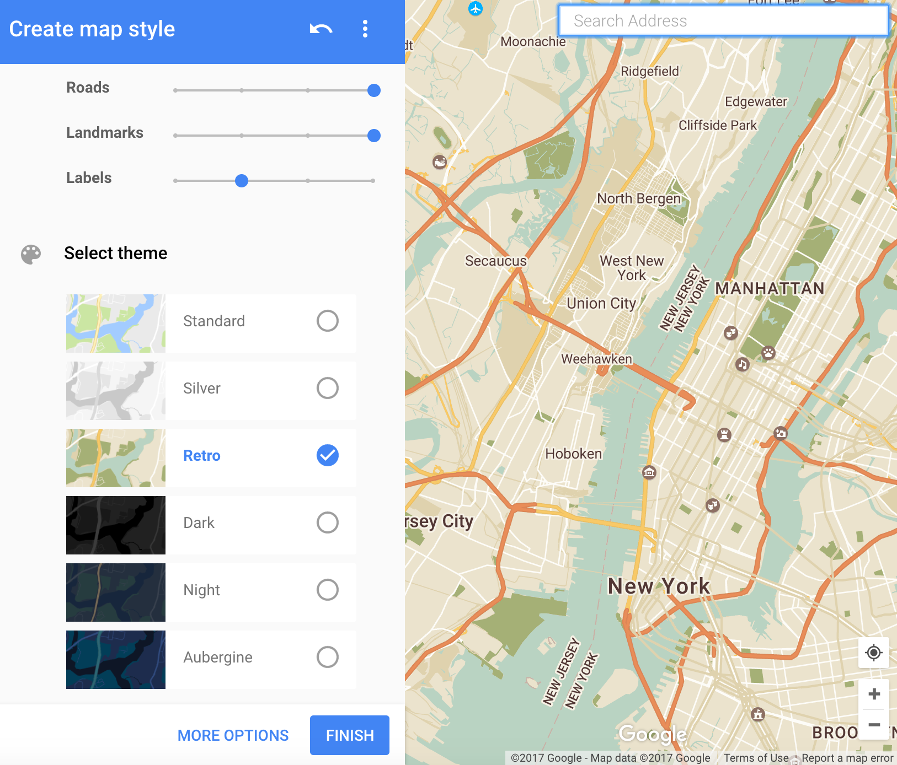 

---

# Creating Styled Google Maps in ggmap

- Can choose pre-set styles for the map
- Advanced options allow you to choose colors, geometry, and labels
- Options for borders, landscape, points of interest, roads, transit etc. 

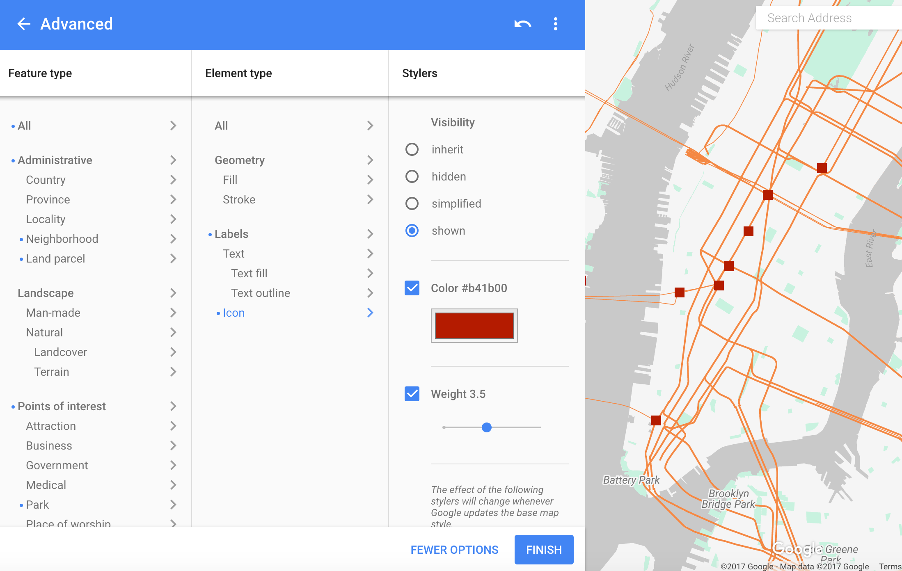

---

# Copy JSON

When done, copy the JSON code for the styles you selected.

[Google Map Style Wizard - Advanced Options](images/google_map_style_wizard_json.png)

---

# Create the map in ggmap

With the json code we copied, we can re-create the map in ggmap.

```{r}
library(RJSONIO)
# This is the JSON you copied
# Marks all parks in green
style <- '[
  {
    "stylers": [
      { "saturation": -100 },
      { "gamma": 0.5 }
      ]
  },{
    "featureType": "poi.park",
    "elementType": "geometry",
    "stylers": [
      { "color": "#008000" }
      ]
  }
  ]'
style_list <- fromJSON(style, asText=TRUE)
```

---

# Get Google Map with the style

```{r}
# Use this helper function to convert json to API string
source("data/google_map_create_style_string.R")
style_string <- create_style_string(style_list)
ggmap(get_googlemap("San Francisco", style=style_string)) + theme_simplemap()
```

---

class: inverse, bottom, center

background-image: url(images/raster_vs_vector.png)
background-size: 65%
background-position: 50% 20%

# Geospatial Raster vs. Vector Data 

---

background-image: url(images/raster_vs_vector.png)
background-size: 18%
background-position: 97% 4%

# Geospatial Raster vs. Vector Data 

Geospatial Data can be represented as **vector** and **raster** information. 

**Vector data**: A representation of the world using **points, lines, and polygons**. Vector models are useful for storing data that has discrete boundaries, such as country borders, land parcels, and streets.

**Raster data**: A representation of the **world as a surface divided into a regular grid of cells**. Raster models are useful for storing data that varies continuously, as in an aerial photograph, a satellite image, a surface of chemical concentrations, or an elevation surface.

.footnotesize[Source: [ESRI GIS Dictionary](https://support.esri.com/en/other-resources/gis-dictionary/term/vector%20data%20model)]


---

# Vector Data is stored in shapefiles

- A **shapefile** is a vector data storage format (developed by [ESRI](https://support.esri.com/en/other-resources/gis-dictionary/search/shapefile)) for **storing the location, shape, and attributes of geographic features**. 
- The **shapefile format spatially describes geometries** as either **'points', 'polylines', or 'polygons'**.
- The shapefile is in fact a grouping of several files formatted to represent different aspects of geodata:
  - `.shp` — shape format; the feature geometry itself.
  - `.shx` — shape index format; a positional index of the feature geometry to allow seeking forwards and backwards quickly.
  - `.dbf` — attribute format; columnar attributes for each shape, in dBase IV format.

---

# Where to get shape files?

There are plenty of places to get free shape files online. Here are a few examples:

- [GeoFabrik](http://download.geofabrik.de/index.html) Provides data extracts from the OpenStreetMap project.
- [BBBike.org](http://extract.bbbike.org/) Allows you to create your own custom shapefiles. Provides separate shapefiles for points, places, waterways, roads, railways, landuse and buildings with relevant tags, then shapefiles with all points, lines and polygons together.
- [U.S. Census Tiger Database](http://www.census.gov/geo/maps-data/data/tiger.html) Shape files provided by the the U.S. Census Bureau.

And here is a longer list of links to shapefile resources:
http://wiki.openstreetmap.org/wiki/Shapefiles

---

# Shapefiles from BBBike.org

- make sure to choose `ESRI` as the output format. It is easy to work with in R.

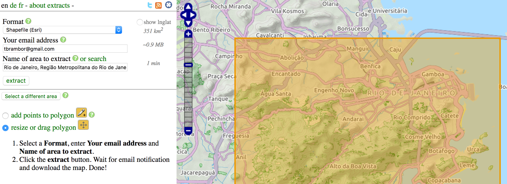

---

# Example: Shape files for NYC

Get shape files for NYC [here](http://www1.nyc.gov/site/planning/data-maps/open-data/districts-download-metadata.page)

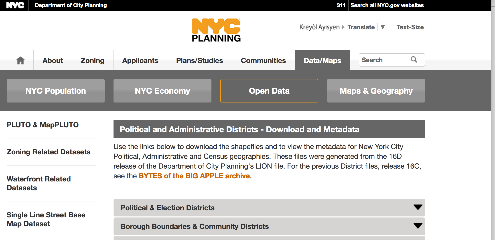

---

# Reading shape files into R

```{r, warning=FALSE}
library(rgdal) # for reading shape files into R
# Defining the folder and base name of the files
nyc_census <- readOGR("data/nyc_shapefiles/census/.","nycb2010")
# Let's keep only Manhattan
nyc_census <- subset(nyc_census, BoroName=="Manhattan")
```

---

# Converting to a shape object
  
We need to prepare our object so that it may be portrayed on a map. 

`spTransform` allows us to convert and transform between different mapping projections and datums.

```{r}
nyc_census <- spTransform(nyc_census, 
                          CRS("+proj=longlat +datum=WGS84"))
```

---

# Fortify() for ggmap
  
**Option 1**: For most simple spatial objects, we can use `geom_sf` to add spatial objects directly to gpplot2. Preferred!

**Option 2**: If you experience issues with the spatial object you want to plot, you also have the (less efficient) option of converting the spatial object to a dataframe using `fortify`

We can **`fortify` the object** to prepare it for `ggmap`.

```{r, warning=FALSE}
nyc_census <- fortify(nyc_census)
```

Note, the `broom::tidy()` package can do the same conversion, so feel free to use either.

---

# Plot the map

```{r}
map_census <- ggmap(map_TS_st1) + # our raster map from before
  geom_polygon(aes(x=long, y=lat, group=group), 
               size=0.3, color='red', data=nyc_census, alpha=0)
map_census
```


```{r}
map_census <- ggmap(map_TS_st1) + # our raster map from before
  geom_polygon(aes(x=long, y=lat, group=group), 
               size=0.3, color='red', data=nyc_census, alpha=0)
map_census
```

---

# Let's import city council districts
  
```{r message=FALSE, warning=FALSE}
nyc_citycouncil <- readOGR("data/nyc_shapefiles/city_council/.","nycc")
nyc_citycouncil <- spTransform(nyc_citycouncil, CRS("+proj=longlat +datum=WGS84"))
nyc_citycouncil <- fortify(nyc_citycouncil)
```


---

# Map city council districts

```{r message=FALSE, warning=FALSE}
(map_citycouncil <- ggmap(map_Manhattan_st) + # our raster map 
  geom_polygon(aes(x=long, y=lat, group=group, fill=id), 
               size=0.5, color='blue', data=nyc_citycouncil)     + theme_simplemap() )
```

---

# Zooming in a polygon map
  
.small[Zooming a map of polygons. Let's use the Times Square Map from before.]
  
```{r}
ggmap(map_TS_st1) +    # our raster map from before
geom_polygon(aes(x=long, y=lat, group=group, fill=id), 
size=0.5, color='blue', data=nyc_citycouncil) + theme_simplemap()
```

---

# Zooming in a polygon map

The previous map is screwed up. By zooming in to the extent of the raster image, polygon points outside the zoomed-in rectangle get dropped as `NA`, leading to incomplete polygons. Let's fix that:
  
```{r, eval=FALSE}
(map_TS_cc <- ggmap(map_TS_st1, 
                    base_layer=ggplot(aes(x=long,y=lat), 
                                      data=nyc_citycouncil),
                    extent = "normal", maprange=FALSE) + 
   # Note: the map should not define the x and y limits
 geom_polygon(aes(x=long, y=lat, group=group, fill=id), size=2, 
              color='blue', alpha=0.3) + theme_simplemap() +
 coord_map(projection="mercator",  
           # And now using the extent of the raster image
  xlim=c(attr(map_TS_st1, "bb")$ll.lon, 
         attr(map_TS_st1, "bb")$ur.lon),
  ylim=c(attr(map_TS_st1, "bb")$ll.lat, 
         attr(map_TS_st1, "bb")$ur.lat)) )
```


---

# Zooming in a polygon map

```{r, echo=FALSE, fig.width=7, fig.height=7}
(map_TS_cc <- ggmap(map_TS_st1, 
                    base_layer=ggplot(aes(x=long,y=lat), 
                                      data=nyc_citycouncil),
                    extent = "normal", maprange=FALSE) + 
   # Note: the map should not define the x and y limits
 geom_polygon(aes(x=long, y=lat, group=group, fill=id), size=2, 
              color='blue', alpha=0.3) + theme_simplemap() +
 coord_map(projection="mercator",  
           # And now using the extent of the raster image
  xlim=c(attr(map_TS_st1, "bb")$ll.lon, 
         attr(map_TS_st1, "bb")$ur.lon),
  ylim=c(attr(map_TS_st1, "bb")$ll.lat, 
         attr(map_TS_st1, "bb")$ur.lat)) )
```

---

## Combining city council and census tracts

Now, we can add the second set of shape files for the census tracts over the city council borders. 

```{r}
(map_TS_cc + 
  geom_polygon(aes(x=long, y=lat, group=group), 
  size=0.3, color='red', data=nyc_census, alpha=0) )
```

---

class: inverse, center, bottom
background-image: url(images/code_structure_spdf.png)
background-size: 80%
background-position: 50% 30%
background-color: #000000

# Data frames vs. spatial objects

---

## Data frames vs. spatial objects

The elecotoral data we used above were stored in a normal data frame.

```{r, echo=TRUE}
elecstate.merged 
```

---

## Data frames are not the best way to store spatial data

- there is **no** good way to keep information about a **cordinate reference system** in a usual data frame
- they are **inefficient** for complex spatial objects (e.g. we repeat data for each part of the polygon)
- the **hierachical structure of spatial objects** gets pressed into a flat structure of columns and rows

---

## The `sp` package

- but, we already saw the way to get around it.   
The [`sp()` package](https://edzer.github.io/sp/) stores spatial information. 
- The **`sp` package**
    - **allows different classes for storing spatial data**:
        - point data
        - line data, and
        - polygon data
    - provides **methods to manipulate spatial data**
    - is a **standard**, so new spatial packages expect data in an `sp` object
    - is a **more efficient** way to store geographic data

---

## Spatial objects: the `sp` package

Looks like a list, but instead of the elements being proceeded by `$` in the output they are instead proceeded by an `@`. 

`sp` classes are S4 objects, so instead of having elements they have slots and you access them with `@`.

```{r, warning=FALSE, message=FALSE, echo=FALSE, include=FALSE}
library(rgdal) # for reading shape files into R
library(sp)
nyc_citycouncil <- readOGR("data/nyc_shapefiles/city_council/.","nycc")
nyc_citycouncil <- spTransform(nyc_citycouncil, CRS("+proj=longlat +datum=WGS84"))
```

```{r, echo=TRUE}
str(nyc_citycouncil, max.level=2)
```

---

## Spatial objects: the `sp` package

Notice, that the **data is one of the slots of the `sp` object**. The `sp` package has spatial objects with and without such added dataframes.

```{r, echo=TRUE}
library(sp)
summary(nyc_citycouncil)
```

---

## Accessing slots in `sp` objects

```{r}
# 1. A specific command
proj4string(nyc_citycouncil)
# 2. @ followed by the slot names (just like lists and $)
nyc_citycouncil@proj4string
# 3. Use slot() with quoted slot name
slot(nyc_citycouncil, "proj4string")
```

---

## Examing the structure of the `sp` object

```{r}
# How many polygons
str(nyc_citycouncil@polygons, max.level=1)
 # -> 51 polygons, as many as city council members
```

---

## Getting one of the polygons

```{r}
# Take the fifth polygon
ex1 <- nyc_citycouncil@polygons[[5]]
# str() with max.level = 3, on the Polygons slot of ex1
str(ex1@Polygons, max.level=3)
```

---

## Plotting one of the polygons

```{r}
# Plot the single polygon
plot(ex1@Polygons[[1]]@coords)
```

---

## The `sp` object hierarchy

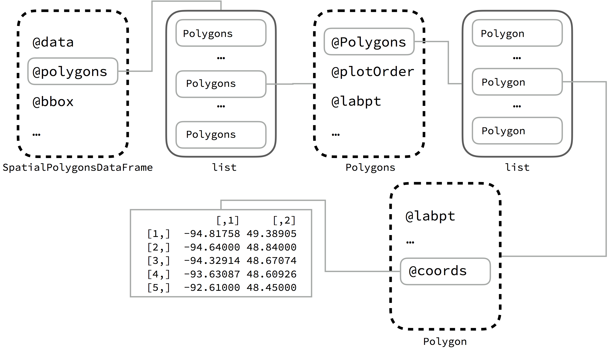

---

## Different types of `sp` objects

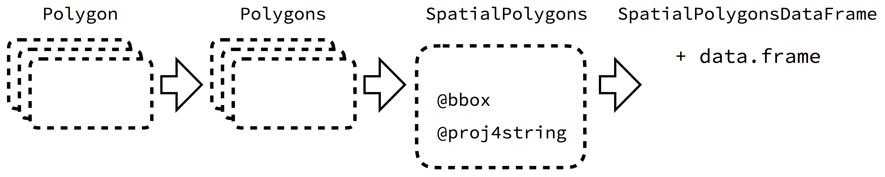
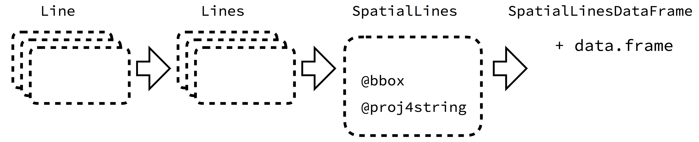
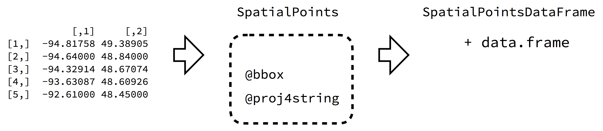

---

## Subsetting `sp` objects

```{r}
# Subset by index
str(nyc_citycouncil[1:3,], max.level=2)  
  # Notice: "list of 3" in @polygons output
```

