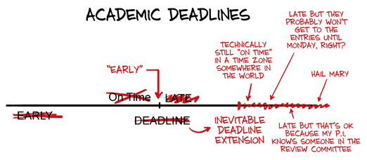
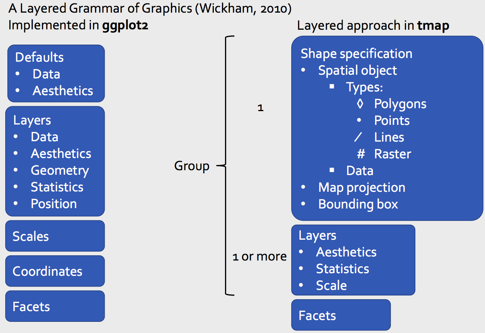
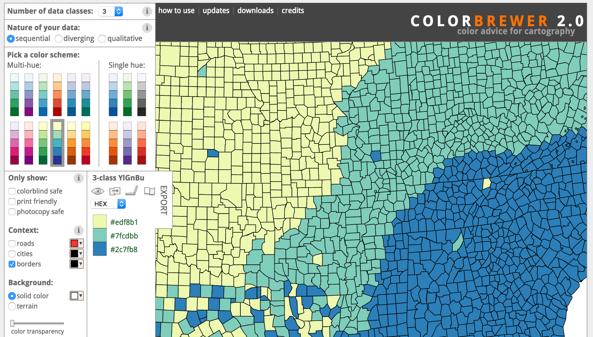

class: left, top
background-image: url(images/roadmap.png)
background-size: 100%
background-position: 50% 280%


```{r packages, message = FALSE, warning = FALSE, echo=FALSE}
## Run / Install before executing slides
 
# Load packages.
packages <- c("devtools", "knitr","tidyverse","DT","ggmap", "ggthemes", "maps", "ggcounty", "statebins", "cdcfluview", "OpenStreetMap", "readr","maptools","mapproj","rgeos","rgdal","RColorBrewer","stringr","scales","tidyverse","readxl","statebins","RJSONIO","XML", "xfun", "sf", "osmdata")

packages <- lapply(packages, FUN = function(x) {
  if(!require(x, character.only = TRUE)) {
    install.packages(x)
  library(x, character.only = TRUE)
  }
}
)

devtools::install_github("hrbrmstr/cdcfluview")
devtools::install_github("hrbrmstr/nominatim")
devtools::install_github("mtennekes/tmaptools")
library(cdcfluview)
library(nominatim)
library(tmaptools)
```

```{r setup, include=FALSE}
library("knitr")
knitr::opts_chunk$set(echo = TRUE, eval=TRUE, 
                      message=FALSE, warning = FALSE,
                      fig.height=5, fig.width=9, cache = TRUE) 
options(htmltools.dir.version = FALSE)
```  

```{r theme-map, include=FALSE}
theme_simplemap <- function(base_size = 9, base_family = "") {
  theme_bw(base_size = base_size, base_family = base_family) %+replace%
    theme(axis.line = element_blank(),
          axis.text = element_blank(),
          axis.ticks = element_blank(),
          axis.title = element_blank(),
          panel.background = element_blank(),
          panel.border = element_blank(),
          panel.grid = element_blank(),
          panel.spacing = unit(0, "lines"),
          plot.background = element_blank(),
          legend.position = "none")
}
```  


## Roadmap for Today

Thematic maps with the `tmap` package
  - How does the process differ from `ggmap`?
  - Example: Building some choropleth maps of London.

The `raster` package.
  - How to add raster layers in `tmap`?
  - Where to get raster data?


---

# Assignment 1

- Grading in progress. Return via comments on Github issue.

--



--

- Data Wrangling with the `tidyverse`. See Grolemund / Wickham's book [_R for Data Science_](http://r4ds.had.co.nz/). 

--

- Ask other students to give you feedback as well. 
- Practice with the selected student solution.

---

# Final Project

1. Sign up on **campuswire**.
2. Add a **private Github project** in the class organization!
    - Repo name: Group\_**Group Letter**\_**Very short title**, e.g. _Group_C_Healthcare_
    - add all group members AND the TAs and Prof as admins
3. **Submit your proposal** by next Monday, March 9 at 3pm. Details on Github.

---

background-image: url(images/group_project_funny.jpg)
background-size: 100%
background-position: 100% 140%


---

class: inverse, middle, center

# Thematic maps with R package `tmap`

---

# `tmap` vs `ggmap`

Both `tmap` vs `ggmap` build up a plot in layers (grammar of graphics)

`ggmap` expects data in data frames, `tmap` expects data in spatial objects

---

# `tmap` vs `ggmap`



---

# Key differences of `tmap` vs `ggmap`

- No `scale_` equivalents, tweaks to scales happen in the relevant layer call 
- `tm_shape()` defines default data for any subsequent layers, you can have many in a single plot
- No need for x and y aesthetics, these are inherent in spatial objects
- No special evaluation, when mapping variables they must be quoted

---

# Building a thematic map - Example London

- As before, we need to read in the shapefiles using the `rgdal` package 
- There are several files named "london_sport" in the folder `data/london/` with different extentions, such as .prj, .dbf and .shp. 

```{r, message=FALSE, results='hide'}
library(rgdal)
lnd <- readOGR(dsn = "data/london", layer = "london_sport")
```

<small><small> The shapefiles contain the population of London Boroughs in 2001 and the percentage of the population participating in sporting activities. 
This data originates from the
[Active People Survey](https://data.london.gov.uk/dataset/active-people-survey-kpi-data-borough).
The boundary data is from the [Ordnance Survey](https://www.ordnancesurvey.co.uk/opendata/viewer/).
</small></small>

---

# Checking the `sp` object

```{r}
# What kind of object?
class(lnd)  
# Structure
str(lnd, max.level=2)
```

---

# Checking the `sp` object

```{r}
head(lnd@data, n = 2)
mean(lnd$Partic_Per)  # Average participation in active sports
nrow(lnd)             # How many boroughs?
```

---

# Learning more about `tmap`

A quick introduction to **tmap** can be accessed (after the package is installed)
by using the vignette function:

```{r, eval=FALSE}
# install.packages("tmap") # install the CRAN version
library(tmap)
vignette(package = "tmap") # available vignettes in tmap
vignette("tmap-nutshell")
```

---

# Building a thematic map

```{r}
library(tmap)
tm_shape(lnd) +
tm_fill()
```

---

# Adding color

```{r}
library(tmap)
tm_shape(lnd) +
tm_fill("blue")
```

---

# Borders

```{r}
tm_shape(lnd) +
tm_borders()
```

---

# Mapping a variable

```{r}
tm_shape(lnd) +
tm_fill("Pop_2001")  ## oops, population is still a factor
  # and the legend placement is not great
```

---

# Layout options

The element `tm_layout` controls all layout options such as fonts, legends, margins, and colors. 

```{r, eval=FALSE}
tm_shape(lnd) +
tm_fill("Pop_2001",  title = "Population") + 
(layout <- tm_layout(  # Note we are saving the layout here
          legend.title.size = 1,
          legend.text.size = 0.6,
          legend.position = c(0.8,0),
          legend.bg.color = "white",
          legend.bg.alpha = 1,
          bg.color="white",
          frame=FALSE))
```

---

# Layout options

```{r}
lnd@data$Pop_2001 <- as.numeric(as.character(lnd@data$Pop_2001))
tm_shape(lnd) + layout +
tm_fill("Pop_2001", title = "Population")
```

---

# Styles


Similar to `ggmap`, you can also add a pre-defined theme to style your map, e.g. `tm_style_natural`, `tm_style_col_blind`, `tm_style_white` etc.

--

.pull-left[

```{r, message=FALSE, warning=FALSE, eval=FALSE}
tm_shape(lnd) +   
  tm_style_natural() +  
  tm_fill("Pop_2001",  
      title = "Population")
# Or set your preferred style
tmap_style("white")
```

]

.pull-right[

```{r, message=FALSE, warning=FALSE, echo=FALSE}
tm_shape(lnd) +   
  tm_style_natural() +  
  tm_fill("Pop_2001",  
          title = "Population")  
# Or set your preferred style
tmap_style("white")
```

]


---

# Calculate a density

```{r}
# Let's calculate population density
tm_shape(lnd) + layout +
tm_fill("Pop_2001", title = "Population per sq km",
        convert2density=TRUE,
        style="kmeans")
```

---

# Setting intervals for the scale

```{r}
(gg <- tm_shape(lnd) + layout +
tm_fill("Pop_2001", title = "Population per sq km",
        convert2density=TRUE,
        style="pretty") +  # provides nicer intervals
tm_borders(alpha=.5))
```

---

# Adding annotations

```{r}
gg + tm_text("name", size=.6, shadow=TRUE,
             bg.color="white", bg.alpha=.25,
             remove.overlap=TRUE) 
```

---

# Aspect ratio and margins

Aspect ratio (=width/height) of the frame determined by (1) device [green] (with outer margins [yellow]), and (2) shape [red] (with frame [blue])

```{r, message=FALSE}
gg + layout + tm_layout(design.mode=TRUE)
  # enables the design mode. Inner and outer margins, legend position, aspect ratio are explicitely shown.
```

---

# Adding a compass

```{r}
gg + layout + 
  tm_compass(position=c(0,0), type="8star", 
             size=2, show.label=2)
```

---

# Adding other data layers

We already tried a few layers thus far, but there are a few more. Here is a selection:

- **tm_shape()**  
- **tm_fill()**  
- **tm_borders()**  
- **tm_polygons()**  
- tm_bubbles()  
- tm_dots()  
- tm_lines()  
- tm_raster()  
- tm_marker()
- tm_symbols() - also with tmap_icons()
- **tm_text()**  

---

# Identify selected areas

```{r, eval=FALSE}
# Select zones where sports participation is less than 17%
sel <- lnd$Partic_Per < 17
# Make these boroughs visible through borders 
gg +  tm_shape(lnd[ sel, ]) + 
        # Note, we need to add tm_shape() again
      tm_borders(col = "blue", lwd = 2) +
      tm_text("name", size=.6, shadow=TRUE,
              bg.color="white", bg.alpha=.5, 
              remove.overlap=FALSE) 
```

---

# Identify by distance from a point

**Goal**: Select all zones whose geographic centroid lies within 10 km of the geographic centroid of inner London.

```{r, echo=FALSE}
(gg <- tm_shape(lnd) + layout + tm_fill(alpha=.5) +
tm_borders(lwd=1, col="gray"))

```

---

# Identify by distance from a point


```{r}
library(rgeos) # R's interface to the vector processing library [geos](http://trac.osgeo.org/geos/)
# find London's geographic centroid
cent_lnd <- gCentroid(lnd[lnd$name == "City of London",])
cent_lnd$name <- "Central     London"
(gg2 <- gg  + tm_shape(cent_lnd) + tm_dots(col="red", size=0.5)
            + tm_text("name", size=0.8))
```

---

# Identify by distance from a point

```{r}
# Set 10 km buffer
lnd_buffer <- gBuffer(spgeom = cent_lnd, width = 10000) 
gg2 + tm_shape(lnd_buffer) + tm_borders(col="blue")
```

---

# Identify by distance from a point

```{r}
# Method 1 of subsetting selects any intersecting zones
lnd_central1 <- lnd[lnd_buffer,] # the selection is too big!
gg2 + tm_shape(lnd_central1) + tm_fill(col="lightblue", alpha=0.4) +
  tm_shape(lnd_buffer) + tm_borders(col="blue")
  # some areas just touch the buffer
```

---

# Identify by distance from a point

Let's try an alternate method of subsetting selects only points within the buffer.

```{r}
## Method2 of subsetting selects only points within the buffer

# Create spatialpoints object of polygo centroids
lnd_cents <- SpatialPoints(coordinates(lnd),
                           proj4string = CRS(proj4string(lnd))) 

# select points inside buffer
sel <- lnd_cents[lnd_buffer,] 
sel
```

---

# Identify by distance from a point

Let's try an alternate method of subsetting selects only points within the buffer.

```{r}
## Show where the points are located
gg2 + tm_shape(sel) + tm_dots(col="black") + 
  tm_shape(lnd_buffer) + tm_borders(col="blue")
```

---

# Identify by distance from a point

```{r, eval=FALSE}
lnd_central2 <- lnd[sel,] # select zones intersecting w. sel
gg2 + 
  ## Zones with polygons touching the buffer (from above)
  tm_shape(lnd_central1) + 
  tm_fill(col="lightblue") + 
  tm_borders(col="gray") +
  ## Zones with centroids inside of the buffer
  tm_shape(lnd_central2) + 
  tm_fill(col="lightslateblue") + 
  tm_borders(col="gray") +
  tm_shape(lnd_buffer) + tm_borders(col="blue") +
  ## The Central London centroid
  tm_shape(cent_lnd) + tm_dots(col="red", size=0.5) +
  tm_text("name", size=0.8)
```

---

# Identify by distance from a point

```{r, echo=FALSE}
lnd_central2 <- lnd[sel,] # select zones intersecting w. sel
gg2 + 
  ## Zones with polygons touching the buffer (from above)
  tm_shape(lnd_central1) + 
  tm_fill(col="lightblue") + 
  tm_borders(col="gray") +
  ## Zones with centroids inside of the buffer
  tm_shape(lnd_central2) + 
  tm_fill(col="lightslateblue") + 
  tm_borders(col="gray") +
  tm_shape(lnd_buffer) + tm_borders(col="blue") +
  ## The Central London centroid
  tm_shape(cent_lnd) + tm_dots(col="red", size=0.5) +
  tm_text("name", size=0.8)
```


---

# Splitting into quadrants

Let's try another one. This time, we want to **split the London shapefile**  into **4 quadrants** corresponding to the cardinal directions.

Starting from the **center point**, we will use that point's coordinates to create the **lines of latitude and longitude** on which the center of the wards will be tested against.

---

# Find the center of the london area

Given that we already know how to get the center point, let's take the latitude and longitude coordinates from that point:

```{r}
lat <- coordinates(gCentroid(lnd))[[1]]
lng <- coordinates(gCentroid(lnd))[[2]]
```

---

# Selecting quadrants

Let's now work with the shapefile for London and split it into quadrants using lines of latitude and longitude.

```{r}
# Test whether or not a coordinate is 
# east or north of the center
east <- coordinates(lnd)[,1] > lat 
west <- coordinates(lnd)[,1] < lat 
north <- coordinates(lnd)[,1] > lng 
south <- coordinates(lnd)[,1] < lng 

east
```

```{r eval=FALSE, include=FALSE}
# Could use functions as well when things get more difficult:
east  <- sapply(coordinates(lnd)[,1], function(x) x > lat)

# Or the purr library
library(purrr)
east  <- map_lgl(coordinates(lnd)[,1], ~ .x > lat)
```

---

# Plot the Northeast quadrant

```{r}
tm_shape(lnd) + 
  tm_borders() +
  tm_shape(lnd[east & north,]) + 
  tm_fill(col="red")
```

---

# Unify each quadrant into a single polygon

```{r, eval=FALSE}
lnd@data$quadrant[east & north] <- "northeast"
lnd@data$quadrant[west & north] <- "northwest"
lnd@data$quadrant[east & south] <- "southeast"
lnd@data$quadrant[west & south] <- "southwest"

ne = gUnaryUnion(lnd[lnd@data$quadrant=="northeast",], lnd$dummy)
```

---

# PLotting the quadrant map  

```{r, echo=FALSE, fig.cap="The 4 quadrants of London"}
# Unify London polygons
london = gUnaryUnion(lnd, lnd$dummy)
london = SpatialPolygonsDataFrame(london, data.frame(dummy = c("london")), match.ID = FALSE)

centerlondon = gCentroid(london, byid = TRUE)

centerLEP = gCentroid(lnd, byid = TRUE)
coords <- cbind(centerlondon$y)

c1 = c(centerlondon$x, centerlondon$x)
c2 = c(90, -90)
c3 = c(90, -90)
c4 = c(centerlondon$y,centerlondon$y)

# simple line strings
L1 = Line(cbind(c1, c2))
L2 = Line(cbind(c3, c4))

Ls1 = Lines(list(L1), ID = "a")
Ls2 = Lines(list(L2), ID = "b")

Ls1 <- SpatialLines(LinesList = list(Ls1))
Ls2 <- SpatialLines(LinesList = list(Ls2))

Longitude = SpatialLinesDataFrame(Ls1, data.frame(Z = c("1", "2"), row.names = c("a","b")))
Latitude = SpatialLinesDataFrame(Ls2, data.frame(Z = c("1", "2"), row.names = c("a","b")))
Longitude@proj4string <- london@proj4string

east <- coordinates(lnd)[,1] > Longitude@lines[[1]]@Lines[[1]]@coords[,1][1]
north <- coordinates(lnd)[,2] > Latitude@lines[[1]]@Lines[[1]]@coords[,2][1]
west <- coordinates(lnd)[,1] < Longitude@lines[[1]]@Lines[[1]]@coords[,1][1]
south <-coordinates(lnd)[,2] < Latitude@lines[[1]]@Lines[[1]]@coords[,2][1]

lnd@data$quadrant[east & north] <- "northeast"
lnd@data$quadrant[west & north] <- "northwest"
lnd@data$quadrant[east & south] <- "southeast"
lnd@data$quadrant[west & south] <- "southwest"

# Unify each quadrant into a single polygon
ne = gUnaryUnion(lnd[lnd@data$quadrant=="northeast",], lnd$dummy)
ne = SpatialPolygonsDataFrame(ne, data.frame(dummy = c("ne")), match.ID = FALSE)
nw = gUnaryUnion(lnd[lnd@data$quadrant=="northwest",], lnd$dummy)
nw = SpatialPolygonsDataFrame(nw, data.frame(dummy = c("nw")), match.ID = FALSE)
se = gUnaryUnion(lnd[lnd@data$quadrant=="southeast",], lnd$dummy)
se = SpatialPolygonsDataFrame(se, data.frame(dummy = c("se")), match.ID = FALSE)
sw = gUnaryUnion(lnd[lnd@data$quadrant=="southwest",], lnd$dummy)
sw = SpatialPolygonsDataFrame(sw, data.frame(dummy = c("sw")), match.ID = FALSE)

# Plot
tm_shape(london) + tm_borders() + 
tm_shape(ne) + tm_fill(col="#ca0020") + tm_borders(col="black", lwd=3) +
tm_shape(nw) + tm_fill(col="#f4a582") + tm_borders(col="black", lwd=3) +
tm_shape(se) + tm_fill(col="#bababa") + tm_borders(col="black", lwd=3) +
tm_shape(sw) + tm_fill(col="#404040") + tm_borders(col="black", lwd=3) +
  ## The Central London centroid
  tm_shape(cent_lnd) + tm_dots(col="white", size=1) +
  tm_text("name", size=1.5, col = "white")
```

---

# Small multiples

Small multiples, i.e. multiple maps side-by-side are generated in three ways.

1. By assigning multiple values to at least one of the aesthetic arguments
2. By defining a group-by variable in tm_facets.
3. By creating multiple stand-alone maps with `tmap_arrange`

Let's go through each of the possibilities.

---

# Small multiples I

```{r}
tm_shape(lnd) + layout + 
    tm_polygons(c("Partic_Per", "Pop_2001"), 
        style=c("pretty", "kmeans"),
        palette=list("RdYlGn", "-Blues"),
        auto.palette.mapping=FALSE,
        title=c("Active People", "Population")) +
tm_style_white()
```

---

# Small multiples II

```{r}
tm_shape(lnd) +
    tm_polygons("Partic_Per", title="Active People") +
    tm_facets("quadrant") +
tm_style_white()
```

---

# Small multiples II

```{r}
tm_shape(lnd) +
    tm_fill("Partic_Per", legend.show = FALSE) +
  # If drop.units=FALSE then neighboring countries are visible.
    tm_facets("name", free.coords=TRUE, drop.units=TRUE)
```

---

# Small multiples III

We can alsp create multiple stand-alone maps and then use `tmap_arrange`.

```{r}
tm1 <- tm_shape(lnd) + layout + tm_fill("Partic_Per")
tm2 <- tm_shape(lnd) + layout + tm_fill("Pop_2001", palette="-Blues")
tmap_arrange(tm1, tm2, asp = 1)
```

---

# Map attributes

.small[Using the example of a world map, this example shows several map attributes such as grid lines, a different projection, a compass etc. [see the "tmap in a nutshell" tutorial for this].]

```{r, eval=FALSE}
data(land)
data(rivers)
data(World)
tm_shape(land, projection="eck4") +
    tm_raster("elevation", 
    breaks=c(-Inf, 250, 500, 1000, 1500, 2000, 2500, 3000, 4000, Inf),  
    palette = terrain.colors(9), title="Elevation", auto.palette.mapping=FALSE) +
tm_shape(rivers) + tm_lines(col="dodgerblue3") +
tm_shape(World) +
    tm_borders("grey20") +
    tm_grid(projection="longlat", labels.size = .5) +
    tm_text("name", size="AREA") +
tm_compass(position = c(.65, .15), color.light = "grey90") +
tm_credits("Eckert IV projection", position = c(.85, 0)) +
tm_style_classic(legend.position = c("left", "bottom"), 
    legend.frame = TRUE, bg.color="lightblue", 
    legend.bg.color="lightblue", 
    earth.boundary = TRUE, space.color="grey90")
```

---

# Map Attributes

```{r, eval=TRUE, echo=FALSE, message=FALSE, warning=FALSE, fig.width = 10, fig.height=6}
data(land)
data(rivers)
data(World)
tm_shape(land, projection="eck4") +
    tm_raster("elevation", 
    breaks=c(-Inf, 250, 500, 1000, 1500, 2000, 2500, 3000, 4000, Inf),  
    palette = terrain.colors(9), title="Elevation", auto.palette.mapping=FALSE) +
tm_shape(rivers) + tm_lines(col="dodgerblue3") +
tm_shape(World) +
    tm_borders("grey20") +
    tm_grid(projection="longlat", labels.size = .5) +
    tm_text("name", size="AREA") +
tm_compass(position = c(.65, .15), color.light = "grey90") +
tm_credits("Eckert IV projection", position = c(.85, 0)) +
tm_style_classic(legend.position = c("left", "bottom"), 
    legend.frame = TRUE, bg.color="lightblue", 
    legend.bg.color="lightblue", 
    earth.boundary = TRUE, space.color="grey90")
```

---

# Exporting thematic maps I

We can use the built in PDF/PNG/JPEG functions:

```{r, eval=FALSE}
tm <- tm_shape(lnd) + ...

png("map.png", width=800, height=1000)
tm + tm_layout(outer.margins=0, asp=0, scale=.8)
  # no margins -> fits perfectly; scale is global scaling parameter
dev.off()
```

---

# Exporting thematic maps II

Alternatively, the function `save_tmap` does it for us:

```{r, eval=FALSE}
tm <- tm_shape(lnd) + ...

save_tmap(tm, "map.png", width=1200, height=800)
# Works also for interactive, standalone maps
save_tmap(tm, "map.html")
```

---

# Built in maps

The `tmap` packages already includes several maps for the "World, Europe, and the Netherlands", including land maps, rivers, population data for cities etc.

---

# Built in maps - World

```{r}
data("World")
tm_shape(World) +
tm_polygons("income_grp", palette="-Blues", # reverse RColorBrewer palette “Blues” reversed
            title="Income classification") + 
  tm_text("iso_a3", size="AREA") +
  tm_layout(scale=0.8)
```

---

# An aside: the package RColorBrewer

The package `RColorBrewer` allows you to easily choose color scales for your graphs and maps. 

There is also an associated website: http://colorbrewer2.org/

```{r, eval=FALSE}
library(RColorBrewer)
display.brewer.pal(11,'RdYlBu')
```



---

# Built in maps - Bubbles

```{r, eval=FALSE}
data(metro)
metro$growth10y = ((metro$pop2010 - metro$pop2000)/metro$pop2000)*100
tm_shape(World) + tm_fill("grey70") +
  tm_shape(metro) +
  tm_bubbles("pop2010", col = "growth10y",
             border.col = "black", border.alpha = .5,
             style="fixed", breaks=c(-Inf, 0, 2, 4, 6, Inf),
             palette="-RdYlBu",
             title.size="Metro population", 
             title.col="Population growth (2000 to 2010)") +
tm_layout(scale=0.6)
```

---

# Built in maps - Bubbles

```{r, echo = FALSE}
data(metro)
metro$growth10y = ((metro$pop2010 - metro$pop2000)/
                          metro$pop2000)*100
tm_shape(World) + tm_fill("grey70") +
  tm_shape(metro) +
  tm_bubbles("pop2010", col = "growth10y",
             border.col = "black", border.alpha = .5,
             style="fixed", breaks=c(-Inf, 0, 2, 4, 6, Inf),
             palette="-RdYlBu",
             title.size="Metro population", 
             title.col="Population growth (2000 to 2010)") +
tm_layout(scale=0.6)
```

---

# Built in maps - Combining choropleth + bubble map

```{r, echo=FALSE}
data(metro)
data(World)
metro$growth10y = ((metro$pop2010 - metro$pop2000)/metro$pop2000)*100
tm_shape(World) +
tm_polygons("income_grp", palette="-Blues",   # RColorBrewer palette “Blues” reversed
title="Income classification") + tm_text("iso_a3", size="AREA") +
tm_shape(metro) +
  tm_bubbles("pop2010", col = "growth10y",
border.col = "black", border.alpha = .5, 
style="fixed", breaks=c(-Inf, 0, 2, 4, 6, Inf),
palette="-RdYlBu", 
title.size="Metro population", title.col="Population growth (2000 to 2010)") +
tm_layout(scale=0.6)
```

---

class: inverse, center, middle

# The `raster` package

---

# Raster Data

**Data frames are not a great way to store spatial data**. This holds for raster data as well:
  - No coordinate reference system (CRS) information 
  - Inefficient storage 
  - Inefficient display

---

# Raster Data

Better to **store raster data in an object** containing 
  - a **data matrix**  
  - information on **grid**  
  - and a **CRS**
    


---

# The `raster` package

- `sp` does provide some raster data classes: 
    + `SpatialGrid`, 
    `SpatialPixels`,
    `SpatialGridDataFrame`, `SpatialPixelsDataFrame`
    
- But `raster` is better:
    - easier import of rasters
    - large rasters aren’t read into memory
    - provides functions for raster type operations
    - provides some nice print methods for `sp` objects. 

---

# The `raster` package

```{r, echo=FALSE, message=FALSE, warning=FALSE}
# devtools::install_github("cwickham/geospatial")
library(geospatial)
```

```{r}
library(raster)
geospatial::pop  # a raster object, printing to the console
```

---

## The `raster` package

```{r}
str(geospatial::pop, max.level=2)  # structure of object
```

---

## Plotting

```{r}
library(raster)
plot(geospatial::pop)  # a heatmap type plot in the raster package
```

---

## Getting out the raster values

```{r}
# Call str() on values(pop)
# the values() function takes out a single vector

str(values(geospatial::pop))

# Call head() on values(pop)
head(values(geospatial::pop))
```

---

## Multi-band rasters

The `pop` object we have seen is a `RasterLayer` object.

But the `raster` package also allows more complicated objects:
  - `RasterStack` and `RasterBrick`. 
  - These two objects are designed for storing many rasters, all of the same extents and dimension (a.k.a. multi-band, or multi-layer rasters).

---

## Multi-band rasters

If a `RasterLayer` is like a matrix, then `RasterStack` and `RasterBrick` are more like three-dimensional arrays made up of multiple `RasterLayer` objects.

We can use `$` or `[[` to subset a `RasterStack` or `RasterBrick` to grab one layer and return a new RasterLayer object.
  - e.g. if `x` is a RasterStack, `x$layer_name` or `x[["layer_name"]]` will return a RasterLayer with only the layer called layer_name in it.

---

## Multi-band rasters

```{r}
# Print pop_by_age
pop_by_age
```

---

## Multi-band rasters

```{r}
# Subset out the under_1 layer using [[
under1 <- pop_by_age[["under_1"]]
# Plot the "under_1"" layer
plot(under1)
```

---

## Plotting `raster` data in `tmap`

```{r, eval=FALSE, message=FALSE, warning=FALSE, error=FALSE}
# Specify pop as the shp and add a tm_raster() layer
tm_shape(pop) +
  tm_raster(style="fixed", palette = blues9,
            breaks = c(0,1,5,10, 25, 50, 100, 200, 500, Inf)) + layout
```

---

## Plotting `raster` data in `tmap`

```{r}
# Plot the under_1 layer in pop_by_age
tm_shape(pop_by_age) +
  tm_raster(col = "under_1",
            style="fixed", palette = blues9,
            breaks = c(0,1,5,10, 25, 50, 100, 200, 500, Inf)) + layout
```

---

# Getting map (vector and raster) data

- there are plenty of sources of both vector and raster data. We covered a few already.
   - the `rnaturalearth` package provides **vector data** from Natural Earth, a source of high resolution world maps including coastlines, states, and populated places. 
   - the `OpenStreetMap` packages provides the type of **raster data** we have seen before in the `ggmaps` package
   
---

## `rnaturalearth` package

```{r}
# devtools::install_github("ropenscilabs/rnaturalearth")
# devtools::install_github("ropenscilabs/rnaturalearthhires")
# devtools::install_github("ropenscilabs/rnaturalearthdata")

library(rnaturalearth)
library(rnaturalearthhires)
library(rnaturalearthdata)
```

---

## `rnaturalearth` package

- The `rnaturalearth` comes with some pre-downloaded maps that can be accessed with:

```{r, eval=FALSE, message=FALSE, warning=FALSE}
ne_countries() # for country (admin-0) boundaries
ne_states() # for boundaries within countries (admin-1)
ne_coastline() # for world coastline
```

---

## `rnaturalearth` package

```{r, message=FALSE, warning=FALSE}
# World at small scale (low resolution)
plot(ne_countries(type = 'countries', scale = 'small'))
```

---

## `rnaturalearth` package

```{r, message=FALSE, warning=FALSE}
# Germany
plot(ne_states(country = "Germany"))
```

---

## `rnaturalearth` package

- Lots of types of features, e.g. coastline, land, ocean, rivers, lakes, airports, roads, railroads, reefs...

```{r, message=FALSE, warning=FALSE, eval=TRUE}
# lakes
lakes <- ne_download(scale = 'large', type = 'lakes', 
                        category = 'physical', destdir = getwd())
# rivers
rivers <- ne_download(scale = 'large', type = 'rivers_lake_centerlines', category = 'physical')
# World
# spdf_world <- ne_download( scale = 110, type = 'countries', destdir = getwd() )
spdf_world <-    ne_load( scale = 110, type = 'countries', destdir = getwd() )
```

---

## Mapping different features

```{r, eval=FALSE}
# Canada Lakes and Rivers
tm_shape(ne_states(country = "canada")) + tm_fill() +
  tm_shape(rivers) + tm_lines(col = "blue") +
  tm_shape(lakes) + tm_polygons(col = "blue") +
  tm_style_natural()
```

---

class: inverse

# Packages to access OpenStreeMap

- `osmdata`
- `nominatim`
- `OpenStreetMap`


---

## Open Street Map

```{r include=FALSE}
library(tidyverse)
library(osmdata)
library(sf)
library(ggmap)

# Set overpass API URL
api_list <- c('http://overpass-api.de/api/interpreter',
              'https://lz4.overpass-api.de/api/interpreter',
              'https://z.overpass-api.de/api/interpreter',
              'https://overpass.kumi.systems/api/interpreter')

api_to_use <- sample(1:length(api_list), 1)
set_overpass_url(api_list[api_to_use])  # random setting
set_overpass_url(api_list[1]) # set to specific API endpoint

```

Before creating a query, we need to know what we can filter. The `available_features()` function returns a list of available OSM features that have different tags. More details are [available in the OSM wiki](https://wiki.openstreetmap.org/wiki/Map_Features). For example, the feature shop contains several tags among others supermarket, fishing, books, etc.


```{r}
head(available_features())

#amenities
head(available_tags("amenity"))

#shops
head(available_tags("shop"))
```

---

## OSM: Where are supermarkets in NYC?


```{r}
q <- getbb("New York") %>%
  opq() %>%
  add_osm_feature("shop", "supermarket")
str(q) #query structure
```

---

## OSM: Where are tattoo shops in NYC?

```{r}
# Return OSM data in Simple Features (SF) format
supermarket <- osmdata_sf(q)
str(supermarket)
```


--- 

## OSM: Add background map and points

```{r}
# background map
nyc_map <-
  get_stamenmap(
    getbb("Manhattan"),
    maptype = "toner-lite",
    source = "stamen",
    zoom = 12)

# Adding spatial points
ggmap(nyc_map)+
  geom_sf(data = supermarket$osm_points,
          inherit.aes = FALSE,
          colour = "black",
          fill = "red",
          alpha = .5,
          size = 2,
          shape = 21) + theme_simplemap()
```

---

## `nominatim` package

A good package to access open street map data and tools on the file is `nominatim`.

The `nominatim` package lets you:  

- `address_lookup`: Lookup the address of one or multiple OSM objects
- `osm_geocode`: Search for places by address
- `osm_search`: Search for places
- `osm_search_spatial`: Search for places, returning a list of
`SpatialPointsDataFrame`, `SpatialLinesDataFrame` or a
`SpatialPolygonsDataFrame`
- `reverse_geocode_coords`: Reverse geocode based on lat/lon
- `reverse_geocode_osm`: Reverse geocode based on OSM Type & Id

---

## `nominatim` package

To access the openstreetmap API you need a valid API key. You can get it for free at https://developer.mapquest.com

```{r eval=FALSE}
library(usethis)
edit_r_environ()   # open your R environ package
# Add your API keys to the renviron file like this:
OSM_API_EMAIL=tbrambor@gmail.com
OSM_API_KEY=fsszjklfue49u4nvsdl
OSM_API_SECRET=fdslfjejfdkldfj
```

---

## `nominatim` package

```{r}
library(nominatim)
ups_pubs <- osm_search("pubs near columbia university", 
                        limit=20,
                        email = Sys.getenv("OSM_API_EMAIL"),
                        key = Sys.getenv("OSM_API_KEY"))

glimpse(ups_pubs)
```

--- 

## `nominatim` 

Now, we need to know ...

```{r}
ups_pubs$display_name
```
