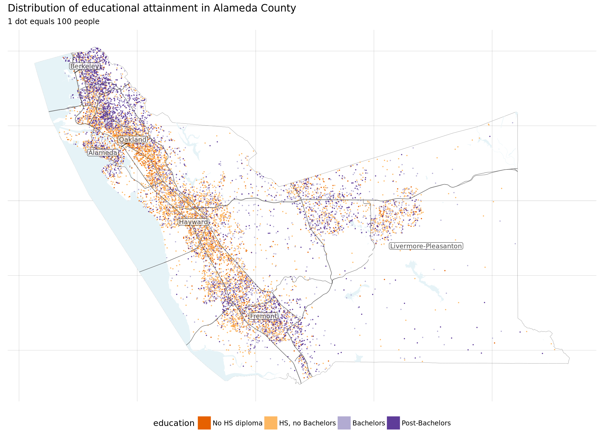
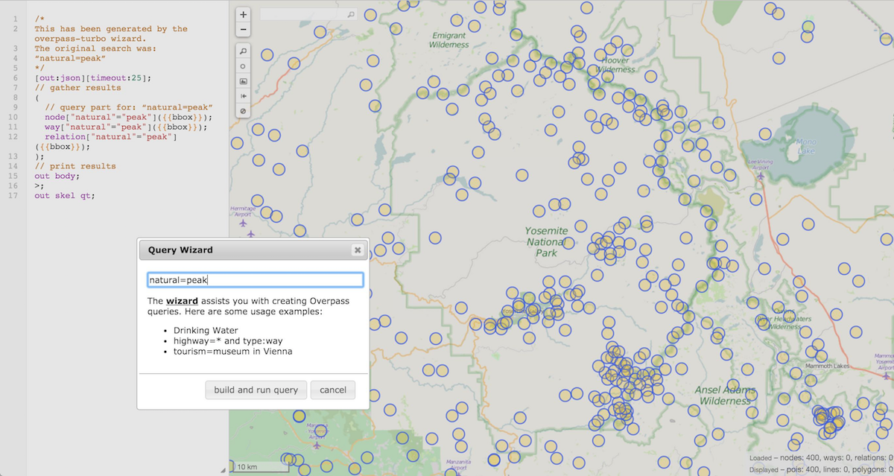
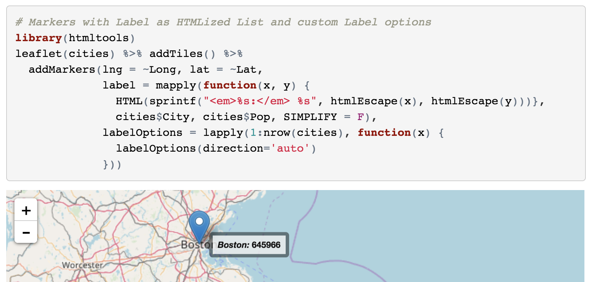
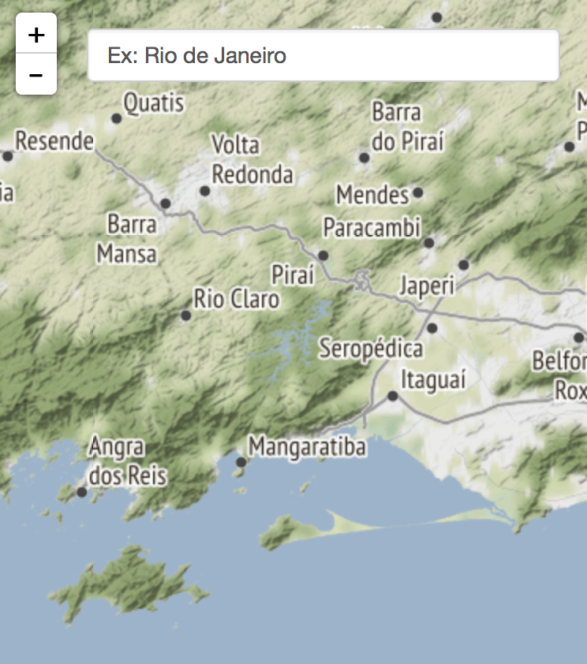
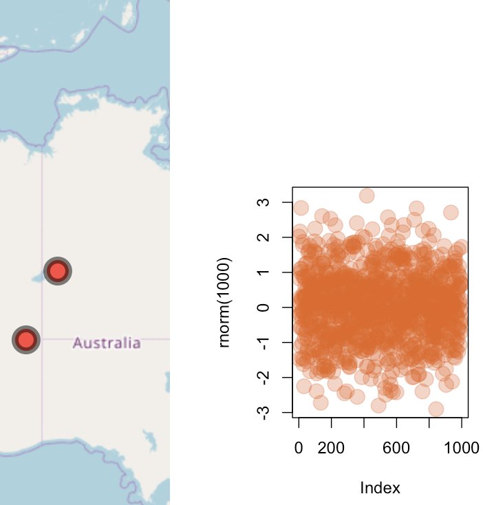

class: right, top
background-image: url(images/roadmap_left.jpg)
background-size: 140%
background-position: 73% 100%


```{r packages, message = FALSE, warning = FALSE, error=FALSE, echo=FALSE}
## Run / Install before executing slides

# devtools::install_github("ropengov/rqog")
# devtools::install_github('bhaskarvk/leaflet.extras')

# Load packages.
packages <- c("devtools","knitr","tidyverse","rJava","widgetframe","readr",
              "leaflet","RColorBrewer","rqog","rgdal","countrycode",
              "leaflet.extras", "widgetframe")

packages <- lapply(packages, FUN = function(x) {
  if(!require(x, character.only = TRUE)) {
    install.packages(x)
  library(x, character.only = TRUE)
  }
}
)


```

```{r setup, include=FALSE}
library("knitr")
knitr::opts_chunk$set(echo = TRUE, eval=TRUE, 
                      message=FALSE, warning = FALSE,
                      fig.height=5, fig.width=9, cache = TRUE) 
options(htmltools.dir.version = FALSE)
```  

```{r theme-map, include=FALSE}
theme_simplemap <- function(base_size = 9, base_family = "") {
  theme_bw(base_size = base_size, base_family = base_family) %+replace%
    theme(axis.line = element_blank(),
          axis.text = element_blank(),
          axis.ticks = element_blank(),
          axis.title = element_blank(),
          panel.background = element_blank(),
          panel.border = element_blank(),
          panel.grid = element_blank(),
          panel.spacing = unit(0, "lines"),
          plot.background = element_blank(),
          legend.position = "none")
}
```  

# Roadmap for Today

.pull-left[

]

.pull-right[

The **leaflet** package to create interactive maps.

**background**: tile providers,   
web map service  
**markers**: cluster, label, icons  
**polygons**: choropleth, palettes, borders  
**interactivity**: hover, label, popup, group layers  
**tricks**: minimap,   
locate me, add-ons


]


---

# Resources for Data Wrangling and EDA

- RStudio has several useful [online webinars](https://www.rstudio.com/resources/webinars/) with associated [slides/code on GitHub](https://github.com/rstudio/webinars):
    - [Getting your data into R](https://www.rstudio.com/resources/webinars/getting-your-data-into-r/)
    - [Data wrangling with R and RStudio](https://www.rstudio.com/resources/webinars/data-wrangling-with-r-and-rstudio/)
- Wickham, H., & Grolemund, G. (2017). R for Data Science: Import, Tidy, Transform, Visualize, and Model Data (1 edition). O’Reilly Media. - Book is [available for free online](http://r4ds.had.co.nz/).

---

# Final project

- try to to think how you can present your results in separate, self-contained web pages  with visualizations (and maybe text, other info, some links etc.)  
- plots can be from plot.ly, leaflet, R Shiny or even D3
- we will cover how to combine these separate pages to make a simple "final project website"

---

class: left, top
background-image: url(images/map_empty_census_tracts.jpg)
background-size: 100%
background-position: 0% -35%

# Election Maps again - Nobody lives here.

--

.pull-left[

]

.pull-right[

]

 <div style="background-color:rgba(255,255,255, 0.7); text-align:left; vertical-align: middle; padding:20px; margin-top:30px">
 
 .small[A Block is the smallest area unit used by the U.S. Census Bureau for counting statistics in the United States. As of 2010, the U.S. consists of 11,078,300 Census Blocks. Of them, **4,871,270 blocks totaling 4.61 million square kilometers were reported to have no population living inside them**. Despite having a population of more than 310 million people, no one calls 47 percent of the USA "home".
 
Source: http://mapsbynik.com/maps/census0pop/ 
]
 </div>

---

class: left, top
background-image: url(images/map_2016_election_dots.jpg)
background-size: 85%
background-position: 50% 100%

# Election Maps again - All votes as dots

--
 <div style="background-color:rgba(255,255,255, 0.7); text-align:left; vertical-align: middle; padding:20px; margin-top:30px">

1 dot = 1 vote dasymetric dot density 2016 Presidential election map.  <br> <br>

65,844,61 blue dots. 62,979,636 red dots

.small[
Source: https://twitter.com/kennethfield/status/970827334038237184
]
 </div>
 

---

# Dot Density Maps 

A dot-density map is one way to **map aggregated spatial data without some of the distortions inherent in choropleths**. 

Dot-density maps work by **placing dots randomly within the appropriate geographic boundaries**, to approximate the overall distribution of people in space. 

See here for a [tutorial on dot density maps](https://tarakc02.github.io/dot-density/).
---

# Dot Density Maps 

```{r, echo=FALSE, out.width = "95%"}

```

---

class: left, top
background-image: url(images/famous_historical_infographics.gif)
background-size: 60%
background-position: 50% 100%

# Famous Infographics

--

 <div style="background-color:rgba(255,255,255, 1); text-align:center; vertical-align: middle; padding:100px; margin-top:30px">

.Large[Too Fast?]

.small[
Source: https://history.infowetrust.com/
]
 </div>

---

background-image: url(images/social_explorer.png)
background-size: 75%
background-position: 50% 100%


# Social Explorer

Check out some great interactive mapping of Census data at the [Social Explorer website](https://www.socialexplorer.com).


---

class: inverse, center, bottom
background-image: url(images/leaflet_logo.png)
background-size: 70%
background-position: 50% 40%

# The **Leaflet** package

---

# Leaflet

- [Leaflet](http://leafletjs.com/) is one of the most popular open-source JavaScript libraries for interactive maps.
- Used widely for websites like [Flickr](https://www.flickr.com/map), [GitHub](https://github.com/blog/1528-there-s-a-map-for-that), [The NYTimes](http://www.nytimes.com/projects/elections/2013/nyc-primary/mayor/map.html) and [The Washington Post](http://www.washingtonpost.com/sf/local/2013/11/09/washington-a-world-apart) etc.
- Can be used as a standalone web javascript application or in conjunction with R.

---

background-image: url(images/WaPo_world_apart.png)
background-size: 80%
background-position: 50% 100%


# Leaflet: Washington Post Example

.small[
http://www.washingtonpost.com/sf/local/2013/11/09/washington-a-world-apart
]


---

background-image: url(images/NYTimes_elections_map.png)
background-size: 100%
background-position: 50% 85%


# Leaflet: NYTimes Example

.small[
NYC [2013](http://www.nytimes.com/projects/elections/2013/nyc-primary/mayor/map.html) and [2017](https://www.nytimes.com/elections/results/new-york-general-elections) elections
]


---

# Installing **leaflet** package

```{r, eval=FALSE}
library(devtools)
# Let's install the development version from Github. Run
devtools::install_github("rstudio/leaflet")
```

**leaflet** is a `htmlwidget` which allows you to build dynamic interactive maps using the Javascript library.

---

# Map Components

- The `leaflet` map object (SVG).
- Tile Layers. <sup>1</sup>
- Vector Data Layers (points, lines, circles, rectangles, polygons).
- Raster Data Layers.
- Popups and labels.
- Controls (zoom control, layer control, buttons, attribution, legends).
- Custom controls and layers via lots and lots of  [plugins](http://www.leafletjs.com/plugins.html).

.footnote[
[1] [How web maps work](https://www.mapbox.com/help/how-web-maps-work/).
]

---

# A simple map

1. **Create a map** widget by calling **`leaflet()`**.
2. **Add layers** (i.e., features) to the map by using layer functions
    (e.g. addTiles, addMarkers,  addPolygons) to modify the map widget.
3. **Print the map widget** to display it.


```{r, eval=FALSE}
library(leaflet)
m <- leaflet() %>%  # Create a map widget
  addTiles() %>%    # Add default OpenStreetMap map tiles
  addMarkers(lat=40.7484405, lng=-73.9878531, 
             popup="Empire State Building")
m  # Print the map 
```

---

# A simple map

```{r, echo=FALSE}
library(leaflet)
m <- leaflet() %>%  # Create a map widget
  addTiles() %>%    # Add default OpenStreetMap map tiles
  addMarkers(lat=40.7484405, lng=-73.9878531, popup="Empire State Building")
m  # Print the map
```

---

# **leaflet()** - The Map Widget

- the `leaflet()` function creates a Leaflet map widget using `htmlwidgets`. The widget can be rendered on HTML pages generated from R Markdown, Shiny, or other applications.
- the `leaflet()` widget consists of two parts:
    - the **map widget** with _initializing options_ to set up the map and _map options_ to manipulate the attributes of the map 
    - **data**, including shape files and other associated data. You can add that right away or at a later time.
- Let's take a look at each in turn

---

# Initializing options **leaflet()**

See all parameters on the [leaflet page here](http://leafletjs.com/reference-1.0.0.html#map-option).

```{r, eval=FALSE}
# Set value for the minZoom and maxZoom settings.
leaflet(options = leafletOptions(minZoom = 0, maxZoom = 18))
```

---

# Map options **leaflet()**

- map options manipulate the attributes of the map widget:
    - `setView()` sets the **center of the map** view and zoom level
    - `fitBounds()` **fits the view into the rectangle** [lng1, lat1] – [lng2, lat2]
    - `clearBounds()` means the range will be determined by the range of lat/long in your data

---

# Data layer

You can use the following objects in defining the `data` parameter:
  - a **simple dataframe** (with lat/long) info 
  - a **`sp` spatial object** (e.g. SpatialPoints[DataFrame], SpatialLines[DataFrame], SpatialPolygons[DataFrame])
  - a **map object from the `map` package**

---

background-image: url(images/nypd_car.jpg) 
background-size: 100%
background-position: 50% 110%

# Example 1: Police Complaints in NYC

This example is using data on all felony, misdemeanor, and violation crimes reported to the New York City Police Department (NYPD). The data is available on [NYC's open data website](https://data.cityofnewyork.us/Public-Safety/NYPD-Complaint-Map-Year-to-Date-/2fra-mtpn).

---

# Example 1: Police Complaints

```{r, message=FALSE, warning=FALSE}
# Get data on NYC police complaints
library(readr)
nypd <- read_csv("data/NYPD_Complaint_2018-06_Manhattan.csv")
```

```{r message=FALSE, warning=FALSE, include=FALSE}
# Remove values with missing coordinates
nypd <- nypd %>% filter(
  is.na(nypd$Latitude)==FALSE &
  is.na(nypd$Longitude)==FALSE)
```

--

Draw a simple map. 

```{r, eval=FALSE, message=FALSE, warning=FALSE}
leaflet(nypd) %>%
  addTiles() %>%    # Add OpenStreetMap map tiles
  addCircles()
```

Above we ask leaflet to **guess the lat/long columns**. But we can **specify them directly** as well:

```{r, eval=FALSE, message=FALSE, warning=FALSE}
leaflet(nypd) %>%
  addTiles() %>%    # Add OpenStreetMap map tiles
  addCircles(lng = ~Longitude, lat = ~Latitude)
```

---

# Map from a Data Frame

```{r, eval=TRUE, echo=FALSE, message=FALSE, warning=FALSE}
leaflet(nypd) %>%
  addTiles() %>%    # Add OpenStreetMap map tiles
  addCircles()      # Add points for the locations of complaints 
```

---

# Change the background tiles

- the default openstreetmap tiles are not the prettiest
- but: there are lots (~100) of other options at   http://leaflet-extras.github.io/leaflet-providers/preview/
- Just copy the generated url from the JavaScript code into the `addTiles` layer or write the name of the provider into the `addProviderTiles` object

---

# Background: NASA Satellite Image 

```{r}
(m = leaflet() %>% addTiles() %>% setView( lng = 2.34, lat = 48.85, zoom = 5 ) %>%
    addProviderTiles("NASAGIBS.ViirsEarthAtNight2012"))
```

---

# Background: Thunderforest with API key

```{r, echo=TRUE}
(m = leaflet() %>%
      setView( lat = 36.2441464, lng = -113.7361594, zoom = 5 ) %>%
      addTiles(
  paste0("https://{s}.tile.thunderforest.com/cycle/{z}/{x}/{y}.png?",
         "apikey=",Sys.getenv("THUNDERFOREST_API_KEY")))) #<<
```

---

# Background: Web Map Service (WMS) tiles 

Lots of maps are available publicly through a format called [Web Map Service (WMS)](https://en.wikipedia.org/wiki/Web_Map_Service).

You can even add tiles that show concurrent info of something, like precipitation here.

```{r, echo=FALSE}
leaflet() %>% addTiles() %>% setView(-93.65, 42.0285, zoom = 4) %>%
  addWMSTiles(
    "https://mesonet.agron.iastate.edu/cgi-bin/wms/us/mrms.cgi?",
    layers = "mrms_p24h",
    options = WMSTileOptions(format = "image/png", transparent = TRUE),
    attribution = "Weather data from Iowa State University"
  )
```

---

# Background: Web Map Service (WMS) tiles 

Or the location of nuclear plants in the world.

```{r}
leaflet() %>% addTiles() %>% setView(-93.65, 42.0285, zoom = 4) %>%  addWMSTiles(
"http://sedac.ciesin.columbia.edu/geoserver/wms",
layers = "energy:energy-pop-exposure-nuclear-plants-locations_plants",
options = WMSTileOptions(format = "image/png", transparent = TRUE),
tileOptions(tms = TRUE),
attribution = "SEDAC @ Columbia University")
```


---

# Background: Web Map Service (WMS) tiles 

And the global population distribution (in 2015).

```{r}
leaflet() %>% addTiles() %>% setView(-93.65, 42.0285, zoom = 4) %>%  addWMSTiles(
"http://sedac.ciesin.columbia.edu/geoserver/wms",
layers = "gpw-v4:gpw-v4-population-count_2015",
options = WMSTileOptions(format = "image/png", transparent = TRUE),
tileOptions(tms = TRUE),
attribution = "SEDAC @ Columbia University")
```

---

# Why consider WMS resources?

WMS tile maps are great, because **map information is requested from the server as needed** when the users moves to other parts of the map or to different zoom levels.

In contrast, the leaflet R package **renders vector and raster data as html objects**. Each coordinate or pixel needs to loaded from a server (or the disk) to be rendered in the browser. So, for large datasets that can slow down the map.

---

# Some free WMS resources

- [Center for International Earth Science Information Network - CIESIN - Columbia University](http://sedac.ciesin.columbia.edu/maps/services): lots of socio-economic data, including population, climate change, population, energy etc. 

- [National Oceanic and Atmospheric Administration (NOAA)](https://nowcoast.noaa.gov/help/#!section=map-service-list): real time weather, forecasts, and warnings (incl. lightning, thunderstorms, hurricanes etc.)

- The [National Map Service](https://nationalmap.gov/small_scale/infodocs/webservices.html) provides shaded relied maps, land cover, tree canopy, elevation maps etc.

But let's return to the providers available directly in `leaflet`.

---

# Background: Using Provider name

```{r, eval=TRUE, message=FALSE, warning=FALSE}
leaflet(nypd) %>%
      addProviderTiles("Stamen.TonerLite") %>% #<<
  # Using the Provider Name
  addCircles(col="orange")
```


---

# Background: Using Provider URL

```{r, eval=TRUE, message=FALSE, warning=FALSE}
leaflet(nypd) %>%
  addTiles('http://{s}.basemaps.cartocdn.com/dark_all/{z}/{x}/{y}.png') %>%  #<<
    # Using the provider URL (as in Javascript library)
  addCircles(col="orange")
```

---

# Change Map Width & Height and Settings

```{r}
m <-  leaflet(height = "30%") %>% #<<
      setView(lng = -74.0156491, lat = 40.7022541, zoom = 17) #<<
m %>% addTiles()
```

---

# Markers

- Represent unique **locations on the map**.

- Markers are added using `addMarkers`, `addCircleMarkers`, `addAwesomeMarkers`, `addLabelOnlyMarkers`.

- **Input** can be vectors of lat/lon coordinates, data.frame, `sp::SpatialPoints`, `sp::SpatialPointsDataFrame`. 

- Can have labels, and **popups whose content can be derived from the data**.

- Can be **toggled using grouping**.

- Can be **clustered** for better performance and visual aesthetics.


---

# Building up as layers 

```{r, eval=TRUE, echo=TRUE, message=FALSE, warning=FALSE}
m <- leaflet(nypd) %>% 
     addTiles('http://{s}.basemaps.cartocdn.com/light_all/{z}/{x}/{y}.png') %>%
     setView(-73.9949344, 40.7179112, zoom = 14)
m %>% addCircles(col="orange")
```

---

# Adjust the points

```{r, eval=TRUE, echo=FALSE}
# Selected offenses
# sort(table(nypd$offense_desc1))
off <- nypd$offense_desc1 
offsel <- NA
offsel <- ifelse(off=="GRAND LARCENY" | off=="PETIT LARCENY" | off=="THEFT-FRAUD" | off=="THEFT OF SERVICES", "Theft", offsel)
offsel <- ifelse(off=="HARRASSMENT", "Harrassment", offsel)
offsel <- ifelse(off=="ASSAULT 3 & RELATED OFFENSES" | off=="FELONY ASSAULT", "Assault", offsel)
offsel <- ifelse(off=="DANGEROUS DRUGS", "Drugs", offsel)
offsel <- ifelse(is.na(offsel), "Other Crime", offsel)
nypd$offsel1 <- offsel
```

```{r, eval=TRUE, echo=TRUE, message=FALSE, warning=FALSE}
library(RColorBrewer)
pal = colorFactor("Set1", domain = nypd$offsel1) # Grab a palette
color_offsel1 = pal(nypd$offsel1)

m %>% addCircles(color = color_offsel1) # Set color of points
```

---

# Add a legend

```{r, eval=TRUE, echo=TRUE, message=FALSE, warning=FALSE}
m %>% addCircles(color = color_offsel1) %>%
  addLegend(pal = pal, values = ~nypd$offsel1, title = "Crimes")
```

---

# Adding a Popup

```{r, eval=TRUE, echo=TRUE, message=FALSE, warning=FALSE}
mpop1 <- m %>% addCircles(color=color_offsel1,
                 popup = ~as.character(nypd$offsel1)) %>%
  addLegend(pal = pal, values = ~nypd$offsel1, title = "Crimes")
```

```{r, echo=FALSE}
frameWidget(mpop1)
```

---

# Adding Popup with more detail

```{r}
content <- paste("What:",nypd$offense_desc1,"<br/>",
                 "When:",nypd$date,"<br/>",
                 "Where:",nypd$premise_type,"<br/>",
                 "Severity:",nypd$crimelevel,"<br/>")

mpop2 <- m %>% addCircles(color=color_offsel1, popup = content) %>%
  addLegend(pal = pal, values = ~nypd$offsel1, title = "Crimes")
```

```{r, echo=FALSE}
frameWidget(mpop2, height="300px")
```

---

# Clustering Points

To improve user experience, we can **cluster points** on the map. 

These **clusters map back into individual points** as users **zoom** into an area of the map.

---

# Clustering Points

```{r, eval=TRUE, message=FALSE, warning=FALSE}
mclust <- m %>% addCircleMarkers(color = color_offsel1, 
                       popup = content,
                       clusterOptions = markerClusterOptions()) #<<
```

```{r, echo=FALSE}
frameWidget(mclust)
```


---

class: bottom, center
background-image: url(images/qog_logo.png) 
background-color: #D3D3D3
background-size: 60%
background-position: 50% 30%


# Example: World Choropleth Map using the Quality of Government (QoG) data

---

# Quality of Government Data

The **Quality of Government Institute** in Gothenburg provides several useful [aggregated datasets for social science](http://qog.pol.gu.se/data). 

The standard data set includes over 2300 variables. The current 760-page codebook(!) is [here](http://www.qogdata.pol.gu.se/data/qog_std_jan20.pdf).

The datasets are also accessible via an R package:

```{r, eval=TRUE}
# library(devtools)
# install_github("ropengov/rqog")
# Cheers to the OQG team and to the Swedish taxpayer.
library(rqog)
```

---

# Some more info on QoG for your reference 

The Quality of Government institute provides data in five different data sets, both in cross-sectional and longitudinal versions:

.small[
[QoG Basic Data](http://www.qog.pol.gu.se/data/datadownloads/qogbasicdata/)  
[QoG Standard Data](http://www.qog.pol.gu.se/data/datadownloads/qogstandarddata/)  
[QoG OECD Data](http://qog.pol.gu.se/data/datadownloads/qogoecddata)  
[QoG Expert Survey Data](http://www.qog.pol.gu.se/data/datadownloads/qogexpertsurveydata/)  
[QoG EU Regional Data](http://www.qog.pol.gu.se/data/datadownloads/qogeuregionaldata/)
]

The **`rqog`-package provides access** to Basic, Standard and OECD datasets **through the function `read_qog()`**. 

.small[Standard data has all the same indicators as in Basic data (241 variables) and an additional ~2300 indicators. Both basic and standard datasets have 211 countries. OECD dataset has 1274 indicators from 34 countries. `rqog` uses longitudinal datasets by default that have time-series of varying duration from majority of the indicators and countries.]

---

# Choosing some data to plot

```{r, message=FALSE, warning=FALSE}
# qog <- read_qog(which.data = "basic", 
#                 data.type = "cross-sectional")

# To ensure accessibility without internet:
qog <- read_csv("data/qog_bas_cs_jan20.csv")
qog
```

---

# Get Shape Files

World map shape files are included in the `maps` package and easy to use.

To show how to use any shape files, we will **import some shapefiles for country borders** instead.

---

# Get Shape Files

```{r, eval=FALSE, echo=FALSE}
# Download .shp file on the web:
download.file("http://thematicmapping.org/downloads/TM_WORLD_BORDERS_SIMPL-0.3.zip" , destfile="world_shape_file.zip")
# system("unzip world_shape_file.zip")
```

```{r, eval=TRUE, message=FALSE, warning=FALSE}
# Read the file with rgdal
library(rgdal)
world_spdf = readOGR(dsn= "data/world_map/", 
                     layer="TM_WORLD_BORDERS_SIMPL-0.3")
```

---

# Add Data to Shapefiles

- we want to add some selected data from the QoG file to our shapefiles. 
- Unfortunately, the country codes do not match directly, so we need to do some extra work.

```{r}
library(countrycode)
qog$UN <- countrycode(qog$ccodecow, "cown", "un")

# Merge the QoG data to Shape Files
combined <- world_spdf@data %>% 
  left_join(qog, by = c(UN = "UN"))
world_spdf@data <- combined
```


---

# Shapes

- Can be **lines, circles, rectangles, polygons**.
- Added using `addPolyLines`, `addCircles`, `addRectangles`, and `addPolygons`.
- For polylines: Input can be `sp::Lines`, `sp::SpatialLines`, `sp::SpatialLinesDataFrame`. 
- For polygons: Input can be `sp::Polygons`, `sp::SpatialPolygons`, `sp::SpatialPolygonsDataFrame`.
- Can have **labels and popups** whose content can be derived from data.
- Can **customize their appearance** using data.
- Can be **grouped** for bulk operations.
- Can be **highlighted on mouse-over**.


---

# Make choropleth map - quantile scale

```{r echo=TRUE}
wm <- leaflet(world_spdf, 
 leafletOptions(attributionControl = FALSE, minzoom=1.5)) %>% 
 setView(lat=10, lng=0 , zoom=2) %>%
 # Add country borders 
 addPolygons(stroke = TRUE, smoothFactor = 0.5,
  weight=1, color='#333333', opacity=1, 
 # Add colors for life exp quantiles
  fillColor = ~colorQuantile("RdYlGn", wdi_lifexp)(wdi_lifexp), 
  fillOpacity = 1)
```

---

# Make choropleth map - quantile scale

```{r, echo=FALSE}
frameWidget(wm)
```

---

# Add hover label

```{r echo=TRUE}
wm2 <- leaflet(world_spdf, 
              leafletOptions(attributionControl = FALSE, minzoom=1.5)) %>% 
 setView(lat=10, lng=0 , zoom=2) %>%
 # Add country borders 
 addPolygons(stroke = TRUE, smoothFactor = 0.5,
             weight=1, color='#333333', opacity=1, 
 # Add colors for life exp quantiles
             fillColor = ~colorQuantile("RdYlGn", wdi_lifexp)(wdi_lifexp), 
             fillOpacity = 1,
  # Add label 
  label = ~stringr::str_c(NAME, ' ', #<<
          formatC(wdi_lifexp, big.mark = ',', format='d')), #<<
  labelOptions = labelOptions(direction = 'auto')) #<<
```

---

# Add hover label

```{r, echo=FALSE}
frameWidget(wm2)
```

---

# Add hover highlight for polygons

```{r echo=TRUE}
wm3 <- leaflet(world_spdf, 
              leafletOptions(attributionControl = FALSE, minzoom=1.5)) %>% 
 setView(lat=10, lng=0 , zoom=2) %>%
 # Add country borders 
 addPolygons(stroke = TRUE, smoothFactor = 0.5,
             weight=1, color='#333333', opacity=1, 
 # Add colors for life exp quantiles
             fillColor = ~colorQuantile("RdYlGn", wdi_lifexp)(wdi_lifexp), 
             fillOpacity = 1,
  # Add label 
  label = ~stringr::str_c(NAME, ' ',
          formatC(wdi_lifexp, big.mark = ',', format='d')),
  labelOptions = labelOptions(direction = 'auto'),
 # Add hightlighting for polygons
  highlightOptions = highlightOptions( #<<
          color='#000000', weight = 3, #<<
          bringToFront = TRUE, sendToBack = TRUE) #<<
    )
```


---

# Add hover highlight for polygons

```{r, echo=FALSE}
frameWidget(wm3)
```

---

# Add a popup with more info

```{r echo=TRUE}
wm4 <- leaflet(world_spdf, 
              leafletOptions(attributionControl = FALSE, minzoom=1.5)) %>% 
 setView(lat=10, lng=0 , zoom=2) %>%
 # Add country borders 
 addPolygons(stroke = TRUE, smoothFactor = 0.5,
             weight=1, color='#333333', opacity=1, 
 # Add colors for life exp quantiles
             fillColor = ~colorQuantile("RdYlGn", wdi_lifexp)(wdi_lifexp), 
             fillOpacity = 1,
  # Add label 
  label = ~stringr::str_c(NAME, ' ',
          formatC(wdi_lifexp, big.mark = ',', format='d')),
  labelOptions = labelOptions(direction = 'auto'),
  # Add hightlighting for polygons
  highlightOptions = highlightOptions( 
          color='#000000', weight = 3, 
          bringToFront = TRUE, sendToBack = TRUE),
 # Popup with more info 
  popup = paste("Country:",world_spdf$NAME,"<br/>",  #<<
     "Life Expectancy:", round(world_spdf$wdi_lifexp,1), "years","<br/>", #<<
     "GDP per capita:",  round(world_spdf$wdi_gdpcapcon2010,0),  "USD")) #<<
```

---

# Add a popup with more info

```{r, eval=TRUE, echo=FALSE}
frameWidget(wm4)
```

---

# Adding a legend 

```{r, eval=TRUE, echo=FALSE}
wm5 <- wm4 %>% 
    addLegend(
    "bottomright", 
    pal = colorNumeric("RdYlGn", world_spdf$wdi_lifexp), 
            values = ~wdi_lifexp,
    title = htmltools::HTML("Life Expectancy<br/>(in years)"),
    opacity = 1)
```

Legend by quartile cut: 

```{r, eval=TRUE}
wm5 <- wm4 %>% 
  addLegend(
  "bottomright", 
  pal = colorQuantile("RdYlGn", world_spdf$wdi_lifexp, n=6),
  values = ~wdi_lifexp,
  title = htmltools::HTML("Life Expectancy
(in years)"),
opacity = 1, 
  labFormat = function(type, cuts, p) {
n = length(cuts)
paste0(cuts[-n], " – ", cuts[-1])}
)
```

---

# Adding a legend 

```{r, eval=TRUE, echo=FALSE}
frameWidget(wm5)
```

---

# Show/Hide Layers

The Leaflet package includes the ability to **show and hide map layers**

The fundamental unit of showing/hiding is the **group**.

A **group is a label given to a set of layers**. You assign layers to groups by using the `group` parameter when adding the layers to the map.

---

# Show/Hide Layers 

Many layers can belong to same group. But each layer can only belong to zero or one groups (you can’t assign a layer to two groups).

```{r, eval=FALSE}
leaflet() %>%
 addTiles() %>%
 addMarkers(data = libraries,  group = "Academic Buildings") %>%
 addMarkers(data = classrooms, group = "Academic Buildings") %>%
 addMarkers(data = cafes,      group = "Cafes")
```

And in the plot, we can use Leaflet’s layers control feature to allow users to toggle the visibility of groups.

```{r, eval=FALSE}
  addLayersControl(
    baseGroups = c("Campus Map w/o Transit", 
                   "Campus Map w/ Transit"),
    overlayGroups = c("Academic Buildings", "Cafes"))
```

---

# Adding multiple layers

**1. Prepare the base layers**

```{r, eval=FALSE}
m_l1 = leaflet(world_spdf) %>% 
 setView(lat=10, lng=0 , zoom=2) %>%
 # Base groups = Background layer
 addTiles(group = "OpenStreetMap") %>% #<<
 addProviderTiles(providers$Stamen.Toner, group = "Toner") %>% #<<
 addProviderTiles(providers$Stamen.TonerLite, group="Toner Lite") %>% #<<
```

---

# Adding multiple layers

**2. Add data layers - life expectancy choropleth**

```{r, eval=FALSE}
m_l1 = leaflet(world_spdf) %>% 
 setView(lat=10, lng=0 , zoom=2) %>%
 # Base groups = Background layer
    ...
 # Data Layers
 ## First Data Layer: Life Expectancy
addPolygons(group="Life Expectancy", #<<
  stroke = TRUE, smoothFactor = 0.5,
  weight=1, color='#333333', opacity=1, 
  fillColor = ~colorQuantile("RdYlGn", wdi_lifexp)(wdi_lifexp), 
  fillOpacity = 1,
  label = ~stringr::str_c(NAME, ' ',
          formatC(wdi_lifexp, big.mark = ',', format='d')),
  labelOptions = labelOptions(direction = 'auto'),
  highlightOptions = highlightOptions( 
          color='#000000', weight = 3, 
          bringToFront = TRUE, sendToBack = TRUE),
  popup = paste("Country:",world_spdf$NAME,"<br/>",  
    "Life Expectancy:", round(world_spdf$wdi_lifexp,1), "years","<br/>", 
    "GDP per capita:",  round(world_spdf$wdi_gdpcapcon2010,0),  "USD")) 
```

---

# Adding multiple layers

**3. Add data layers - democracy as border color**

```{r, eval=FALSE}
m_l1 = leaflet(world_spdf) %>% 
    setView(lat=10, lng=0 , zoom=2) %>%
 # Base groups = Background layer
    ...
 # Data Layers
 ## First Data Layer: Life Expectancy
    ...
 ## Second Data Layer: Democracy
 addPolygons(group="Democracy", #<<
             data=subset(world_spdf, fh_ipolity2>7),#<<
             opacity = 1.0, stroke = TRUE, #<<
             color = "white", weight=1) %>%#<<
```

---

# Adding multiple layers

**4. Layer controls**

```{r, eval=FALSE}
m_l1 = leaflet(world_spdf) %>% 
    setView(lat=10, lng=0 , zoom=2) %>%
 # Base groups = Background layer
    ...
 # Data Layers
 ## First Data Layer: Life Expectancy
    ...
 ## Second Data Layer: Democracy
    ...
 # Layers control
 addLayersControl( #<<
 baseGroups = c("OpenStreetMap", "Toner", "Toner Lite"), #<<
 overlayGroups = c("Life Expectancy","Democracy"), #<<
 options = layersControlOptions(collapsed = TRUE) ) #<<
```

---

# Adding multiple layers

```{r, eval=TRUE, echo=FALSE}
m_l1 = leaflet(world_spdf) %>% 
    setView(lat=10, lng=0 , zoom=2) %>%
    # Base groups = Background layer
    addTiles(group = "OpenStreetMap") %>%
    addProviderTiles(providers$Stamen.Toner, group = "Toner")  %>%
    addProviderTiles(providers$Stamen.TonerLite, group = "Toner Lite") %>%
    # Data Layers
      # First Data Layer: Life Expectancy
    addPolygons(group="Life Expectancy", #<<
      stroke = TRUE, smoothFactor = 0.5,
      weight=1, color='#333333', opacity=1, 
      fillColor = ~colorQuantile("RdYlGn", wdi_lifexp)(wdi_lifexp), 
      fillOpacity = 1,
      label = ~stringr::str_c(NAME, ' ',
              formatC(wdi_lifexp, big.mark = ',', format='d')),
      labelOptions = labelOptions(direction = 'auto'),
      highlightOptions = highlightOptions( 
              color='#000000', weight = 3, 
              bringToFront = TRUE, sendToBack = TRUE),
      popup = paste("Country:",world_spdf$NAME,"<br/>",  
        "Life Expectancy:", round(world_spdf$wdi_lifexp,1), "years","<br/>", 
        "GDP per capita:",  round(world_spdf$wdi_gdpcapcon2010,0),  "USD")) %>%
     # Second Data Layer: Democracy
    addPolygons(group="Democracy", #<<
      data=subset(world_spdf, fh_ipolity2>7), #<<
      stroke = TRUE, smoothFactor = 0.5,
      weight=2, color='white', opacity=1,
      label = ~stringr::str_c(NAME, ' ',
              formatC(wdi_lifexp, big.mark = ',', format='d')),
      labelOptions = labelOptions(direction = 'auto'),
      highlightOptions = highlightOptions( 
              color='yellow', weight = 3, 
              bringToFront = TRUE, sendToBack = TRUE),
      popup = paste("Country:",world_spdf$NAME,"<br/>",  
        "Life Expectancy:", round(world_spdf$wdi_lifexp,1), "years","<br/>", 
        "GDP per capita:",  round(world_spdf$wdi_gdpcapcon2010,0),  "USD")) %>%  
    # Layers control
    addLayersControl( #<<
    baseGroups = c("OpenStreetMap", "Toner", "Toner Lite"), #<<
    overlayGroups = c("Life Expectancy","Democracy"), #<<
    options = layersControlOptions(collapsed = TRUE) ) #<<
```


```{r, echo=FALSE}
frameWidget(m_l1)
```

---


# Adding a Minimap 

We can **add a minimap** to help the user navigate a larger map and orient themselves even when zoomed in.

This is implemented via the [Leaflet-MiniMap plugin](https://github.com/Norkart/Leaflet-MiniMap).

---

# Adding a Minimap 


Simple addition of a mini Map

```{r, eval=FALSE}
m %>% addMiniMap()
```

--

Add further controls

```{r, eval=FALSE}
m %>% addMiniMap(tiles = providers$Esri.WorldStreetMap,
                 toggleDisplay = TRUE,
                 zoomAnimation = TRUE)
```

---

# Adding a Minimap 

```{r, echo=FALSE, message=FALSE, warning=FALSE}
frameWidget(
wm4 %>% addMiniMap(tiles = providers$Esri.WorldStreetMap,
                 toggleDisplay = TRUE,
                 zoomAnimation = TRUE)
)
```

---

# Locate me button

We can use an `addEasyButton()` to **add simple buttons** (via Leaflet.EasyButton) that **trigger a custom JavaScript** logic.

Let's try two examples:
  - setting the zoom level to 1 - i.e. the "back to start" button
  - user location to set center of map
    
This map adds two buttons: 
  - sets the map zoom level to 1
  - attempt to locate you

---

# Locate me button

```{r, eval=TRUE, message=FALSE, warning=FALSE}
m_js1 <- wm4 %>%
  addEasyButton(easyButton(
    icon="fa-globe", 
    title="Zoom to Entire World Map",
    onClick=JS("function(btn, map){ map.setZoom(1.5); }"))) %>%
  addEasyButton(easyButton(
    icon="fa-crosshairs", 
    title="Locate Me",
    onClick=JS("function(btn, map){ map.locate({setView: true}); }")))
```

---

# Locate me button

```{r, echo=FALSE, message=FALSE, warning=FALSE}
frameWidget(m_js1)
```

---

# Exporting Leaflat maps

Leaflet maps live in html. From R you can **export the leaflet map** as follows:

```{r, eval=FALSE}
library(htmlwidgets)
saveWidget(m, file="m.html")
```

In RStudio, you can **knit your .Rmd file into HTML**
    ```
    ---
    title: "Leaflet Map"
    output: html_document
    ---
     \```{r}
     library(leaflet)
     m = leaflet() %>% addTiles() %>% addCircles()
     m
     \```
     ```

---

class: inverse, bottom, center
background-image: url(images/yosemite-tunnel-view.jpg) 
background-size: 116%
background-position: 50% 0%

# Example: Yosemite Peaks

Using OpenStreetMap data on the peaks in Yosemite National Park to show plotting of icons, lines, and shapes.

---

# OpenStreetMap data from TurboOverpass

This OSM data is extracted from [TurboOverpass](http://overpass-turbo.eu/).

```{r, echo=FALSE, out.width = "100%"}

```

---

# Loading the Data and adding polygons  

We load a *shapefile* of Yosemite National Park using the function `readOGR()`. 

.small[If you're only loading one layer into leaflet this is easier, but if you're loading multiple layers, it's best to be explicit and specify your data layer in the function that adds that layer (i.e. `addPolygons()`, `addMarkers()`, etc.)]

```{r, message=FALSE, warning=FALSE}
# Yosemite boundary shapefile
yosemite <- readOGR("./data/yosemite/yosemite", "yosemite", verbose = FALSE) 
# Pacific Crest Trail shapefile
PCT <- readOGR("./data/yosemite/PCT.geojson", verbose=FALSE)

# Make map
p <- leaflet() %>% addTiles() %>% 
     addPolylines(data = yosemite) %>% 
       # Notice the object `yosemite` is loaded directly here 
     addPolylines(data = PCT, color="red")
```

---

# Loading the Data and adding polygons  

```{r, echo=FALSE}
frameWidget(p)
```

---

background-image: url(images/metric_system_cartoon.png) 
background-size: 60%
background-position: 50% 100%


# Mapping peaks

```{r, message=FALSE}
# Load peaks points shapefile
peaks <- readOGR("./data/yosemite/peaks.geojson", verbose=FALSE)

# Convert peak values to numeric (and, sigh, non-metric units)
peaks <- subset(peaks, peaks@data$ele!="0")
peaks@data$ele <- round(as.numeric(
  levels(peaks@data$ele))[peaks@data$ele] * 3.28084)
```


---

# Mapping peaks

```{r, message=FALSE}
# Make map of peaks
p2 <- p %>% 
  addCircleMarkers(data=peaks, weight=0, radius=6, #<<
                   fillOpacity=0.6, #<<
                   popup=~paste("Name: ",name,"<br>
                                Elevation: ",ele,"feet")) %>% #<<
  addPolylines(data=yosemite, fillOpacity = 0, 
               dashArray=c(10,10), fill=FALSE, color="red") %>%
  addPolylines(data=PCT, fillOpacity = 0, 
               dashArray=c(10,10), fill=FALSE, color="red")
```

---

# Mapping peaks

```{r, echo=FALSE}
frameWidget(p2)
```

---

# Mapping Peaks: Icons for high peaks

We want to **size these circles based on their elevation** using the code: `radius=~ele/1000`.

We also want to **highlight the peaks that are over 10,000 feet with an icon**.

To do this, we 
  - first set the icon setting using the function `icons()` and 
  - then using `addMarkers` with the subset of peaks `data=subset(peaks, peaks@data$ele>10000)`.

---

# Mapping Peaks: Icons for high peaks

```{r}
# Icon settings
peakIcons <- icons( #<<
  iconUrl = "./data/yosemite/Mountain-512.png", #<<
  iconWidth = 15, iconHeight = 15, #<<
  iconAnchorX = 7.5, iconAnchorY = 8.5 #<<
  )

p3 <- leaflet() %>%
  addTiles() %>%
  addCircleMarkers(data=peaks, weight=0, 
                   radius=~ele/1000, #<<
                   fillOpacity=0.7, 
                   popup=~paste("Name: ",name,"<br>
                                Elevation: ",ele)) %>%
  addMarkers(data=subset(peaks, peaks@data$ele>10000),
             icon = peakIcons, #<<
             popup=~paste("Name: ",
                     name,"<br>Elevation: ",ele)) %>%
  addPolylines(data=yosemite, fillOpacity = 0, 
               dashArray=c(10,10), 
               fill=FALSE, color="red")
```

---

# Mapping Peaks: Icons for high peaks

```{r, echo=FALSE}
frameWidget(p3)
```

---

# Mapping Peaks: Add Color and Legend

Let's **add some color to our circles**. Do do this, we **create a palette**.

In this example, there is an extra line where we **define the palette `spectral` so we can flip the color scheme**. 

Then we **map elevations to the palette** in the line that begins `eleColor `.

To **add a legend to the map**, we use the function `addLegend()` and assign the `pal` to the mapped palette `eleColor`.

---

# Mapping Peaks: Add Color and Legend

```{r, eval=TRUE}
# create color scale from elevation
spectral <- brewer.pal(11, "Spectral")  %>% rev() #<<
eleColor <- colorBin(spectral, peaks@data$ele) #<<

p4 <- leaflet(peaks,
              leafletOptions(initialTileLayerAttribution = FALSE)) %>%
  addTiles(attribution = FALSE) %>%
  addCircleMarkers(weight=0, radius=~ele/1000, fillOpacity=0.7, 
                   color = ~eleColor(ele), #<<
                   popup=~paste("Name: ",name,
                           "<br>Elevation: ",ele)) %>%
  addMarkers(data=subset(peaks,peaks@data$ele>10000),
             icon = peakIcons,
             popup=~paste("Name: ",name,
                    "<br>Elevation: ", ele)) %>%
  addLegend(title = "Peak Elevation", pal = eleColor, #<<
            values = ~ele, opacity = 1, #<<
            position="topright") %>% #<<
  addPolylines(data=yosemite, fillOpacity = 0, 
               dashArray=c(10,10), 
               fill=FALSE, color="blue")
```

---

# Mapping Peaks: Add Color and Legend

```{r, echo=FALSE}
frameWidget(p4)
```

---

# Add different base map

```{r, eval=FALSE, message=FALSE}
p4 %>% addProviderTiles("Esri.WorldImagery",
                        options = providerTileOptions(attribution = ""))
```

```{r, echo=FALSE, message=FALSE}
p4 %>% addProviderTiles("Esri.WorldImagery",
                        options = providerTileOptions(attribution = "")) %>%
  frameWidget()
```

---

# Switching Layers

```{r, echo=FALSE}
mapbox <- "http://api.tiles.mapbox.com/v4/mapbox.outdoors/{z}/{x}/{y}.png?access_token=pk.eyJ1Ijoiam9zaHBlcHBlciIsImEiOiJuTWdrY2k4In0.HCCXtgU04scrTB_-ON4kjA"

(p5 <- leaflet() %>%
  addCircleMarkers(data=peaks, weight=0, radius=~ele/1000, fillOpacity=0.7, color = ~eleColor(ele),
                   popup=~paste("Name: ",name,"<br>Elevation: ",ele),
                   group="Peaks") %>%
  addLegend(title = "Peak Elevation", pal = eleColor,
            values = peaks@data$ele, opacity = 1, position="bottomleft") %>%
  addMarkers(data=subset(peaks,peaks@data$ele>10000),
             icon = peakIcons, popup=~paste("Name: ",name,"<br>Elevation: ",ele),
             group="Mountain Icons") %>%
  addPolylines(data=yosemite, fillOpacity = 0, dashArray=c(10,10),
               fill=FALSE, color="#3288BD", group="Yosemite") %>%
  addPolylines(data=PCT, dashArray=c(10,10),
               fill=FALSE, color="#9E0142", group="PCT") %>%
  #add basemaps
  addProviderTiles("CartoDB.Positron", group="Simple",
                   options = providerTileOptions(attribution = "")) %>%
  addProviderTiles("Esri.WorldImagery", group="Satellite",
                   options = providerTileOptions(attribution = "")) %>%
  addTiles(urlTemplate = mapbox, group="Outdoors") %>%
  #Add layer switcher
   addLayersControl(
    baseGroups = c("Simple", "Satellite", "Outdoors"),
    overlayGroups = c("Peaks","Mountain Icons","Yosemite","PCT"),
    options = layersControlOptions(collapsed = TRUE)
  )
)
```

---

# Save the map

```{r}
library(htmlwidgets)
saveWidget(p5, file="yosemite_peaks.html")
```


---

class: inverse, bottom, center
background-image: url(images/leaflet_extra.png) 
background-size: 100%
background-position: 50% 0%

# Leaflet: Other features, extensions, and add-ons

---

# What I did not cover today

- [projections](https://rstudio.github.io/leaflet/projections.html)
- [raster images](https://rstudio.github.io/leaflet/raster.html)
    (and see example of precipitation map above)
--
- [Adjusting formatting of labels](https://rpubs.com/bhaskarvk/leaflet-labels)



---

# Lots(!) of Extensions and Extras

- Many 3rd-Party vendors (commercial and open-source) provide add-ons on top of Leaflet. e.g. ESRI, Mapbox, GIBs. 
- Custom controls and layers via lots of [plugins](http://www.leafletjs.com/plugins.html).
- many of these require some knowledge of HTML, CSS, and JavaScript to implement successfully into the HTML output from your R code

---

# **leaflet.extra** package

The [`leaflet.extra` package](https://bhaskarvk.github.io/leaflet.extras/) provides extensions of functionalities: 

- Add/Modify/delete/style markers/shapes using [Leaflet.Draw](http://rpubs.com/bhaskarvk/leaflet-draw).
- Add [GeoJSON](http://rpubs.com/bhaskarvk/geojsonv2), [TopoJSON](http://rpubs.com/bhaskarvk/topojsonv2), [KML](http://rpubs.com/bhaskarvk/kml), [GPX](http://rpubs.com/bhaskarvk/gpx), [CSV](http://rpubs.com/bhaskarvk/csv) files directly.
    + Customizable Markers and Shapes
    + Choropleths from polygon data w/ auto legends and bi-directional highlighting
    + Popup showing properties in a table
- Create [Heatmap](http://rpubs.com/bhaskarvk/leaflet-heatmap) from point data.
- [Search](http://rpubs.com/bhaskarvk/leaflet-search) Markers. Geo-locate using OSM Nominatum API.
- [Pulsating](http://rpubs.com/bhaskarvk/leaflet-pulseIcon) and  [Weather](http://rpubs.com/bhaskarvk/leaflet-weather) icons for markers.
- [Tiles Caching](http://rpubs.com/bhaskarvk/TileLayer-Caching), 
   [GPS](https://github.com/stefanocudini/leaflet-gps), and many more!

---

# Using [JSON data](http://rpubs.com/bhaskarvk/topojsonv2) and providing HTML Table

```{r, echo=FALSE}
library(leaflet.extras)
fName <- 'data/crimes_by_district.topojson'

l <- leaflet() %>%
  addBootstrapDependency() %>%
  setView(-75.14, 40, zoom = 11) %>%
  addProviderTiles(providers$CartoDB.Positron) %>%
  addGeoJSONChoropleth(
    readr::read_file(fName), valueProperty ='incidents',
    scale = 'OrRd', mode='q', steps = 5, padding = c(0.2,0),
    popupProperty = propstoHTMLTable(
      props = c('dist_numc', 'location', 'incidents', '_feature_id_string'),
      table.attrs = list(class='table table-striped table-bordered'),drop.na = T),
    labelProperty = JS('function(feature){return "WARD: " + feature.properties.dist_numc;}'),
    color='#ffffff', weight=1, fillOpacity = 0.7,
    highlightOptions = highlightOptions(
      fillOpacity=1, weight=2, opacity=1, color='#000000',
      bringToFront=TRUE, sendToBack = TRUE),
    legendOptions = legendOptions(title='Crimes', position='topright'))
```

```{r, echo=FALSE, message=FALSE, warning=FALSE}
l %>%
  frameWidget(height='450')
```

---

# Day / Night Indicator

```{r, eval=FALSE}
leaflet() %>% addTiles() %>% addTerminator()
```

```{r, echo=FALSE}
# Custom Resolution + Custom Date and on a toggleable Layer
leaflet() %>%
  addTiles() %>%
  addTerminator(
    resolution=10,
    time = "2013-06-20T21:00:00Z",
    group = "daylight") %>%
  addLayersControl(
    overlayGroups = "daylight",
    options = layersControlOptions(collapsed = FALSE)) %>% 
  frameWidget
```

---

# Pulsating Icon

```{r, eval=FALSE}
leaflet() %>% addTiles() %>% 
  addPulseMarkers(lng=-77.036530, lat=38.897547,
    label='What is going on here?', labelOptions(noHide = T),
    icon = makePulseIcon(heartbeat = 0.5))
```

```{r, echo=FALSE}
leaflet() %>% 
  setView(lng=-77.036560, lat=38.897547, zoom = 18) %>%
  addTiles() %>% 
  addPulseMarkers(lng=-77.036530, lat=38.897547,
    label='What is going on here?', labelOptions(noHide = T),
    icon = makePulseIcon(heartbeat = 0.5)) %>% frameWidget(height='300')
```


---

# Further Help for Leaflet

- `leaflet()` is a package created by RStudio and there is a nice online intro here: https://rstudio.github.io/leaflet/
- `Leaflet.js` is an [open-source javascript library](http://leafletjs.com/). The R package provides easy to integrate and control Leaflet maps in R.
- Here is a [presentation of some features of Leaflet](https://resources.rstudio.com/rstudio-conf-2017/mapping-in-r-with-leaflet-bhaska-karambelkar/) at the RStudio Conference

---

background-image: url(images/leaflet_extra_code_examples.png) 
background-size: 55%
background-position: 27% 100%

# [Worked Examples with Code](http://rpubs.com/bhaskarvk)

---

# Preview: Leaflet and Shiny


.pull-left[

```{r, echo=FALSE, out.width = "100%"}

```

]

.pull-right[

```{r, echo=FALSE, out.width = "100%"}

```

]


```{r shiny_ex1, eval= FALSE, echo=FALSE, cache=FALSE}
library(shiny)
library(leaflet)
library(ggmap)

server <- function(input, output) {

    output$map <- renderLeaflet({
    
        # Get latitude and longitude
        if(input$target_zone=="Ex: Rio de Janeiro"){
            ZOOM=9
            LAT=-22.970722
            LONG=-43.182365
        }else{
            target_pos=geocode(input$target_zone)
            LAT=target_pos$lat
            LONG=target_pos$lon
            ZOOM=12
        }

        # Plot it!
        leaflet() %>% 
          setView(lng=LONG, lat=LAT, zoom=ZOOM ) %>%
        addProviderTiles("Stamen.Terrain")
    })
}


ui <- fluidPage(
    br(),
    leafletOutput("map", height="600px"),
    absolutePanel(top=20, left=70, textInput("target_zone", "" , "Ex: Rio de Janeiro")),
    br()
)

shinyApp(ui = ui, server = server)

```


```{r shiny_ex2, eval= FALSE, echo=FALSE, cache=FALSE}
library(shiny)
library(leaflet)

server <- function(input, output) {
    
    # build data with 2 places
    data=data.frame(x=c(130, 128), y=c(-22,-26), id=c("In the middle of", "nowhere"))
    
    # create a reactive value that will store the click position
    data_of_click <- reactiveValues(clickedMarker=NULL)

    # Leaflet map with 2 markers
    output$map <- renderLeaflet({
        leaflet() %>% 
          setView(lng=131 , lat =-25, zoom=4) %>%
          addTiles(options = providerTileOptions(noWrap = TRUE)) %>%
          addCircleMarkers(data=data, ~x , ~y, layerId=~id, popup=~id, radius=8 , color="black",  fillColor="red", stroke = TRUE, fillOpacity = 0.8)
    })

    # store the click
    observeEvent(input$map_marker_click,{
        data_of_click$clickedMarker <- input$map_marker_click
    })
    
    # Make a barplot or scatterplot depending of the selected point
    output$plot=renderPlot({
        my_place=data_of_click$clickedMarker$id
        if(is.null(my_place)){my_place="place1"}
        if(my_place=="place1"){
            plot(rnorm(1000), col=rgb(0.9,0.4,0.1,0.3), cex=3, pch=20)
        }else{
            barplot(rnorm(10), col=rgb(0.1,0.4,0.9,0.3))
        }    
    })
}


ui <- fluidPage(
    br(),
    column(8,leafletOutput("map", height="600px")),
    column(4,br(),br(),br(),br(),plotOutput("plot", height="300px")),
    br()
)

shinyApp(ui = ui, server = server)

```


