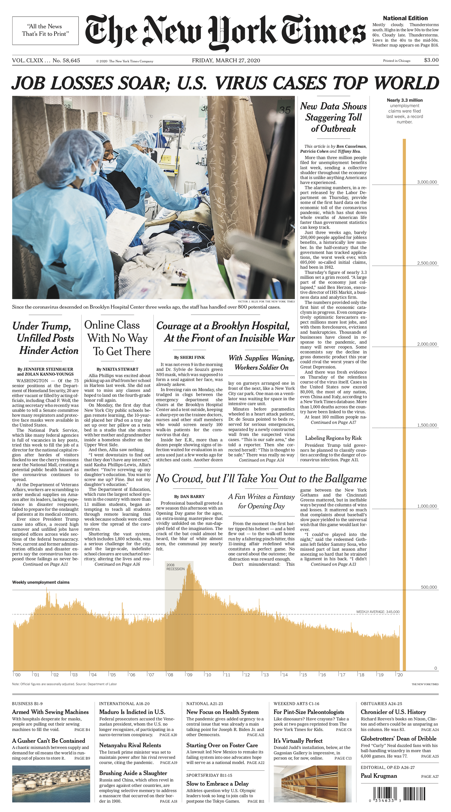
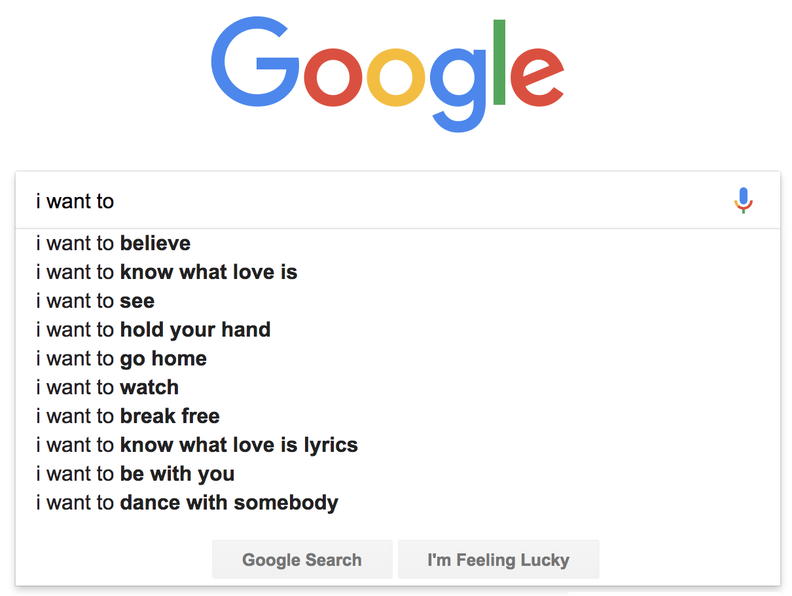
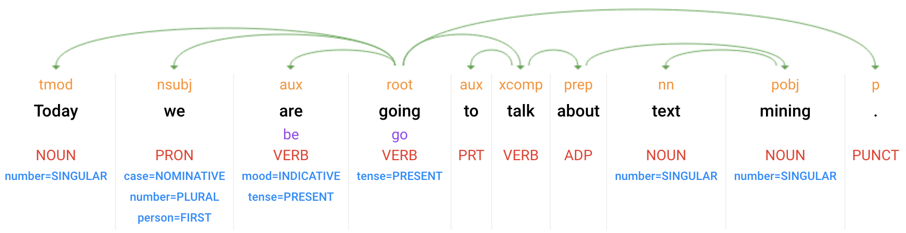
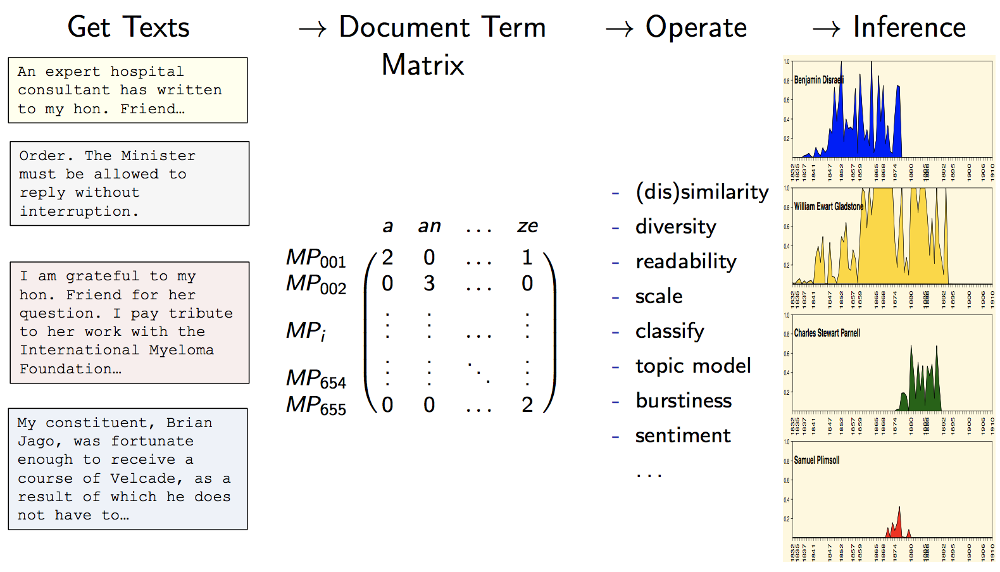
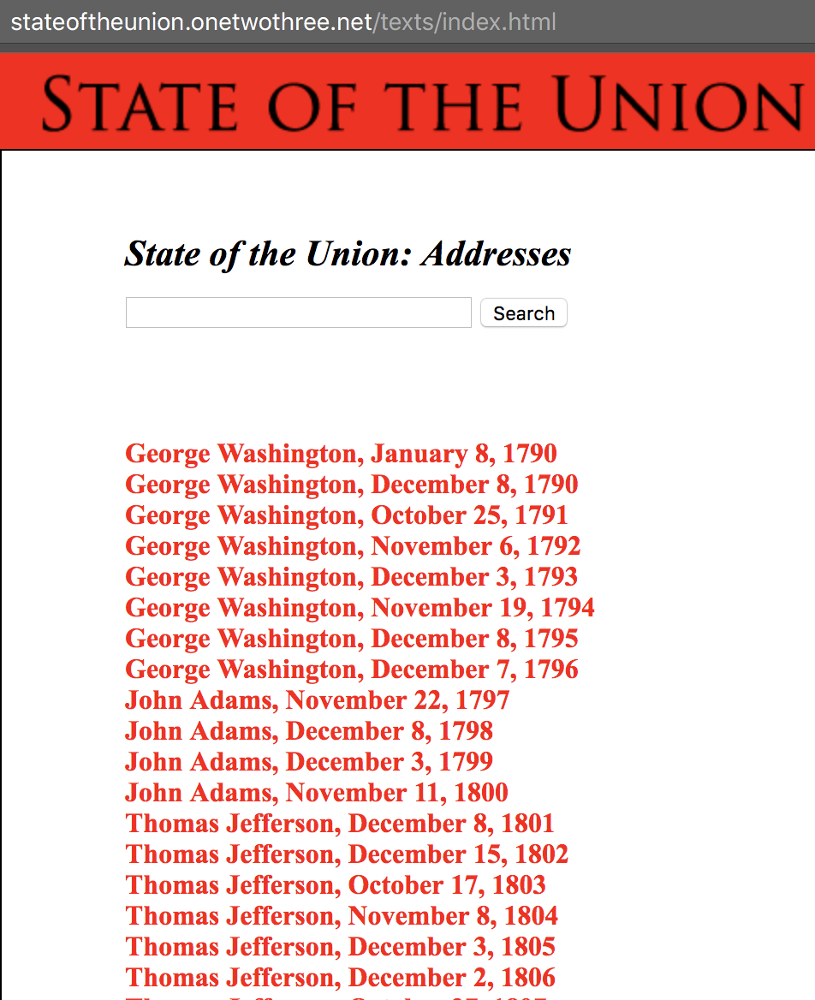
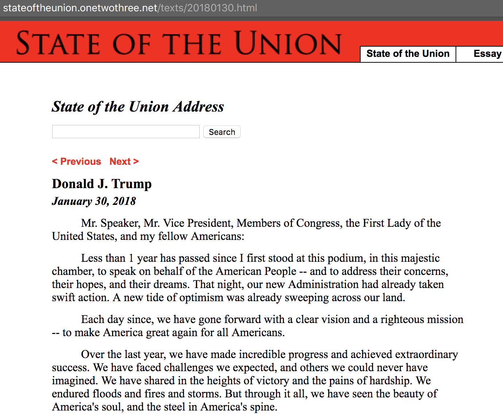
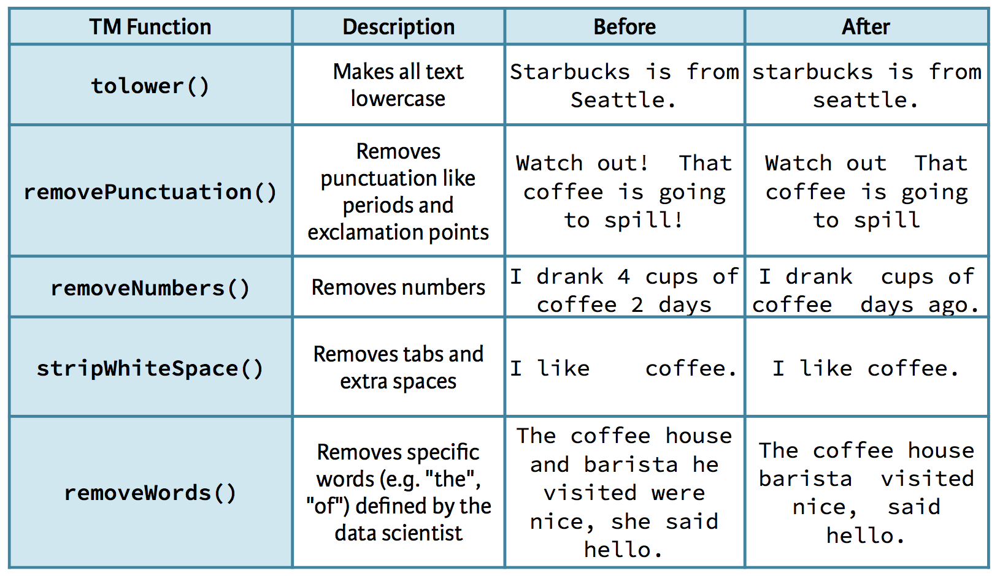
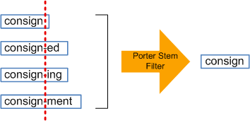
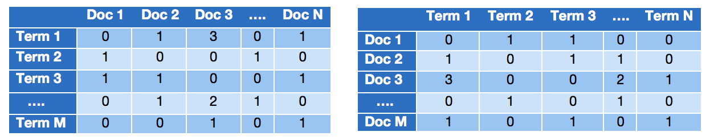
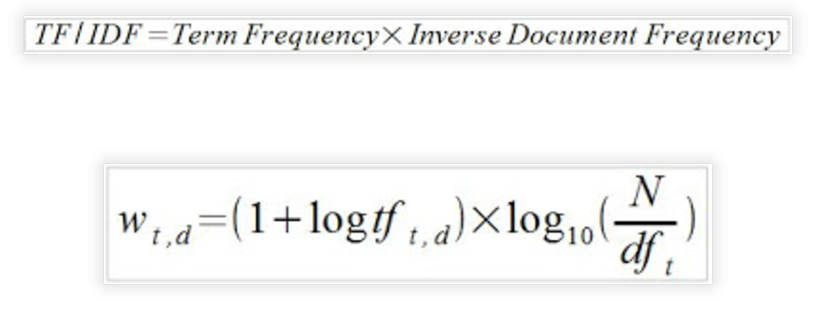

```{r packages, message = FALSE, warning = FALSE, echo=FALSE}
## Run / Install before executing slides

# Load packages.
packages <- c("devtools","knitr","tidyverse","widgetframe","readr",
              "wordcloud", "base64enc", "tm", "qdap",
              "qdapDictionaries", "tidytext", "rvest", "stringr", 
              "SnowballC", "plotrix", "tidyr", "stats", 
              "dendextend", "ggthemes", "readtext",
              "quanteda"
              )

packages <- lapply(packages, FUN = function(x) {
  if(!require(x, character.only = TRUE)) {
    install.packages(x)
  library(x, character.only = TRUE)
  }
}
)
```

```{r setup, include=FALSE}
library("knitr")
knitr::opts_chunk$set(echo = TRUE, eval=TRUE, 
                      message=FALSE, warning = FALSE,
                      fig.height=5, fig.width=9, cache = TRUE) 
options(htmltools.dir.version = FALSE)
```  


class: inverse, bottom, right
background-image: url(images/text-mining-icon.png)
background-size: 50%
background-position: 25% 30%

# Mining Text as Data

-- 

```{r, echo=FALSE, out.width = "20%"}

```


---

# Text as the new frontier of ...

**Data**  
- Lots of it (literally petabytes) on the web, not to mention archives.

--

**Methods**:
- **Unstructured data** needs to be harvested and modeled.
- Quantitative 'text-as-data' approaches as strategies to **learn more about social** scientific phenomena of interest.

--

**Social Science**  
- Politicians give speeches, thinkers write articles, nations sign treaties, users connect on Facebook  etc.

---

# Roadmap for Text Analysis and Visualization (2 lectures) 

1. Getting text and structuring it.
2. bag of words vs. ngrams
3. introduce popular packages: `tm`, `quanteda`, `tidytext`
4. sentiment analysis, identifying important words, topic modeling

**Our focus**: visualizing the results of some simple text mining approaches, including word clouds, dendrograms, frequency analyses, sentiments, topics etc.

---

# Text Mining

**Text mining**: the process of distilling **analytical insights from text**.

Basic idea: go from unorganized to organized state.

--

```{r, echo=FALSE, out.width = "70%"}

```

---

background-image: url(images/semantic_vs_bagofwords.png)
background-size: 90%
background-position: 50% 70%

# Semantic Parsing vs. Bag of Words


---

# Semantic Parsing vs. Bag of Words

Two basic approaches to text mining:

- **semantic parsing**: grammar is important; care of word type and order → creates a lot of features 

- **bag of words**: just care about the **individual words or sets of words**, no matter the type and order → we are going to focus on these types

--

```{r, echo=FALSE, out.width = "100%"}

```

.center[.small[Example of sentence parsing via [Google Cloud NLP API](https://cloud.google.com/natural-language/).]]


---

background-image: url(images/getcape_wearcape_fly.png)
background-size: 70%
background-position: 95% 95%

# What we won't cover here

Supervised and unsupervised machine learning on text, including most clustering techniques, classification, and prediction.

Complex tokenization.

Languages other than English.

The underlying statistical ideas of text mining.

---

background-image: url(images/data_analysis_funny_cartoon.gif)
background-size: 90%
background-position: 50% 98%

# **4 principles** of quantitative text analysis

1. All quantitative models of language are wrong — but some are useful.  

--
2. Quantitative methods for text amplify resources and augment humans. 

--
3. There is no globally best method for automated text analysis.  

--
4. Validate, Validate, Validate.  
.right[.small[<small>   Source: Grimmer and Stewart (2013)</small>]]


---

class: inverse, center, bottom
background-image: url(images/alphabet_beads.jpg)
background-size: 100%
background-position: 100% 100%


# Getting text and structuring it

---

# Sources for text

- There are lots of sources of (large-scale) text collection that can serve as the basis for research and analysis:

- existing corpora: e.g. [Google Books Ngrams](http://storage.googleapis.com/books/ngrams/books/datasetsv2.html), [Cobuild English corpus](http://www.collins.co.uk/category/English+Language+Teaching/COBUILD+Reference) (4.5 billion words), [Wikipedia Comporable Corpora](http://linguatools.org/tools/corpora/wikipedia-comparable-corpora/) (41 million Wikipedia articles in 253 languages), [Gutenberg Project](http://www.gutenberg.org/) (25,000 free books)

- electronic sources: Twitter, Facebook, political speeches, reviews on websites; web scraping for data acquisition, NYTimes, Google News, Yahoo Finance etc.

- undigitized text: OCR methods can help to digitize text and make it accessible (see for example [Archive.org](archive.org))

---

# From text to inference

```{r, echo=FALSE, out.width = "100%"}

```

<small><small>Arthur Spirling, EITM EUROPE, An Introduction to Text-as-Data. June 2016
</small></small>

---

background-image: url(images/robot-reading.jpg)
background-size: 30%
background-position: 95% 5%

# From Text to Numeric Data

<br> 
1. **collect raw text** in machine readable /   
electronic form.  
Decide what constitutes a _document_.
2. **strip away ‘superfluous’ material**:  
HTML tags, capitalization, punctuation,   
stop words etc.
3. cut document up into useful **elementary pieces**: _tokenization_.
4. add descriptive **annotations** that preserve context: _tagging_.
5. **map tokens back** to common form: _lemmatization_, _stemming_.
6. operate / model / **visualize**.

---

# Useful packages

[**tm** package](http://tm.r-forge.r-project.org/)  
Powerful text mining package with lots of functionalities to get text into R (from PDFs etc.) and work with it. The standard.

[**quanteda** package](http://docs.quanteda.io/)
A more modern contender built for efficiency and speed. Lots of tools and great documentation of its functionality with examples.

[**tidytext** package](https://www.tidytextmining.com/)
A tidy approach to text mining. Great effort though not all functionality is implemented yet.


```{r}
library(tm)       # Framework for text mining.
library(quanteda) # Another great text mining package
library(tidytext) # Text as Tidy Data (good for use with ggplot2)

```

---

class: inverse, center, bottom
background-image: url(images/SOTU_logo.jpg)
background-size: 100%
background-position: 0% 30%

# Analysing all State of the Union Addresses 1790 - 2020

---

class: inverse
background-image: url(images/sotu_trump.jpg)
background-size: 100%
background-position: 100% 120%

## Who watched the last State of Union Address?

---

# Web scraping all State of the Union Addresses

Often the text we want is online, but not yet in a single data file or the right format.

Web scraping is often a good way to get such text

**Example**: State of the Union Addresses from 1790 - 2020

---

# Source of the Text

We will use the texts published in this site:

http://stateoftheunion.onetwothree.net/texts/index.html

```{r, echo=FALSE, out.width = "33.5%"}

```
```{r, echo=FALSE, out.width = "49%"}

```

---

# Get the URLs we want to scrape

```{r, eval=FALSE}
library(rvest)     # Excellent package for web scraping
library(stringr)   # Good for working with strings

# Load the page
main.page <- read_html(
  "http://stateoftheunion.onetwothree.net/texts/index.html")

# Get Link URLs
urls <- main.page %>% 
  # get the relevant links
  html_nodes("#text > ul > li > a") %>%  
  # extract the URLs
  html_attr("href") %>%
  # back to absolute urls
  paste("http://stateoftheunion.onetwothree.net/texts/", 
        . , sep="") 
```

---

# Get each HTML file

```{r, eval=FALSE}
# Loop over each row in `sotu`
sotu.df <- data.frame(urls = urls, pres_name = NA, date = NA, 
                      text = NA,  stringsAsFactors = FALSE)

for(i in 1:dim(sotu.df)[1]) {
  file <- read_html(urls[i])
  sotu.df[i,"pres_name"] <- file %>% # load the current page
    html_nodes("h2") %>% # isolate the text 
    html_text() # get the text
    trimws() # trim white space
  # ... 
```

---

# Save each document as a text file

```{r, eval=FALSE}
# NOTE: Still part of the same loop; full loop in subsequent slide

# Save each SOU as a text file
  # Create the text file
  filename <- paste0("data/SOTU/texts/", 1000+i, 
                     sotu.df$pres_name[i], "-", 
                     sotu.df$year[i], ".txt")
  sink(file = filename) %>% # open file to write 
  cat(sotu.df[i,"text"])  # write the file
  sink() # close the file
  
# Reorder columns, save data frame
sotu.df <- sotu.df[,c("pres_name","year","date")]

library(readr)
write_csv(export, "data/SOTU/sotu.df.csv")
```

```{r, eval=FALSE, echo=FALSE}
## Full Loop from previous slides
library(rvest)     # Excellent package for web scraping
library(stringr)   # Good for working with strings

# Load the page
main.page <- read_html(
  "http://stateoftheunion.onetwothree.net/texts/index.html")

# Get Link URLs
urls <- main.page %>% 
  # get the relevant links
  html_nodes("#text > ul > li > a") %>%  
  # extract the URLs
  html_attr("href") %>%
  # back to absolute urls
  paste("http://stateoftheunion.onetwothree.net/texts/", 
        . , sep="") 

# Loop over each row in sotu
sotu.df <- data.frame(urls = urls, pres_name = NA, date = NA, 
                      text = NA,  stringsAsFactors = FALSE)

for(i in 1:dim(sotu.df)[1]) {
  file <- read_html(urls[i])
  sotu.df[i,"pres_name"] <- file %>% # load the current page
    html_nodes("h2") %>% # isolate the text
    html_text() %>% # get the text
    trimws()
  sotu.df[i,"date"] <- file %>% # load the page
    html_nodes("h3") %>% # isloate the text
    html_text()  # get the text  
  sotu.df[i,"year"] <- file %>% # load the page
    html_nodes("h3") %>% # isloate the text
    html_text() %>% # get the text  
    stringr::str_sub(-4,-1) # get year only
  sotu.df[i,"text"] <- file %>% # load the page
    html_nodes("p") %>% # isloate the text
    html_text()  %>% # get the text 
    paste(collapse = " ") %>% # Collapse to one text string
    gsub("[\r\n]", " ", .) # replace new lines with spaces
  
  # Create the text file
  filename <- paste0("data/SOTU/texts/", 1000+i, "_", sotu.df$pres_name[i], "_", sotu.df$year[i], ".txt")
  sink(file = filename) %>% # open file to write 
  cat(sotu.df[i,"text"])  # write the file
  sink() # close the file
  
  print(i)
}

# Reorder columns, save data frame
sotu.df <- sotu.df[,c("pres_name","year","date")]

library(readr)
write_csv(sotu.df, "data/SOTU/sotu.df.csv")
```

---

# Get other meta data: _president's party_

```{r, echo=FALSE, eval=FALSE}
presidents_party <- read_csv("https://gist.githubusercontent.com/namuol/2657233/raw/74135b2637e624848c163759be9cd14ae33f5153/presidents.csv")
write_csv(presidents_party, "presidents_party.csv")
```


```{r, eval=TRUE}
# Read in Data part
sotu.df <- read_csv("data/SOTU/sotu.df.csv")

# Add party info
party <- read.csv("data/SOTU/presidents_party.csv")
party <- party[,c("Presidency","President","Took.office",
                  "Left.office","Party")]

# Correct some names to match
party$President <- gsub("James K. Polk", "James Polk", party$President)
party$President <- gsub("William Howard Taft", "William H. Taft", party$President)
party$President <- gsub("Warren G. Harding", "Warren Harding", party$President)
party$President <- gsub("Gerald Ford", "Gerald R. Ford", party$President)
party$President <- gsub("George H. W. Bush", "George H.W. Bush", party$President)
party$President <- gsub("Bill Clinton", "William J. Clinton", party$President)
party$President <- gsub("Barack Obama", "Barack Obama", party$President)

sotu.df$party <- party[match(tolower(sotu.df$pres_name),
                             tolower(party$President)),"Party"]

# Add Donald Trump
sotu.df[sotu.df$pres_name == "Donald J. Trump", "party"] <- "Republican"
```

---

# Make corpus with meta data

# Create a Corpus

`Tidytext` is nice but it still does not have the full functionality of text analysis packages like `tm()` or `quanteda()`.

```{r message=FALSE, warning=FALSE}
# Convert to Corpus object (in the tm() package)
library(tm)
# Create Corpus
sotu <- VCorpus(DirSource("data/SOTU/texts/"))

NLP::meta(sotu) <- sotu.df[1:length(sotu),]

# Add data frame to Corpus
# Index of the metadata for a document in the corpus in   
# meta(sotu, type="local", tag="author") <- sotu.df$pres_name
# meta(sotu, type="local", tag="year")   <- sotu.df$year
# meta(sotu, type="local", tag="party")  <- sotu.df$party
```

```{r eval=FALSE, echo=FALSE}
#### For Quanteda package #####
# Create corpus
sotu_quanteda <- readtext::readtext(paste0("data/SOTU/texts/", "*.txt"),
                  docvarsfrom = "filenames", 
                  docvarnames = c("doc_id", "president", "year"),
                  dvsep = "_")
```

Note: We will stick with the **tm** package here, but feel free to use whichever you find more convenient. 
---

# Corpus object

```{r}
# Print out sotu corpus
sotu
# Print data on the 15th SOU
sotu[[15]]$content
```

```{r eval=FALSE, include=FALSE}
##### For Quanteda package #####
names(sotu_quanteda)
```

---

# Corpus object

```{r,eval=FALSE, null_prefix=TRUE}
# Print the content of the 15th tweet in SOU corpus, i.e the text
sotu[[15]]$content
```

```{r, eval=TRUE, echo=FALSE, null_prefix=TRUE}
# Print the content of the 15th tweet in SOU corpus, i.e the text
strwrap(sotu[[15]]$content, width=55)[1:10]
```

---

# Make a Corpus from a data frame

<!--- Jayz (Author1), 2Pac (Author2) --->
```{r}
# Make example data frame
line = rep(1:3,2)
doc_id = c(rep(1,3),rep(2,3))
Author1 = c("Jealousy’s a weak emotion.",
            "We change people through conversation, 
              not through censorship.",
            "I'm a hustler, baby; I sell water to a well!")
Author2 = c("They Have Money For War But Can't Feed The Poor.",
            "Fear is stronger than love",
            "I didn't choose the thug life, 
              the thug life chose me.")
  
example_text <- data.frame(doc_id, text = c(Author1, Author2),
                           line, stringsAsFactors = FALSE)
```

--

```{r, echo=FALSE, out.width = "50%"}

```


---

# Make a Corpus from a data frame


```{r}
# Create a DataframeSource from df_source
# data frame source interprets each row of the 
# data frame x as a document.
df_source <- DataframeSource(example_text)

# Convert df_source to a corpus: df_corpus
## Note: there are two types (VCopus vs PCorpus)
df_corpus <- VCorpus(df_source)

# Examine df_corpus
df_corpus
```


```{r eval=FALSE, include=FALSE}
##### For Quanteda package #####
example_corpus_quanteda <- corpus(example_text)
summary(example_corpus_quanteda)
```


---

# Cleaning and preprocessing text

The `tm` packages contains a number of **pre-processing functions**. 

Five functions built in; can use any others as well (including self-created functions).

```{r}
getTransformations()
```

---

# Cleaning and preprocessing text

```{r, echo=FALSE, out.width = "100%"}

```


---

# Example: Cleaning text

```{r, eval=FALSE, null_prefix=TRUE}
# Create the object: text
text <- "<b>She</b> woke up at       6 A.M. It\'s so early! 
She was only 10% awake and began eating breakfast in 
front of her computer (not healthy!)."

# All lowercase
tolower(text)
```

```{r, echo=FALSE, null_prefix=TRUE}
text <- "<b>She</b> woke up at       6 A.M. It\'s so early! 
She was only 10% awake and began eating breakfast in 
front of her computer (not healthy!)."

# All lowercase
strwrap(tolower(text))
```

```{r, eval=FALSE, null_prefix=TRUE}
# Remove punctuation
removePunctuation(text)
```

```{r, echo=FALSE, null_prefix=TRUE}
# Remove punctuation
strwrap(removePunctuation(text))
```

---

# Example: Cleaning text

```{r, eval=FALSE}
# Remove numbers
removeNumbers(text)
```
```{r, echo=FALSE, null_prefix=TRUE}
# Remove numbers
strwrap(removeNumbers(text))
```

```{r, eval=FALSE}
# Remove whitespace
stripWhitespace(text)
```
```{r, echo=FALSE, null_prefix=TRUE}
# Remove whitespace
strwrap(stripWhitespace(text))
```

---

# Using the **qdap** package

Additional useful functions are available in the `qdap` package:
  - `bracketX()`: Remove all text within brackets (e.g. "It's (so) cool" becomes "It's cool")
  - `replace_number()`: Replace numbers with their word equivalents (e.g. "2" becomes "two")
  - `replace_abbreviation()`: Replace abbreviations with their full text equivalents (e.g. "Sr" becomes "Senior")
  - `replace_contraction()`: Convert contractions back to their base words (e.g. "shouldn't" becomes "should not")
  - `replace_symbol()` Replace common symbols with their word equivalents (e.g. "$" becomes "dollar")

---

# Using the **qdap** and **qdapRegex** packages

```{r, eval=FALSE}
# Remove text within brackets
bracketX(text)
```
```{r, echo=FALSE, null_prefix=TRUE}
# Remove text within brackets
strwrap(bracketX(text))
```

```{r, eval=FALSE}
# Replace numbers with words
replace_number(text)
```
```{r, echo=FALSE, null_prefix=TRUE}
# Replace numbers with words
strwrap(replace_number(text))
```

```{r, eval=FALSE}
# Replace abbreviations
replace_abbreviation(text)
```
```{r, echo=FALSE, null_prefix=TRUE}
# Replace abbreviations
strwrap(replace_abbreviation(text))
```

---

# Using the **qdap** and **qdapRegex** packages


```{r, eval=FALSE}
# Replace contractions
replace_contraction(text)
```
```{r, echo=FALSE, null_prefix=TRUE}
# Replace contractions
strwrap(replace_contraction(text))
```

```{r, eval=FALSE}
# Replace symbols with words
replace_symbol(text)
```
```{r, echo=FALSE, null_prefix=TRUE}
# Replace symbols with words
strwrap(replace_symbol(text))
```

---

background-image: url(images/stopwords.jpg)
background-size: 40%
background-position: 100% 100%

# Removing stop words

**Stop words** are common English stop words which are usually filtered out before or after processing text. 

They include "I", "she'll", "the", etc. In the `tm` package, there are 174 stop words on this common list.

```{r}
# List standard English stop words
stopwords("en")[1:5]
```

---

# Removing stop words

```{r, eval=FALSE}
# Print text without standard stop words
removeWords(text, stopwords("en"))
```
```{r, echo=FALSE, null_prefix=TRUE}
# Print text without standard stop words
strwrap(removeWords(tolower(text), stopwords("en")))
```

```{r, eval=FALSE}
# Print text without standard stop words
removeWords(text, stopwords("en"))
```
```{r, echo=FALSE, null_prefix=TRUE}
# Print text without standard stop words
strwrap(removeWords(text, stopwords("en")))
```

---

# Removing stop words

```{r, eval=FALSE}
# Add "breakfast" and "lunch" to the list: new_stops
new_stops <- c("breakfast", "lunch", stopwords("en"))

# Remove stop words from text
removeWords(text, new_stops)
```
```{r, echo=FALSE, null_prefix=TRUE}
# Add "breakfast" and "lunch" to the list: new_stops
new_stops <- c("breakfast", "lunch", stopwords("en"))

# Remove stop words from text
strwrap(removeWords(tolower(text), new_stops))
```

In general, it is helpful to consider **domain specific stopwords**.

---

# Word stemming and stem completion

```{r, echo=FALSE, out.width = "100%"}

```

---

# Word stemming and stem completion

```{r}
library(SnowballC)
# Create complicate
complicate <- c("complicated", "complication", "complicatedly")

# Perform word stemming: stem_doc
stem_doc <- stemDocument(complicate)

# Create the completion dictionary: comp_dict
comp_dict <- "complicate"

# Perform stem completion: complete_text 
complete_text <- stemCompletion(stem_doc, comp_dict)

# Print complete_text
complete_text
```

---

# **Word stemming** and stem completion on a sentence

```{r, results='hold'}
text_data <- "In a complicated haste, Tom rushed to fix a new 
complication, too complicatedly."
# Remove punctuation: rm_punc
rm_punc <- removePunctuation(text_data)
# Create character vector: n_char_vec
n_char_vec <- unlist(strsplit(rm_punc, split = ' '))
# Perform word stemming: stem_doc
stem_doc <- stemDocument(n_char_vec)
# Print stem_doc
stem_doc
```

---

# Word stemming and **stem completion** on a sentence

```{r}
# Re-complete stemmed document: complete_doc
complete_doc <- stemCompletion(stem_doc, comp_dict)

# Print complete_doc
complete_doc
```

---

# Apply preprocessing steps to a corpus

- The `tm` package provides a special function `tm_map()` to apply cleaning functions to a corpus.

- Since we apply these functions potentially to many corpora, we can create a custom `clean_corpus()` function which takes one argument, `corpus`, and applies a series of cleaning functions to it in order, then returns the final result.

- The five function in the `tm` package do not need `content_transformer()`, but base R and `qdap` functions do.

---

# Apply preprocessing steps to a corpus

```{r}
# You can add your own functions as well - careful!
removeNumPunct <- function(x){gsub("[^[:alpha:][:space:]]*", "", x)}

clean_corpus <- function(corpus){
# corpus <- tm_map(corpus, removePunctuation)
  corpus <- tm_map(corpus, content_transformer(tolower))
  corpus <- tm_map(corpus, content_transformer(replace_symbol))
  corpus <- tm_map(corpus, removeWords, c(stopwords("en")))  
    # We could add more stop words as above
  corpus <- tm_map(corpus, removeNumbers)
  corpus <- tm_map(corpus, content_transformer(removeNumPunct))
  corpus <- tm_map(corpus, stripWhitespace)
  return(corpus)
}

# Apply your customized function to the SOTU: sotu_clean
sotu_clean <- clean_corpus(sotu)
```

---

background-image: url(images/caution.png)
background-size: 20%
background-position: 95% 5%


# Note of caution

**Order matters** in this cleaning process:
  - e.g. removing `$` through `removeNumPunct`  
  first will leave no symbols to be transformed   
  by `replace_symbol`

**Validate** that your cleaning process works on your data.

---

# Apply preprocessing steps to a corpus

```{r, eval=FALSE}
# Print out a cleaned up SOTU
sotu_clean[[15]][1]
```
```{r, echo=FALSE, null_prefix=TRUE}
# Print out a cleaned up SOTU
strwrap(sotu_clean[[15]][1])[1:3]
```

```{r, eval=FALSE}
# And compare with orginal text 
sotu[[15]][1]
```
```{r, echo=FALSE, null_prefix=TRUE}
# And compare with orginal text 
strwrap(sotu[[15]][1])[1:3]
```


---

# Stemming a corpus

```{r, eval=FALSE}
library(SnowballC)    
# Stem all words
sotu_stemmed <- tm_map(sotu_clean, stemDocument)

# Show one example
sotu_stemmed[[15]]$content
```

```{r, echo=FALSE, null_prefix=TRUE}
library(SnowballC)    
# Stem all words
sotu_stemmed <- tm_map(sotu_clean, stemDocument)

# Show one example
strwrap(sotu_stemmed[[15]]$content)[1:3]
```


---

# Completing the stems to full words for a corpus

```{r}
# Complete with clean corpus as dictionary
# sotu_compl <- tm_map(sotu_stemmed, 
#                  stemCompletion(sotu_stemmed, 
#                  dictionary = sotu_clean))  -> shows error

# Note: Function tm::stemCompletion() shows an error. 
# Instead, here is a small loop around the stem completion function:

# Stem completion
stemCompletion2 <- function(x, dictionary) {
   x <- unlist(strsplit(as.character(x), " "))
    # # Oddly, stemCompletion completes an empty string to
	  # a word in dictionary. Remove empty string to avoid issue.
   x <- x[x != ""]
   x <- stemCompletion(x, dictionary=dictionary)
   x <- paste(x, sep="", collapse=" ")
   PlainTextDocument(stripWhitespace(x))
}
```

---

# Completing the stems to full words for a corpus

```{r}
# one speech only
sotu_comp <- lapply( sotu_clean[100], stemCompletion2, 
                     dictionary=sotu_clean)
```

```{r, eval=FALSE}
# Print sotu_comp content
sotu_comp[[1]]$content
```

```{r, echo=FALSE, null_prefix=TRUE}
# Print sotu_comp content
strwrap(sotu_comp[[1]]$content)[1:3]
```


```{r, include=FALSE, eval=FALSE, echo=FALSE}
# For all SOTU speeches -> Really slow!
library(parallel)
library(pbapply)  # to see progress bar for apply()

# Calculate the number of cores
no_cores <- detectCores() - 1
 
# Initiate cluster
start.time <- Sys.time()

sotu_comp_all <- mclapply(sotu_stemmed, 
                          stemCompletion2, 
                          dictionary = sotu_clean, 
                          mc.cores=no_cores)

end.time <- Sys.time()
time.taken <- end.time - start.time
time.taken 
 ## 41 min!!

save(sotu_comp_all, file = "data/SOTU/sotu_comp_all.RData")
save.image("data/SOTU/sotu_comp_all_image.RData")
```

---

# Completing the stems to full words for a corpus

Completing all stemmed words turns out to be computing intensive (~38 min on my laptop), though the command could be improved.

```{r, eval=FALSE}
load("data/SOTU/sotu_comp_all.RData")
sotu_comp_all <- as.VCorpus(sotu_comp_all)
```


```{r, echo=FALSE}
load("data/SOTU/sotu_comp_all.RData")

# Re-attach metadata to Corpus
sotu.df[] <- lapply(sotu.df, as.character)

for (i in 1:length(sotu_comp_all)){
  sotu_comp_all[[i]]$meta$author <- sotu.df[i,"pres_name"]
  sotu_comp_all[[i]]$meta$year <- sotu.df[i,"year"]
  sotu_comp_all[[i]]$meta$party <- as.character(sotu.df[i,"party"])
  sotu_comp_all[[i]]$meta$id <- paste(sotu.df[i,"pres_name"],
                                  sotu.df[i,"year"],
                                  as.character(sotu.df[i,"party"]),
                                  sep="_")
}

sotu_comp_all <- as.VCorpus(sotu_comp_all)

```


---

# Change to a data format 

Term Document Matrix (TDM) vs. Document Term Matrix (DTM)

```{r, echo=FALSE, out.width = "100%"}

```


---

# Make a Document-Term-Matrix

```{r, eval=TRUE}
# Create the dtm from the corpus: sotu_comp_all
sotu_dtm <- DocumentTermMatrix(sotu_comp_all)  

# Print out sotu_dtm data
sotu_dtm
```

---

# Make a Document-Term-Matrix

```{r, eval=TRUE}
# Convert sotu_dtm to a matrix: sotu_m
sotu_m <- as.matrix(sotu_dtm)

# Print the dimensions of sotu_m
dim(sotu_m)

# Review a portion of the matrix
sotu_m[1:3, 1014:1016]
```

---

# Make a term document matrix (TDM)

```{r}
# Create a TDM from clean_corp: sotu_tdm
sotu_tdm <- TermDocumentMatrix(sotu_comp_all)

# Print sotu_tdm data
sotu_tdm
```

---

# Make a term document matrix (TDM)

```{r}
# Convert sotu_tdm to a matrix: sotu_m
sotu_m <- as.matrix(sotu_tdm)

# Print the dimensions of the matrix
dim(sotu_m)

# Review a portion of the matrix
sotu_m[1727:1729,1:3]
```

---

class: inverse, center, middle

# Visualizing text data

---

background-image: url(images/cover_text_mining_with_r.png)
background-size: 40%
background-position: 85% 50%


# **Tidytext** package

.pull-left[

`tm` and `qdap` both include several plotting functions.

If we want to continue using `ggplot2` for most of our plots, we need to **convert from corpus/TDM/DTM to a tidy dataframe object**.

The `tidytext` package helps us with the transformation


]

.pull-right[

]

---

# Tidying Objects

```{r, message=FALSE, warning=FALSE}
sotu_td <- tidy(sotu_tdm)
head(sotu_td)
```


---

# Tidying Objects

```{r, message=FALSE, warning=FALSE}
# Get meta data
meta <- as_data_frame(str_split_fixed(sotu_td$document, "_", n=3))
colnames(meta) <- c("president", "year", "party")
  
# Merge on
sotu_td <- as_data_frame(cbind(sotu_td, meta))

# Show
sotu_td  # note: only the non-zero values are included
```

---

# Frequent Terms

```{r, eval=FALSE, echo=TRUE, message=FALSE, warning=FALSE, fig.height=6}
sotu_td %>%     group_by(term) %>%
                summarise(n = sum(count)) %>%
                top_n(n = 15, wt = n)  %>%
                ungroup() %>%
                mutate(term = reorder(term, n)) %>%
ggplot(aes(term, n)) + 
  geom_bar(stat = "identity") + 
  geom_text(aes(label=term, x=term, y=300), hjust = 0, color="white") +
  geom_text(aes(label=n, x=term, y=n-100), hjust = 1, color="white") +
  xlab(NULL) +  coord_flip() + theme_fivethirtyeight() +
  theme(axis.title.y=element_blank(), 
        axis.text.y=element_blank(), 
        axis.ticks.y=element_blank()) +
  ggtitle("Most frequent terms in the State of the Union")
```

---

# Frequent Terms

```{r, eval=TRUE, echo=FALSE, message=FALSE, warning=FALSE, fig.height=6}
sotu_td %>%     group_by(term) %>%
                summarise(n = sum(count)) %>%
                top_n(n = 15, wt = n)  %>%
                ungroup() %>%
                mutate(term = reorder(term, n)) %>%
ggplot(aes(term, n)) + geom_bar(stat = "identity") + 
  geom_text(aes(label=term, x=term, y=300), hjust = 0, color="white") +
  geom_text(aes(label=n, x=term, y=n-100), hjust = 1, color="white") +
  xlab(NULL) +  coord_flip() + theme_fivethirtyeight() + theme(axis.title.y=element_blank(), axis.text.y=element_blank(), axis.ticks.y=element_blank()) +
  ggtitle("Most frequent terms in the State of the Union")
```

---

# Measuring Word Importance 

- **Term Frequency (TF)**: How often does a word appear in a document. Often normalized in some way with respect to the document length, 
- **Document Frequency (DF)**: Number of documents in the collection that contain a term _t_. Idea is that rare terms are more informative than frequent terms.
- **Inverse Document Frequency (IDF)** =  log(total number of documents in a collection / document frequency)

---

# Measuring Word Importance 

**Term Frequency TF**:
.small[
- The word with the **highest term frequency** is _states_ making up 2.9 to 3.2% of the words in three presidential addresses (Franklin Pierce, Andrew Johnson, George Washington). 
- The **highest count overall** is _year_ in Harry S. Truman's much longer 1946 address.  
  ]
  
--

**Document Frequency DF**: 
.small[
  - _nation_ and _states_ appear **in all 234 SOTU addresses**. _can_, _congress_, _countries_, _government_, _time_, and _united_ in 230.  
- Ronald Reagan (1982) was the only SOTU **without mentioning the _United States_**
]

--

**Inverse Document Frequency IDF**: 
.small[
  - **Rare words** occuring several times in few documents, are _Obamacare_ in Trumps 2017 address (5x), or _Chickamaugas_ in Washington's 1792 address.  
]

--

So which one of these is the **best summary of the data**?

```{r, echo=FALSE, include=FALSE, eval=FALSE}
## FROM BELOW:
sotu_tf_idf <-  sotu_td %>%
                bind_tf_idf(term, document, count) %>%  # Bind the term frequency and inverse document frequency of a tidy text dataset to the dataset
                arrange(desc(tf_idf)) 

# Term Frequency
sotu_tf_idf %>% arrange(desc(tf))  %>% top_n(n = 10, wt = tf)
sotu_tf_idf %>% arrange(desc(count))  %>% top_n(n = 10, wt = count)

# Document Frequency
X <- as.matrix(sotu_tdm)
dim(sotu_tdm)
X$rowsums <- apply(X, 1, function(c)sum(c!=0))
sort(X$rowsums, decreasing = TRUE)[1:10]

X <- NULL

# Inverse Document Frequency
sotu_tf_idf %>% arrange(desc(idf))  %>% top_n(n = 10, wt = idf)

```

---

# TF-IDF 

- The TF-IDF combines the _term frequency (TF)_ and the _inverse document frequency (IDF)_ into a single numerical value. 
- Decreases the weight for commonly used words and increases the weight for words that are not used very much in a collection of documents.
- Several formulas, but here is one:

```{r, echo=FALSE, out.width = "70%"}

```


---

# TF-IDF 

```{r, echo=FALSE, out.width = "85%"}
knitr::include_graphics("images/TD_IDF_graph.jpg")
```

---

# Calculating Frequencies

```{r, eval=FALSE, null_prefix=TRUE}
# Bind the TF,DF, and IDF frequency
# of a tidy text dataset to the dataset
sotu_tf_idf <-  sotu_td %>%
                bind_tf_idf(term, document, count) %>%  
                arrange(desc(tf_idf)) 
sotu_tf_idf
```

---

# Calculating Frequencies

```{r, eval=TRUE, echo=FALSE}
# Bind the TF,DF, and IDF frequency
# of a tidy text dataset to the dataset
sotu_tf_idf <-  sotu_td %>%
                bind_tf_idf(term, document, count) %>%  
                arrange(desc(tf_idf)) 
sotu_tf_idf[1:10,c("term","year","count","tf","idf","tf_idf")]
```

---

# Most Frequent Terms by President

```{r, eval=FALSE}
sotu_tf_idf %>% group_by(president) %>%
                top_n(n = 1, wt = tf_idf)  %>%
                filter(year>1970) %>%
ggplot(aes(x = reorder(term, desc(year)), y = tf_idf)) +
  geom_bar(stat = "identity") + 
  geom_text(aes(label=president, x=term, y=0.005), color="white") +
  xlab(NULL) +  coord_flip() + theme_fivethirtyeight()
```

---

# Most Frequent Terms by President

```{r, echo=TRUE, fig.height=4}
sotu_tf_idf %>% group_by(president) %>%
                top_n(n = 1, wt = tf_idf)  %>%
                filter(year>1960) %>%
ggplot(aes(x = reorder(term, desc(year)), y = tf_idf)) +
  geom_bar(stat = "identity") + 
  geom_text(aes(label=president, x=term, y=0.005), color="white") +
  xlab(NULL) +  coord_flip() + theme_fivethirtyeight()
```

---

# Top Words in Selected Speeches

```{r, echo=TRUE, eval=FALSE}
sotu_tf_idf %>% 
  filter(!(term %in% c("tonight","dont"))) %>%
  filter(president== "Donald J. Trump" & year==2020 | 
        (president=="Barack Obama" & year==2012)) %>% 
  group_by(president) %>% 
  top_n(n = 10, wt = tf_idf) %>%
  arrange(tf_idf) %>% 
  mutate(term = factor(term, term)) %>%
ggplot(aes(x = reorder(term, desc(-tf_idf)), y = tf_idf)) +
  geom_bar(stat = "identity") + coord_flip() +
  facet_wrap(~ document, scales="free_y") + 
  xlab(NULL) + ylab("Most important words (TF-IDF)") + 
  theme_fivethirtyeight()
```

---

# Top Words in Selected Speeches

```{r, echo=FALSE, eval=TRUE}
sotu_tf_idf %>% 
  filter(!(term %in% c("tonight","dont"))) %>%
  filter(president== "Donald J. Trump" & year==2020 | 
        (president=="Barack Obama" & year==2012)) %>% 
  group_by(president) %>% 
  top_n(n = 10, wt = tf_idf) %>%
  arrange(tf_idf) %>% 
  mutate(term = factor(term, term)) %>%
ggplot(aes(x = reorder(term, desc(-tf_idf)), y = tf_idf)) +
  geom_bar(stat = "identity") + coord_flip() +
  facet_wrap(~ document, scales="free_y") + 
  xlab(NULL) + ylab("Most important words (TF-IDF)") + theme_fivethirtyeight()
```

---

# Words over time

```{r, message=FALSE, warning=FALSE, eval=FALSE}
sotu_td %>% mutate(year = as.numeric(year)) %>%
  group_by(year) %>%
  mutate(year_total = sum(count)) %>%  # Get counts by year 
  filter(term %in% c("god", "america", "union", "war", "world", 
                     "constitution", "freedom")) %>%
ggplot(aes(year, count / year_total)) +
  geom_point() +  geom_smooth() +
  facet_wrap(~ term, scales = "free_y") +
  scale_y_continuous(labels = scales::percent_format()) +
  scale_x_continuous(breaks = c(1800,1850,1900,1950,2000)) +
  ylab("% frequency of word in state of union address") + 
  xlab(NULL)
```

---

# Words over time

```{r, echo=FALSE,message=FALSE, warning=FALSE}
sotu_td %>% mutate(year = as.numeric(year)) %>%
  group_by(year) %>%
  mutate(year_total = sum(count)) %>%  # Get counts by year 
  filter(term %in% c("god", "america", "union", "war", "world", "constitution", "freedom")) %>%
ggplot(aes(year, count / year_total)) +
  geom_point() +  geom_smooth() +
  facet_wrap(~ term, scales = "free_y") +
  scale_y_continuous(labels = scales::percent_format()) +
  scale_x_continuous(breaks = c(1800,1850,1900,1950,2000)) +
  ylab("% frequency of word in state of union address") + 
  xlab(NULL)
```

---

# Summary: Word Frequency

- have discussed three indicators to get a word frequency: TF, DF, and TF-IDF
- there are many more sophisticated ways to calculate what words are describing a document AND which documents are best matches for a word/phrase (think search engines)
- for more info see: 
    - Manning, C. D., Raghavan, P., & Schütze, H. (2008). Introduction to Information Retrieval (1 edition). Cambridge University Press. Free at  http://nlp.stanford.edu/IR-book/

---

# Word Clouds

We can also generate a **word cloud** as an effective alternative to providing a quick visual overview of the frequency of words in a corpus.

**Drawback**: only "guestimate" information for the reader, so more a visual cue than actual information.

---

# Simple Word Cloud

```{r, echo=FALSE, message=FALSE, warning=FALSE}
## need term_frequency for the package
term_frequency_DT <-
  sotu_tf_idf %>% filter(president == "Donald J. Trump") %>% filter(year == 2020)

# Load wordcloud package
library(wordcloud)

# Set seed - to make your word cloud reproducible 
set.seed(2103)

# Create a wordcloud for the values in word_freqs
wordcloud(term_frequency_DT$term, term_frequency_DT$tf, 
         max.words = 100, colors = "red")
```


---

# Simple Word Cloud

```{r, eval=FALSE, message=FALSE, warning=FALSE}
## need term_frequency for the package
term_frequency_DT <- sotu_tf_idf %>% filter(president=="Donald J. Trump") %>% filter(year==2020)

# Load wordcloud package
library(wordcloud)

# Set seed - to make your word cloud reproducible 
set.seed(2103)

# Create a wordcloud for the values in word_freqs
wordcloud(term_frequency_DT$term, term_frequency_DT$tf, 
         max.words = 100, colors = "red")
```


---

# Simple Word Cloud - TF-IDF

```{r, eval=TRUE, echo=FALSE, message=FALSE, warning=FALSE}
## need term_frequency for the package
term_frequency_DT <- sotu_tf_idf %>% 
  filter(president=="Donald J. Trump") %>%
  filter(year == 2020)

# Load wordcloud package
library(wordcloud)

# Set seed - to make your word cloud reproducible 
set.seed(2103)

# Create a wordcloud for the values in word_freqs
wordcloud::wordcloud(term_frequency_DT$term, term_frequency_DT$tf_idf, 
          max.words = 100, colors = "red")
```

---

# Simple Word Cloud - TF-IDF - remove terms

```{r, eval=FALSE, echo=TRUE, message=FALSE, warning=FALSE}
# Drop the names and some words from the list
library(babynames)
term_frequency_DT2 <- term_frequency_DT %>% 
  filter(!term %in% tolower(babynames$name)) %>%
  filter(!term %in% c('tonight'))

set.seed(1)
# Create a wordcloud for the values in word_freqs
wordcloud(term_frequency_DT2$term, term_frequency_DT2$tf_idf, 
        max.words = 100, colors = "blue")
```

---

# Simple Word Cloud - TF-IDF - remove terms

```{r, eval=TRUE, echo=FALSE, message=FALSE, warning=FALSE}
# Drop the names and some words from the list
library(babynames)
term_frequency_DT2 <- term_frequency_DT %>% filter(!term %in% tolower(babynames$name)) %>%  filter(!term %in% c('tonight', 'yearold'))

set.seed(1)
# Create a wordcloud for the values in word_freqs
wordcloud(term_frequency_DT2$term, term_frequency_DT2$tf_idf, 
        max.words = 100, colors = "blue")
```

---

# Change Word cloud colors

```{r, eval=FALSE, message=FALSE, warning=FALSE}
# List the available colors
# display.brewer.all()

# Create purple_orange
purple_orange <- brewer.pal(10, "PuOr")
# Drop 2 faintest colors
purple_orange <- purple_orange[-(1:2)]

# Create a wordcloud with purple_orange palette
wordcloud(term_frequency_DT2$term, term_frequency_DT2$tf_idf, 
      max.words = 100, colors = purple_orange)
```

---

# Change Word cloud colors

```{r, echo=FALSE, message=FALSE, warning=FALSE}
# List the available colors
# display.brewer.all()

# Create purple_orange
purple_orange <- brewer.pal(10, "PuOr")
# Drop 2 faintest colors
purple_orange <- purple_orange[-(1:2)]

# Create a wordcloud with purple_orange palette
wordcloud(term_frequency_DT2$term, term_frequency_DT2$tf_idf, 
      max.words = 100, colors = purple_orange)
```

---

# Comparing different sets of text

To visualize **common words across multiple documents**, we can use `commonality.cloud()`.

The command allows us to plot a cloud of words shared across documents

---

# Visualize common words

```{r, eval=FALSE, message=FALSE, warning=FALSE}
# Let's limit it to Trump (2020) vs. Obama (2012)
tdm_sel <- sotu_tdm[,c(226,234)]

# Convert the Term-Document-Matrix
all_m <- as.matrix(tdm_sel)

# Print a commonality cloud: Obama vs. Trump
commonality.cloud(all_m, colors = purple_orange, max.words = 100)
```

---

# Visualize common words

```{r, eval=TRUE, echo=FALSE, message=FALSE, warning=FALSE}
# Let's limit it to Trump (2020) vs. Obama (2012)
tdm_sel <- sotu_tdm[,c(226,234)]

# Convert the Term-Document-Matrix
all_m <- as.matrix(tdm_sel)

# Print a commonality cloud: Obama vs. Trump
commonality.cloud(all_m, colors = purple_orange, max.words = 100)
```

---

# Visualize dissimilar words

```{r, eval=FALSE,message=FALSE, warning=FALSE}
# Create comparison cloud
comparison.cloud(all_m, colors = c("orange", "blue"), 
                 scale=c(0.1,2), title.size= 1, 
                 max.words = 100)
```

---

# Visualize dissimilar words

```{r, echo=FALSE,message=FALSE, warning=FALSE}
# Create comparison cloud
comparison.cloud(all_m, colors = c("orange", "blue"), scale=c(0.1,2), title.size	
= 1, max.words = 100)
```

---

# Pyramid Plot

```{r, eval=TRUE, echo=FALSE, message=FALSE, warning=FALSE}
library(plotrix)
# Create common_words
common_words <- subset(all_m, all_m[, 1] > 0 & all_m[, 2] > 0)

# Create difference
difference <- abs(common_words[, 1] - common_words[, 2])

# Combine common_words and difference
common_words <- cbind(common_words, difference)

# Order the data frame from most differences to least
common_words <- common_words[order(common_words[, 3], decreasing = TRUE), ]

# Create top25_df
top25_df <- data.frame(x = common_words[1:25, 1], 
                       y = common_words[1:25, 2], 
                       labels = rownames(common_words[1:25, ]))

# Create the pyramid plot
p <- pyramid.plot(top25_df$x, top25_df$y, labels = top25_df$labels, 
             gap = 10, top.labels = c("Obama", " ", "Trump"), 
             main = "Words in Common", laxlab = NULL, 
             raxlab = NULL, unit = NULL, labelcex=0.5)
```

---

# Pyramid Plot

```{r, eval=FALSE, echo=TRUE, message=FALSE, warning=FALSE}
library(plotrix)

# Data Prep -> see the notes 

# Create the pyramid plot
p <- pyramid.plot(top25_df$x, top25_df$y, 
                  labels = top25_df$labels, 
             gap = 10, 
             top.labels = c("Obama", " ", "Trump"), 
             main = "Words in Common", 
             laxlab = NULL, 
             raxlab = NULL, 
             unit = NULL, 
             labelcex=0.5)
```

---

# Pyramid Plot - in ggplot

```{r, echo=FALSE}
top25 <- top25_df
colnames(top25) = c("Obama","Trump","terms")
top25 <- top25 %>% gather(President, Frequency, -terms)
top25$Frequency <- ifelse(top25$President=="Obama",
                          top25$Frequency,top25$Frequency*-1)
top25 <- top25[which(top25$terms!="will"),] 
```

```{r, eval=TRUE, echo=TRUE, message=FALSE, warning=FALSE}
ggplot(top25, aes(x = reorder(terms, Frequency), 
                  y = Frequency, fill = President)) +
  geom_bar(data = filter(top25, President == "Trump"), stat = "identity") +  
  geom_bar(data = filter(top25, President == "Obama"), stat = "identity") + 
  scale_fill_brewer(palette = "Set1", direction=-1) + coord_flip() + 
  scale_y_continuous(breaks = seq(-50, 50, 25)) + ylab("") +
  theme_fivethirtyeight() 
```

---

class: bottom, center
background-image: url(images/text_similarity_literature.png)
background-size: 65%
background-position: 80% 10%
background-color: #d3d3d3

# Identifying and Visualizing Text Similarity


---

# Simple Word Clustering

Thus far, we have worked with a **single word _tokenization_**, that is we split our documents up into single words and compared frequency measures

We also **compared documents** (or presidents in our example) based on the **frequency of the words** they used

We now turn to considering **relationships between words and documents** by considering the **distance** between them

---

# Calculating Distance

Based on our document-term matrix, we can **calculate a measure of similarity between texts**; the term-document matrix allows to calculate distance between words.

Since each row of the document-term matrix is a sequence of a text’s word frequencies, it is possible to put mathematical notions of similarity (or distance) between sequences of numbers in service of calculating the similarity (or distance) between any two texts.

<small>See here for more info on [measuring similarity and hierarchical cluster analysis](http://www.econ.upf.edu/~michael/stanford/maeb7.pdf)</small> 

---

# Dendrogram - Clear Days Example

```{r, eval=TRUE}
# Make (# of) clear daysdataframe
clear <- data.frame(city=c("Las Vegas","Seattle",
                           "Denver","Austin"),
                    cleardays=c(210,58,115,115))
clear 
```

---

# Dendrogram - Clear Days Example

```{r, eval=TRUE}
# Create dist_clear
dist_clear <- dist(clear[, 2])

# View the distance matrix
dist_clear
```

---

## Dendrogram - Clear Days Example

```{r, eval=TRUE}
require(stats)
# Create hc
hc <- hclust(dist_clear)
# Plot hc
plot(hc, labels = clear$city)
```

---

# Cluster dendrogram of Words

```{r, eval=TRUE}
# Print the dimensions of sotu_tdm
dim(sotu_tdm)
# Create tdm1 by removing sparse words
tdm1 <- removeSparseTerms(sotu_tdm, sparse = 0.05)
# Print tdm1
tdm1
```

---

# Cluster dendrogram of Words

```{r, eval=FALSE}
# Create tdm_m
tdm_m <- as.matrix(tdm1)

# Create tdm_df
tdm_df <- as.data.frame(tdm_m)

# Create words_dist
words_dist <- dist(tdm_df)

# Create hc
hc <- hclust(words_dist)

# Plot the dendrogram
plot(hc)
```

---

# Cluster dendrogram of Words

```{r, echo=FALSE}
# Create tdm_m
tdm_m <- as.matrix(tdm1)

# Create tdm_df
tdm_df <- as.data.frame(tdm_m)

# Create words_dist
words_dist <- dist(tdm_df)

# Create hc
hc <- hclust(words_dist)

# Plot the dendrogram
plot(hc)
```

---

# Cluster dendrogram of Presidential SOTU Texts

```{r, echo=FALSE, message=FALSE, warning=FALSE}
# Get Sotu DTM
preslastnameyear <- paste(do.call(rbind, strsplit(sotu.df$pres_name, 
   ' (?=[^ ]+$)', perl=TRUE))[,2], sotu.df$year, sep="-")
sotu_tdm$dimnames$Docs <- preslastnameyear

sotu_dtm <- t(sotu_tdm[,200:234])  
  # transposes from TDM <-> DTM; 
```

```{r, message=FALSE, warning=FALSE}
# Start with Document-Term Matrix
sotu_dtm
```

---

# Cluster dendrogram of Presidential SOTU Texts

```{r, echo=TRUE, eval=FALSE, message=FALSE, warning=FALSE}
require(tm)
# Create data for dendrogram
dtm1 <- removeSparseTerms(sotu_dtm, sparse = 0.01) 
   # Remove most sparse terms
dtm_m <- as.matrix(dtm1) # Create tdm_m
dtm_df <- as.data.frame(dtm_m) # Create tdm_df
texts_dist <- dist(dtm_df) # Create texts_dist
hc <- hclust(texts_dist) # Create hc

# Plot the dendrogram
plot(hc)
```

---

# Cluster dendrogram of Presidential SOTU Texts

```{r, echo=FALSE, eval=TRUE, message=FALSE, warning=FALSE}
# Create data for dendrogram
dtm1 <- removeSparseTerms(sotu_dtm, sparse = 0.01) # Remove most sparse terms
dtm_m <- as.matrix(dtm1) # Create tdm_m
dtm_df <- as.data.frame(dtm_m) # Create tdm_df
texts_dist <- dist(dtm_df) # Create texts_dist
hc <- hclust(texts_dist) # Create hc

# Plot the dendrogram
par(mar=c(0, 4, 4, 2)) # c(bottom, left, top, right)
plot(hc, xlab="", sub="")
```

---

# Making dendrogram pretty

The `dendextend` package can help your audience by **coloring branches and outlining clusters**. 

`dendextend` is designed to operate on dendrogram objects, so you'll have to change the hierarchical cluster from `hclust` using `as.dendrogram()`.

---

## Making dendrogram pretty

```{r, eval=FALSE}
require(dendextend)
# Create hc
hc <- hclust(texts_dist)
# Create hcd
hcd <- as.dendrogram(hc)
# Get Republican Presidents
dem <- grep("Obama|Clinton", labels(hcd), value=TRUE)
rep <- grep("Reagan|Bush|Trump", labels(hcd), value=TRUE)
# Change the branch color to red for "reps" and blue for "dems"
hcd <- branches_attr_by_labels(hcd, dem, "blue")
hcd <- branches_attr_by_labels(hcd, rep, "red")
# Plot hcd
plot(hcd, main = "Will the real Obama please stand up")
```

---

## Making dendrogram pretty

```{r, echo=FALSE}
require(dendextend)

# Create hc
hc <- hclust(texts_dist)

# Create hcd
hcd <- as.dendrogram(hc)

# Get Republican Presidents
dem <- grep("Obama|Clinton", labels(hcd), value=TRUE)
rep <- grep("Reagan|Bush|Trump", labels(hcd), value=TRUE)

# Change the branch color to red for "marvin" and "gaye"
hcd <- branches_attr_by_labels(hcd, dem, "blue")
hcd <- branches_attr_by_labels(hcd, rep, "red")

# Plot hcd
# plot(hcd, main = "Better Dendrogram")

# Plot with reduced label size
par(cex=0.5, mar=c(0,9,3,6))
plot(hcd, xlab="", ylab="", main="Clustering of State of the Union Texts", sub="1989 - 2020", axes=FALSE, horiz=T)

# Add cluster rectangles 
# rect.dendrogram(hcd, k = 2, border = "grey50")
```

---

# Using word association

Another way to think about word relationships is with the `findAssocs()` function in the tm package. 

For any given word, `findAssocs()` **calculates its correlation with every other word in a TDM or DTM**. 

Scores range from 0 to 1. A score of **1** means that two **words always appear together**, while a score of **0** means that they **never appear together**.

---

## Using word association

```{r, eval=TRUE}
# Create associations
associations <- findAssocs(sotu_tdm, c("war"), 0.2)
# View 
associations$war[1:10]
# Select the Top 15 liberty associations
associations$war <- associations$war[1:15]
# Create associations_df
associations_df <- list_vect2df(associations)[, 2:3]
```

---

## Using word association

```{r, eval=TRUE, out.width="70%"}
# Plot the associations_df values 
ggplot(associations_df, aes(y = associations_df[, 1])) + 
  geom_point(aes(x = associations_df[, 2]), 
             data = associations_df, size = 3) + 
  xlab("Word Association") + ylab(NULL) + 
  ggtitle("Word Assocation with `War'") + theme_fivethirtyeight()
```


```{r, eval=TRUE, include=FALSE, echo=FALSE}
# Save some SOTU material for subsequent week lecture
cat(ls()[grep("sotu", ls())], sep=",")

save(sotu,sotu_clean,sotu_comp,sotu_comp_all,sotu_dtm,sotu_m,sotu_stemmed,sotu_td,sotu_tdm,sotu_tf_idf,sotu.df, file="sotu_previous_lecture.RData")

```

