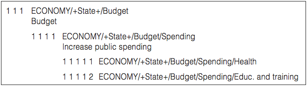
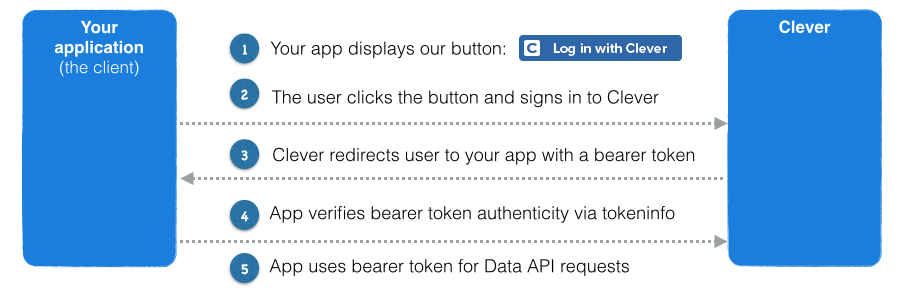

```{r packages, message = FALSE, warning = FALSE, echo=FALSE}
## Run / Install before executing slides

# Load packages.
packages <- c("devtools","knitr","tidyverse","widgetframe","readr",
              "wordcloud", "base64enc", "tm", "quanteda", "qdap",
              "qdapDictionaries", "tidytext", 
              "RWeka","stats","manifestoR","readtext",
              "rvest", "stringr", 
              "SnowballC", "plotrix", "tidyr", "tidytext", "stats", 
              "dendextend", "ggthemes",
              "httr","jsonlite", "DT")

packages <- lapply(packages, FUN = function(x) {
  if(!require(x, character.only = TRUE)) {
    install.packages(x)
  library(x, character.only = TRUE)
  }
}
)

# devtools::install_github("ManifestoProject/manifestoR")
# devtools::install_github("rOpenGov/rtimes")
```

```{r setup, include=FALSE}
library("knitr")
knitr::opts_chunk$set(echo = TRUE, eval=TRUE, 
                      message=FALSE, warning = FALSE,
                      fig.height=5, fig.width=9, cache = TRUE) 
options(htmltools.dir.version = FALSE)
```  

background-image: url(images/wenjun_student_loans.png)
background-size: 50%
background-position: 50% 90% 

# Sandbox

Anything to share? Need feedback from your colleagues? 

Take a look at Wenjun's contributions on the [student loan assignment](https://medium.com/@wenjun.sarah.sun/visualize-student-loans-with-ggplot2-c44ea0cfd911) and some [Fortune 500 HQ maps](https://medium.com/@wenjun.sarah.sun/maps-of-where-the-fortune-500-companies-in-r-6ee6e98c64f8) (Don't forget to 👏).


---


background-image: url(images/kickstarter.jpg)
background-size: 100%
background-position: 100% 140% 


# Assignment 3: Text Analysis

- Next assignment out tomorrow.
- Due a week later.

---

background-image: url(images/countdown.jpg)
background-size: 30%
background-position: 50% 80%

# Final Project - Due Date on May 6 [May 11 hand in]

---

background-image: url(images/reticulated_python.png)
background-size: 20%
background-position: 95% 5%
 
# Using Python in R

The [`reticulate` package](https://rstudio.github.io/reticulate/) allows tight integration of R and Python, including:

- **Calling Python from R** in a variety of ways including R Markdown, sourcing Python scripts, importing Python modules, and using Python interactively within an R session.

- **Translation between R and Python objects** (for example, between R and Pandas data frames, or between R matrices and NumPy arrays).

---

background-image: url(images/reticulated_python.png)
background-size: 20%
background-position: 100% 10%

# Using Python in R

<br>
<br> 


---

# Finding Data

The website https://opendatainception.io/ presents links to 2,600 open data portals in the world.


---

# Cleaning Text - Does it matter?

The [package `preText`](https://github.com/matthewjdenny/preText) makes it east to assess the **consequences of text preprocessing decisions**.
install.packages("preText")

> We can also see the **conditional effects of each preprocessing step** on the **mean preText score** for each specification that included that step. 

> Here again, a **negative coefficient** indicates that a step tends to **reduce the unusualness of the results**, while a **positive coefficient** indicates that applying the step is likely to produce **more unusual results for that corpus**.

Computing intensive but useful for a check whether your results depend on the preprocessing options.

---

# Cleaning Text - Does it matter?


---

# Where were we?

.pull-left[

Our fundamental unit of text analysis is the **document term matrix** (DTM).

The DTM is a set of stacked vectors, with each entry in each vector representing the ‘amount’ of a particular term. This can be (re-)weighted in several ways (e.g. tfidf).

We can start visualizing texts, as well as their similarities and differences using **word clouds**.

To relate texts, we can use **hierarchical clustering** and display the results using **dendrograms**.

]

.pull-right[

```{r, echo=FALSE, out.width = "80%"}

```

```{r, echo=FALSE, out.width = "80%"}

```

```{r, echo=FALSE, out.width = "80%"}
knitr::include_graphics("images/dendrogram_sotu.png")
```

]

---

background-image: url(images/roadsign_dragon.jpg)
background-size: 30%
background-position: 100% 0%

# Roadmap

**Going Beyond Single Words**  
  Different tokenizations


**Summarizing documents**   
**and measuring**  
**their complexity**


**Using own and custom dictionaries**  
**to assess and evaluate documents**  
  Sentiment analysis (think Amazon reviews)  
  Measuring psychological features  
  Political communication  

**Getting and analyzing Tweets**   
  Topic Analysis


---

class: center
background-image: url(images/ngram_matrix.jpg)
background-size: 110%
background-position: 50% 100%

# Getting past single words

---

background-image: url(images/collocations_wordcloud.png)
background-size: 100%
background-position: 50% 100%

# Collocations, phrasemes and co-occurrence

So far, we’ve treated the features in a ‘**bag of words**’ style. 

In some cases, may also want to think seriously about **collocations**: words that co-occur in a document, adjacent (or close to adjacent) to one another.

---

# Collocations, phrasemes and co-occurrence


**Collocation** is a group of two or more adjacent words that are seen together more often than we would ‘expect’ were words placed in document independent of the others. Mean something specific. 
- Describe as _strong collocation_ if the link between the words is fixed and restrictive.

- **Example**: ‘do business’ (not ‘make business’), ‘save money’ (not ‘preserve money’). [Note that, one of the terms is chosen freely (e.g. money), but the other is constrained by language.]

---

# Getting past single words

So far, we have only made TDMs and DTMs using **single words**. 

The default is to make them with _unigrams_, but you can also focus on tokens containing two or more words, called **ngrams**. 

This can help extract useful phrases which lead to some additional insights or provide improved predictive attributes for a machine learning algorithm.

Uses the `RWeka` package to create digram (two word) tokens: min and max are both set to 2.

```{r, eval=FALSE, message=FALSE, warning=FALSE, include=FALSE}
# Had some troubles with Java. Used command described here in terminal to fix:
# http://stackoverflow.com/questions/30738974/rjava-load-error-in-rstudio-r-after-upgrading-to-osx-yosemite/31039105#31039105
# install.packages("rJava",type='source')
# install.packages("RWeka")
```

---

# Unigram - single words 

```{r, eval=TRUE}
# Continue with files from last lecture
load("data/sotu_previous_lecture.RData")
```

```{r, eval=TRUE}
require(RWeka)
# Make tokenizer function 
tokenizer <- function(x) 
  NGramTokenizer(x, Weka_control(min = 2, max = 2))

# Create unigram_dtm
unigram_dtm <- DocumentTermMatrix(sotu_comp_all)

# Examine unigram_dtm
unigram_dtm
```

---

# Bigram - two words in each term

```{r, eval=TRUE}
# Create bigram_dtm
bigram_dtm <- DocumentTermMatrix(
  sotu_comp_all, 
  control = list(tokenize = tokenizer,
  options(mc.cores=1))
)

# Examine bigram_dtm
bigram_dtm  # Note, we have 110m entries already!
```

---

# Bigrams

```{r, eval=TRUE}
# Create bigram_dtm_m
bigram_dtm_m <- as.matrix(bigram_dtm)

# Create freq
freq <- colSums(bigram_dtm_m)

# Create bi_words
bi_words <- names(freq)

# Examine part of bi_words
bi_words[2577:2587]
```

---

# Bigrams

```{r, echo=FALSE}
# Replace "unit state" with "United States"
bi_words[grep("unit state",bi_words)] <- "united states"
```

```{r, message=FALSE, warning=FALSE, echo=FALSE}
# Plot a wordcloud
# par(mai=c(0,0,0,0))
wordcloud(bi_words, freq, max.words = 40)
```

---

class: inverse, center, bottom
background-image: url(images/abstract_maze.jpg)
background-size: 100%
background-position: 100% 30%

# Measurement of Linguistic Complexity

---

# Measurement of Linguistic Complexity

> Restoration of national income, which shows continuing gains for the third successive year, supports the normal and logical policies under which agriculture and industry are returning to full activity. Under these policies we approach a balance of the national budget. National income increases; tax receipts, based on that income, increase without the levying of new taxes.

**vs.**


> Some say my tax plan is too big. Others say its too small. I respectfully disagree.

---

# Measurement of Linguistic Complexity

Over a hundred years of literature on measurement of _readability_: general issue was assigning school texts to pupils of different ages and abilities.

Flesch (1948) suggests **Flesch Reading Ease** statistic:

.small[
$$= 206.835 - 1.015\left(\frac{\mbox{total words}}{\mbox{total sentences}}\right)-84.6\left(\frac{\mbox{total syllables}}{\mbox{total words}}\right)$$ 
]

.small[
Based on $\hat{\beta}$s from linear model where $y=$ average grade level of school children who could correctly answer at least 75\% of multiple choice questions on texts. Scaled such that a document with score of 100 could be understood by fourth grader (9yo).]

Kincaid et al. later translate to US School grade level that would be (on average) required to comprehend text.

---

# Flesch Reading Ease

In practice, estimated FRE can be outside [0, 100]. But, as a guideline:

.small[
Score	      | School    | Level
----------- | --------- | ------------------------------
100-90	| 5th grade |	Very easy to read. Easily understood by an average 11-year-old student.
90–80	      | 6th grade |	Easy to read. Conversational English for consumers.
80–70	      | 7th grade	| Fairly easy to read.
70–60     	| 8th & 9th grade	| Plain English. Easily understood by 13- to 15-year-old students.
60–50	      | 10th to 12th grade |	Fairly difficult to read. 
50–30	      | College	           | Difficult to read. 
30–0	      | College Graduate   |	Very difficult to read. Best understood by university graduates.
]

---

# Flesch Reading Ease - Examples

.small[
Score | Text
----- | --------------------------------
-800  | Molly Bloom’s (3.6K) Soliloquy in Ulysses (James Joyce)
33    | mean social science article; judicial opinion
45    | life insurance requirement (FL)
48    | New York times
52    | Time Magazine
65    | Reader’s Digest
67    | Al Qaeda press release
77    | Dickens’ works
80    | children’s books: e.g. Wind in the Willows
90    | death row inmate last statements (TX)
100   | this entry right here.
]

---

# Flesch Reading Ease - Wikipedia


---

# Flesch Reading Ease - MS Word


---

# Flesch Reading Ease - Examples

But: widespread use does not mean it is a great measure.

**It can be beyond wrong. Joyce's _Ulysses_, according to Amazon's Text Stats, has a Flesch-Kincaid score of 6.8. Show me the seventh grader who can comprehend Ulysses, and I'll pay for her college education.**

--


---

# Flesch Reading Ease - Limitations

Flesch scoring only uses syllable information: no input from rarity or unfamiliarity of word.

e.g. “Indeed, the shoemaker was frightened” would score similarly to “Forsooth, the cordwainer was afeared”

- Widely used because it ‘works’, not because it is justified from first principles
- Many other indices available: **Gunning-Fog, Dale-Chall, Automated Readability Index, SMOG**. Typically highly correlated (at text level).

---

# Calculating Fresch-Kincaid Reading Ease Score - Example

**Sentence 1:**  
To think Being itself explicitly requires disregarding Being to the extent that it is only grounded and interpreted in terms of beings and for beings as their ground, as in all metaphysics.

**Sentence 2:**  
If civilization is to survive, we must cultivate the science of human relationships - the ability of all peoples, of all kinds, to live together, in the same world at peace.

**Sentence 3:**  
I know the human being and fish can coexist peacefully.

<!-- 1.Heidegger, 2. Franklin D. Roosevelt 3. George W. Bush --> 


---

# Calculating Fresch-Kincaid Reading Ease Score

```{r, echo=FALSE, message=FALSE, warning=FALSE}
s1 <- "To think Being itself explicitly requires disregarding Being to the extent that it is only grounded and interpreted in terms of beings and for beings as their ground, as in all metaphysics."
s2 <- "If civilization is to survive, we must cultivate the science of human relationships - the ability of all peoples, of all kinds, to live together, in the same world at peace."
s3 <- "I know the human being and fish can coexist peacefully."
```

```{r, echo=TRUE, message=FALSE, warning=FALSE}
require(quanteda)
textstat_readability(c(s1,s2,s3), 
        measure=c('Flesch','Flesch.Kincaid',
                  'meanSentenceLength','meanWordSyllables'))
```

---

# Application: FRE in SOTU texts

```{r, include=FALSE}
# 
# <small><small>https://www.theguardian.com/world/interactive/2013/feb/12/state-of-the-union-reading-level</small></small>
```

```{r, message=FALSE, warning=FALSE}
require(quanteda)
require(dplyr)
sotu_corpus <- corpus(sotu)  # convert to quanteda corpus
FRE_sotu <- textstat_readability(sotu_corpus,
              measure=c('Flesch.Kincaid'))
```

```{r, echo=FALSE, message=FALSE, warning=FALSE}
sotu_metadata <- read_csv("data/sotu_metadata.csv")
sotu_corpus$year <- sotu_metadata$year
sotu_corpus$party <- sotu_metadata$party
sotu_corpus$pres_name <- sotu_metadata$pres_name

FRE <- data_frame(FK = FRE_sotu$Flesch.Kincaid,
    pres = sotu_metadata$pres_name,
    year = sotu_metadata$year,
    words = ntoken(sotu_corpus),
    party = sotu_metadata$party)
FRE[c(1,13,135,158,178,200,232),c(1:4)]

# Name documents with PRESNAME-YEAR
presnameyear <- paste(sotu_metadata$pres_name, "-", sotu_metadata$year) 
presnameyear[duplicated(presnameyear)] <- paste(presnameyear[duplicated(presnameyear)],"II")
docnames(sotu_corpus) <- presnameyear

# summary(sotu_corpus)
```

---

# Application: FRE in SOTU texts

```{r, echo=FALSE, message=FALSE, warning=FALSE}
ggplot(data=FRE, aes(x=year,y=FK, size=words)) + 
  geom_point(alpha=0.5) + geom_smooth() + guides(size=FALSE) +
  theme_tufte(22) + xlab("") + ylab("Flesch-Kincaid Grade Level") + theme(legend.position="none")
```

---

# Application: FRE in SOTU texts

- The Fresh-Kincaid reading score of SOTU speeches is declining. 
- Why might it be difficult to make readability comparisons over time? 
 <span style="color:white">(hint: when were the reading ease measures invented? are topics of speeches constant? were addresses always delivered the same way?)</span>
- Does the nature of the decline suggest that speeches are becoming simpler for demand (i.e. voter) or supply (i.e. leader) incentive reasons?  <span style="color:white">(hint: consider the smoothness/jaggedness of the decrease)</span>

---

# Application: FRE in SOTU texts

- The Fresh-Kincaid reading score of SOTU speeches is declining. 
- Why might it be difficult to make readability comparisons over time? 
 <span style="color:blue">(hint: when were the reading ease measures invented? are topics of speeches constant? were addresses always delivered the same way?)</span>
- Does the nature of the decline suggest that speeches are becoming simpler for demand (i.e. voter) or supply (i.e. leader) incentive reasons?  <span style="color:blue">(hint: consider the smoothness/jaggedness of the decrease)</span>


---

# Application: FRE in SOTU texts

- some addresses were spoken, other submitted in written form
- over time, the type of publication form also changed. Radio, TV, and since 2002 live publication on the web
- Let's add that information: http://www.presidency.ucsb.edu/sou_words.php

---

# Application: FRE in SOTU texts

```{r, echo=FALSE, message=FALSE, warning=FALSE}
require(readr)
require(dplyr)
delivery <- read_csv("data/sotu_delivery_format.csv")
delivery$year <- as.numeric(delivery$year)

# delivery[delivery$year==1981,]
# FRE[FRE$year==1981,]
 # Need to correct 1981

FRE2 <- as_data_frame(merge(FRE, delivery, by=c("year")))
FRE2[FRE2$year==1981 & FRE2$pres == "Jimmy Carter","Format"] <- "written"

FRE2[c(1,13,135,158,178,200,223,231,241),c("FK","pres","year","Format","Publicity")]
```

---

# Application: FRE in SOTU texts

```{r, eval=FALSE, message=FALSE, warning=FALSE}
# Plot with added information
ggplot(data=FRE2, aes(x=year,y=FK, size=words)) + 
  geom_point(alpha = 0.5, 
             aes(col = Publicity, shape = Format)) + 
  geom_smooth() + 
  guides(size=FALSE) + theme_tufte() + 
  xlab("") + ylab("Flesch-Kincaid Grade Level") 
```

---

# Application: FRE in SOTU texts

```{r, echo=FALSE, message=FALSE, warning=FALSE}
# Plot with added information
ggplot(data=FRE2, aes(x=year,y=FK, size=words)) + 
  geom_point(alpha=0.5,aes(col=Publicity, shape=Format)) + geom_smooth() + guides(size=FALSE) + theme_tufte(22) + xlab("") + ylab("Flesch-Kincaid Grade Level") 
```

---

# Application: FRE in SOTU texts

```{r, echo=FALSE, message=FALSE, warning=FALSE}
# Plot with added information
ggplot(data=FRE2, aes(x=year,y=FK, size=words, col=Publicity)) + 
  geom_point(alpha=0.5,aes(shape=Format)) + 
  geom_smooth(method="lm", se=FALSE) + 
  guides(size=FALSE) + 
  theme_tufte(22) + xlab("") + ylab("Flesch-Kincaid Grade Level") 
```

---

# Application: FRE in SOTU texts

```{r, echo=FALSE, message=FALSE, warning=FALSE}
# Plot with added information
ggplot(data=FRE2, aes(x=year,y=FK, size=words, shape=Format)) + 
  geom_point(alpha=0.5,aes(col=Publicity)) + 
  geom_smooth(method="loess", se=T, aes(linetype=Format)) + 
  guides(size=FALSE) + theme_tufte(22) + 
  xlab("") + ylab("Flesch-Kincaid Grade Level") 
```

---

class: bottom, center, inverse
background-image: url(images/dictionary_sample_page.jpg)
background-size: 100%
background-position: 100% 100%

# Classifying Documents with Dictionaries

---

# Classifying Documents

- can think about documents as members of **categories** or **classes**
→ simple, fast dictionary based ways to classify/categorize
- will cover some _‘major’_ dictionaries in social science
and demonstrate challenges that emerge in constructing and using dictionaries

 <span style="font-size:small">Note: This part relies on Arthur Spirling's Lectures at EITM Mannheim in July 2016. **Thanks!**
</span>

---

# Terminology

.small[
|   **Unsupervised** techniques 	|   **Supervised** techniques 	|
| ------------------------- | ----------------------- |	
| learning (hidden or latent) structure in **unlabeled** data. 	| learning relationship between inputs and a **labeled** set of outputs 	|
| e.g. PCA of legislators’s votes: want to see how they are organized—by party? by ideology? by race? 	| e.g. opinion mining: what makes a critic like or dislike a movie $$y \in \{0,1\}$$ |
   
]
---

# Overview: Supervised Learning

1. **label** some examples of each category
    - e.g. some reviews that were positive (y = 1), some that were negative (y = 0); some statements that were liberal, some that were conservative.
2. **train** a ‘machine’ on these examples (e.g. logistic regression), using the features (DTM, other stuff) as the ‘independent’ variables.
    - e.g. does the commentator use the word ‘fetus’ or ‘baby’ in discussing abortion law?
3. **classify** by using the learned relationship to predict the outcomes of documents (y ∈ {0, 1}, review sentiment) not in the training set.

---

# Which labels?

**idea:** use a set of pre-defined words (**dictionaries**) with specific connotations that allow us to classify documents automatically, quickly and accurately.

→ common in opinion mining/sentiment analysis, and in coding events or manifestos.

---

# Classification with Dictionary Methods

.small[
We have a set of key words, with attendant scores,
  - e.g. for movie reviews: ‘terrible’ is scored as −1; ‘fantastic’ as +1

The relative rate of occurrence of these terms tells us about the overall tone or category that the document should be placed in.

For document $i$ and words $m = 1, \ldots , M$ in the dictionary, the 

$\boxed{\mbox{Tone of document i}= \sum^M_{m=1} \frac{s_m w_{im}}{N_i}}$

where 
- $s_m$ is the score of word $m$  
- $w_{im}$ is the number of occurrences of the $m$th dictionary word in the document $i$ 
- $N_i$ is the total number of all dictionary words in the document.

$\rightarrow$ just add up the number of times the words appear and multiply by the score (normalizing by doc dictionary presence) 
]
---

# Example: Movie Review


---

# Example: Movie Review


---

# Example: Movie Review


---

# Example: Movie Review

Negative Words:  <span style="color:Red">11</span>

Positive Words:  <span style="color:Blue">2 </span>

Total Words: 13

$$\boxed{\mbox{tone of document}= \frac{2-11}{13} = \frac{-9}{13}}$$

```{r, echo=FALSE, out.width = "30%"}
knitr::include_graphics("images/two-star-rating.png")
```

---

# Sentiment Analysis using Hu & Liu Dic

Hu and Liu (“Mining and Summarizing Customer Reviews”) provide 6800 words which are **positive** and **negative** derived from amazon.com and others.

```{r, echo=FALSE, out.width = "88%"}

```

---

# Hard in Practice

You are working for rottentomatoes.com, and want to automatically code (written) movie reviews as being between 1 and 5 stars.

- Would the Hu & Liu approach work better for distinguishing a 1 star review from a 5 star review, or a 4 from a 5 star review? Why? How could you improve upon this?
    <span style="color:White">Might want to differentiate ‘good’ from ‘great’ from ‘best’. Hard to come up with rules!</span>
    <span style="color:White">Tone of the document can be presented as a continuous value or we can use cutoffs.</span>
- Why does sarcasm cause problems, and what should we do about it?
    <span style="color:White">“Great for insomniacs!” Presence of tags and pitch analysis can help.</span>
- Why might be generally nervous about Bag of Word approaches?
    <span style="color:White">context matters: “was **not** good” gets +1 !</span>
    

---

# Hard in Practice

You are working for rottentomatoes.com, and want to automatically code (written) movie reviews as being between 1 and 5 stars.

- Would the Hu & Liu approach work better for distinguishing a 1 star review from a 5 star review, or a 4 from a 5 star review? Why? How could you improve upon this?
    <span style="color:Lightblue">Might want to differentiate ‘good’ from ‘great’ from ‘best’. Hard to come up with rules!</span>
    <span style="color:Lightblue">Tone of the document can be presented as a continuous value or we can use cutoffs.</span>
- Why does sarcasm cause problems, and what should we do about it?
    <span style="color:Lightblue">“Great for insomniacs!” Presence of tags and pitch analysis can help.</span>
- Why might be generally nervous about Bag of Word approaches?
    <span style="color:Lightblue">context matters: “was **not** good” gets +1 !</span>


---

# Define and apply a dictionary in practice

```{r, eval=FALSE}
recentSOTUCorpus <- corpus_subset(sotu_corpus, year > 1995)

# Now we define a demonstration dictionary:
myDict <- dictionary(list(
  terror = c("terrorism", "terrorists", "threat"),
  economy = c("jobs", "business", "grow", "work")))

# We can use the dictionary when making the dfm:
byPresMat <- dfm(recentSOTUCorpus, dictionary = myDict)
byPresMat
```

---

# Define and apply a dictionary in practice

```{r, echo=FALSE}
recentSOTUCorpus <- corpus_subset(sotu_corpus, year > 2000)

# Now we define a demonstration dictionary:
myDict <- dictionary(list(terror = c("terrorism", "terrorists", "threat"),
                          economy = c("jobs", "business", "grow", "work")))

# We can use the dictionary when making the dfm:
byPresMat <- dfm(recentSOTUCorpus, dictionary = myDict)
byPresMat
```

---

# Other Dictionaries

There are many available dictionaries that will identify sentiments, emotions, psychological traits, specific topics in an area etc.

.small[Examples of **dictionaries in social science**:
- **General Inquirer [Stone 1965]** : analyze psychological states of authors  
- **Customer Reviews [Hu & Liu (2004)]**: positive and negative sentiments
- **Linguistic Inquiry and Word Count (LIWC) [Pennebaker et al]**: 80 categories, organized hierarchically into 4 larger groups. E.g. all anger words (e.g. hate) ⊂ negative emotion ⊂ affective processes ⊂ psychological processes.
- **Regressive Imagery Dictionary (RID) [Martindale 1983]**: designed to distinguish between primordial and conceptual thinking
- **NRC Word-Emotion Association Lexicon (aka EmoLex)**: [Crowdsourced dictionary](http://saifmohammad.com/WebPages/NRC-Emotion-Lexicon.htm) of eight basic emotions (anger, fear, anticipation, trust, surprise, sadness, joy, and disgust) and two sentiments (negative and positive).
- **Lexicoder Sentiment Dictionary**: dictionary created specifically for political communication
- **Party Manifestos (Laver & Garry 2002)**: create dictionary for party manifestos where basic unit is strings of ∼ 10 words in length. Hierarchical, with topmost level pertaining to five policy domains: economy, political system, social system, external relations, ‘other’.
]

---

# Getting Hu & Liu Dictionary

```{r}
pos <- read.table("data/dictionaries/positive-words.txt", as.is=T)
neg <- read.table("data/dictionaries/negative-words.txt", as.is=T)
pos[1:15,]
neg[1:15,]
```

---

# Sentiment Analysis using Hu & Liu

```{r}
# function just to do simply arithmetic
sentiment <- function(words=c("really great good stuff bad")){
  require(quanteda)
  tok <- quanteda::tokens(words)
  pos.count <- sum(tok[[1]]%in%pos[,1])
  cat("\n positive words:",tok[[1]][which(tok[[1]]%in%pos[,1])],"\n")
  neg.count <- sum(tok[[1]]%in%neg[,1])
  cat("\n negative words:",tok[[1]][which(tok[[1]]%in%neg[,1])],"\n")
  out <- (pos.count - neg.count)/(pos.count+neg.count)
  cat("\n Tone of Document:",out)
}
```

---

# Sentiment Analysis Example 1

```{r, echo=FALSE}
movie <- "Director and co-screenwriter Adam McKay (Step Brothers) bungles a great opportunity to savage the architects of the 2008 financial crisis in The Big Short, wasting an A-list ensemble cast in the process. Steve Carell, Brad Pitt, Christian Bale and Ryan Gosling play various tenuously related members of the finance industry, men who made made a killing by betting against the housing market, which at that point had superficially swelled to record highs. All of the elements are in place for a lacerating satire, but almost every aesthetic choice in the film is bad, from the U-Turn-era Oliver Stone visuals to Carell's sketch-comedy performance to the cheeky cutaways where Selena Gomez and Anthony Bourdain explain complex financial concepts. After a brutal opening half, it finally settles into a groove, and there's a queasy charge in watching a credit-drunk America walking towards that cliff's edge, but not enough to save the film."
strwrap(movie)
```

---

# Sentiment Analysis Example 1

```{r}
sentiment(movie)
```

---

# Sentiment Analysis Example 2

```{r, echo=FALSE}
yelp <- "this guy mat the owner is a scam do not use him you will regret doing business with this company I'm going to court he is a scam customers please beware he will destroy your floors he is nothing by a liar he robs customers, 
and promises you everything if you want s--- then go with him if you like nice work find another he is A SCAM LIAR BULL----ER,"
```

```{r, echo=FALSE}
strwrap(yelp)
sentiment(yelp)
```

---

# Sentiment Analysis Example 3

```{r, echo=FALSE}
wolfshirt <-"This item has wolves on it which makes it intrinsically sweet and worth 5 stars by itself, but once I tried it on, that's when the magic happened. After checking to ensure that the shirt would properly cover my girth, I walked from my trailer to Wal-mart with the shirt on and was immediately approached by women. The women knew from the wolves on my shirt that I, like a wolf, am a mysterious loner who knows how to 'howl at the moon' from time to time (if you catch my drift!). The women that approached me wanted to know if I would be their boyfriend and/or give them money for something they called mehth. I told them no, because they didn't have enough teeth, and frankly a man with a wolf-shirt shouldn't settle for the first thing that comes to him."
```

```{r, echo=FALSE}
strwrap(wolfshirt)
sentiment(wolfshirt)
```

---

# Measuring Emotions - RID Dictionary

- The **Regressive Imagery Dictionary** (Martindale, 1975,1990) is a content analysis coding scheme designed to measure _primordial vs. conceptual_ thinking. 
- Conceptual thought is abstract, logical, reality oriented, and aimed at problem solving. Primordial thought is associative, concrete, and takes little account of reality.

---

# Measuring Emotions - RID Dictionary

```{r}
# Regressive Imagery dictionary
# primordial / conceptual thinking
RID_dictionary <- dictionary(file="data/dictionaries/RID.cat",
                             format = "wordstat")

# make a dfm based on the dictionary
DTM_RIDdict <- dfm(sotu_corpus, dictionary=RID_dictionary)
```

---

# Measuring Emotions - Categories

```{r}
# What categories do we have?
DTM_RIDdict@Dimnames$features[c(8:9,22:23,38:43)]
```

---

# Measuring Emotions - DFM to Data Frame

```{r}
# Make DFM into data frame to plot with ggplot
require(reshape2)
require(stringr)
RIDdf <- melt(as.matrix(DTM_RIDdict))
RIDdf$pres <- str_split_fixed(RIDdf$docs, "-", 2)[,1]
RIDdf$year <- str_split_fixed(RIDdf$docs, "-", 2)[,2]
RIDdf$year <- as.numeric(substr(RIDdf$year,1,4))
RIDdf <- as_data_frame(RIDdf)
```

---

# Measuring Emotions - Aggression in SOTU

```{r, message=FALSE, warning=FALSE, eval=FALSE}
require(ggrepel)
# Has politics become more aggressive over time?
ggplot(filter(RIDdf, features=="EMOTIONS.AGGRESSION"), 
  aes(x=year, y=value)) + geom_point() + 
  ylab("Aggression") + xlab("") + theme_tufte() +
  geom_smooth() + geom_text_repel(data=filter(RIDdf,
  features=="EMOTIONS.AGGRESSION._",value>200), 
  aes(label=docs), size=2)
```

---

# Measuring Emotions - Narcissism in SOTU

```{r, message=FALSE, warning=FALSE, echo=FALSE}
require(ggrepel)
# Has politics become more aggressive over time?
ggplot(filter(RIDdf, features=="PRIMARY.REGR_KNOL.NARCISSISM"), 
  aes(x=year, y=value)) + geom_point() + 
  ggtitle("Roosevelt, not Trump, most narcissistic president ever") +
  ylab("Narcissism") + xlab("") + theme_tufte() +
  geom_smooth() + geom_text_repel(data=filter(RIDdf,
  features=="PRIMARY.REGR_KNOL.NARCISSISM",value>50), 
  aes(label=docs), size=2)
```

---

# Measuring Emotions - Need Sex in SOTU

```{r, message=FALSE, warning=FALSE, echo=FALSE}
require(ggrepel)
ggplot(filter(RIDdf, features=="PRIMARY.NEED.SEX"), 
  aes(x=year, y=value)) + geom_point() + 
  ggtitle("Roosevelt also 'Needs Sex' - apparently") +
  ylab("Need Sex") + xlab("") + theme_tufte() +
  geom_smooth() + geom_text_repel(data=filter(RIDdf,
  features=="PRIMARY.NEED.SEX",value>12), 
  aes(label=docs), size=2)
```

---

# Party Manifestos

- The [Manifesto Project](https://manifesto-project.wzb.eu/) estimates parties’ policy positions derived from a content analysis of parties’ electoral manifestos. 
- It covers over 1000 parties from 1945 until today in 60 countries on five continents.
- 4174 manifestos in 713 elections; 2.1m human-coded sentences.

---

# Laver and Garry Dictionary

- Laver and Garry create dictionary for manifestos where basic unit is strings of ∼ 10 words in length.
- Hierarchical, with topmost level pertaining to five policy domains: economy, political system, social system, external relations, ‘other’.
- get good/valid results and high correlation with expert surveys.

```{r, echo=FALSE, out.width = "80%"}

```

---

# Party Manifestos in R

Two options to get party manifests:
  1. Using the `manifestoR` package and accessing the API of the Manifesto Project.
  2. Downloading and reading in text files.
  3. The `ukManifestos` package that comes shipped with `quanteda`

---

# Party Manifestos in R - `manifestoR`

```{r, message=FALSE, warning=FALSE}
require(manifestoR)
manifestoR::mp_setapikey(key="d90a4c5e0c251fe01d267e18c7c8d6e6")
  # This is my key. Use in lecture but otherwise get your own.
maninfestUS <- mp_corpus(subset(mp_maindataset(), 
                                countryname == "United States"))
maninfestUS2016 <- maninfestUS[grep("2016",names(maninfestUS))]
doc <- maninfestUS[[30]]
```

---

# Party Manifestos in R - `manifestoR`

```{r, message=FALSE, warning=FALSE, echo=FALSE}
strwrap(doc$content)[1:7]
```

---

# Party Manifestos in R - reading in text files

```{r}
require(quanteda)
require(readtext)

# UK manifestos for liberals, labor and conservatives
manifestos <- readtext::readtext("data/UK_manifestos/*.txt",
              docvarsfrom=c("filenames"))

# Turn the text files into a 'corpus' so that we can do more 
# interesting things with them
manifestos_corpus <- corpus(manifestos)

# Make Party / Year variables
manifestos_corpus$party <- 
  substr(names(manifestos_corpus),1,3)
manifestos_corpus$year <-
  as.numeric(substr(names(manifestos_corpus),4,7))
```

---

# Party Manifestos in R - Get Laver/Garry Dictionary

```{r, eval=TRUE, message=FALSE, warning=FALSE}
require(quanteda)
LG_dictionary <- dictionary(file="data/dictionaries/LaverGarry.cat", 
                            format = "wordstat")
# Categories in the dictionary
names(LG_dictionary)
```

---

# Party Manifestos in R - Conservative Values

```{r}
## Words identifying "conservative values"
LG_dictionary$VALUES$CONSERVATIVE
```

---

# Document Term Matrix

```{r}
# make a DFM based on the dictionary
DTM_LGdict <- dfm(manifestos_corpus, dictionary=LG_dictionary,
                  groups=c("party","year"))
# Look at the 1983 manifestos specifically (Con, Lab)
DTM_dict_1983 <- DTM_LGdict[c("Con.1983","Lab.1983"),]
# who talks more about 'conservative' values?
DTM_dict_1983[,c("VALUES.CONSERVATIVE","VALUES.LIBERAL")]
```

---

# Plot GL categorization over time

```{r}
require(tidytext)
require(tidyr)
# Make tidy data
DTM_tidy <- tidy(DTM_LGdict)
# Separate document name column (e.g. "Lab.1983")
DTM_tidy <- separate(DTM_tidy, document, c("party","year"), 
         remove = FALSE, convert = TRUE)
```

---

# Plot GL categorization over time

```{r, message=FALSE, warning=FALSE, eval=FALSE}
ggplot(filter(DTM_tidy, 
       term %in% c("VALUES.CONSERVATIVE","VALUES.LIBERAL")), 
       aes(x=year, y=count, color=party, group=party)) + 
  facet_wrap(~term) +
  geom_point() +
  geom_smooth(se=F)
```

---

# Plot GL categorization over time

```{r, message=FALSE, warning=FALSE, echo=FALSE}
ggplot(filter(DTM_tidy, 
       term %in% c("VALUES.CONSERVATIVE","VALUES.LIBERAL")), 
       aes(x=year, y=count, color=party, group=party)) + 
  facet_wrap(~term) +
  geom_rect(xmin = 1979, xmax = 1990, ymin = -Inf, ymax = Inf,
            fill = "light grey", color="white") +
  geom_text(x=1991, y=140, label="PM Thatcher", size=2.5, color="dark grey") +
  geom_point() + theme_tufte() + xlab("") + ylab("Word Frequency") +
  geom_smooth(aes(color=party), se=F)
```

---

# Plot GL categorization over time

```{r, message=FALSE, warning=FALSE, echo=FALSE}
ggplot(filter(DTM_tidy, 
       term %in% c("ECONOMY.-STATE-")), 
       aes(x=year, y=count, color=party, group=party)) + 
  facet_wrap(~term) +
  geom_rect(xmin = 1979, xmax = 1990, ymin = -Inf, ymax = Inf,
            fill = "light grey", color="white") +
  geom_text(x=1984.5, y=500, label="PM Thatcher", size=2.5, color="red") +
  geom_point() + theme_tufte() + xlab("") + ylab("Word Frequency") +
  geom_smooth(aes(color=party), se=F)
```

---

background-image: url(images/Oauth_logo.png)
background-size: 50%
background-position: 50% 50%

# APIs with `oauth`

---

# OAuth

`OAuth` is an authorization framework that provides credentials as proof for access to certain information. 

Previously, we discussed APIs that only require a key or token. Now, we are extending this discussion.

Currently, at least 2041 out of 22,887 APIs on [programmableweb.com](https://www.programmableweb.com/category/all/apis) require OAuth.


---

# OAuth Service Providers

```{r, echo=FALSE, out.width = "100%"}

```

---

# OAuth in a nutshell

```{r, echo=FALSE, out.width = "49%"}

```
```{r, echo=FALSE, out.width = "49%"}

```

---

# OAuth Flow

```{r, echo=FALSE, out.width = "100%"}

```

<!--
http://www.springframework.net/social/refdoc/serviceproviders.html

This exchange, commonly known as the "OAuth Dance", follows these steps:

1. The flow starts by the application redirecting the user to the provider's authorization URL. 
Here the provider displays a web page asking the user if he or she wishes to grant the application access to read and update their data.
2. The user agrees to grant the application access.
3. The service provider redirects the user back to the application (via the redirect URI), passing an authorization code as a parameter.
4. The application exchanges the authorization code for an access grant.
5. The service provider issues the access grant to the application. 
  The grant includes an access token and a refresh token. 
  On receipt of these tokens, the "OAuth dance" is complete.
6. The application uses the AccessGrant to establish a connection between the local user account and the external provider account. 
With the connection established, the application can now obtain a reference to the Service API and invoke the provider on behalf of the user.

-->

---

# More about oauth

- [Google Documentation](https://developers.google.com/identity/protocols/OAuth2)
- [Facebook Documentation](https://developers.facebook.com/docs/facebook-login/manually-build-a-login-flow)  
- [OAuth 2.0 in depth](https://www.slideshare.net/rohitsghatol/oauth-20-in-depth) presentation by Rohit Ghatol
- [_Getting Started with OAuth 2.0_ (2012), O'Reilly Media book by Ryan Boyd](http://shop.oreilly.com/product/0636920021810.do)

---

# Twitter API

```{r, echo=FALSE, out.width = "40%"}
knitr::include_graphics("images/twitter_logo.gif")
```

---

# Rate limiting

The Twitter APIs are **rate-limited**, meaning that in every 15 minute window, there is a maximum number of request that you can make with a single command.

The **Search API** can be used to query tweets **that have already happened**; however, the API documentation notes that **relevancy is prioritised over completeness**, and so if one wishes to access every tweet with a certain match, a **Streaming API** may be more appropriate.

---

# Streaming API

**Twitter’s Streaming API** is a push of data as tweets happen in **near real-time**. With Twitter’s Streaming API, users register a set of criteria (keywords, usernames, locations, named places, etc.) and as tweets match the criteria, they are pushed directly to the user. 

The Twitter API platform offers two options for [**streaming realtime Tweets**](https://developer.twitter.com/en/docs/tweets/filter-realtime/overview). You won't be able to get **all** tweets on a topic in the free API version (not even close), but that is what is available. 

The package [`streamR`](https://cran.r-project.org/web/packages/streamR/streamR.pdf) will help you fetch data from the streaming Twitter API.

---

# Twitter Firehose

```{r, echo=FALSE, out.width = "100%"}
knitr::include_graphics("images/twitter_firehose.jpg")
```

---

# Twitter Authentication 

Every request sent to Twitter's API must be authorized. 

Here is the [Twitter API uses oauth authentication](https://developer.twitter.com/en/docs/basics/authentication/overview/oauth).

To **set up the verification of your credentials**, you will need to:

  - **register a new application** with Twitter  
  - **obtain a consumer key** (identifies your app) and an **access token** (identifies a user of your app)  
  - **check** to make sure that you are sending the values correctly

---

# Find OAuth Settings for Twitter

```{r}
library(httr)

# 1. Find OAuth settings for twitter:
#    https://dev.twitter.com/docs/auth/oauth
oauth_endpoints("twitter")
```

---

# Register a New Application

Register an application at https://apps.twitter.com/. Make sure to set callback url to "http://127.0.0.1:1410/". 

```{r, echo=FALSE, out.width = "100%"}

```

---

# Obtain the keys

Go to your newly created app and navigate to "Keys and Access Tokens".

```{r, echo=FALSE, out.width = "100%"}

```

---

# Obtain the keys

Copy the info ...

```{r, echo=FALSE, out.width = "100%"}

```


---

# Obtain the keys

... and place your key and secret into your `.Renviron` file.

    # Twitter API Key
    TWITTER_KEY = IH9MW...
    TWITTER_SECRET = hRWUjr...
    TWITTER_ACCESS_TOKEN=280...
    TWITTER_ACCESS_TOKEN_SECRET=XuSDF172...

---

# Define the app in R

```{r}
# Make sure key and secret are in your .Renviron file
myapp <- oauth_app(
  appname = Sys.getenv("TWITTER_APP"), # you can name this whatever you want
  key = Sys.getenv("TWITTER_KEY"),
  secret = Sys.getenv("TWITTER_SECRET")
)
myapp
```

---

# Add additional credentials

_Note_: This is a hotfix for current `httr`'s inability to accept Twitter Access Tokens and Token Secret.

```{r}
options(httr_oauth_cache=T)  
   # Sets caching of the authorization to TRUE
   # Helpful for use of oauth in functions
credentials <- list(
  oauth_token = Sys.getenv("TWITTER_ACCESS_TOKEN"),
  oauth_token_secret = Sys.getenv("TWITTER_ACCESS_TOKEN_SECRET")
)
params <- list(as_header = TRUE)
twitter_token <-
  httr::Token1.0$new(
    app = myapp,
    endpoint = httr::oauth_endpoints("twitter"),
    params = params,
    credentials = credentials,
  )
```

---

# Let's see the token

```{r}
twitter_token
```


<!--
Using rtweet instead of httr:

```{r}
# devtools::install_github("mkearney/rtweet")
library(rtweet)
token <- rtweet::create_token(
  app = Sys.getenv("TWITTER_APP"),
  consumer_key = Sys.getenv("TWITTER_KEY"),
  consumer_secret = Sys.getenv("TWITTER_SECRET"),
  access_token = Sys.getenv("TWITTER_ACCESS_TOKEN"),
  access_secret = Sys.getenv("TWITTER_ACCESS_TOKEN_SECRET")
)
rstats_tweets <- search_tweets(q = "#rstats", n = 500)
```

-->


---

# Authorize the app when asked

```{r, echo=FALSE, out.width = "100%"}

```

---

# Check the connection to the API

```{r message=FALSE, warning=FALSE}
# 4. Use API
req <- GET("https://api.twitter.com/1.1/statuses/home_timeline.json",
  config(token = twitter_token))
try(stop_for_status(req))
cont <- content(req)  
```

---

# Analyzing _Your_ Timeline 

```{r}
# request Twitter data
req <- GET("https://api.twitter.com/1.1/statuses/home_timeline.json",
           config(token = twitter_token))

# convert to R object
tweets <- content(req)

# available data for first tweet on my timeline
names(tweets[[1]])
```

---

# Analyzing _Your_ Timeline

```{r}
# Further analysis of first tweet on my timeline
tweets[[1]]$user$name

writeLines(tweets[[1]]$text)

tweets[[1]]$favorite_count
```

---

# Examining the content

Content in Twitter comes in the from of JSON (we will cover this in the next topic). For now, just follow me in converting the data we get to a data frame.

```{r message=FALSE, warning=FALSE}
library(jsonlite)
data <- jsonlite::flatten(fromJSON(toJSON(tweets)))
```

---

# Examining the content 

Let’s take a look at the data. The first 4 columns (of 198) are as follows:

- `created_at` - when the tweet was sent
- `id` - ID as a numeric value
- `id_str` - ID as a string
- `text` - the content of the tweet

```{r}
dim(data)
```


```{r}
colnames(data)[1:20]
```

---

# Examining the content 

```{r echo=FALSE, message=FALSE, warning=FALSE}
# datatable((data[,c("user.name","text")]))
datatable(
  data[,c("user.name","text")], 
  extensions = 'FixedColumns',
  options = list(
  dom = 't',
  scrollX = FALSE,
  scrollCollapse = FALSE
))
```

---

# Examining the info on one tweet 

```{r echo=FALSE, message=FALSE, warning=FALSE}
datatable((t(data[1,])))
```

---

# Search tweets about a topic

Your own timeline is a start, but what we really want is to examine **tweets on a topic we 
choose**.

```{r}
search_req <- GET("https://api.twitter.com/1.1/search/tweets.json?q=covid", twitter_token)
content_search <- content(search_req)
search_tweets <- jsonlite::fromJSON(toJSON(content_search))
statuses <- search_tweets$statuses
```

---

# Search tweets about a topic 

```{r echo=FALSE}
datatable(
  matrix(statuses[1:10,4]), 
  colnames=c("Tweets about 'Covid'"),
  extensions = 'FixedColumns',
  options = list(
  dom = 't'
))
```

---

# Using the `twitteR` or `rtweet` package

```{r}
library(twitteR)
```

```{r}
# Add you https://apps.twitter.com application information
# to use my_setup() to register your session.
setup_twitter_oauth(Sys.getenv("TWITTER_KEY"), 
                    Sys.getenv("TWITTER_SECRET"),
                    Sys.getenv("TWITTER_ACCESS_TOKEN"),
                    Sys.getenv("TWITTER_ACCESS_TOKEN_SECRET"))
```

---

# Or using `rtweet`

```{r}
library(rtweet)

twitter_token <- create_token(
  app = "qmss",
  consumer_key = Sys.getenv("TWITTER_KEY"),
  consumer_secret = Sys.getenv("TWITTER_SECRET"),
  access_token = Sys.getenv("TWITTER_ACCESS_TOKEN"),
  access_secret = Sys.getenv("TWITTER_ACCESS_TOKEN_SECRET"))
```

---

# Getting Tweets

```{r}
## Search for 500 tweets using the #rstats hashtag
topic_tweets <- search_tweets(q = "#covid_19",
                               n = 500,
                               include_rts = FALSE)  # ignoring re-tweets

# view the first 3 rows of the dataframe
head(topic_tweets, n = 3)
```

---

# Who is tweeting?

```{r}
unique(topic_tweets$screen_name)
```

---

# User Locations

```{r}
users <- search_users("#covid_19",
                      n = 500)
# just view the top of the df
head(users)
# How many locations
length(unique(users$location))
```

---

# Analyzing Tweets on "Covid"

Get some Tweets.

```{r}
covid_tweets <- search_tweets(q = "covid", n = 10000,
                                      lang = "en",
                                      include_rts = FALSE)
```

---

# Data Cleaning

Removing some URLS.

```{r}
# Remove URLS
covid_tweets$stripped_text <- gsub("http.*","",  covid_tweets$text)
covid_tweets$stripped_text <- gsub("https.*","", covid_tweets$stripped_text)
```

---

# Data Cleaning

You can use the `tidytext::unnest_tokens()` function in the `tidytext` package to magically clean up your text (lowercase and punctuation removed)!

```{r}
covid_tweets_clean <- covid_tweets %>%
  dplyr::select(stripped_text) %>%
  unnest_tokens(word, stripped_text)
```

---

# Data Cleaning

```{r}
# load list of stop words - from the tidytext package
data("stop_words")

# remove stop words from your list of words
cleaned_tweet_words <- covid_tweets_clean %>%
  anti_join(stop_words)
```

---

# Plot Top 15 Words

```{r, echo=FALSE}
# plot the top 15 words
cleaned_tweet_words %>%
  count(word, sort = TRUE) %>%
  top_n(15) %>%
  mutate(word = reorder(word, n)) %>%
  ggplot(aes(x = word, y = n)) +
  geom_col() +
  xlab(NULL) +
  coord_flip() +
      labs(y = "Count",
      x = "Unique words",
      title = "Count of unique words found in tweets",
      subtitle = "Stop words removed from the list")
```


---
class: inverse, center, bottom
background-image: url(images/random_grape_berry.jpg)
background-size: 65%
background-position: 50% 100%

# Other Random Stuff

---

class: bottom, center
background-image: url(images/NYTDevLogo.svg)
background-size: 80%
background-position: 50% 30%

# The New York Times API

---

# NYTimes API

The [New York Times](https://developer.nytimes.com/) provides an API to access several data sources they have collected as well as their articles. For this example, we will use the `rtimes()` package.

The main limitation is that **access to the full-text of articles is not provided.**

---

# The  `rtimes()` package

You can access the API directly. However, the [`rtimes` package](https://github.com/tbrambor/rtimes) provided by Scott Chamberlain makes this easier from R, so we will use the package to get what we want.

---

# Install `rtimes()` package

First, install the `rtimes` package.
```{r}
library(rtimes)
```

---

# Get a free API key

To use the NYTimes API, you need to obtain a free API key by registering here:  http://developer.nytimes.com/apps/register

They do offer a few different APIs (but it seems you may get the same key for each one). Get the ones for the "Geographic API" and the "Article Search API".

---

# Get a free API key 

```{r, echo=FALSE, out.width = "50%"}

```

---

# Store the keys in the R startup file

While you can provide the API keys directly in the code, it is more efficient (and safer) to store them in the `.Renviron` file which is loaded during `R`'s startup. It is also safer to keep it secret if you share code (as you may in a assignment/group work).

```{r, eval=FALSE}
# Open the .Renviron file
usethis::edit_r_environ()
```

Add the NYTimes API keys with the following lines

```{r, eval=FALSE}
# NYTIMES Geo API Key
NYTIMES_GEO_KEY = THE_API_KEY_HERE
# NYTIMES Article Search API Key
NYTIMES_AS_KEY = THE_API_KEY_HERE
```

---

# Play around with the API

To ge to know the API, there is an online GUI which allows you to get to know the parameters: http://developer.nytimes.com/article_search_v2.json

We will return to this a bit later.

<!--- http://jamesboehmer.github.io/nytd2013/#/6/1 -->

---

# Getting a query

Let's run a simple query for articles containing the term "Donald Trump" published since the start of the 2020 in the NYTimes. By default, the fields `body`, `byline`, `date`, `title`, and `url` will be searched for the keyword you provide.

```{r}
articlesearch <- as_search(q='Donald Trump', 
                 begin_date='20200101', 
                 end_date='20200406', 
                 fq = 'source:"The New York Times"',
                 facet_field='section_name')
```

---

# Structure of the Information 

The information we get back is structured as a list of lists. The top three lists are (1) a copyright info, (2) meta info about the search results, (3) the article info.

```{r}
str(articlesearch, max.level=1)
articlesearch$meta
```

---

# Get info on one document 

Get the information about the first element, i.e. the first article, from the data list.

```{r warning=FALSE}
library(purrr)
article <- map(articlesearch$data, 1)
names(article)
```

---

# Get info on one document 

```{r warning=FALSE}
strwrap(article$snippet)
```

**Note**: Again, the `rtimes` package only gives you access to article metadata (url, headline, byline, summary, etc.), and does _not return full article content_.

---

# Other NY Times APIs - Campaign Finance

There are also other interesting NYTimes APIs. 

Formerly maintained by the NYTimes, ProPublica now offers a campaign finance API. We can use it to gain some insight into Trumps compaign income and expenditures. The only special data you need is the [FEC ID](http://www.fec.gov/finance/disclosure/candcmte_info.shtml?tabIndex=2) for the candidate of interest. You will also need to get an API key.

```{r eval=FALSE}
trump <- cf_candidate_details(campaign_cycle = 2020, 
   fec_id = 'P80001571',
   key = Sys.getenv("PROPUBLICA_API_KEY"))
trump
```

---

# Other NY Times APIs - Congress

```{r}
out <- cg_rollcallvote(congress_no = 105, 
                         chamber = 'house', 
                         session_no = 2, 
                         rollcall_no = 38)
out$votes
```


