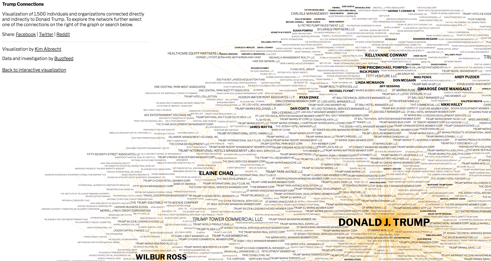
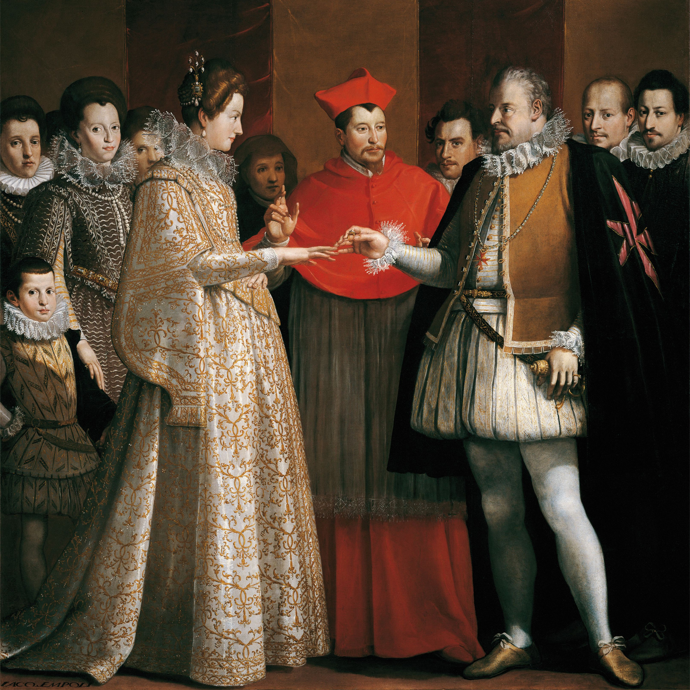
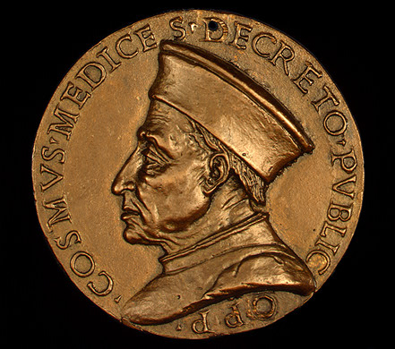
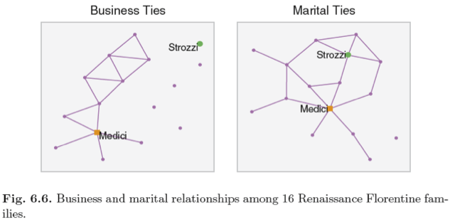
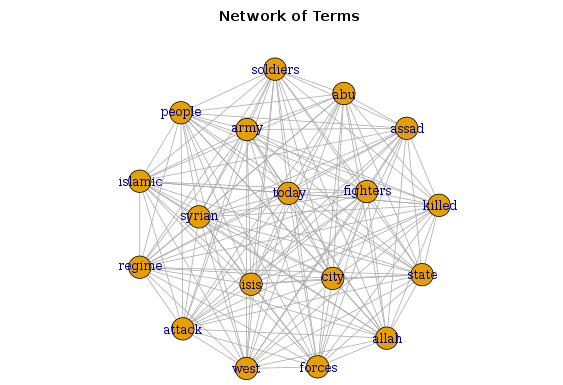
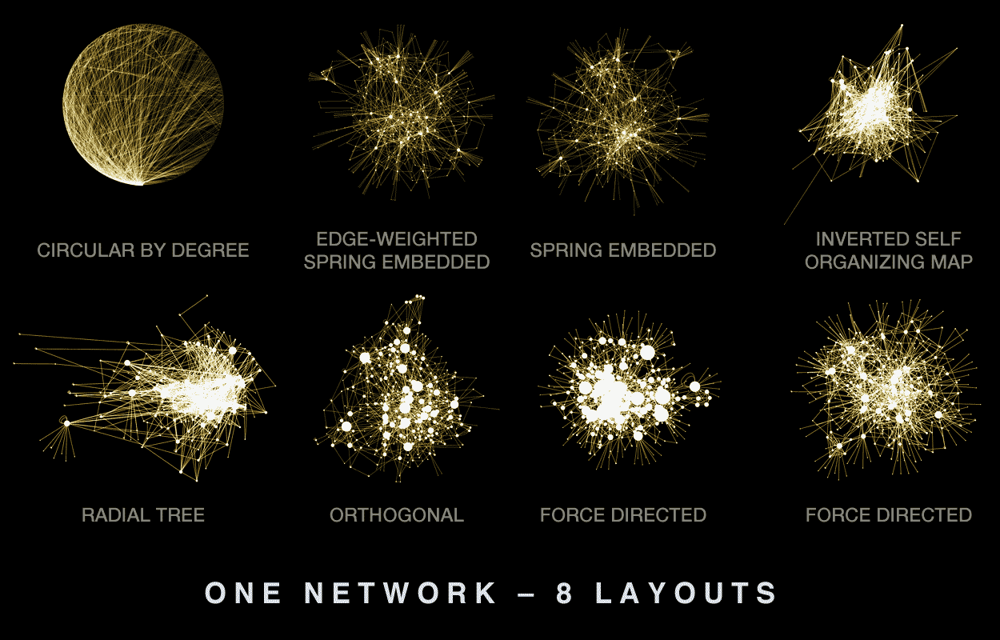
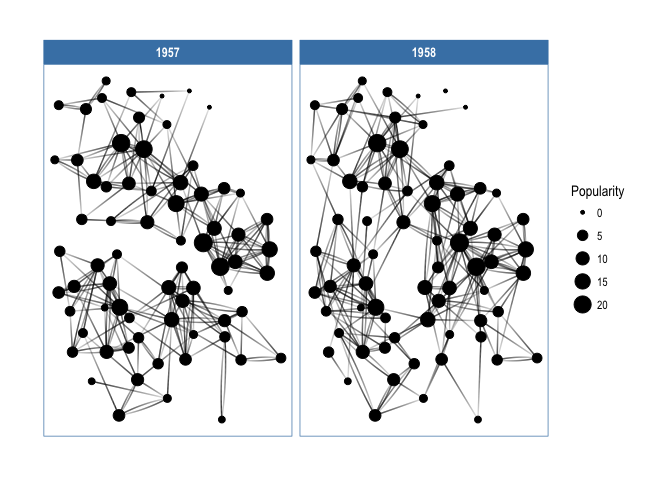
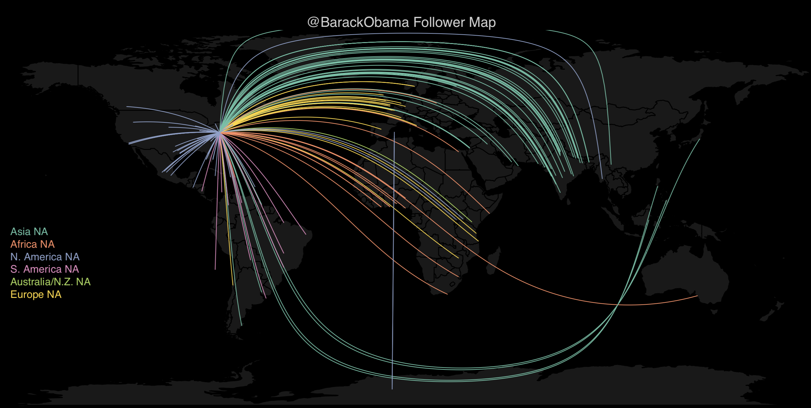

```{r packages, message = FALSE, warning = FALSE, echo=FALSE}
## Run / Install before executing slides
 
# Load packages.
packages <- c("devtools","knitr","widgetframe","readr",
              "ggnetwork","GGally","network","sna","ggplot2",
              "svglite","rsvg","tidyverse",
              "ggraph","igraph","tidygraph",
              "gganimate","randomNames","threejs","visNetwork",
              "ergm","tweenr","rtweet","twitteR", "kableExtra", 
              "ggthemes","DT")

packages <- lapply(packages, FUN = function(x) {
  if(!require(x, character.only = TRUE)) {
    install.packages(x)
  library(x, character.only = TRUE)
  }
}
)
```

```{r setup, include=FALSE}
library("knitr")
knitr::opts_chunk$set(echo = TRUE, eval=TRUE, 
                      message=FALSE, warning = FALSE,
                      fig.height=5, fig.width=9, cache = TRUE) 
options(htmltools.dir.version = FALSE)
```  


<!-- Title picture from http://twittercensus.se/graph2014/ -->

# Roadmap

<!--- 
Visualizing networks
    - Part 1: Static Visualizations
    - Part 2: Interactive Visualizations
- Tutorial: Network Visualization of Hillary Clinton's Emails
-->

```{r, fig.height=7.5, echo=FALSE}
roadmap = graph_from_literal( Static-+Interactive,
                              Static-+InputFormats,
                              Static-+igraph,
                              Static-+network,
                              Static-+ggnet2-+Florence,
                              Static-+ggraph-+Twitter,
                              Static-+ggnet2,
                              Static-+ggnetwork,
                              Static-+ggraph,
                              Interactive-+networkD3, 
                              Interactive-+networkD3-+Clinton, 
                              Interactive-+threejs, 
                              Interactive-+visNetwork, 
                              Interactive-+visNetwork, 
                              Interactive-+visNetwork
                              )
visIgraph(roadmap, physics=TRUE, type="full")

```

---

background-image: url(images/myth_of_criminal_immigrant_nytimes.png)
background-size: 80%
background-position: 50% 95%

# Final project - Make a clear point


---

class: inverse, bottom, center
background-image: url(images/facebook_world.jpg)
background-size: 100%
background-position: 100% 30%

<!-- Source: Paul Butler (Facebook), U.S.: Map visualizing friendships in Facebook around the globe, 2010.
-->

# Visualizing Networks

---

class: middle

> .Large[The focus of social network analysis is **between, not within people**.]

--

.pull-left[

Whereas traditional social-science research methods such as surveys focus on individuals and their attributes (e.g., gender, age, income), **network scientists focus on the connections that bind individuals together**, not exclusively on their internal qualities or abilities.

  _Ben Shneiderman_

]

.pull-right[

```{r, echo=FALSE, out.width = "100%"}

```


]

<!--
Source: Shneiderman, Ben; Hansen, Derek; Smith, Marc A. (2010): Analyzing Social Media Networks with NodeXL: Insights from a Connected World. San Francisco, CA: Morgan Kaufmann.
-->

---

background-image: url(images/networks_terminology.png)
background-size: 90%
background-position: 90% 30%

# Terminology

---

background-image: url(images/Erdoes_links.png)
background-size: 70%
background-position: 95% 5%

# Links

<br><br><br><br><br><br><br><br><br><br>

The mathematician Paul Erdös published around 1,500 papers. The graph displays the collaboration network of Erdös. The **nodes are mathematicians**, and **links** connect pairs who have **jointly authored a paper with Erdös**. 

A mathematician’s **Erdös number** is the distance from him or her to Erdös in this graph - the **path of connectivity**.


---

# Trump's Personal Network

http://trump.kimalbrecht.com/network/

```{r, echo=FALSE, out.width = "100%"}

```

---

# Resources

This lecture will only allow a brief glimpse on how to visualize networks.

I recommend the resources I added to the syllabus and to the links on the following slides for going further:

.small[
* [Network visualization with R](http://kateto.net/network-visualization) by Katherine Ognyanova (Rutgers University) - is a full workshop on how to work with and visualize networks in R, including [GitHub code](https://github.com/kateto/R-Network-Visualization-Workshop#network-visualization-with-r).
* [ggnet2: network visualization with ggplot2](https://briatte.github.io/ggnet/) - a visualization function to plot network objects as ggplot2 objects.
* James Curley's slides on [Interactive and Dynamic Network Visualization in R](http://curleylab.psych.columbia.edu/netviz/)
* A [comprehensive(!) curated list of network visualization info](https://github.com/briatte/awesome-network-analysis)  
* [R graph gallery](https://www.r-graph-gallery.com/network/) is an excellent resource, including many worked examples and code. 
]

---

background-image: url(images/nytimes_pharma.png)
background-size: 75%
background-position: 50% 100%

# Pharma targets influential doctors


<!-- Source: http://www.nytimes.com/interactive/2013/05/16/business/PHARMA.html -->

---

background-image: url(images/networks_viz_goals.png)
background-size: 70%
background-position: 40% 95%


# Network visualization goals
 
---

# Input formats for network charts

There are several ways to import data for a network:

 - **Adjacency Matrix**  
 - **Incidence Matrix**  
 - **Edge List**  
 - **Literal List of Connections**  

---

# Input formats: adjacency matrix

An **adjacency matrix** is a square matrix, in which individuals in rows and columns are the same. 

Example: a correlation matrix 

.pull-left[

```{r echo=FALSE}
library(igraph)
set.seed(10)
 
# Create data
data_am=matrix(sample(0:2, 25, replace=TRUE), nrow=5)
colnames(data_am)=rownames(data_am)=LETTERS[1:5]

data_am %>%
  kable("html") %>%
  kable_styling(bootstrap_options = c("striped", "hover"), full_width = T)
```

]

.pull-right[

```{r echo=FALSE, fig.width=5, fig.height=5}
# Tell Igraph it is an adjency matrix... with default parameters
set.seed(10)
network=graph_from_adjacency_matrix(data_am)
 
# plot it
plot(network) 
```

]

---

# Input formats: incidence matrix

An **incidence matrix** does not necessarily have the same individuals in row and column. By default, it is directed from rows to columns. This can be useful to check the relationship between one population and another.

.pull-left[

```{r echo=FALSE}
# create data
set.seed(1)
data_im=matrix(sample(0:2, 15, replace=TRUE), nrow=3)
colnames(data_im) <- letters[1:5]
rownames(data_im) <- LETTERS[1:3]

data_im %>%
  kable("html") %>%
  kable_styling(bootstrap_options = c("striped", "hover"), full_width = T)
```

]

.pull-right[

```{r echo=FALSE, fig.width=5, fig.height=5}
library(igraph)
set.seed(1)

# create the network object
set.seed(1)
network=graph_from_incidence_matrix(data_im)
 
# plot it
plot(network)
```

]

---

# Input formats: edge list

An **edge list** is a simply a data frame listing all the connections. It can be **undirected** ...


.pull-left[

```{r echo=FALSE}
# create data:
data_el1=data.frame(
    source=c("A","A", "A", "A", "A","F", "B"),
    target=c("B","B", "C", "D", "F","A","E")
    )
 
data_el1 %>%
  kable("html") %>%
  kable_styling(bootstrap_options = c("striped", "hover"), full_width = T)
```

]

.pull-right[

```{r echo=FALSE, fig.width=5, fig.height=5}
library(igraph)

# create the network object
set.seed(10)
network1=graph_from_data_frame(d=data_el1, directed=F) 
network2=graph_from_data_frame(d=data_el1, directed=T) 
# plot it
plot(network1)
```

]


---

# Input formats: edge list

An **edge list** is a simply a data.frame listing all the connections. It can undirected or **directed**.


.pull-left[

```{r echo=FALSE}
# create data:
data_el1=data.frame(
    source=c("A","A", "A", "A", "A","F", "B"),
    target=c("B","B", "C", "D", "F","A","E")
    )
 
data_el1 %>%
  kable("html") %>%
  kable_styling(bootstrap_options = c("striped", "hover"), full_width = T)
```

]

.pull-right[

```{r echo=FALSE, fig.width=5, fig.height=5}
library(igraph)

# create the network object
set.seed(10)
network1=graph_from_data_frame(d=data_el1, directed=F) 
network2=graph_from_data_frame(d=data_el1, directed=T) 
# plot it
plot(network2)
```

]

---

# Input formats: Literal List of connections

The last option is to provide a vector with all the connections listed.

Type `help(graph_from_literal)` for more information.

```{r, fig.height=4.8}
network = graph_from_literal( A-B-C-D, E-A-E-A, D-C-A, D-A-D-C )
plot(network)
```


---


class: inverse, bottom, center
<!--background-image: url(images/florence_skyline.jpg)-->
background-image: url(images/lorenzo_medici.jpeg)
background-size: 100%
background-position: 100% 0%

# Network of Families in Florence

---

# Example: Network of Families in Florence

An example on <a href="https://books.google.com/books?id=CAm2DpIqRUIC&lpg=PR21&dq=Wasserman%20SS%2C%20Faust%20K%20(1994).%20Social%20Network%20Analysis%3A%20Methods%20and%20Applications.%20Structural%20Analysis%20in%20the%20Social%20Sciences.%20Cambridge%20University%20Press%2C%20Cambridge.&lr&pg=PA61#v=onepage&q&f=false">powerful families in Florence, Italy</a> during the Renaissance. 

```{r, message=FALSE, warning=FALSE}
library(network)
data(flo)
flo
```

---

background-image: url(images/painting_medici.jpg)
background-size: 100%
background-position: 100% 140%

<!-- Note: Middle is 
Giovanni de' Medici (1475–1523), Pope Leo X. One of the three Medici’s to be elected to the papal office, Leo is the Pope who supported Raphael’s work in the Vatican and St Peters. 
--> 

# Florence: Making a network data object

```{r}
nflo <- network(flo, directed = FALSE)
class(nflo)
```

---

# Florence: Quick info on a network data object

See the vignette of the [`network`](https://cran.r-project.org/web/packages/network/vignettes/networkVignette.pdf) package for more details.

```{r}
network.size(nflo)
network.edgecount(nflo)
network.density(nflo)
```

---

# Florence: Network Attributes

The advantage of `network` objects over simple matrix or list based data representations is the _ability to store meta-information_ regarding vertices, edges, or the network as a whole.

```{r}
summary(nflo)
```

---

# Fortify() the data for ggplot

```{r}
library(ggnetwork)
set.seed(2105)
flo_df <- ggnetwork(flo, 
                    layout = "fruchtermanreingold", 
                    cell.jitter = 0.75)
flo_df
```

---

# Plot network in ggplot

```{r, echo=FALSE, message=FALSE, warning=FALSE}
# workaround for some odd error about "atomic vectors"
# workaround - no longer needed
# library(readr)
# write_csv(flo_df,"data/dat.csv")
# flo_df <- read_csv("data/dat.csv")
```

```{r, out.width="80%"}
ggplot(flo_df, aes(x, y, xend = xend, yend = yend)) +
  geom_edges(alpha = 0.5) +
  geom_nodes(size = 15, color = "white") +
  geom_nodes(data=subset(flo_df, vertex.names=="Medici"), 
             size = 20, color = "red") +
  geom_nodetext(aes(label = vertex.names), fontface = "bold") +
  theme_blank()
```

---

class: center, inverse

# Florence: Marriage vs. Business

```{r, eval=FALSE, echo=FALSE, message=FALSE, warning=FALSE}
library(ergm)  # to get the business data as well
data(florentine)

library(ggnetwork)
set.seed(2111)
flomarriage_df <- ggnetwork(flomarriage, layout = "fruchtermanreingold", 
                    cell.jitter = 0.75)
flobusiness_df <- ggnetwork(flobusiness, layout = "fruchtermanreingold", 
                    cell.jitter = 0.75)

# Workaround for ggnet error
library(readr)
write_csv(flomarriage_df,"data/dat.csv")
flomarriage_df <- read_csv("data/dat.csv")
write_csv(flobusiness_df,"data/dat.csv")
flobusiness_df <- read_csv("data/dat.csv")
flomarriage_df$connection <- "marriage"
flobusiness_df$connection <- "business"
floall_df <- rbind(flomarriage_df,flobusiness_df)
write_csv(floall_df,"data/florence.csv")
floall_df <- read_csv("data/florence.csv")
```

```{r, eval=FALSE, echo=FALSE, message=FALSE, warning=FALSE}
mar_df <- dplyr::filter(floall_df, connection=="marriage")
bus_df <- dplyr::filter(floall_df, connection=="business")
mar <- ggplot(mar_df, aes(x, y, xend = xend, yend = yend)) +
  geom_edges(alpha = 0.5) +
  geom_nodes(size = 12, color = "white") +
  geom_nodes(data=dplyr::filter(mar_df, vertex.names=="Medici"), 
             size = 18, color = "red") +
  geom_nodes(data=dplyr::filter(mar_df, vertex.names=="Strozzi"), 
             size = 18, color = "lightgreen") +
  geom_nodetext(aes(label = vertex.names), fontface = "bold") +
  ggtitle("Marriage Ties") + theme_blank() +
  theme(panel.background = element_rect(colour = 'grey'))

bus <- ggplot(bus_df, aes(x, y, xend = xend, yend = yend)) +
  geom_edges(alpha = 0.5) +
  geom_nodes(size = 12, color = "white") +
  geom_nodes(data=dplyr::filter(bus_df, vertex.names=="Medici"), 
             size = 18, color = "red") +
  geom_nodes(data=dplyr::filter(bus_df, vertex.names=="Strozzi"), 
             size = 18, color = "lightgreen") +
  geom_nodetext(aes(label = vertex.names), fontface = "bold") +
  ggtitle("Business Ties") + theme_blank() +
  theme(panel.background = element_rect(colour = 'grey'))

print(bus)
ggsave("images/florence_business.png", width = 6.5, height = 8, dpi = 150)
print(mar)
ggsave("images/florence_marriage.png", width = 6.5, height = 8, dpi = 150)
```

<br><br>
```{r, echo=FALSE, out.width = "43.5%"} 

```
```{r, echo=FALSE, out.width = "49%"}

```


---

# What can we learn from this?

```{r, echo=FALSE, out.width='50%'}
knitr::include_graphics(c("images/florence_marriage.png","images/florence_business.png"))
```

---

# Florence: Business vs. Marriage

```{r, echo=FALSE, out.width = "50%"}

```

Medici had among the most ties, both marital and business. The Strozzi family was well-connected maritally, but not in business.

Good visuals: 
  * nodes colored informatively
  * clean layout avoids crossovers
  * network is small

---

background-image: url(images/networks_viz_aesthetics.png)
background-size: 80%
background-position: 42% 100%

# Network Aesthetics

---

# Are network visualizations the right tool?

What are the **main patterns and ideas** you want to communicate to your audience?

Are network graphs the **right way** to represent your data?

Are **static** networks sufficient? If not, what should be **interactive**?

---

# I have a hammer...

```{r, echo=FALSE, out.width = "100%"}

```

<!-- From https://www.kaggle.com/adhok93/d/kzaman/how-isis-uses-twitter/text-analysis-using-the-tweets/code -->

---

# Visualizing networks is pretty (hard)

```{r, echo=FALSE, out.width = "100%"}

```
<!-- Example from http://www.hiveplot.net/ -->

---

# Visualizing networks is pretty (hard)

```{r, echo=FALSE, eval=FALSE, message=FALSE, warning=FALSE}
library(igraph)
library(ggraph)
library(tweenr)

igraph_layouts <- c('star', 'circle', 'gem', 'dh', 'graphopt', 'grid', 'mds', 
                    'randomly', 'fr', 'kk', 'drl', 'lgl')
igraph_layouts <- sample(igraph_layouts)
graph <- graph_from_data_frame(highschool)
V(graph)$degree <- degree(graph)
layouts <- lapply(igraph_layouts, create_layout, graph = graph)
layouts_tween <- tween_states(c(layouts, layouts[1]), tweenlength = 1, 
                              statelength = 1, ease = 'cubic-in-out', 
                              nframes = length(igraph_layouts) * 16 + 8)
title_transp <- tween_t(c(0, 1, 0, 0, 0), 16, 'cubic-in-out')[[1]]
for (i in seq_len(length(igraph_layouts) * 16)) {
    tmp_layout <- layouts_tween[layouts_tween$.frame == i, ]
    layout <- igraph_layouts[ceiling(i / 16)]
    title_alpha <- title_transp[i %% 16]
    p <- ggraph(graph, 'manual', node.position = tmp_layout) + 
        geom_edge_fan(aes(alpha = ..index.., colour = factor(year)), n = 15) +
        geom_node_point(aes(size = degree)) + 
        scale_edge_color_brewer(palette = 'Dark2') + 
        ggtitle(paste0('Layout: ', layout)) + 
        theme_void() + 
        theme(legend.position = 'none', 
              plot.title = element_text(colour = alpha('black', title_alpha)))
    plot(p)
}
```

All available `igraph` layouts on the same network data

```{r, echo=FALSE, out.width = "60%"}
knitr::include_graphics("images/igraph_layouts.gif")
```

---

background-image: url(images/big_data_hairball.png)
background-size: 60%
background-position: 100% 100%

## Visualizing [large] networks is pretty (hard)

Large networks often resemble a **hairball** and make it difficult to transmit meaningful information to the viewer.

---

background-image: url(images/big_data_hairball.png)
background-size: 20%
background-position: 100% 3%

## Visualizing [large] networks is pretty (hard)

**Interpreting hairballs is difficult** because:
  - their **form is determined by layout algorithms**, which typically cannot be adjusted to address a user's specific questions.
  - many **layout algorithms are stochastic** and can produce many different layouts of the same network
  - layouts of the same network created by **different algorithms cannot be easily compared**
  - the layout is brittle — it can be disproportionately **affected by very small changes** in a network
  - layouts of **different networks** created by the same algorithm **cannot be easily compared**

---

background-image: url(images/nature_genome.png)
background-size: 54%
background-position: 100% 50%


# Visualizing networks is pretty (hard)

.pull-left[

From [Nature](doi.org/10.1038/nature04209). In figure description: 

_The apparent **banding pattern of the yellow nodes is an artefact of the graph layout algorithm** (Supplementary Data). Importantly, the layout algorithm was not informed by type of supporting evidence and therefore does not explain the evident separation of blue and red edges._

<!-- Towards a proteome-scale map of the human protein–protein interaction network. 2005. Nature 437, 1173-1178. doi:10.1038/nature04209 -->


]

.pull-right[

]


---

class: bottom, center, inverse
background-image: url(images/network_visualization_example.png)
background-size: 100%
background-position: 100% 100%


# Part I: Static Network Visualizations

---

background-image: url(images/boxes.png)
background-size: 25%
background-position: 95% 5%


# Lots of packages

There are many packages that offer static  
network visualizations. Here are a few:

.small[

- [igraph](http://igraph.org/): Collection of network analysis tools.  `igraph` can be programmed in R, Python and C/C++  
- [statnet](http://www.statnet.org/): a suite of software packages for network analysis with the focus on statistical modeling of network data.  
- [ggnet](https://briatte.github.io/ggnet/): visualization function to plot network objects as ggplot2 objects.  
- [ggnetwork](https://cran.r-project.org/web/packages/ggnetwork/vignettes/ggnetwork.html): Similar to ggnet. Will ‘flatten’ the network object to a data frame.  
- [ggraph](https://github.com/thomasp85/ggraph): `ggraph` is an extension of `ggplot2` aimed at supporting relational data structures such as networks, graphs, and trees.  
- [tidygraph](https://github.com/thomasp85/tidygraph) While network data itself is not tidy, it can be envisioned as two tidy tables, one for node data and one for edge data. `tidygraph` provides a way to switch between the two tables and provides `dplyr` verbs for manipulating them.
]

They have different strengths and weaknesses. Look at examples and choose what fits best for your needs.

---

# Example: [Game of Thrones](http://www.maa.org/sites/default/files/pdf/Mathhorizons/NetworkofThrones%20%281%29.pdf)

```{r, echo=FALSE, out.width = "85%"}
knitr::include_graphics("images/game_of_thrones_network.png")
```

---

# Static plots

We will come back to the excellent **igraph** package later.

First, since we are already familiar with the ggplot grammar of graphics method and syntax let's work with **three ggplot2 inspired network packages**:
  - **ggnet2**  
  - **ggnetwork**  
  - **ggraph**  
  
---

# Packages: **ggnet2** and **ggnetwork**

`ggnet2` introduces geoms to plot networks with ggplot2. `ggnetwork` allows to pass network objects directly to ggplot2. 

https://github.com/briatte/ggnet

vignettes:  
  - https://github.com/briatte/ggnetwork  
  - https://briatte.github.io/ggnet/
    
author: François Briatte

---

# Example: Florentine Family ties

```{r, out.width="100%", echo=FALSE}
ggplot(flo_df, aes(x, y, xend = xend, yend = yend)) +
  geom_edges(alpha = 0.5) +
  geom_nodes(size = 15, color = "white") +
  geom_nodes(data=subset(flo_df, vertex.names=="Medici"), 
             size = 20, color = "red") +
  geom_nodetext(aes(label = vertex.names), fontface = "bold") +
  theme_blank()
```

---

# Edge and Node Labeling

```{r, echo=FALSE, message=FALSE, warning=FALSE, eval=TRUE, fig.width=12, fig.height = 8}
### From ggnetwork vignette:
library(ggnetwork)
library(GGally)
library(network)
library(sna)
library(ggplot2)

# Random graph  
set.seed(1)
n <- network(rgraph(10, tprob = 0.2), directed = FALSE)
n %v% "family" <- sample(letters[1:3], 10, replace = TRUE)
n %v% "importance" <- sample(1:3, 10, replace = TRUE)
e <- network.edgecount(n) #get total edges
network::set.edge.attribute(n, "type", sample(letters[24:26], e, replace = TRUE))
network::set.edge.attribute(n, "day", sample(1:3, e, replace = TRUE))

# Workaround ggnet error
n_df <- ggnetwork(n)
library(readr)
write_csv(n_df,"data/dat.csv")
n_df <- read_csv("data/dat.csv")

# add ggrepel style edge labels
ggplot(n_df, aes(x = x, y = y, xend = xend, yend = yend)) +
  geom_edges(aes(linetype = type), color = "grey75", size=1) +
  geom_nodes(color = "#ffff4d", size = 12) +
  geom_nodetext(aes(label = LETTERS[ vertex.names ]),size=8) +
  geom_edgetext_repel(aes(label = day), color = "white", fill = "gray20",
                      box.padding = unit(1, "lines"),
                      label.size = .25,
                      size=6) +
  theme_minimal() +
  theme(axis.text = element_blank(),
        axis.title = element_blank(),
        panel.background = element_rect(fill = "gray20", color = "gray20"),
        plot.background = element_rect(fill = "gray20"),
        panel.grid = element_blank(),
        legend.position="none")
```

---

# Edge Size and Color

```{r, echo=FALSE}
library(GGally)
# library(ggnet)

# Dependencies
library(network)
library(sna)
library(ggplot2)

# weighted adjacency matrix
bip = data.frame(event1 = c(1, 2, 1, 0),
                 event2 = c(0, 0, 3, 0),
                 event3 = c(1, 1, 0, 4),
                 row.names = letters[1:4])

# weighted bipartite network
bip = network(bip,
              matrix.type = "bipartite",
              ignore.eval = FALSE,
              names.eval = "weights")

# set colors for each mode
col = c("actor" = "grey", "event" = "gold")

# Set attributes
network::set.edge.attribute(bip, "color", ifelse(bip %e% "weights" > 1, "black", "grey75"))
network::set.edge.attribute(bip, "lty", ifelse(bip %e% "weights" > 1, 1, 2))

# detect and color the mode
ggnet2(bip, color = "mode", 
       palette = col, 
       edge.size = "weights", 
       edge.lty = "lty",
       label = TRUE)
```

---

# **ggraph**

`ggraph` is an extension of ggplot2 aimed at supporting relational data structures such as networks, graphs, and trees. It builds upon the foundation of ggplot2 but comes with its **own set of geoms, facets**, etc., as well as adding the concept of layouts to the grammar.

Method is slightly **different from ggnet**, **ggnetwork** - it **does not flatten network objects to a dataframe** but keeps their network object structure.

https://github.com/thomasp85/ggraph

vignettes: explaining the [layout](http://www.data-imaginist.com/2017/ggraph-introduction-layouts/), [nodes](http://www.data-imaginist.com/2017/ggraph-introduction-nodes/), and [edges](http://www.data-imaginist.com/2017/ggraph-introduction-edges/)
    
author: Thomas Lin Pedersen

---

# **ggraph**

<!-- from package vignette -->

```{r, eval=FALSE}
# devtools::install_github('thomasp85/ggraph')
library(ggraph)
library(igraph)

# Create graph of highschool friendships
graph <- graph_from_data_frame(highschool)
V(graph)$Popularity <- degree(graph, mode = 'in')

# plot using ggraph
ggraph(graph, layout = 'kk') + 
    geom_edge_fan(aes(alpha = ..index..), 
                  show.legend = FALSE) + 
    geom_node_point(aes(size = Popularity)) + 
    theme_graph(foreground = 'steelblue', 
                fg_text_colour = 'white')
```

---

# **ggraph**

```{r, echo=FALSE, out.width = "100%"}

```

---

class: top, center
background-image: url(images/ggnet_small_multiples.png)
background-size: 100%
background-position: 100% 100%

# Small multiples with **ggnet**


```{r, echo=FALSE, eval=FALSE}
# Source of Example:
# https://raw.githubusercontent.com/jalapic/rmeetup_examples/master/smallmultiple_ggnet.R

## Growing Model Graph - small multiple ggnet implementation

library(dplyr)
library(network)
library(ggplot2)
# library(ggnet)
library(RColorBrewer)

# Set up our Network
set.seed(777)
g <- igraph::sample_pa_age(100, pa.exp=1, aging.exp=-0.4, aging.bin=20) # get igraph object from aging barbarsi game
net <- network(intergraph::asNetwork(g),directed=F) #convert igraph object to network object

# Set up the initial layout
x = gplot.layout.fruchtermanreingold(net, NULL) 
net %v% "x" = x[, 1]
net %v% "y" = x[, 2]

# Get a data.frame of edges and add an arbitrary time unit
dat <- as.data.frame(igraph::get.edgelist(g), stringsAsFactors = F) #get dataframe of edges
colnames(dat)<-c("from", "to") #add column names
dat$time <- round(seq.int(1,8,length.out=nrow(dat)),0) #add a time variable

# Convert df to a matrix of when node present or absent
tmp = data.frame(nodeid = c(dat$from,dat$to), time=dat$time) %>% group_by(nodeid) %>% 
      filter(time==min(time)) %>% unique %>% arrange(nodeid)

out <- sapply(tmp$time, function(i) c(rep(0, i-1), rep(1,8-i+1)))
out[out==0]<-NA


# Define vertex attribute activation as 1 or NA:
net %v% "t1" = out[1,]
net %v% "t2" = out[2,]
net %v% "t3" = out[3,]
net %v% "t4" = out[4,]
net %v% "t5" = out[5,]
net %v% "t6" = out[6,]
net %v% "t7" = out[7,]
net %v% "t8" = out[8,]

#for color
mycols <- rev(brewer.pal(9, "Greens")[-1]) #remove really overly light color


# Create ggnet2 plots removing inactive nodes and setting initial layout
t1 = ggnet2(net, mode = c("x", "y"), size = 0,  node.color = mycols[tmp$time], na.rm = "t1")
t2 = ggnet2(net, mode = c("x", "y"), size = 0,  node.color = mycols[tmp$time], na.rm = "t2")
t3 = ggnet2(net, mode = c("x", "y"), size = 0,  node.color = mycols[tmp$time], na.rm = "t3")
t4 = ggnet2(net, mode = c("x", "y"), size = 0,  node.color = mycols[tmp$time], na.rm = "t4")
t5 = ggnet2(net, mode = c("x", "y"), size = 0,  node.color = mycols[tmp$time], na.rm = "t5")
t6 = ggnet2(net, mode = c("x", "y"), size = 0,  node.color = mycols[tmp$time], na.rm = "t6")
t7 = ggnet2(net, mode = c("x", "y"), size = 0,  node.color = mycols[tmp$time], na.rm = "t7")
t8 = ggnet2(net, mode = c("x", "y"), size = 0,  node.color = mycols[tmp$time], na.rm = "t8")


# Set up some plot features
b1 = theme(panel.background = element_rect(color = "grey50"),
           plot.title = element_text(size=rel(2.1)))
b2 = geom_point(aes(color = color), size = 4, color = "white")
b3 =  geom_point(aes(color = color), size = 3, alpha = 0.4)
b4 =  geom_point(aes(color = color), size = 3) 
b5 =  guides(color = FALSE)
y1 = scale_y_continuous(limits = range(x[, 2] * 1.1), breaks = NULL)
x1 = scale_x_continuous(limits = range(x[, 1] * 1.1), breaks = NULL)

# show each temporal network
gridExtra::grid.arrange(t1 + x1 + y1  + ggtitle("t = 1") + b1 + b2 + b3 + b4 + b5,
                        t2 + x1 + y1  + ggtitle("t = 2") + b1 + b2 + b3 + b4 + b5,
                        t3 + x1 + y1  + ggtitle("t = 3") + b1 + b2 + b3 + b4 + b5,
                        t4 + x1 + y1  + ggtitle("t = 4") + b1 + b2 + b3 + b4 + b5,
                        t5 + x1 + y1  + ggtitle("t = 5") + b1 + b2 + b3 + b4 + b5,
                        t6 + x1 + y1  + ggtitle("t = 6") + b1 + b2 + b3 + b4 + b5,
                        t7 + x1 + y1  + ggtitle("t = 7") + b1 + b2 + b3 + b4 + b5,
                        t8 + x1 + y1  + ggtitle("t = 8") + b1 + b2 + b3 + b4 + b5,
                        nrow = 2)

```


---

class: inverse, bottom, center
background-image: url(images/infectious_disease.gif)
background-size: 100%
background-position: 100% 100%

# Part II: Interactive Network Visualization


<!-- Example from Thomas Lin Pedersen
https://gist.github.com/thomasp85/eee48b065ff454e390e1
-->

---

# Making networks interactive

There are several packages that allow you to add interactivity to network plots.

.small[
- [networkD3 (d3.js)](http://www.htmlwidgets.org/showcase_networkD3.html): `networkD3` is an htmlwidget that provides tools for creating D3 JavaScript network graphs from R.  
- [threejs](http://bwlewis.github.io/rthreejs/) and [presentation](https://www.rstudio.com/resources/videos/interactive-network-visualization-with-threejs-and-r/): The `threejs` package provides interactive 3D scatterplots and globe plots using three.js and the htmlwidgets package for R.  
- [visNetwork (vis.js)](http://datastorm-open.github.io/visNetwork/) and [here](http://www.htmlwidgets.org/showcase_visNetwork.html): `visNetwork` is an R package for network visualization, using the vis.js javascript library.  
- [plot.ly (d3.js)](https://plot.ly/r/network-graphs): Interactive networks using the plot.ly library.  
- [ndtv (statnet/NetworkDynamic)](https://github.com/statnet/ndtv): The R package ndtv renders dynamic network data from [networkDynamic objects](https://cran.r-project.org/web/packages/networkDynamic/index.html networkDynamic) as movies, interactive HTML5 animations, or other static representations of changing relational structures and attributes.
]

---

# **networkD3**

D3.js force network graphs via a htmlwidget

http://christophergandrud.github.io/networkD3/

authors: Christopher Gandrud, JJ Allaire, & Kent Russell

```{r, echo=FALSE, message=FALSE, warning=FALSE, out.width="30%"}
# adapted from vignette
library(networkD3)
src <- c("A", "I", "A", "B",
         "B", "E", "C", "C", 
         "D", "C", "B")

target <- c("B", "C", "F", "J",
            "H", "F", "G", "H", 
            "I", "I", "I")

networkData <- data.frame(src, target)

# Plot
p1 <- simpleNetwork(networkData, 
              nodeColour = "red", 
              ## nodeClickColour="blue",
              zoom=T,
              fontSize = 16)
frameWidget(p1, height=350)
```

---

# **networkD3** - simpleNetwork()

.pull-left[

```{r, echo=FALSE, message=FALSE, warning=FALSE, out.width="30%"}
# adapted from vignette
library(networkD3)
src <- c("A", "I", "A", "B",
         "B", "E", "C", "C", 
         "D", "C", "B")

target <- c("B", "C", "F", "J",
            "H", "F", "G", "H", 
            "I", "I", "I")

networkData <- data.frame(src, target)

# Plot
p1 <- simpleNetwork(networkData, 
              nodeColour = "red", 
              ## nodeClickColour="blue",
              zoom=T,
              fontSize = 16)
frameWidget(p1, height=350)
```

]

.pull-right[
.small[
    
    library(networkD3)
    
    src <- c("A", "I", "A", "B",
             "B", "E", "C", "C", 
             "D", "C", "B")
    
    target <- c("B", "C", "F", "J",
                "H", "F", "G", "H", 
                "I", "I", "I")
    
    networkData <- data.frame(src, target)
    
    # Plot
    p1 <- simpleNetwork(networkData, 
                  nodeColour = "red", 
                  zoom=T,
                  fontSize = 16)
    p1
]

]


---

# **networkD3**: Characters of Les Misérables

```{r, echo=FALSE, message=FALSE, warning=FALSE}
library(networkD3)
data(MisLinks)
data(MisNodes)

# Create graph
p2 <- forceNetwork(Links = MisLinks, 
                   Nodes = MisNodes, 
                   Source = "source",
                   Target = "target", 
                   Value = "value", 
                   NodeID = "name",
                   Group = "group", 
                   opacity = 0.4, zoom = TRUE)
frameWidget(p2)
```

---

# **networkD3**: Characters of Les Misérables

```{r, echo=TRUE, eval=TRUE, message=FALSE, warning=FALSE}
library(networkD3)
data(MisNodes)
data(MisLinks)

head(MisNodes, 4)
head(MisLinks, 4)
```

---

# **networkD3**: Characters of Les Misérables

A force directed network graph.

```{r, echo=TRUE, eval=FALSE, message=FALSE, warning=FALSE}
# Create graph
forceNetwork(Links = MisLinks, 
             Nodes = MisNodes, 
             Source = "source",
             Target = "target", 
             Value = "value", 
             NodeID = "name",
             Group = "group", 
             opacity = 0.4, zoom = TRUE)
```

---

class: inverse, bottom, center
background-image: url(images/hillary_clinton_email_wordcloud.png)
background-size: 45%
background-position: 50% 10%


# Tutorial - Hillary's Emails

<!-- Example from [Bob Rudis](https://rud.is/projects/clinton_emails_01.html) -->

---

# Clinton Emails

In this tutorial, we will use a **fairly large directional network database** -- the "damn emails" (Bernie Sanders) of Hillary Clinton.


The [WSJ makes all the emails accessible](http://graphics.wsj.com/hillary-clinton-email-documents/) and its [API](http://graphics.wsj.com/hillary-clinton-email-documents/api/search.php) make its possible to download them all.

Please find the required R code for the example in our course GitHub folder under  `Data/Clinton_Emails/`.

The example relies in good part on [Bob Rudis](https://rud.is/) [example on networkD3](https://github.com/hrbrmstr).

---

# threejs

Great htmlwidget graphjs from threejs package for 3D visualizations

http://bwlewis.github.io/rthreejs/graphjs.html

author: Bryan Lewis

---

# threejs

```{r, echo=FALSE}
suppressPackageStartupMessages(library(threejs, quietly=TRUE))
data(LeMis)
graphjs(LeMis, vertex.size = 1)
```

---

# Sankey Diagram in **networdD3**

```{r, include = FALSE}
# Origin of Energy Data
# URL <- paste0('https://cdn.rawgit.com/christophergandrud/networkD3/',
#              'master/JSONdata/energy.json')
```

```{r}
energy <- jsonlite::fromJSON("data/energy.json")
# Plot
sankeyNetwork(Links = energy$links, Nodes = energy$nodes, 
            Source = 'source',
            Target = 'target', Value = 'value', NodeID = 'name',
            units = 'TWh', fontSize = 12, nodeWidth = 30)

# Colour links
energy$links$energy_type <- sub(' .*', '',
                               energy$nodes[energy$links$source + 1, 'name'])

sankeyNetwork(Links = energy$links, Nodes = energy$nodes, Source = 'source',
             Target = 'target', Value = 'value', NodeID = 'name',
             LinkGroup = 'energy_type', NodeGroup = NULL)
```

---

# **visNetwork**

uses `vis.js` library for network vizualization. 

Is implemented as an html widget and it provides a [GUI to configure and view options directly in R](http://datastorm-open.github.io/visNetwork/configure.html.

It is also possible to use images and icons to visualize the nodes.

http://datastorm-open.github.io/visNetwork/

---

# **visNetwork**: minimal example


```{r}
# minimal example
nodes <- data.frame(id = 1:5)
edges <- data.frame(from = c(2,2,4,1,1), to = c(1,3,2,3,5))
visNetwork(nodes, edges, width = "100%")

```


---

# **visNetwork**: _Les Misérables_ again

```{r, echo=FALSE}
nodes <- jsonlite::fromJSON("https://raw.githubusercontent.com/datastorm-open/datastorm-open.github.io/master/visNetwork/data/nodes_miserables.json")

edges <- jsonlite::fromJSON("https://raw.githubusercontent.com/datastorm-open/datastorm-open.github.io/master/visNetwork/data/edges_miserables.json")


v1 <- visNetwork(nodes, edges, height = "700px", width = "100%") %>%
  visOptions(selectedBy = "group", 
             highlightNearest = TRUE, 
             nodesIdSelection = TRUE) %>%
  visPhysics(stabilization = FALSE)

frameWidget(v1)
```

---

# **visNetwork**: Show nearest neighbors

```{r, echo=FALSE}
#create a random graph to work from
library(igraph)
set.seed(576)

g <- sample_forestfire(125, fw.prob=0.05, bw.factor = 0.2, ambs = 2,directed = F)

nodes <- data.frame(id = as.character(V(g)))
nodes$font.size<-20

edges <- data.frame(get.edgelist(g))
colnames(edges)<-c("from","to")

# Plot with defaut layout
v2 <- visNetwork(nodes, edges, height = "600px") %>%
  visIgraphLayout() %>%
  visNodes(size = 25) %>%
  visOptions(highlightNearest = T) %>%  
  visInteraction(keyboard = TRUE)

frameWidget(v2) 
```

---

# **tidygraph**

`tidygraph` is a **recent** edition to the network visualization space. Its appeal is that we can continue working with dataframe, along with all the tools (`dplyr` etc.) that we have grown used to.

`tidygraph` and `ggraph` allow you to **deal with network objects** in a manner that is more consistent with the commands used for **working with tibbles and data frames**. However, the true promise of `tidygraph` and `ggrap`h is that they **leverage the power of igraph**.

```{r}
# Load the packages
library(tidygraph)
library(ggraph)

# Load some Data (from Jesse Sadler)
letters <- read_csv("data/Dutch_letters/correspondence-data-1585.csv")
letters
```

```{r, echo=FALSE}
# Data Prep
# See Example https://github.com/jessesadler/intro-to-r

sources <- letters %>%
  distinct(source) %>%
  rename(label = source)

destinations <- letters %>%
  distinct(destination) %>%
  rename(label = destination)

# Make node list
nodes <- full_join(sources, destinations, by = "label")
nodes <- nodes %>% rowid_to_column("id")
nodes

# Make edge list
per_route <- letters %>%  
  group_by(source, destination) %>%
  summarise(weight = n()) %>% 
  ungroup()
per_route

edges <- per_route %>% 
  left_join(nodes, by = c("source" = "label")) %>% 
  rename(from = id)

edges <- edges %>% 
  left_join(nodes, by = c("destination" = "label")) %>% 
  rename(to = id)

edges <- select(edges, from, to, weight)
edges

# Create network object
routes_network <- network(edges, vertex.attr = nodes, matrix.type = "edgelist", ignore.eval = FALSE)
```


---

# **tidygraph**

Make a network `tbl_graph` object:

```{r}
routes_tidy <- tbl_graph(nodes = nodes, edges = edges, directed = TRUE)
routes_tidy
```

---

# **tidygraph**: A basic plot

```{r}
ggraph(routes_tidy) + geom_edge_link() + 
  geom_node_point() + theme_graph()
```

---

# **tidygraph** + **ggraph**


```{r, fig.height=4}
ggraph(routes_tidy, layout = "graphopt") + 
  geom_node_point() +
  geom_edge_link(aes(width = weight), alpha = 0.8) + 
  scale_edge_width(range = c(0.2, 2)) +
  geom_node_text(aes(label = label), repel = TRUE) +
  labs(edge_width = "Letters") +
  theme_graph()
```

---

# Arc Diagram

```{r, fig.width=15, fig.height=7}
ggraph(routes_tidy, layout = "linear") + 
  geom_edge_arc(aes(width = weight), alpha = 0.8) + 
  scale_edge_width(range = c(0.2, 2)) +
  geom_node_text(aes(label = label)) +
  labs(edge_width = "Letters") +
  theme_graph()
```


---

# **visnetwork** version

```{r, echo=FALSE}
edges <- mutate(edges, width = weight/5 + 1)
```

```{r, eval=FALSE}
visNetwork(nodes, edges) %>% 
  visIgraphLayout(layout = "layout_with_fr") %>% 
  visEdges(arrows = "middle")
```

```{r, echo=FALSE}
vis <- visNetwork(nodes, edges) %>% 
  visIgraphLayout(layout = "layout_with_fr") %>% 
  visEdges(arrows = "middle")
frameWidget(vis, height = 400)
```

---

class: inverse, bottom, center
background-color: #000000

# Analyzing Twitter

<iframe  title="Twitter Pulse" width="800" height="810" src="http://twistori.com/#i_wish" frameborder="0" allowfullscreen align="right"></iframe>

---

# Trending topics

```{r eval=FALSE, echo=FALSE, message=FALSE, warning=FALSE, paged.print=FALSE}
# Setting your Access Token
## Please follow the guide in the previous lecture
## For twitteR
options(httr_oauth_cache=T)  

twitteR::setup_twitter_oauth(Sys.getenv("TWITTER_KEY"), 
                    Sys.getenv("TWITTER_SECRET"),
                    Sys.getenv("TWITTER_ACCESS_TOKEN"),
                    Sys.getenv("TWITTER_ACCESS_TOKEN_SECRET"))
## For rtweet
twitter_token <- rtweet::create_token(
  app = "qmss",
  consumer_key = Sys.getenv("TWITTER_KEY"),
  consumer_secret = Sys.getenv("TWITTER_SECRET"))
```

```{r}
library(rtweet)
# Let's get the current trending topcis in the U.S.
us <- get_trends("united states")
```

```{r, echo=FALSE}
frameWidget(datatable(us[,c("trend","tweet_volume")]))
```

---

## Capturing Tweets in Real-time with Streaming API

We want to **capture a stream of public tweets in real-time**, optionally filtering by select screen names or keywords in the text of the tweet.

```{r}
# Capture 60 seconds of tweets in the U.S.
stream_tweets(
  lookup_coords("usa"), # handy helper function in rtweet
  verbose = FALSE,
  timeout = (60 * 1),
) -> usa
```

---

# Where are the tweets from?

```{r}
count(usa, place_full_name, sort=TRUE)
```

---

# What are the tweets about?

```{r}
unnest(usa, hashtags) %>% 
  count(hashtags, sort=TRUE) %>% 
  filter(!is.na(hashtags))
```

---

# World Leaders Tweets

Using data from the [Twiplomacy Project](http://twiplomacy.com/blog/twiplomacy-study-2017/), let's check on the set of 50 most influential leaders in the world.

```{r}
world_leaders <- read_csv("data/Twiplomacy/world_leaders.csv")
```

```{r}
# Get 10 latest tweets from each account
leaders_tweets <- 
  get_timelines(user = world_leaders$twitter_account,
    n = 100, ## number of tweets to download (max is 3,200)
    )
```

---

# Top Tweet by each World Leader

```{r, echo=FALSE}
leaders_tweets %>%
  group_by(user_id) %>%
  arrange(desc(favorite_count)) %>%
  slice(1) %>%
  ungroup() %>%
  arrange(desc(favorite_count)) %>%
  select(c(screen_name,text,favorite_count)) %>%
  datatable() %>%
  frameWidget()
```

---

# Most followers, location, friends etc.

```{r}
# Get more info about accounts
leaders_info <- lookup_users(unique(leaders_tweets$user_id))
```

```{r, echo=FALSE}
leaders_info %>%
  select(-c(user_id,url,protected,screen_name)) %>%
  arrange(desc(followers_count)) %>%
  datatable() %>%
  frameWidget()
```

---

# Location of followers

```{r, eval=FALSE}
# Based on Jeff Leeks twitterMap function
source("http://biostat.jhsph.edu/~jleek/code/twitterMap.R")
twitterMap("BarackObama")
```

```{r, echo=FALSE, out.width = "100%"}

```

---

# `#rstats`

```{r}
# Getting rstats tweets
rstats <- search_tweets("#rstats", n=1500)
```

```{r, echo=FALSE}
rstats %>%
  select(c(screen_name,text)) %>%
  datatable() %>%
  frameWidget()
```

---

# Extract the Originating Source from a Retweet

```{r}
filter(rstats, retweet_count > 0) %>% 
  select(screen_name, mentions_screen_name) %>%
  unnest(mentions_screen_name) %>% 
  filter(!is.na(mentions_screen_name)) %>% 
  graph_from_data_frame() -> rt_g

summary(rt_g)
```

---

# How many retweets?

```{r, fig.height=4}
ggplot(data_frame(y=degree_distribution(rt_g), 
                  x=1:length(y))) +
  geom_segment(aes(x, y, xend=x, yend=0), color="slateblue") +
  scale_y_continuous(expand=c(0,0), trans="sqrt") +
  labs(x="Degree", y="Density (sqrt scale)", 
       title="#rstats Retweet Degree Distribution") +
  theme_fivethirtyeight()
```

---

# Location of Tweets

```{r, fig.height=5}
## create lat/lng variables using all available tweet and profile geo-location data
rstats <- lat_lng(rstats)
```

```{r, fig.height=6, echo=FALSE}
## plot state boundaries
par(mar = c(0, 0, 0, 0))
maps::map("state", lwd = .25)
## plot lat and lng points onto state map
with(rstats, points(lng, lat, pch = 20, cex = 2, col = rgb(0, .3, .7, .75)))
```

---

# Add node labels

We will only add labels for nodes that have a degree of 20 or more. 

```{r}
V(rt_g)$node_label <- 
  unname(ifelse(degree(rt_g)[V(rt_g)] > 20, 
                names(V(rt_g)), "")) 
V(rt_g)$node_size <- 
  unname(ifelse(degree(rt_g)[V(rt_g)] > 20, 
                degree(rt_g), 0)) 
```

---

# Retweet Graph

```{r, eval=FALSE}
ggraph(rt_g, layout = 'linear', circular = TRUE) + 
  geom_edge_arc(edge_width=0.125, aes(alpha=..index..)) +
  geom_node_label(aes(label=node_label, size=node_size),
                  label.size=0, fill="#ffffff66", segment.colour="springgreen",
                  color="slateblue", repel=TRUE, fontface="bold") +
  coord_fixed() +
  scale_size_area(trans="sqrt") +
  labs(title="Retweet Relationships", subtitle="Most retweeted screen names labeled. Darkers edges == more retweets. Node size == larger degree") +
  theme_graph() +
  theme(legend.position="none")
```

---

# Retweet Graph

```{r, echo=FALSE, fig.height=7, fig.width=7}
ggraph(rt_g, layout = 'linear', circular = TRUE) + 
  geom_edge_arc(edge_width=0.125, aes(alpha=..index..)) +
  geom_node_label(aes(label=node_label, size=node_size),
                  label.size=0, fill="#ffffff66", 
                  segment.colour="springgreen",
                  color="slateblue", 
                  repel=TRUE, fontface="bold") +
  coord_fixed() +
  scale_size_area(trans="sqrt") +
  labs(title="Retweet Relationships", 
       subtitle="Most retweeted screen names labeled. Darkers edges == more retweets. Node size == larger degree") +
  theme_graph() +
  theme(legend.position="nfone")
```

---

# More Resources for Twitter Analysis

* Yanchang Zhao presents a helpful short course on [Twitter Data Analysis with R – Text Mining and Social Network Analysis](http://www.rdatamining.com/docs/twitter-analysis-with-r) (based on his [book](http://www.rdatamining.com/docs/RDataMining-book.pdf))  
* Bob Rudis has a (still incomplete but already helpful) short primer on [21 Recipes for Mining Twitter Data with rtweet](https://rud.is/books/21-recipes/)   
* The support page for the R package `smappR` provides a nice FAQ of [solutions to common tasks and problems in analyzing social media data](https://github.com/SMAPPNYU/smappR)  
* Jesse Sadler, a historian at UCLA, provides a clean [Introduction to Network Analysis with R](https://www.jessesadler.com/post/network-analysis-with-r/), especially with respect to its coverage of `tidygraph` and `ggraph`


