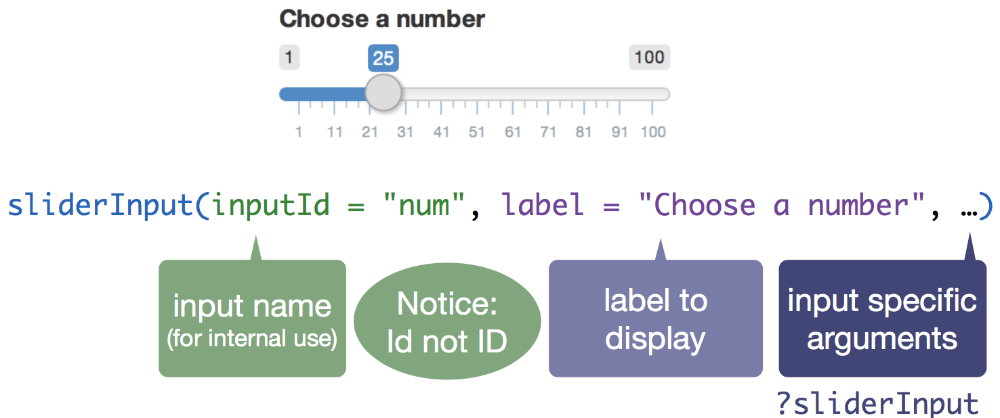
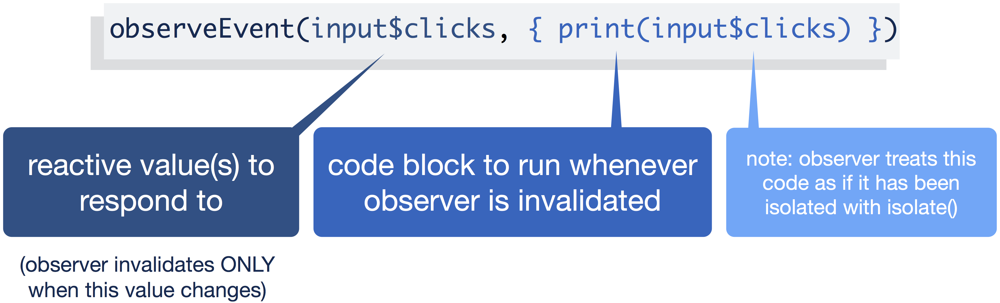

```{r packages, message = FALSE, warning = FALSE, echo=FALSE}
# Load packages.
packages <- c("devtools","knitr","leaflet","shiny","raster",
              "rgdal","RColorBrewer","here","pkgnet","praise",
              "rsconnect")


packages <- lapply(packages, FUN = function(x) {
  if(!require(x, character.only = TRUE)) {
    install.packages(x, repos = "http://cran.us.r-project.org")
    library(x, character.only = TRUE)
  }
})

```


```{r Setup, include=FALSE, results='hide', warning=FALSE}

# A Prefix nulling hook.

# Make sure to keep the default for normal processing.
default_output_hook <- knitr::knit_hooks$get("output")

# Output hooks handle normal R console output.
knitr::knit_hooks$set( output = function(x, options) {

  comment <- knitr::opts_current$get("comment")
  if( is.na(comment) ) comment <- ""
  can_null <- grepl( paste0( comment, "\\s*\\[\\d?\\]" ),
                     x, perl = TRUE)
  do_null <- isTRUE( knitr::opts_current$get("null_prefix") )
  if( can_null && do_null ) {
    # By default R print output aligns at the right brace.
    align_index <- regexpr( "\\]", x )[1] - 1
    # Two cases: start or newline
    re <- paste0( "^.{", align_index, "}\\]")
    rep <- comment
    x <- gsub( re, rep,  x )
    re <- paste0( "\\\n.{", align_index, "}\\]")
    rep <- paste0( "\n", comment )
    x <- gsub( re, rep,  x )
  }

  default_output_hook( x, options )

})

knitr::opts_template$set("kill_prefix"=list(comment=NA, null_prefix=TRUE))
knitr::knit_engines$set("html")

## Normal Setup From Here
library(knitr)

opts_chunk$set(fig.path="images/",
               cache.path="cache/",
            #   dev=c("png","pdf"),
            #  fig.width=5,
            #  fig.height=4.5,
            #  dpi=300,
            #  fig.show="hold",
            #  fig.lp="fig:",
               cache=TRUE,
            #  par=TRUE,
               echo=TRUE,
               message=FALSE,
               warning=FALSE)
```

## 

<div style="margin-left:-50px; width:900px">
```{r, echo=FALSE, out.width = "100%"}
# knitr::include_graphics("images/beer_shiny.mp4")

```
</div>

<small>https://davesteps.shinyapps.io/homebrewR/</small>

## Roadmap

- Introduction to `R Shiny`
    - Inputs and Outputs. The `ui` and `server` objects. A simple app template.
    - Adding reactivity. 7 useful reactive functions.
    - Customize the user interface of a Shiny App using HTML and CSS
- Example: Visualizing the World Development Indicators in Shiny
 
# Get started with R Shiny

This part will introduce you to `R Shiny` and build a simple first app.

<div align="center">
```{r, echo=FALSE, out.width = "25%"}
knitr::include_graphics("images/shiny_logo.png")
```
</div>

## Aside: Network of package deps

```{r, eval=FALSE}
library(pkgnet)
result <- CreatePackageReport('ggplot2')
```

```{r, echo=FALSE, out.width = "100%"}
# knitr::include_graphics("images/pkgnet_for_ggplot2.mov")

```

## The `switch()` function

Convenient shortening of an `if` statement that chooses its value according to the value of another variable. 

Really useful in Shiny apps where you might want to load different datasets or even environment files depending on one or more of the input menu choices.


```{r, eval=FALSE}
data <- read.csv(
  switch(company, 
         "apple" = "apple_data.csv", 
         "yahoo" = "yahoo_data.csv",
         "google" = "google_data.csv")
)
```

## Aside: Rock on with `praise()`

```{r}
praise("${EXCLAMATION}! Your final project is ${adjective}!")
```

```{r, echo=FALSE, out.width = "60%"}
knitr::include_graphics("images/rock_rule.jpeg")
```


## What is R Shiny?

- `R Shiny` is a web application framework developed by R Studio. 
- The package allows us to connect a running `R` session with an interactive HTML-based app.
- So you can turn your analyses into interactive web applications!
- Pro: No HTML, CSS, or JavaScript knowledge required
- This app can be run on your local computer or a server to make it accessible online for a wider audience.

## Tutorials and Webinars

R Studio has an a detailed tutorial, a gallery of examples, and several in-depth discussion of features at https://shiny.rstudio.com/.

R Studio also offers a [three-part video tutorial series on how to get started with Shiny](https://shiny.rstudio.com/tutorial/):  

* Part 1: How to build a Shiny app  
* Part 2: How to customize reactions   
* Part 3: How to customize appearance 

## Showcase of examples

Take a look at the [R Shiny show case](https://www.rstudio.com/products/shiny/shiny-user-showcase/) to get a feel what you can do with it.

## Showcase of examples

```{r, echo=FALSE, out.width = "100%"}

```

## What is shiny?

- Transport an R script (and its analysis) to a non-R user offline and online
- Shiny creates an app that will do the analysis in R without interacting with R on the part of the user


## A simple app

```{r, eval=TRUE, echo=FALSE, cache=FALSE}
library(shiny)

ui <- fluidPage(
  sliderInput(inputId = "num", 
    label = "Choose a number", 
    value = 25, min = 1, max = 100),
  plotOutput("hist")
)

server <- function(input, output) {
  output$hist <- renderPlot({
    hist(rnorm(input$num))
  })
}

shinyApp(ui = ui, server = server)
```


## A simple app

Let's take a closer look at this app:

```{r, eval=FALSE}
library(shiny)

ui <- fluidPage(
  sliderInput(inputId = "num", 
    label = "Choose a number", 
    value = 25, min = 1, max = 100),
  plotOutput("hist")
)

server <- function(input, output) {
  output$hist <- renderPlot({
    hist(rnorm(input$num))
  })
}

shinyApp(ui = ui, server = server)
```

## Here is a shiny app with multiple inputs

Open `Drinkr` example in RStudio. 

[located in `data/shiny_drinkr/shiny_app/`]

```{r, echo=FALSE, out.width = "60%"}

```

## App template

Try to run this in R. See what happens.

```{r, eval=FALSE}
library(shiny)
ui <- fluidPage()
server <- function(input, output) {}
shinyApp(ui = ui, server = server)
```


## Inputs and Outputs

Let's take a look at `Cancer-data` app.  
[Located in `data/shiny_cancer-data`]

```{r, echo=FALSE, out.width = "70%"}

```

## Adding elements to app

Add elements to your app as arguments to
```{r, eval=FALSE}
fluidPage()
 ui <- fluidPage(
  # *Input() functions,
  # *Output() functions
)
```

## Input

Create an input with an **`Input()`** function.

```{r, eval=TRUE, cache=FALSE}
sliderInput(inputId = "num",
  label = "Choose a number",
  value = 25, min = 1, max = 100)
```

```
<div class="form-group shiny-input-container">
  <label class="control-label" for="num">Choose a number</label>
  <input class="js-range-slider" id="num" data-min="1" data-max="100" data-from="25" data-step="1" data-grid="true" data-grid-num="9.9" data-grid-snap="false" data-keyboard="true" data-keyboard-step="1.01010101010101" data-drag-interval="true" data-data-type="number" data-prettify-separator=","/>
</div>
```

## Different **input** functions

```{r, echo=FALSE, out.width = "100%"}

```

## Input Syntax

```{r, echo=FALSE, out.width = "100%"}

```

## Different **output** functions

```{r, echo=FALSE, out.width = "100%"}

```

## Output Syntax

```{r, echo=FALSE, out.width = "100%"}

```

## Run the app

```{r, eval=FALSE}
library(shiny)
ui <- fluidPage(
  sliderInput(inputId = "num",
    label = "Choose a number",
    value = 25, min = 1, max = 100),
  ### <b>
  plotOutput("hist")
  ### </b>
)
server <- function(input, output) {}
shinyApp(ui = ui, server = server)
```

## No output yet?

- We did not specify any output yet. The plot output `hist` needs to be created.
- We need to tell the `server()` function how to use inputs to create outputs.

## The **`server()`** function

Save objects to display to `output$`

```
server <- function(input, output) {
  output$hist <- # code
}
```

## The **`server()`** function

Build objects to display with `render*()`

```
server <- function(input, output) {
  output$hist <- renderPlot({   })
```

## The **`server()`** function

The `render*()` function will create the type of output you want to display.

```{r, echo=FALSE, out.width = "100%"}

```

## The **`server()`** function

For our example, let's use:

```
 renderPlot({ hist(rnorm(100)) })
```

## The **`server()`** function

Now, let's map the user `input` values into `input$`. E.g. 

```
sliderInput(inputId = "num",...)
                 input$num
```

## The **`server()`** function

So, our whole `server()` function for this example is:

```
server <- function(input, output) {
  output$hist <- renderPlot({
    hist(rnorm(input$num))
  })
}
```

## The **`server()`** function - Recap

We are using the `server` function to connect inputs to outputs. Here are the three basic steps:

1. Save the output you want into `output$`
2. Build the output with the `render*()` function
3. Map input values with `input$`

Using inputs to build rendered Outputs is the "interactive" part of the shiny app.

## The full app code

```{r, eval=FALSE}
library(shiny)

ui <- fluidPage(
  sliderInput(inputId = "num", 
    label = "Choose a number", 
    value = 25, min = 1, max = 100),
  plotOutput("hist")
)

server <- function(input, output) {
  output$hist <- renderPlot({
    hist(rnorm(input$num))
  })
}

shinyApp(ui = ui, server = server)
```

## The full app

```{r, eval=TRUE, echo=FALSE, cache=FALSE}
library(shiny)

ui <- fluidPage(
  sliderInput(inputId = "num", 
    label = "Choose a number", 
    value = 25, min = 1, max = 100),
  plotOutput("hist")
)

server <- function(input, output) {
  output$hist <- renderPlot({
    hist(rnorm(input$num))
  })
}

shinyApp(ui = ui, server = server)
```

## More built-in examples

```
system.file("examples", package="shiny")

runExample("01_hello") # a histogram
runExample("02_text") # tables and data frames
runExample("03_reactivity") # a reactive expression
runExample("04_mpg") # global variables
runExample("05_sliders") # slider bars
runExample("06_tabsets") # tabbed panels
runExample("07_widgets") # help text and submit buttons
runExample("08_html") # Shiny app built from HTML
runExample("09_upload") # file upload wizard
runExample("10_download") # file download wizard
runExample("11_timer") # an automated timer
...
```

## Publishing your app to shinyapps.io

Follow the steps [here](https://shiny.rstudio.com/articles/shinyapps.html) on how to publish your app to the shinyapps.io site.

# Improving the interactive parts of your Shiny App

In this part, we will discuss how to improve the **reactivity** of the app in the `server` function of the app. 

## What is reactivity?

```{r, echo=FALSE, out.width = "100%"}

```

## What is reactivity?

```{r, echo=FALSE, out.width = "100%"}

```

## Reactive values

```{r, echo=FALSE, out.width = "100%"}

```

**Important**: Reactive values only work in reactive functions, e.g. `render*()`

## Common Functions vs. Reactive Expressions

- Each time you call a function, R will evaluate it.  
- Reactive expressions are lazy, they only get executed when their input changes.  
- Even if you call a reactive expression multiple
times, it only re-executes when its input(s) change.

## Reactive functions

There are seven reactive functions that are worth getting to know:

1. `render*()`
2. `reactive()`
3. `isolate()`
4. `actionButton()`
5. `observeEvent()`
6. `eventReactive()`
7. `reactiveValues()`

## Reactive functions #1: **`render*()`**

```{r, echo=FALSE, out.width = "100%"}

```

## Example 1: Two inputs

```{r, eval=FALSE}
ui <- fluidPage(
  ### <b>
  sliderInput(inputId = "num", 
    label = "Choose a number", 
    value = 25, min = 1, max = 100),
  textInput(inputId = "title", 
    label = "Write a title",
    value = "Histogram of Random Normal Values"),
  ### </b> 
  plotOutput("hist")
)

server <- function(input, output) {
  output$hist <- renderPlot({
    hist(rnorm(input$num), main = input$title)
  })
}

shinyApp(ui = ui, server = server)
```

## Example 1: Two inputs

```{r, eval=TRUE, echo=FALSE, cache=FALSE}
ui <- fluidPage(
  sliderInput(inputId = "num", 
    label = "Choose a number", 
    value = 25, min = 1, max = 100),
  textInput(inputId = "title", 
    label = "Write a title",
    value = "Histogram of Random Normal Values"),
  plotOutput("hist", width="500px", height="300px")
)

server <- function(input, output) {
  output$hist <- renderPlot({
    hist(rnorm(input$num), main = input$title)
  })
}

shinyApp(ui = ui, server = server)
```


## Example 2: Two outputs

```{r, eval=FALSE, echo=TRUE, cache=TRUE}
ui <- fluidPage(
  sliderInput(inputId = "num", 
    label = "Choose a number", 
    value = 25, min = 1, max = 100),
  plotOutput("hist"),
  verbatimTextOutput("stats")
)

server <- function(input, output) {
  ### <b> 
  output$hist <- renderPlot({
    hist(rnorm(input$num))
  })
  output$stats <- renderPrint({
    summary(rnorm(input$num))
  })
  ### </b> 
}

shinyApp(ui = ui, server = server)
```

## Example 2: Two outputs

```{r, eval=TRUE, echo=FALSE, cache=FALSE}
ui <- fluidPage(
  sliderInput(inputId = "num", 
    label = "Choose a number", 
    value = 25, min = 1, max = 100),
  plotOutput("hist", width="500px", height="300px"),
  verbatimTextOutput("stats")
)

server <- function(input, output) {
  output$hist <- renderPlot({
    hist(rnorm(input$num))
  })
  output$stats <- renderPrint({
    summary(rnorm(input$num))
  })
}

shinyApp(ui = ui, server = server)
```

## Not quite right

```{r, echo=FALSE, out.width = "100%"}

```

## Not quite right

```{r, echo=FALSE, out.width = "100%"}

```

## Reactive functions #2: **`reactive()`**

`reactive()` will build a reactive object (actually a function) that will update when its `input$` changes. The object can be used downstream in other reactive functions.

```{r, echo=FALSE, out.width = "100%"}
knitr::include_graphics("images/shiny_reactive_fun2.png")
```

## Example 3: Reactive data set{.smaller}

```{r, eval=FALSE, echo=TRUE, cache=TRUE}
ui <- fluidPage(
  sliderInput(inputId = "num", 
    label = "Choose a number", 
    value = 25, min = 1, max = 100),
  plotOutput("hist"),
  verbatimTextOutput("stats")
)

server <- function(input, output) {
  
### <b>
  data <- reactive({
    rnorm(input$num)
  })
### </b>

  output$hist <- renderPlot({
    hist(data())
  })
  output$stats <- renderPrint({
    summary(data())
  })
}

shinyApp(ui = ui, server = server)
```

## Example 3: Reactive data set

```{r, eval=TRUE, echo=FALSE, cache=FALSE}
ui <- fluidPage(
  sliderInput(inputId = "num", 
    label = "Choose a number", 
    value = 25, min = 1, max = 100),
  plotOutput("hist"),
  verbatimTextOutput("stats")
)

server <- function(input, output) {
  
  data <- reactive({
    rnorm(input$num)
  })
  
  output$hist <- renderPlot({
    hist(data())
  })
  output$stats <- renderPrint({
    summary(data())
  })
}

shinyApp(ui = ui, server = server)
```

## Reactive functions #3: **`isolate()`**

`isolate()` will create _non_-reactive object.

```{r, echo=FALSE, out.width = "100%"}

```

- we can use these non-reactive values in our normal R code.
- our code will not change as we change the input (e.g. a text field)

## Example 4: Isolate {.smaller}

```{r, eval=FALSE, echo=TRUE, cache=TRUE}
ui <- fluidPage(
  sliderInput(inputId = "num", 
    label = "Choose a number", 
    value = 25, min = 1, max = 100),
  textInput(inputId = "title", 
    label = "Write a title",
    value = "Histogram of Random Normal Values"),
  plotOutput("hist")
)

server <- function(input, output) {
  output$hist <- renderPlot({
    hist(rnorm(input$num), 
         ###<b>
         main = isolate(input$title))
         ###</b>
  })
}

shinyApp(ui = ui, server = server)
```

## Example 4: Isolate {.smaller}

```{r, eval=TRUE, echo=FALSE, cache=FALSE}
ui <- fluidPage(
  sliderInput(inputId = "num", 
    label = "Choose a number", 
    value = 25, min = 1, max = 100),
  textInput(inputId = "title", 
    label = "Write a title",
    value = "Histogram of Random Normal Values"),
  plotOutput("hist", width="500px", height="300px")
)

server <- function(input, output) {
  output$hist <- renderPlot({
    hist(rnorm(input$num), main = isolate(input$title))
  })
}

shinyApp(ui = ui, server = server)
```

## Reactive fun #4: **`actionButton()`**

```{r, echo=FALSE, out.width = "100%"}

```

## Example 5: Action Button

```{r, eval=FALSE, echo=TRUE, cache=TRUE}
ui <- fluidPage(
  ###<b>
  actionButton(inputId = "clicks", 
    label = "Click me")
  ###</b>
)

server <- function(input, output) {
  observeEvent(input$clicks, {
    print(as.numeric(input$clicks))
  })
}

shinyApp(ui = ui, server = server)
```

## Example 5: Action Button

```{r, eval=TRUE, echo=FALSE, cache=FALSE}
ui <- fluidPage(
  actionButton(inputId = "clicks", 
    label = "Click me")
)

server <- function(input, output) {
  observeEvent(input$clicks, {
    print(as.numeric(input$clicks))
  })
}

shinyApp(ui = ui, server = server)
```

## Reactive fun #5: **`observeEvent()`**

Triggers some code to run on the server based on, you guessed it, observing an event (e.g. a click).

```{r, echo=FALSE, out.width = "100%"}

```

<!-- Not that interesting to show:

## Example 6: Observe an Event{.smaller}

```{r, eval=FALSE, echo=TRUE, cache=TRUE}
ui <- fluidPage(
  sliderInput(inputId = "num", 
    label = "Choose a number",
    min = 1, max = 100, value = 25),
  actionButton(inputId = "go", 
    label = "Print Value")
)

server <- function(input, output) {
  
  # observe responds to the print button
  # but not the slider
  observeEvent(input$go, {
    print(as.numeric(input$num))
  })
}

shinyApp(ui = ui, server = server)
```

## Example 6: Observe an Event

```{r, eval=TRUE, echo=FALSE, cache=FALSE}
ui <- fluidPage(
  sliderInput(inputId = "num", 
    label = "Choose a number",
    min = 1, max = 100, value = 25),
  actionButton(inputId = "go", 
    label = "Print Value")
)

server <- function(input, output) {
  
  # observe responds to the print button
  # but not the slider
  observeEvent(input$go, {
    print(as.numeric(input$num))
  })
}

shinyApp(ui = ui, server = server)
```

-->

## Reactive fun #6: **`eventReactive()`**

A reactive expression that only responds to specific values.

```{r, echo=FALSE, out.width = "100%"}

```


## Example 7: Reactive Expression{.smaller}

```{r, eval=FALSE, echo=TRUE, cache=TRUE}
ui <- fluidPage(
  sliderInput(inputId = "num", 
    label = "Choose a number", 
    value = 25, min = 1, max = 100),
  actionButton(inputId = "go", 
    label = "Update"),
  plotOutput("hist")
)

server <- function(input, output) {
  ### <b>
  data <- eventReactive(input$go, {
    rnorm(input$num) 
  ### </b>
  })
  
  output$hist <- renderPlot({
    hist(data())
  })
}

shinyApp(ui = ui, server = server)
```

## Example 7: Reactive Expression

```{r, eval=TRUE, echo=FALSE, cache=FALSE}
ui <- fluidPage(
  sliderInput(inputId = "num", 
    label = "Choose a number", 
    value = 25, min = 1, max = 100),
  actionButton(inputId = "go", 
    label = "Update"),
  plotOutput("hist", width="500px", height="300px")
)

server <- function(input, output) {
  ### <b>
  data <- eventReactive(input$go, {
    rnorm(input$num) 
  ### </b>
  })
  
  output$hist <- renderPlot({
    hist(data())
  })
}

shinyApp(ui = ui, server = server)
```

## Reactive fun #7: **`reactiveValues()`**

Creates a list of reactive values to manipulate programmatically.

```{r, echo=FALSE, out.width = "100%"}

```


## Example 8: Reactive Values{.smaller}

```{r, eval=FALSE, echo=TRUE, cache=TRUE}
ui <- fluidPage(
  actionButton(inputId = "norm", label = "Normal"),
  actionButton(inputId = "unif", label = "Uniform"),
  plotOutput("hist")
)

server <- function(input, output) {
  ### <b>
  rv <- reactiveValues(data = rnorm(100))
  ### </b>

  observeEvent(input$norm, { rv$data <- rnorm(100) })
  observeEvent(input$unif, { rv$data <- runif(100) })

  output$hist <- renderPlot({ 
    hist(rv$data) 
  })
}

shinyApp(ui = ui, server = server)
```

## Example 8: Reactive Values

```{r, eval=TRUE, echo=FALSE, cache=FALSE}
ui <- fluidPage(
  actionButton(inputId = "norm", label = "Normal"),
  actionButton(inputId = "unif", label = "Uniform"),
  plotOutput("hist")
)

server <- function(input, output) {

  rv <- reactiveValues(data = rnorm(100))

  observeEvent(input$norm, { rv$data <- rnorm(100) })
  observeEvent(input$unif, { rv$data <- runif(100) })

  output$hist <- renderPlot({ 
    hist(rv$data) 
  })
}

shinyApp(ui = ui, server = server)
```

## Reactive functions summary

```{r, echo=FALSE, out.width = "100%"}

```

# Customizing Appearance of your Shiny App

In this part, we will learn how to customize the user interface of a Shiny App using some HTML and CSS. Let's prettify!

## The **U**ser **I**nterface

- the `ui()` part of your app creates HTML representations of your R functions
- `fluidPage()` is a quick set up of the UI to call the output of a complete HTML page to the browser

## Adding static content

- Our page is in HTML. So any usual HTML code works and can be added to the app.
- Google is your friend.

## Adding static content

```{html}
<div class="container-fluid">
  <h1>Final Project</h1>
  <p style="font-family:Impact">See my other work at my
    <a href=https://github.com/tbrambor>GitHub</a> page.</p>
</div> 
```

## Using `tag()` functions{.smaller}

```{r, eval=TRUE, echo=TRUE, cache=FALSE}
ui <- fluidPage(
  h1("My Shiny App"),
  p(style = "font-family:Impact",
    "See other apps in the",
    a("Shiny Showcase",
      href = "http://www.rstudio.com/
      products/shiny/shiny-user-showcase/")
  )
)

server <- function(input, output){}

shinyApp(ui = ui, server = server)
```

## The full `tag()` list of functions{.smaller}

```{r, echo=FALSE}
options(max.print = 150)
names(tags)
```

## `tag()` example: `H1`

```{r, echo=TRUE}
tags$h1
```
```{r, echo=TRUE}
tags$h1("My Title Here")
```

## `tag()` example: `a`

```{r, echo=TRUE}
tags$a(href = "http://qmss.columbia.edu/", "QMSS at Columbia")
```

## Common HTML tags

All these have wrapper functions. No need to call `tags$*`

```{r, echo=FALSE, out.width = "100%"}

```

## A simple page with HTML

```{r, echo=TRUE, cache=TRUE, eval=FALSE}
ui <- fluidPage(
  h1("Greatest App Ever"),
  img(height = 100, 
      width = 100, 
      src = "qmss_logo.jpg"),
  p("Go the QMSS website", a(href="qmss.columbia.edu","here")),
  hr(),
  p("We can write normal text."),
  p("And a bit more, even", strong("nesting"),em("other"),"stuff."),
  p(style="font-family:Impact",
    "Or change the font.")
)

server <- function(input, output){}
shinyApp(ui = ui, server = server)
```

## A simple page with HTML

```{r, echo=FALSE, cache=FALSE, eval=TRUE}
ui <- fluidPage(
  h1("Greatest App Ever"),
  img(height = 100, 
      width = 100, 
      src = "https://pbs.twimg.com/profile_images/1251474450/QMSS_Logo_Final_400x400.jpg"),
  p("Go the QMSS website", a(href="qmss.columbia.edu","here")),
  hr(),
  p("We can write normal text."),
  p("And a bit more, even", strong("nesting"),em("other"),"stuff."),
  p(style="font-family:Impact",
    "Or change the font.")
)

server <- function(input, output){}
shinyApp(ui = ui, server = server)
```

# An application: Visualizing the World Development Indicators with a time-series graph and a leaflet map

## Final Output

```{r, echo=FALSE, out.width = "100%"}

```


