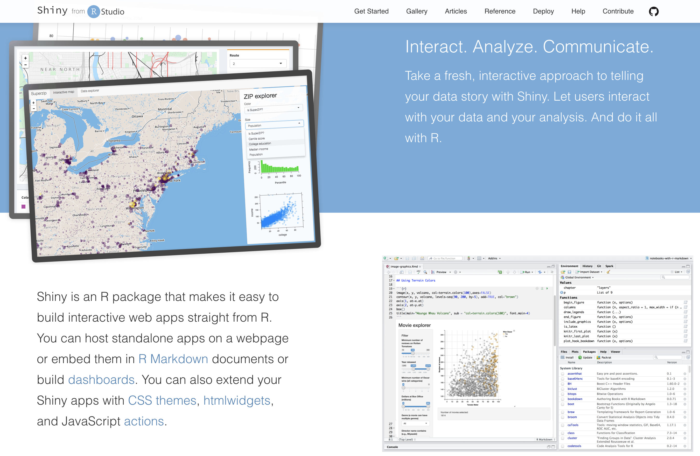

```{r packages, fmessage = FALSE, warning = FALSE, echo=FALSE, results='hide'}
library(knitr)
library(leaflet)
library(shiny)
library(rgdal)
library(RColorBrewer)
library(flexdashboard)
library(shinydashboard)
```


```{r Setup, warning=FALSE, fmessage=FALSE, include=FALSE, results='hide'}

# A Prefix nulling hook.

# Make sure to keep the default for normal processing.
default_output_hook <- knitr::knit_hooks$get("output")

# Output hooks handle normal R console output.
knitr::knit_hooks$set( output = function(x, options) {

  comment <- knitr::opts_current$get("comment")
  if( is.na(comment) ) comment <- ""
  can_null <- grepl( paste0( comment, "\\s*\\[\\d?\\]" ),
                     x, perl = TRUE)
  do_null <- isTRUE( knitr::opts_current$get("null_prefix") )
  if( can_null && do_null ) {
    # By default R print output aligns at the right brace.
    align_index <- regexpr( "\\]", x )[1] - 1
    # Two cases: start or newline
    re <- paste0( "^.{", align_index, "}\\]")
    rep <- comment
    x <- gsub( re, rep,  x )
    re <- paste0( "\\\n.{", align_index, "}\\]")
    rep <- paste0( "\n", comment )
    x <- gsub( re, rep,  x )
  }

  default_output_hook( x, options )

})

knitr::opts_template$set("kill_prefix"=list(comment=NA, null_prefix=TRUE))


## Normal Setup From Here
library(knitr)

opts_chunk$set(fig.path="images/",
               cache.path="cache/",
            #   dev=c("png","pdf"),
            #  fig.width=5,
            #  fig.height=4.5,
            #  dpi=300,
            #  fig.show="hold",
            #  fig.lp="fig:",
               cache=TRUE,
            #  par=TRUE,
               echo=TRUE,
               message=FALSE,
               warning=FALSE)
```

## Roadmap

- Final Project: some more details 
- Shiny Part II
- Example: Visualizing the World Development Indicators in Shiny
 
# Final Project

## Final Video Presentations - Details

```{r, echo=FALSE, out.width = "50%"}

```

- Prepare a 3-5 min presentation. 
- Remember: Everyone can look at your website output even before class or with you.

## Final Video Presentations - Software

- [SnagIt](https://www.techsmith.com/screen-capture.html) or [Camtasia](https://www.techsmith.com/video-editor.html): Screen capture and
recording softwares. Use the 15-day trial. (Win/Mac)
- [Screencastify](https://www.screencastify.com/): Record, edit, and share videos directly in the Chrome Browser. Videos up to 5min free. (Win/Mac. Chrome needed)
- [Loom](https://www.loom.com/): Another Chrome extension for screen capture and video creation. Education accounts are [free after verification](https://support.loom.com/hc/en-us/articles/360006579637-Loom-Pro-Free-for-Students-and-Teachers). (Win/Mac. Chrome needed)

## Feedback to other project

- Each student will provide comments about the visualizations used in another project. These comments can then be used to inform some final adjustments before submission.  
- We will post links to all final projects on a website.
- Everyone will receive an email specifying which project they should comment on.
- Comments are anonymous and shared on Github.


## How is the final project evaluated?

1. **Visualization**  
    - Is your visualization effective in answering the questions you intended to address? Is the storytelling clear?  
    - Do the visualizations follow visualization principles? 
    - Is it informative and interesting for a user? 
    - Does it allow some sensible interactive exploration?  
2. **Implementation**  
    - What is the quality of your implementation? 
    - Is it appropriately polished, robust, and reliable?  
3. **Presentation**     
    - Are your web site and presentation clear, engaging, and effective?
    
## Publishing your final project

- **OPTION A:** Publish you final project on [GitHub pages](https://pages.github.com/) (or any other web host you like). Simply convert your .rmd file into a HTML document and enable GitHub pages for a public(!) repository of your choice to render the result. Or make a simple website with a few child pages linked together.  
- **OPTION B:** You can publish [(multiple) interactive documents](http://rmarkdown.rstudio.com/authoring_shiny.html#shinyapps) to the [ShinyApps](http://www.shinyapps.io/) hosted service. There are limits to the amount of use, but that should be sufficient for sharing in class.  
- **OPTION C:** Use [RPubs.com](https://rpubs.com/) to publish a RMarkdown document directly from R. 

Beside the visualizations, your process book, code and data should be linked from the web site as well. Make sure to cite any code, ideas, and other insights you used.

# Visualizing World Development Indicators

## Part 1 - Making the plot

```{r, echo=FALSE, out.width = "100%"}

```

## Switch to the tutorial

Please start a new RStudio session by opening the file `wdi-shiny_part1.Rproj` to follow along in the tutorial.

```{r, echo=FALSE, out.width = "50%"}

```

# Intro to R Shiny - Part II

## Where were we

1. Building a simple shiny app
2. Using reactive functions to customize behavior
3. **Make it pretty** - today's lecture

```{r, echo=FALSE, out.width = "100%"}
knitr::include_graphics("images/shiny_showcase.png")
```

## HTML is the basis of the UI

```{r, eval=TRUE}
ui <- fluidPage()
```
```{r, echo=FALSE}
print(ui)
```

## HTML is the basis of the UI

```{r, split=TRUE, eval=FALSE}
sliderInput(inputId = "num",
  label = "Choose a number",
  value = 25, min = 1, max = 100)
```

```{r, echo=FALSE}
print(sliderInput(inputId = "num",
  label = "Choose a number",
  value = 25, min = 1, max = 100))
```

```{r, split=TRUE, eval=FALSE}
plotOutput("myPlot")
```

```{r, echo=FALSE}
print(plotOutput("myPlot"))
```

## HTML is the basis of the UI

```{r, echo=FALSE, out.width = "100%"}

```

## _Recall:_ The **U**ser **I**nterface

- the `ui()` part of your app creates HTML representations of your R functions
- `fluidPage()` is a quick set up of the UI to call the output of a complete HTML page to the browser

# Creating a layout

- just as in HTML pages, we can create a layout of the page in which we place all visual elements.
- take a look at this [layout tutorial for shiny](https://shiny.rstudio.com/articles/layout-guide.html) for a nice introduction of some of the layout elements

## Shiny grid layout system: `fluidRow()`

- `fluidRow()` and `column()` simply divide the page into rows and columns. Think of a table (or grid) as a visual analogue.

```{r, echo=FALSE, out.width = "100%"}

```

## Shiny grid layout system: `column()`

- `column()` adds columns within a row. Each new column goes to the left of the previous column.
- You can specify the width and offset of each column out of 12.

```{r, echo=FALSE, out.width = "100%"}

```

## Ex: `fluidRow` and `column`{.smaller}

```{r, eval=FALSE, echo=TRUE}
ui <- fluidPage(
  fluidRow(
    column(width = 4,
      "width = 4"
    ),
    column(width = 3, offset = 2,
      "width 3, offset 2"
    )
  )
)
shinyApp(ui, server = function(input, output) { })
```

```{r, cache=FALSE, echo=FALSE}
ui <- fluidPage(
  fluidRow(
    column(width = 4,
      "width = 4",
      style = "background-color:#9EB9D4; 
               line-height: 5;
               font-size:30px"
    ),
    column(width = 3, offset = 2,
      "width 3, offset 2",
      style = "background-color:#FA8072;
               line-height: 2.5;
               font-size:30px"
    )
  )
)
shinyApp(ui, server = function(input, output) { })
```

## Segmenting layouts using panels

- we can group multiple elements into a panel which has its own properties
- provides a simple visual clue for users of what elements are grouped together

## `wellPanel()`{.smaller}

```{r, eval=FALSE}
ui <- fluidPage(
### <b>
    wellPanel(
### </b>
      sliderInput(inputId = "num", 
      label = "Choose a number", 
      value = 25, min = 1, max = 100),
    textInput(inputId = "title", 
      label = "Write a title",
      value = "Histogram of Random Normal Values")
  ),
  plotOutput("hist")
)

server <- function(input, output) {
  output$hist <- renderPlot({
    hist(rnorm(input$num), main = input$title)
  })
}

shinyApp(ui = ui, server = server)
```

## `wellPanel()`

```{r, eval=TRUE, echo=FALSE, cache=FALSE}
ui <- fluidPage(
  column(width=7,
### <b>
    wellPanel(
### </b>
      sliderInput(inputId = "num", 
      label = "Choose a number", 
      value = 25, min = 1, max = 100),
    textInput(inputId = "title", 
      label = "Write a title",
      value = "Histogram of Random Normal Values")
  ),
  plotOutput("hist", height="250px")
  )

)

server <- function(input, output) {
  output$hist <- renderPlot({
    hist(rnorm(input$num), main = input$title)
  })
}

shinyApp(ui = ui, server = server)
```

## More panels in shiny

```{r, echo=FALSE, out.width = "100%"}

```

## Tabs and Navigation Panels

- We can subdivide the user-interface into discrete sections. 
- This can be accomplished using the `tabsetPanel()` function. 

## Example: `tabsetPanel()`

```{r, echo=TRUE, eval=FALSE}
ui <- fluidPage(title = "Random generator",
  ### <b>
   tabsetPanel( 
     tabPanel(title = "Normal data",
  ### </b>
      plotOutput("norm"),
      actionButton("renorm", "Resample")
    ),
  ### <b>
    tabPanel(title = "Uniform data",
  ### </b>
      plotOutput("unif"),
      actionButton("reunif", "Resample")
    ),
  ### <b>
    tabPanel(title = "Chi Squared data",
  ### </b>
      plotOutput("chisq"),
      actionButton("rechisq", "Resample")
    )
  )
)

server <- function(input, output) {# Excluded for brevity}
shinyApp(server = server, ui = ui)
```

## Example: `tabsetPanel()`

```{r, echo=FALSE, cache=FALSE}
# 05-tabs.R

library(shiny)

ui <- fluidPage(title = "Random generator",
  tabsetPanel(              
    tabPanel(title = "Normal data",
      plotOutput("norm"),
      actionButton("renorm", "Resample")
    ),
    tabPanel(title = "Uniform data",
      plotOutput("unif"),
      actionButton("reunif", "Resample")
    ),
    tabPanel(title = "Chi Squared data",
      plotOutput("chisq"),
      actionButton("rechisq", "Resample")
    )
  )
)

server <- function(input, output) {
  
  rv <- reactiveValues(
    norm = rnorm(500), 
    unif = runif(500),
    chisq = rchisq(500, 2))
  
  observeEvent(input$renorm, { rv$norm <- rnorm(500) })
  observeEvent(input$reunif, { rv$unif <- runif(500) })
  observeEvent(input$rechisq, { rv$chisq <- rchisq(500, 2) })
  
  output$norm <- renderPlot({
    hist(rv$norm, breaks = 30, col = "grey", border = "white",
      main = "500 random draws from a standard normal distribution")
  })
  output$unif <- renderPlot({
    hist(rv$unif, breaks = 30, col = "grey", border = "white",
      main = "500 random draws from a standard uniform distribution")
  })
  output$chisq <- renderPlot({
    hist(rv$chisq, breaks = 30, col = "grey", border = "white",
       main = "500 random draws from a Chi Square distribution with two degree of freedom")
  })
}

shinyApp(server = server, ui = ui)
```

## `tabsetPanel()` - with headers

```{r, echo=FALSE, cache=FALSE, fig.heigh=3}

shinyUI(fluidPage(
  
  titlePanel("Application Title"),
  
  navlistPanel(
    "Header A",
    tabPanel("Component 1"),
    tabPanel("Component 2"),
    "Header B",
    tabPanel("Component 3"),
    tabPanel("Component 4"),
    widths = c(5,10)
  )
))
```

## Sidebar navigation with `navlistPanel()`

- you can also add a navigation on the sidebar using a `navlistPanel()`
- instead of tabs, we thus have list of items in the sidebar
- we can add headings and separators to make things visually appealing and easy for the user

## Example: `navlistPanel()`

```{r, echo=TRUE, eval=FALSE}
ui <- fluidPage(title = "Random generator",
  ### <b>
  navlistPanel(              
    tabPanel(title = "Normal data",
  ### </b>
  plotOutput("norm"),
      actionButton("renorm", "Resample")
    ),
  ### <b>
    tabPanel(title = "Uniform data",
  ### </b>
      plotOutput("unif"),
      actionButton("reunif", "Resample")
    ),
  ### <b>
    tabPanel(title = "Chi Squared data",
  ### </b>
      plotOutput("chisq"),
      actionButton("rechisq", "Resample")
    )
  )
)
server <- function(input, output) { # omitted for brevity }
shinyApp(server = server, ui = ui)
```

## Example: `navlistPanel()`

```{r, echo=FALSE, cache=FALSE}
library(shiny)

ui <- fluidPage(title = "Random generator",
  navlistPanel(              
    tabPanel(title = "Normal data",
      plotOutput("norm"),
      actionButton("renorm", "Resample")
    ),
    tabPanel(title = "Uniform data",
      plotOutput("unif"),
      actionButton("reunif", "Resample")
    ),
    tabPanel(title = "Chi Squared data",
      plotOutput("chisq"),
      actionButton("rechisq", "Resample")
    )
  )
)

server <- function(input, output) {
  
  rv <- reactiveValues(
    norm = rnorm(500), 
    unif = runif(500),
    chisq = rchisq(500, 2))
  
  observeEvent(input$renorm, { rv$norm <- rnorm(500) })
  observeEvent(input$reunif, { rv$unif <- runif(500) })
  observeEvent(input$rechisq, { rv$chisq <- rchisq(500, 2) })
  
  output$norm <- renderPlot({
    hist(rv$norm, breaks = 30, col = "grey", border = "white",
      main = "500 random draws from a standard normal distribution")
  })
  output$unif <- renderPlot({
    hist(rv$unif, breaks = 30, col = "grey", border = "white",
      main = "500 random draws from a standard uniform distribution")
  })
  output$chisq <- renderPlot({
    hist(rv$chisq, breaks = 30, col = "grey", border = "white",
       main = "500 random draws from a Chi Square distribution with two degree of freedom")
  })
}

shinyApp(server = server, ui = ui)
```

## Pre-canned Layouts in Shiny

- you can custom-make your own layout or use one of the several pre-packaged layouts that come with shiny

## `sidebar()` layout

```{r, echo=TRUE, eval=FALSE}
ui <- fluidPage(
### <b>
    sidebarLayout(
    sidebarPanel(
### </b>
      sliderInput(inputId = "num", 
        label = "Choose a number", 
        value = 25, min = 1, max = 100),
      textInput(inputId = "title", 
        label = "Write a title",
        value = "Histogram of Random Normal Values")
    ),
### <b>
    mainPanel(
### </b>
      plotOutput("hist")
    )
  )
)

server <- function(input, output) { # omitted for brevity}
shinyApp(ui = ui, server = server)
```

## `sidebar()` layout

```{r, echo=FALSE, cache=FALSE}
# 04-well.R

library(shiny)

ui <- fluidPage(
  sidebarLayout(
    sidebarPanel(
      sliderInput(inputId = "num", 
        label = "Choose a number", 
        value = 25, min = 1, max = 100),
      textInput(inputId = "title", 
        label = "Write a title",
        value = "Histogram of Random Normal Values"),
    style = "background-color:#e6f2ff;"
    ),
    mainPanel(
      plotOutput("hist")
    )
  )
)

server <- function(input, output) {
  output$hist <- renderPlot({
    hist(rnorm(input$num), main = input$title)
  })
}

shinyApp(ui = ui, server = server)
```

## Navigation Bar with more components

- The `navbarPage()` function helps us to create applications with multiple top-level components.
- _Note: `navbarPage()` replaces `fluidPage()`. Requires a title._

## Example: `navbarPage()`

```{r, echo=TRUE, eval=FALSE}
### <b>
ui <- navbarPage(title = "Random generator",
  tabPanel(title = "Normal data",
### </b>
    plotOutput("norm"),
    actionButton("renorm", "Resample")
  ),
### <b>
  navbarMenu(title = "Other data",
    tabPanel(title = "Uniform data",
### </b>
      plotOutput("unif"),
      actionButton("reunif", "Resample")
    ),
### <b>
    tabPanel(title = "Chi Squared data",
### </b>
      plotOutput("chisq"),
      actionButton("rechisq", "Resample")
    )
  )
)
server <- function(input, output) { # omitted for brevity}
shinyApp(server = server, ui = ui)
```


## Example: `navbarPage()`

```{r, echo=FALSE, cache=FALSE}
# 06-navlist.R

library(shiny)

ui <- navbarPage(title = "Random generator",
  tabPanel(title = "Normal data",
    plotOutput("norm"),
    actionButton("renorm", "Resample")
  ),
  navbarMenu(title = "Other data",
    tabPanel(title = "Uniform data",
      plotOutput("unif"),
      actionButton("reunif", "Resample")
    ),
    tabPanel(title = "Chi Squared data",
      plotOutput("chisq"),
      actionButton("rechisq", "Resample")
    )
  )
)

server <- function(input, output) {
  
  rv <- reactiveValues(
    norm = rnorm(500), 
    unif = runif(500),
    chisq = rchisq(500, 2))
  
  observeEvent(input$renorm, { rv$norm <- rnorm(500) })
  observeEvent(input$reunif, { rv$unif <- runif(500) })
  observeEvent(input$rechisq, { rv$chisq <- rchisq(500, 2) })
  
  output$norm <- renderPlot({
    hist(rv$norm, breaks = 30, col = "grey", border = "white",
      main = "500 random draws from a standard normal distribution")
  })
  output$unif <- renderPlot({
    hist(rv$unif, breaks = 30, col = "grey", border = "white",
      main = "500 random draws from a standard uniform distribution")
  })
  output$chisq <- renderPlot({
    hist(rv$chisq, breaks = 30, col = "grey", border = "white",
       main = "500 random draws from a Chi Square distribution with two degree of freedom")
  })
}

shinyApp(server = server, ui = ui)
```

## Dashboards out of the box

There are two shiny add-on packages that provide ready-made layouts for Shiny dashboard pages: `flexdashboard` and `shinydashboard`.

**[flexdashboard](https://rmarkdown.rstudio.com/flexdashboard/)**

Examples: [Neighboorhood Diversity](https://walkerke.shinyapps.io/neighborhood_diversity/), [Linked Brushing](https://jjallaire.shinyapps.io/shiny-ggplot2-brushing/), [Multi Dropdown Data Explorer](https://jjallaire.shinyapps.io/shiny-ggplot2-diamonds/)

**[shinydashboard](https://rstudio.github.io/shinydashboard)**

Examples: [CRAN downloads streaming](https://gallery.shinyapps.io/087-crandash/), [Flights Drill down with dynamic tabs and DB connection](https://edgarruiz.shinyapps.io/db-dashboard/), [Bus map](https://gallery.shinyapps.io/086-bus-dashboard/)


## `shinydashboard::dashboardPage()`

```{r, echo=FALSE, cache=FALSE}
library(shinydashboard)

ui <- dashboardPage(
  dashboardHeader(title = "Info boxes"),
  dashboardSidebar(),
  dashboardBody(
    # infoBoxes with fill=FALSE
    fluidRow(
      # A static infoBox
      infoBox("New Orders", 10 * 2, icon = icon("credit-card")),
      # Dynamic infoBoxes
      infoBoxOutput("progressBox"),
      infoBoxOutput("approvalBox")
    ),

    # infoBoxes with fill=TRUE
    fluidRow(
      infoBox("New Orders", 10 * 2, icon = icon("credit-card"), fill = TRUE),
      infoBoxOutput("progressBox2"),
      infoBoxOutput("approvalBox2")
    ),

    fluidRow(
      # Clicking this will increment the progress amount
      box(width = 4, actionButton("count", "Increment progress"))
    )
  )
)

server <- function(input, output) {
  output$progressBox <- renderInfoBox({
    infoBox(
      "Progress", paste0(25 + input$count, "%"), icon = icon("list"),
      color = "purple"
    )
  })
  output$approvalBox <- renderInfoBox({
    infoBox(
      "Approval", "80%", icon = icon("thumbs-up", lib = "glyphicon"),
      color = "yellow"
    )
  })

  # Same as above, but with fill=TRUE
  output$progressBox2 <- renderInfoBox({
    infoBox(
      "Progress", paste0(25 + input$count, "%"), icon = icon("list"),
      color = "purple", fill = TRUE
    )
  })
  output$approvalBox2 <- renderInfoBox({
    infoBox(
      "Approval", "80%", icon = icon("thumbs-up", lib = "glyphicon"),
      color = "yellow", fill = TRUE
    )
  })
}

shinyApp(ui, server)
```


# Style your app with CSS

## What does CSS do?

- most styling and customization of the appearance of website elements is done through CSS (Cascading Style Sheets)

```{r, echo=FALSE, out.width = "50%"}


```

- if you are interested in learning more about CSS, I recommend the [CSS and HTML tutorial at codeacademy](https://www.codecademy.com/learn/web)

## CSS in Shiny

- Shiny uses the popular [Bootstrap 3 CSS framwework](http://getbootstrap.com/).

```{r, echo=FALSE, out.width = "100%"}

```

## CSS in Shiny

There are three ways Shiny works with CSS. To get CSS into your Shiny App, you can:

1. Add style sheets to the `www` directory
2. Add CSS to your HTML header
3. Add styling directly to HTML tags

## Add style sheet to `www` directory

- Lot's of nice, free themes that work with bootstrap available from http://bootswatch.com/
- Download a theme and add it the `www` folder of your app. 
- Alter anything you want in the global CSS file

```{r, echo=FALSE, out.width = "100%"}

```

## Example: style sheet in `www` directory

```{r, echo=TRUE, eval=FALSE, cache=FALSE}
ui <- fluidPage(
### <b>
  theme = "bootstrap_slate.css",  # Saved in the www folder
  tags$h1("My application", style = "color:#DAA520;"), # CSS Style passed directly
### </b>
  titlePanel("My Application"),
  sidebarLayout(
    sidebarPanel(
      sliderInput("obs",
                  "Number of observations:",
                  min = 0,
                  max = 1000,
                  value = 500)),
    mainPanel(
      plotOutput("distPlot")
    )
  )
)
server <- function(input, output) { # omitted for brevity}
shinyApp(ui, server)
```

## {.columns-2}

```{r, echo=FALSE, eval=TRUE, cache=FALSE, out.width="50%"}
shinyAppDir("data/shiny_CSS/noCSS/")
```

<br>

```{r, echo=FALSE, eval=TRUE, cache=FALSE, out.width="50%"}
shinyAppDir("data/shiny_CSS/withCSS/")
```

## What we learned

```{r, echo=FALSE, out.width = "100%"}

```

# Continuing our sample application

Visualizing the World Development Indicators with a time-series graph and a leaflet map.

## What we want

```{r, echo=FALSE, out.width = "100%"}
knitr::include_graphics("images/wdi_example_preview.gif")
```

## To the tutorial

Please start a new RStudio session by opening the file `wdi-shiny_part2.Rproj` to follow along in the tutorial. Part II starts at line 480.

```{r, echo=FALSE, out.width = "50%"}

```

# Other Resources

## Shiny Website

The [Shiny website](https://shiny.rstudio.com/) has plenty of tutorials, code for small examples, a gallery of full projects etc. Check it out.

```{r, echo=FALSE, out.width = "80%"}

```

## Examples

About [180 Demo Examples](https://github.com/rstudio/shiny-examples) are included in the shiny package and can be called directly from R and are all hosted.

For your convenience, I have also added them to this week's data folder. Let's take a look.

## Highcharter and Themes

http://gallery.shinyapps.io/118-highcharter-births

```{r, echo=FALSE, eval=FALSE, cache=FALSE, out.width="50%"}
shiny::runApp("data/shiny_examples/118-highcharter-births")
```

## Bus Dashboard

http://gallery.shinyapps.io/086-bus-dashboard

```{r, echo=TRUE, eval=FALSE, cache=FALSE, out.width="50%"}
shiny::runApp("data/shiny_examples/086-bus-dashboard")
```

## Superzip

http://gallery.shinyapps.io/063-superzip-example

```{r, echo=TRUE, eval=FALSE, cache=FALSE, out.width="50%"}
shiny::runApp("data/shiny_examples/063-superzip-example")
```

## Movie Explorer

http://gallery.shinyapps.io/051-movie-explorer

```{r, echo=TRUE, eval=FALSE, cache=FALSE, out.width="50%"}
shiny::runApp("data/shiny_examples/051-movie-explorer")
```
