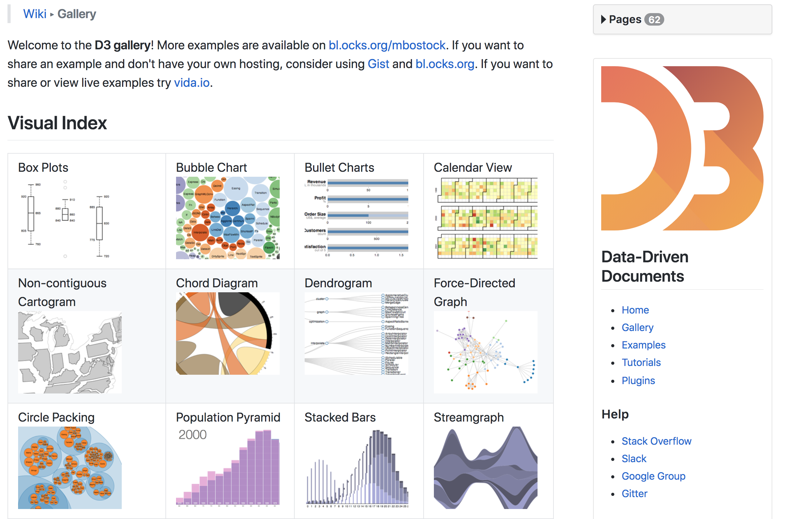
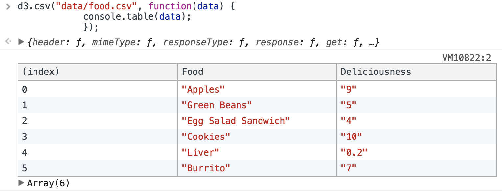

# An Introduction to d3.js


## What is d3.js? 


D3 is a **JavaScript library** to **create dynamic and interactive data visualizations in the browser**. It's built to work with common **web standards**, namely HTML, CSS, and Scaleable Vector Graphics (SVG).

Created by [Mike Bostock](https://bost.ocks.org/mike/) in 2011, it is now among the [Top 10 most popular repositories on Github](https://github.com/search?o=desc&q=stars%3A%3E1&s=stars&type=Repositories).

## D3 is not a data viz library. Huh?

**d3.js is not a data visualization library.** It will not draw anything for you.

It is a **tool** to help you manipulate DOM elements. As such, **we** do the heavy-lifting, not vice versa. 

<div class="emphasize"> D3 combines powerful visualization and interaction
techniques with a data-driven approach to DOM manipulation, giving you the full capabilities of modern browsers and the freedom to design the right visual interface for your data.
</div>

[https://github.com/d3/d3/wiki](https://github.com/d3/d3/wiki).


# Some examples in the real world (i.e on the web)


## NY Times ['Stop and Frisk'](https://www.nytimes.com/interactive/2014/09/19/nyregion/stop-and-frisk-is-all-but-gone-from-new-york.html)


## NY Times ['Spread of Drought'](https://www.nytimes.com/interactive/2014/upshot/mapping-the-spread-of-drought-across-the-us.html)


## Periscope’s [U.S. Gun Deaths Viz](https://guns.periscopic.com/?year=2013)


## Bostock: [Uber Rides in SF](https://bost.ocks.org/mike/uberdata/)


## ThePudding: [Abortion Clinics](https://pudding.cool/2017/09/clinics/)


# Resources


## Observable.com 

[Observable](http://observablehq.com/) is web service co-developed by Mike Bostock to allow user to code up D3 example, share them easily, and interactively edit your code right in the browser.

There is a [short intro notebook](https://observablehq.com/@observablehq/five-minute-introduction) to get you started as well as some [other short tutorials](https://observablehq.com/collection/@observablehq/introduction).

Best of all, there is growing list of [visualization examples](https://observablehq.com/collection/@observablehq/visualization)! 


## Other great resources

<div id="left">
- D3.js official website https://d3js.org/ & documentation

- D3 Blocks http://bl.ocks.org/mbostock/

<br>

- Big List by Christian Viau http://christopheviau.com/d3list/

- Blockbuilders (live coding) http://blockbuilder.org/

</div>
<div id="right">
  
</div>

## BlockBuilder.org

<div id="left">

[BlockBuilder.org](http://blockbuilder.org/)

Created by https://github.com/enjalot

Open Source

Based on GitHub hosting

Create a block from scratch  
Search a block  
Fork a block  
</div>

<div id="right">
  
</div>

# Some Examples

## Bubble Plot

<svg id="bubble" width="600" height="480" font-family="sans-serif" font-size="8" text-anchor="middle"></svg>

<script src="https://d3js.org/d3.v4.js"></script>

<script>
var svg1 = d3.select("svg#bubble"),
    width = +svg1.attr("width"),
    height = +svg1.attr("height");

var format = d3.format(",d");

var color = d3.scaleOrdinal(d3.schemeCategory20c);

var pack = d3.pack()
    .size([width, height])
    .padding(1.5);

d3.csv("data/flare.csv", function(d) {
  d.value = +d.value;
  if (d.value) return d;
}, function(error, classes) {
  if (error) throw error;

  var root = d3.hierarchy({children: classes})
      .sum(function(d) { return d.value; })
      .each(function(d) {
        if (id = d.data.id) {
          var id, i = id.lastIndexOf(".");
          d.id = id;
          d.package = id.slice(0, i);
          d.class = id.slice(i + 1);
        }
      });

  var node = svg1.selectAll(".node")
    .data(pack(root).leaves())
    .enter().append("g")
      .attr("class", "node")
      .attr("transform", function(d) { return "translate(" + d.x + "," + d.y + ")"; });

  node.append("circle")
      .attr("id", function(d) { return d.id; })
      .attr("r", function(d) { return d.r; })
      .style("fill", function(d) { return color(d.package); });

  node.append("clipPath")
      .attr("id", function(d) { return "clip-" + d.id; })
    .append("use")
      .attr("xlink:href", function(d) { return "#" + d.id; });

  node.append("text")
      .attr("clip-path", function(d) { return "url(#clip-" + d.id + ")"; })
    .selectAll("tspan")
    .data(function(d) { return d.class.split(/(?=[A-Z][^A-Z])/g); })
    .enter().append("tspan")
      .attr("x", 0)
      .attr("y", function(d, i, nodes) { return 13 + (i - nodes.length / 2 - 0.5) * 10; })
      .text(function(d) { return d; });

  node.append("title")
      .text(function(d) { return d.id + "\n" + format(d.value); });
});

</script>

## Bubble Plot (Code)


```{.js .long}
<svg id="bubble" width="600" height="480" font-family="sans-serif" font-size="8" text-anchor="middle"></svg>

<script>
var svg1 = d3.select("svg#bubble"),
    width = +svg1.attr("width"),
    height = +svg1.attr("height");

var format = d3.format(",d");

var color = d3.scaleOrdinal(d3.schemeCategory20c);

var pack = d3.pack()
    .size([width, height])
    .padding(1.5);

d3.csv("data/flare.csv", function(d) {
  d.value = +d.value;
  if (d.value) return d;
}, function(error, classes) {
  if (error) throw error;

  var root = d3.hierarchy({children: classes})
      .sum(function(d) { return d.value; })
      .each(function(d) {
        if (id = d.data.id) {
          var id, i = id.lastIndexOf(".");
          d.id = id;
          d.package = id.slice(0, i);
          d.class = id.slice(i + 1);
        }
      });

  var node = svg1.selectAll(".node")
    .data(pack(root).leaves())
    .enter().append("g")
      .attr("class", "node")
      .attr("transform", function(d) { return "translate(" + d.x + "," + d.y + ")"; });

  node.append("circle")
      .attr("id", function(d) { return d.id; })
      .attr("r", function(d) { return d.r; })
      .style("fill", function(d) { return color(d.package); });

  node.append("clipPath")
      .attr("id", function(d) { return "clip-" + d.id; })
    .append("use")
      .attr("xlink:href", function(d) { return "#" + d.id; });

  node.append("text")
      .attr("clip-path", function(d) { return "url(#clip-" + d.id + ")"; })
    .selectAll("tspan")
    .data(function(d) { return d.class.split(/(?=[A-Z][^A-Z])/g); })
    .enter().append("tspan")
      .attr("x", 0)
      .attr("y", function(d, i, nodes) { return 13 + (i - nodes.length / 2 - 0.5) * 10; })
      .text(function(d) { return d; });

  node.append("title")
      .text(function(d) { return d.id + "\n" + format(d.value); });
});

</script>

```


<script type="text/javascript">
<svg id="bubble" width="600" height="480" font-family="sans-serif" font-size="8" text-anchor="middle"></svg>

<script>
var svg1 = d3.select("svg#bubble"),
    width = +svg1.attr("width"),
    height = +svg1.attr("height");

var format = d3.format(",d");

var color = d3.scaleOrdinal(d3.schemeCategory20c);

var pack = d3.pack()
    .size([width, height])
    .padding(1.5);

d3.csv("data/flare.csv", function(d) {
  d.value = +d.value;
  if (d.value) return d;
}, function(error, classes) {
  if (error) throw error;

  var root = d3.hierarchy({children: classes})
      .sum(function(d) { return d.value; })
      .each(function(d) {
        if (id = d.data.id) {
          var id, i = id.lastIndexOf(".");
          d.id = id;
          d.package = id.slice(0, i);
          d.class = id.slice(i + 1);
        }
      });

  var node = svg1.selectAll(".node")
    .data(pack(root).leaves())
    .enter().append("g")
      .attr("class", "node")
      .attr("transform", function(d) { return "translate(" + d.x + "," + d.y + ")"; });

  node.append("circle")
      .attr("id", function(d) { return d.id; })
      .attr("r", function(d) { return d.r; })
      .style("fill", function(d) { return color(d.package); });

  node.append("clipPath")
      .attr("id", function(d) { return "clip-" + d.id; })
    .append("use")
      .attr("xlink:href", function(d) { return "#" + d.id; });

  node.append("text")
      .attr("clip-path", function(d) { return "url(#clip-" + d.id + ")"; })
    .selectAll("tspan")
    .data(function(d) { return d.class.split(/(?=[A-Z][^A-Z])/g); })
    .enter().append("tspan")
      .attr("x", 0)
      .attr("y", function(d, i, nodes) { return 13 + (i - nodes.length / 2 - 0.5) * 10; })
      .text(function(d) { return d; });

  node.append("title")
      .text(function(d) { return d.id + "\n" + format(d.value); });
});

</script>

</script>


## Circle Plot

<svg id="circle" width="960" height="500" viewBox="-480 -250 960 500">
  <circle r="100" stroke="brown" stroke-opacity="0.5" fill="none"></circle>
  <circle r="200" stroke="steelblue" stroke-opacity="0.5" fill="none"></circle>
</svg>

<script src="https://d3js.org/d3.v4.js"></script>

<script>

var nodes = [].concat(
  d3.range(80).map(function() { return {type: "a"}; }),
  d3.range(160).map(function() { return {type: "b"}; })
);

var node = d3.select("#circle")
  .append("g")
  .selectAll("circle")
  .data(nodes)
  .enter().append("circle")
    .attr("r", 2.5)
    .attr("fill", function(d) { return d.type === "a" ? "brown" : "steelblue"; })

var simulation = d3.forceSimulation(nodes)
    .force("charge", d3.forceCollide().radius(5))
    .force("r", d3.forceRadial(function(d) { return d.type === "a" ? 100 : 200; }))
    .on("tick", ticked);

function ticked() {
  node
      .attr("cx", function(d) { return d.x; })
      .attr("cy", function(d) { return d.y; });
}

</script>

## Circle Plot (Code)


```{.js .long}
<svg id="circle" width="960" height="500" viewBox="-480 -250 960 500">
  <circle r="100" stroke="brown" stroke-opacity="0.5" fill="none"></circle>
  <circle r="200" stroke="steelblue" stroke-opacity="0.5" fill="none"></circle>
</svg>

<script src="https://d3js.org/d3.v4.js"></script>

<script>

var nodes = [].concat(
  d3.range(80).map(function() { return {type: "a"}; }),
  d3.range(160).map(function() { return {type: "b"}; })
);

var node = d3.select("#circle")
  .append("g")
  .selectAll("circle")
  .data(nodes)
  .enter().append("circle")
    .attr("r", 2.5)
    .attr("fill", function(d) { return d.type === "a" ? "brown" : "steelblue"; })

var simulation = d3.forceSimulation(nodes)
    .force("charge", d3.forceCollide().radius(5))
    .force("r", d3.forceRadial(function(d) { return d.type === "a" ? 100 : 200; }))
    .on("tick", ticked);

function ticked() {
  node
      .attr("cx", function(d) { return d.x; })
      .attr("cy", function(d) { return d.y; });
}

</script>
```


<script type="text/javascript">
<svg id="circle" width="960" height="500" viewBox="-480 -250 960 500">
  <circle r="100" stroke="brown" stroke-opacity="0.5" fill="none"></circle>
  <circle r="200" stroke="steelblue" stroke-opacity="0.5" fill="none"></circle>
</svg>

<script src="https://d3js.org/d3.v4.js"></script>

<script>

var nodes = [].concat(
  d3.range(80).map(function() { return {type: "a"}; }),
  d3.range(160).map(function() { return {type: "b"}; })
);

var node = d3.select("#circle")
  .append("g")
  .selectAll("circle")
  .data(nodes)
  .enter().append("circle")
    .attr("r", 2.5)
    .attr("fill", function(d) { return d.type === "a" ? "brown" : "steelblue"; })

var simulation = d3.forceSimulation(nodes)
    .force("charge", d3.forceCollide().radius(5))
    .force("r", d3.forceRadial(function(d) { return d.type === "a" ? 100 : 200; }))
    .on("tick", ticked);

function ticked() {
  node
      .attr("cx", function(d) { return d.x; })
      .attr("cy", function(d) { return d.y; });
}

</script>
</script>


## Hierarchical Bar Chart

<!-- Source: http://blockbuilder.org/jsanch/08b892efc109166b01b6 -->


## Hierarchical Bar Chart (Code)


```{.js .long}
<script>

var margin = {top: 30, right: 20, bottom: 0, left: 100},
    width = 600 - margin.left - margin.right,
    height = 480 - margin.top - margin.bottom;

var x = d3.scale.linear()
    .range([0, width]);

var barHeight = 20;

var color = d3.scale.ordinal()
    .range(["steelblue", "#ccc"]);

var duration = 750,
    delay = 25;

var partition = d3.layout.partition()
    .value(function(d) { return d.size; });

var xAxis = d3.svg.axis()
    .scale(x)
    .orient("top");

var svg3 = d3.select("#hierarchical_barchart").append("svg")
    .attr("width", width + margin.left + margin.right)
    .attr("height", height + margin.top + margin.bottom)
  .append("g")
    .attr("transform", "translate(" + margin.left + "," + margin.top + ")");

svg3.append("rect")
    .attr("class", "background")
    .attr("width", width)
    .attr("height", height)
    .on("click", up);

svg3.append("g")
    .attr("class", "x axis");

svg3.append("g")
    .attr("class", "y axis")
  .append("line")
    .attr("y1", "100%");

d3.json("data/readme.json", function(error, root) {
  if (error) throw error;

  partition.nodes(root);
  x.domain([0, root.value]).nice();
  down(root, 0);
});

function down(d, i) {
  if (!d.children || this.__transition__) return;
  var end = duration + d.children.length * delay;

  // Mark any currently-displayed bars as exiting.
  var exit = svg3.selectAll(".enter")
      .attr("class", "exit");

  // Entering nodes immediately obscure the clicked-on bar, so hide it.
  exit.selectAll("rect").filter(function(p) { return p === d; })
      .style("fill-opacity", 1e-6);

  // Enter the new bars for the clicked-on data.
  // Per above, entering bars are immediately visible.
  var enter = bar(d)
      .attr("transform", stack(i))
      .style("opacity", 1);

  // Have the text fade-in, even though the bars are visible.
  // Color the bars as parents; they will fade to children if appropriate.
  enter.select("text").style("fill-opacity", 1e-6);
  enter.select("rect").style("fill", color(true));

  // Update the x-scale domain.
  x.domain([0, d3.max(d.children, function(d) { return d.value; })]).nice();

  // Update the x-axis.
  svg3.selectAll(".x.axis").transition()
      .duration(duration)
      .call(xAxis);

  // Transition entering bars to their new position.
  var enterTransition = enter.transition()
      .duration(duration)
      .delay(function(d, i) { return i * delay; })
      .attr("transform", function(d, i) { return "translate(0," + barHeight * i * 1.2 + ")"; });

  // Transition entering text.
  enterTransition.select("text")
      .style("fill-opacity", 1);

  // Transition entering rects to the new x-scale.
  enterTransition.select("rect")
      .attr("width", function(d) { return x(d.value); })
      .style("fill", function(d) { return color(!!d.children); });

  // Transition exiting bars to fade out.
  var exitTransition = exit.transition()
      .duration(duration)
      .style("opacity", 1e-6)
      .remove();

  // Transition exiting bars to the new x-scale.
  exitTransition.selectAll("rect")
      .attr("width", function(d) { return x(d.value); });

  // Rebind the current node to the background.
  svg3.select(".background")
      .datum(d)
    .transition()
      .duration(end);

  d.index = i;
}

function up(d) {
  if (!d.parent || this.__transition__) return;
  var end = duration + d.children.length * delay;

  // Mark any currently-displayed bars as exiting.
  var exit = svg3.selectAll(".enter")
      .attr("class", "exit");

  // Enter the new bars for the clicked-on data's parent.
  var enter = bar(d.parent)
      .attr("transform", function(d, i) { return "translate(0," + barHeight * i * 1.2 + ")"; })
      .style("opacity", 1e-6);

  // Color the bars as appropriate.
  // Exiting nodes will obscure the parent bar, so hide it.
  enter.select("rect")
      .style("fill", function(d) { return color(!!d.children); })
    .filter(function(p) { return p === d; })
      .style("fill-opacity", 1e-6);

  // Update the x-scale domain.
  x.domain([0, d3.max(d.parent.children, function(d) { return d.value; })]).nice();

  // Update the x-axis.
  svg3.selectAll(".x.axis").transition()
      .duration(duration)
      .call(xAxis);

  // Transition entering bars to fade in over the full duration.
  var enterTransition = enter.transition()
      .duration(end)
      .style("opacity", 1);

  // Transition entering rects to the new x-scale.
  // When the entering parent rect is done, make it visible!
  enterTransition.select("rect")
      .attr("width", function(d) { return x(d.value); })
      .each("end", function(p) { if (p === d) d3.select(this).style("fill-opacity", null); });

  // Transition exiting bars to the parent's position.
  var exitTransition = exit.selectAll("g").transition()
      .duration(duration)
      .delay(function(d, i) { return i * delay; })
      .attr("transform", stack(d.index));

  // Transition exiting text to fade out.
  exitTransition.select("text")
      .style("fill-opacity", 1e-6);

  // Transition exiting rects to the new scale and fade to parent color.
  exitTransition.select("rect")
      .attr("width", function(d) { return x(d.value); })
      .style("fill", color(true));

  // Remove exiting nodes when the last child has finished transitioning.
  exit.transition()
      .duration(end)
      .remove();

  // Rebind the current parent to the background.
  svg3.select(".background")
      .datum(d.parent)
    .transition()
      .duration(end);
}

// Creates a set of bars for the given data node, at the specified index.
function bar(d) {
  var bar = svg3.insert("g", ".y.axis")
      .attr("class", "enter")
      .attr("transform", "translate(0,5)")
    .selectAll("g")
      .data(d.children)
    .enter().append("g")
      .style("cursor", function(d) { return !d.children ? null : "pointer"; })
      .on("click", down);

  bar.append("text")
      .attr("x", -6)
      .attr("y", barHeight / 2)
      .attr("dy", ".35em")
      .style("text-anchor", "end")
      .text(function(d) { return d.name; });

  bar.append("rect")
      .attr("width", function(d) { return x(d.value); })
      .attr("height", barHeight);

  return bar;
}

// A stateful closure for stacking bars horizontally.
function stack(i) {
  var x0 = 0;
  return function(d) {
    var tx = "translate(" + x0 + "," + barHeight * i * 1.2 + ")";
    x0 += x(d.value);
    return tx;
  };
}

</script>

```

## [Collision detection](https://bl.ocks.org/mbostock/3231298)

  <div id="collision_detection"></div>

<!-- Source: https://bl.ocks.org/mbostock/3231298 -->

<script src="//d3js.org/d3.v3.min.js"></script>

<script>

var width_cd = 960,
    height_cd = 500;

var nodes = d3.range(200).map(function() { return {radius: Math.random() * 12 + 4}; }),
    root = nodes[0],
    color = d3.scale.category10();

root.radius = 0;
root.fixed = true;

var force = d3.layout.force()
    .gravity(0.05)
    .charge(function(d, i) { return i ? 0 : -2000; })
    .nodes(nodes)
    .size([width_cd, height_cd]);

force.start();

var svg5 = d3.select("#collision_detection").append("svg")
    .attr("id", "collision_detection")
    .attr("width", width_cd)
    .attr("height", height_cd);

svg5.selectAll("circle")
    .data(nodes.slice(1))
  .enter().append("circle")
    .attr("r", function(d) { return d.radius; })
    .style("fill", function(d, i) { return color(i % 3); });

force.on("tick", function(e) {
  var q = d3.geom.quadtree(nodes),
      i = 0,
      n = nodes.length;

  while (++i < n) q.visit(collide(nodes[i]));

  svg5.selectAll("circle")
      .attr("cx", function(d) { return d.x; })
      .attr("cy", function(d) { return d.y; });
});

svg5.on("mousemove", function() {
  var p1 = d3.mouse(this);
  root.px = p1[0];
  root.py = p1[1];
  force.resume();
});

function collide(node) {
  var r = node.radius + 16,
      nx1 = node.x - r,
      nx2 = node.x + r,
      ny1 = node.y - r,
      ny2 = node.y + r;
  return function(quad, x1, y1, x2, y2) {
    if (quad.point && (quad.point !== node)) {
      var x = node.x - quad.point.x,
          y = node.y - quad.point.y,
          l = Math.sqrt(x * x + y * y),
          r = node.radius + quad.point.radius;
      if (l < r) {
        l = (l - r) / l * .5;
        node.x -= x *= l;
        node.y -= y *= l;
        quad.point.x += x;
        quad.point.y += y;
      }
    }
    return x1 > nx2 || x2 < nx1 || y1 > ny2 || y2 < ny1;
  };
}

</script>

## Collision detection (code)


```{.js .long}
<script>

var width = 960,
    height = 500;

var nodes = d3.range(200).map(function() { return {radius: Math.random() * 12 + 4}; }),
    root = nodes[0],
    color = d3.scale.category10();

root.radius = 0;
root.fixed = true;

var force = d3.layout.force()
    .gravity(0.05)
    .charge(function(d, i) { return i ? 0 : -2000; })
    .nodes(nodes)
    .size([width, height]);

force.start();

var svg5 = d3.select("#collision_detection").append("svg")
    .attr("id", "collision_detection")
    .attr("width", width)
    .attr("height", height);

svg5.selectAll("circle")
    .data(nodes.slice(1))
  .enter().append("circle")
    .attr("r", function(d) { return d.radius; })
    .style("fill", function(d, i) { return color(i % 3); });

force.on("tick", function(e) {
  var q = d3.geom.quadtree(nodes),
      i = 0,
      n = nodes.length;

  while (++i < n) q.visit(collide(nodes[i]));

  svg5.selectAll("circle")
      .attr("cx", function(d) { return d.x; })
      .attr("cy", function(d) { return d.y; });
});

svg5.on("mousemove", function() {
  var p1 = d3.mouse(this);
  root.px = p1[0];
  root.py = p1[1];
  force.resume();
});

function collide(node) {
  var r = node.radius + 16,
      nx1 = node.x - r,
      nx2 = node.x + r,
      ny1 = node.y - r,
      ny2 = node.y + r;
  return function(quad, x1, y1, x2, y2) {
    if (quad.point && (quad.point !== node)) {
      var x = node.x - quad.point.x,
          y = node.y - quad.point.y,
          l = Math.sqrt(x * x + y * y),
          r = node.radius + quad.point.radius;
      if (l < r) {
        l = (l - r) / l * .5;
        node.x -= x *= l;
        node.y -= y *= l;
        quad.point.x += x;
        quad.point.y += y;
      }
    }
    return x1 > nx2 || x2 < nx1 || y1 > ny2 || y2 < ny1;
  };
}

</script>
```


<script type="text/javascript">
<script>

var width = 960,
    height = 500;

var nodes = d3.range(200).map(function() { return {radius: Math.random() * 12 + 4}; }),
    root = nodes[0],
    color = d3.scale.category10();

root.radius = 0;
root.fixed = true;

var force = d3.layout.force()
    .gravity(0.05)
    .charge(function(d, i) { return i ? 0 : -2000; })
    .nodes(nodes)
    .size([width, height]);

force.start();

var svg5 = d3.select("#collision_detection").append("svg")
    .attr("id", "collision_detection")
    .attr("width", width)
    .attr("height", height);

svg5.selectAll("circle")
    .data(nodes.slice(1))
  .enter().append("circle")
    .attr("r", function(d) { return d.radius; })
    .style("fill", function(d, i) { return color(i % 3); });

force.on("tick", function(e) {
  var q = d3.geom.quadtree(nodes),
      i = 0,
      n = nodes.length;

  while (++i < n) q.visit(collide(nodes[i]));

  svg5.selectAll("circle")
      .attr("cx", function(d) { return d.x; })
      .attr("cy", function(d) { return d.y; });
});

svg5.on("mousemove", function() {
  var p1 = d3.mouse(this);
  root.px = p1[0];
  root.py = p1[1];
  force.resume();
});

function collide(node) {
  var r = node.radius + 16,
      nx1 = node.x - r,
      nx2 = node.x + r,
      ny1 = node.y - r,
      ny2 = node.y + r;
  return function(quad, x1, y1, x2, y2) {
    if (quad.point && (quad.point !== node)) {
      var x = node.x - quad.point.x,
          y = node.y - quad.point.y,
          l = Math.sqrt(x * x + y * y),
          r = node.radius + quad.point.radius;
      if (l < r) {
        l = (l - r) / l * .5;
        node.x -= x *= l;
        node.y -= y *= l;
        quad.point.x += x;
        quad.point.y += y;
      }
    }
    return x1 > nx2 || x2 < nx1 || y1 > ny2 || y2 < ny1;
  };
}

</script>
</script>

# Setup

## Referencing D3

To use **D3.js** in our HTML we need to load it into the browser. There are at least two options.

We will be using version 4 of D3 (following Murray's book) but v5 is out by now.

Either download the [D3.js library](https://d3js.org/) and reference its local folder, e.g. 

```{}
    <html lang="en">
    <head>
        <script type="text/javascript" src="d3/d3.v4.js"></script>
    </head>
    </html>
```

## Referencing D3

or call it directly from [d3js.org](https://d3js.org/) by including the following script call in the header:

```{}
    <html lang="en">
    <head>
        <script src="https://d3js.org/d3.v4.js"></script>
    </head>
    </html>
```

## Showing D3 in the Browser

For some D3 examples, you can just open the HTML file in a web browser to view it. 

If you load external databases (which will be the usual case), it is more reliable to run a local web server and view your page from http://localhost:8888/. I suggest to use python to run a local web server but there are [other options](https://github.com/d3/d3/wiki).

Go to your project folder and run (in the terminal):
    
    python -m http.server 8888 &.
    
Then, in the browser, go to [http://localhost:8888/](http://localhost:8888/)

Note: For **windows users**, please install anaconda and then open the anaconda prompt and type the above command.


# Technical Interlude – Brushing up basics of HTML, CSS, JavaScript and SVG

## HTML

The basic **structure of a web page is written in html**. We already reviewed some of that before, so I will skip this here. Here is a very simple website with just one paragraph:


```html
<!DOCTYPE html>
<html>
    <head>
        <title>Learning D3 in 2 hours</title>
    </head>
    <body>
        <p>What's up?</p>
    </body>
</html>
```

<div style="background-color:Beige; padding:20px">
<p>What's up?</p>
</div>

## CSS

We can **style our site and change the presentation by applying CSS** selectors to the html tags:


```html
<!DOCTYPE html>
<html>
    <head>
        <title>Learning D3 in 2 hours</title>
    </head>
    <body>
        <p style="color:red; font-weight: bold">What's up?</p>
    </body>
</html>
```

<div style="background-color:Beige; padding:20px">
<p style="color:red; font-weight: bold">What's up?</p>
</div>

## Javascript

To **make webpages interactive we use Javascript**. D3.js is one of many javascript libraries, but one particularly well suited for interacting with data. 

## JS: A simple example


```html
<body>
<p onclick="show()" id="myText">I dare you! Click here!</p>

</body>
```


```css
#image{
visibility: hidden;/* hide the image */
width: 60%; /* set width of image to 60% of body */
height: 60%; /* set height of image to 60% of body */
}
```


<style type="text/css">
#image{
visibility: hidden;/* hide the image */
width: 60%; /* set width of image to 60% of body */
height: 60%; /* set height of image to 60% of body */
}
</style>

```js
<script type="text/javascript">
var show = function(){
var txt = document.getElementById("myText"),
img = document.getElementById("image");
txt.innerHTML = "Happy Birthday! :D";
img.style.visibility = "visible";}
</script>
```

## JS: A simple example (executed)

<script type="text/javascript">
var show = function(){
var txt = document.getElementById("myText"),
img = document.getElementById("image");
txt.innerHTML = "Whahahaha! :D";
img.style.visibility = "visible";
}
</script>

<div style="background-color:Beige; padding:20px">
<p onclick="show()" id="myText">I dare you! Click here!</p>

</div>

## SVG

**SVG** or **Scalable Vector Graphics** is a format used to draw xml based graphics and animations. As the name indicates, SVG graphics **do not lose any quality if they are zoomed or resized**.

<svg width="600" height="500">
  <style type="text/css">
    circle:hover {fill-opacity:0.9;}
  </style>
  <g style="fill-opacity:0.7;">
    <circle cx="6.5cm" cy="2cm" r="100" style="fill:red; stroke:black; stroke-width:0.1cm" transform="translate(0,50)" />
    <circle cx="6.5cm" cy="2cm" r="100" style="fill:blue; stroke:black; stroke-width:0.1cm" transform="translate(70,150)" />
    <circle cx="6.5cm" cy="2cm" r="100" style="fill:green; stroke:black; stroke-width:0.1cm" transform="translate(-70,150)"/>
  </g>
</svg>

## Example


```svg
<svg width="600" height="500">
  <style type="text/css">
    circle:hover {fill-opacity:0.9;}
  </style>
  <g style="fill-opacity:0.7;">
    <circle cx="6.5cm" cy="2cm" r="100" 
        style="fill:red; stroke:black; stroke-width:0.1cm"
        transform="translate(0,50)" />
    <circle cx="6.5cm" cy="2cm" r="100" 
        style="fill:blue; stroke:black; stroke-width:0.1cm"
        transform="translate(70,150)" />
    <circle cx="6.5cm" cy="2cm" r="100" 
        style="fill:green; stroke:black; stroke-width:0.1cm"
        transform="translate(-70,150)"/>
  </g>
</svg>
```

## A fancier SVG example


## Cheat Sheets

There are plenty of resources to get started with HTML, CSS, SVG, and JS. 

Here is a set of [interactive cheatsheets](http://htmlcheatsheet.com/) that may be helpful.

**Codeacademy** also has nice tutorials: [HTML](https://www.codecademy.com/learn/learn-html), [CSS](https://www.codecademy.com/learn/learn-css), [Javascript](https://www.codecademy.com/learn/introduction-to-javascript).

# Learning some basic skills in D3

## Our template


```html
<!DOCTYPE html>
<html lang="en">
    <head>
        <meta charset="utf-8">
        <title>D3 Page Template</title>
        <script src="https://d3js.org/d3.v4.js"></script>
    </head>
    <body>
        <script type="text/javascript">
            // Your beautiful D3 code will go here
        </script>
    </body>
</html>
```

## New Element


```html
<!DOCTYPE html>
<html lang="en">
    <head>
        <meta charset="utf-8">
        <title>D3 Page Template</title>
        <script src="https://d3js.org/d3.v4.js"></script>
    </head>
    <body>
        <script type="text/javascript">
            d3.select("body").append("p").text("A paragraph with D3!");
        </script>
    </body>
</html>
```

<script src="https://d3js.org/d3.v4.js"></script>

<div id="new_element" style="background-color:Beige; padding:20px">
<script> 
  d3.select("#new_element").append("p").text("A paragraph with D3!");
</script> 
</div>

## New Element

Let's take a closer look


```js
d3.select("body").append("p").text("A paragraph with D3!");
```

Since we called the D3 library, we now can use the **global object d3** that allows to call various D3 functions

## To recap, the sequence of events is:

- invoke D3’s `.select(..)` method, which selects a single element from the DOM ([Document Object Model](https://www.w3.org/DOM/)) using CSS selector syntax. (We selected the `body`.)  
- Created a new `<p>` element and `append`ed that to the end of our selection, meaning just before the closing `</body>` tag in this case.  
- Set the text content of that new, empty paragraph to “`A paragraph with D3!`”

## Notice the dots `.`

You may have noticed all the dots connecting the syntax. This is called [method chaining](http://alignedleft.com/tutorials/d3/chaining-methods). 


```js
d3.select("body").append("p").text("A paragraph with D3!");
```

By “chaining” methods together with periods, you can **perform several actions in a single line of code**. 

Note, JavaScript, like HTML, doesn’t care about whitespace and line breaks, so you can put each method on its own line for legibility:


```js
d3.select("body")
  .append("p")
  .text("A paragraph with D3!");
```

## Notice the dots `.`

Many D3 methods return a **selection** (or, really, reference to a selection), which enables this handy technique of method chaining. Typically, **a method returns a reference to the element that it just acted upon**, but not always.

**Order matters**: When chaining methods, the output type of one method has to match the input type expected by the next method in the chain. 

## Getting Data {.smaller}

Ok. Now we need some data. For simplicity, let's type it in directly into a **javascript array** for now. We will learn how to read it from an external csv a bit later.

Let’s create a data array:


```js
var dataset = [ 5, 10, 15, 20, 25 ];
```


<script type="text/javascript">
var dataset = [ 5, 10, 15, 20, 25 ];
</script>

We could check the existence of the object in the [Chrome Developer Javascript console](https://developers.google.com/web/tools/chrome-devtools/console/):


## Data binding

**Data binding** is when you associate your data to DOM elements so that the properties of DOM represent properties of data.

We know already that **data visualization is simply mapping of data values to visuals**. 

Now, we just need to figure out how to **bind our data to the DOM elements** (for example, to paragraphs, points, rectangles, lines etc.) in order to **represent it as a visualization**. 

D3.js provides powerful ways to bind data in different forms (csv, tsv, json etc.) to the DOM.

## Binding Data to Elements {.smaller}

Now, we want to show the data, by **binding the values to paragraph elements**.


```js
var dataset = [ 5, 10, 15, 20, 25 ];
			
d3.select("#data_bind").selectAll("p")
	.data(dataset)
	.enter()
	.append("p")
	.text(function(d) { return "I can count to " + d; });
```

<div id="data_bind"></div>

<script>
			var dataset = [ 5, 10, 15, 20, 25 ];
			
			d3.select("#data_bind").selectAll("p")
				.data(dataset)
				.enter()
				.append("p")
				.text(function(d) { return "I can count to " + d; })
				.style({"font-size":"20px","font-family":"arial"});
</script>			

## Drawing SVGs

Instead of writing paragraphs, we can also **use the numbers in the data to draw scalable vector graphics**.

First, we need to set up a "canvas svg" in which we want to draw:


```js
//Width and height
var w = 500;
var h = 50;
			
//Data
var dataset = [ 5, 10, 15, 20, 25 ];
	
//Create SVG element
var svg = d3.select("body")
						.append("svg")
						.attr("width", w)
						.attr("height", h);
```

## Drawing SVGs

And then we can continue drawing some shapes (here circles) based on our data values:


```js
var circles = svg.selectAll("circle")
            	    .data(dataset)
			            .enter()
			            .append("circle");

circles.attr("cx", function(d, i) {
				return (i * 50) + 25;
			})
		   .attr("cy", h/2)
		   .attr("r", function(d) {
				return d;
		   });
```

<div id="circles_bind"></div>

<script>
			//Width and height
			var w = 500;
			var h = 50;
			
			//Data
			var dataset = [ 5, 10, 15, 20, 25 ];
			
			//Create SVG element
			var svg6 = d3.select("#circles_bind")
						.append("svg")
						.attr("width", w)
						.attr("height", h);

			var circles = svg6.selectAll("circle")
			    .data(dataset)
			    .enter()
			    .append("circle");

			circles.attr("cx", function(d, i) {
						return (i * 50) + 25;
					})
				   .attr("cy", h/2)
				   .attr("r", function(d) {
						return d;
				   });
</script>

# Making a bar chart

We have now all elements to start visualizing.


## Drawing Rectangles with the Data

A barchart is nothing more than a **set of rectangles** that **map some data values** by the **height of the bars**.

A rectangle in SVG is fully described by an `x` and `y` position and its size, `width` and `height`:


```html
<svg width="100" height="100">
  <rect x="0" y="0" width="100" height="100" fill="green" />
</svg>
```

<svg width="100" height="100">
  <rect x="0" y="0" width="100" height="100" fill="green" />
</svg>

<br>

So, let's now **bind some data to some rectangles to make a barchart**.

## Drawing Rectangles with the Data


```js
var w = 500;
var h = 100;
var databar = [ 5, 10, 13, 19, 21, 25, 22, 18, 15, 13,
       				 11, 12, 15, 20, 18, 17, 16, 18, 23, 25 ];
			
//Create SVG element
var svg = d3.select("body")
						.append("svg")
						.attr("width", w)
						.attr("height", h);

svg.selectAll("rect")
   .data(databar)
	 .enter()
	 .append("rect")
	 .attr("x", 0)
	 .attr("y", 0)
	 .attr("width", 20)
	 .attr("height", 100);
```

## Drawing Rectangles with the Data

The important part is, of course, the binding of the rectangles to the data.


```js
svg.selectAll("rect")
   .data(dataset)
	 .enter()
	 .append("rect")
	 .attr("x", 0)
	 .attr("y", 0)
	 .attr("width", 20)
	 .attr("height", 100);
```

Hmmh. Something is not right?

<div id="barchart1" 
style="background-color:#e6f2ff; padding:10px; width:500px">
</div>

<script>

//Width and height
var w = 500;
var h = 100;
	
var databar = [ 5, 10, 13, 19, 21, 25, 22, 18, 15, 13,
       				 11, 12, 15, 20, 18, 17, 16, 18, 23, 25 ];
			
//Create SVG element
var svgb1 = d3.select("#barchart1")
						.append("svg")
						.attr("width", w)
						.attr("height", h);

svgb1.selectAll("rect")
   .data(databar)
	 .enter()
	 .append("rect")
	 .attr("x", 0)
	 .attr("y", 0)
	 .attr("width", 20)
	 .attr("height", 100);
</script>

## Offset

We need to add an offset. Otherwise, all the rectangles are overplotting.


```js
svg.selectAll("rect")
   .data(dataset)
   .enter()
   .append("rect")
   .attr("x", function(d, i) {
		   		return i * 21;	//Bar width of 20 plus 1 for padding
			   })
   .attr("y", 0)
	 .attr("width", 20)
	 .attr("height", 100);
```

<div id="barchart2" 
style="background-color:#e6f2ff; padding:10px; width:500px">
</div>

<script>

//Width and height
var w = 500;
var h = 100;
	
var databar = [ 5, 10, 13, 19, 21, 25, 22, 18, 15, 13,
       				 11, 12, 15, 20, 18, 17, 16, 18, 23, 25 ];
			
//Create SVG element
var svgb2 = d3.select("#barchart2")
						.append("svg")
						.attr("width", w)
						.attr("height", h);

svgb2.selectAll("rect")
   .data(databar)
   .enter()
   .append("rect")
   .attr("x", function(d, i) {
		   		return i * 21;	//Bar width of 20 plus 1 for padding
			   })
   .attr("y", 0)
	 .attr("width", 20)
	 .attr("height", 100);
</script>

## Spread bars evenly

For now this fits on the page, but note that the location and  `width = 20px` is hard coded in the previous example. Let's adjust that to spread the bars evenly across the available width of the plot depending on the number of bars (i.e. number of observations).


```js
// excerpt of code
	.append("rect")
	.attr("x", function(d, i) {
	   		return i * (w / dataset.length);
		   })
  .attr("y", 0)
  .attr("width", w / dataset.length - barPadding)
```

<div id="barchart3" 
style="background-color:#e6f2ff; padding:10px; width:500px">
</div>

<script>

//Width and height
var w = 500;
var h = 100;
var barPadding = 1;

var databar = [ 5, 10, 13, 19, 21, 25, 22, 18, 15, 13,
       				 11, 12, 15, 20, 18, 17, 16, 18, 23, 25 ];
			
//Create SVG element
var svgb3 = d3.select("#barchart3")
						.append("svg")
						.attr("width", w)
						.attr("height", h);

svgb3.selectAll("rect")
   .data(databar)
   .enter()
   .append("rect")
   .attr("x", function(d, i) {
			   		return i * (w / databar.length);
			   })
   .attr("y", 0)
   .attr("width", w / databar.length - barPadding)
	 .attr("height", 100);
</script>

## Adjust the Heights


```js
svg.selectAll("rect")
   .data(databar)
	 .enter()
	 .append("rect")
	 .attr("x", function(d, i) {
	    		return i * (w / databar.length);
			 })
	 .attr("y", function(d) {
	   		return h - (d * 4);
	     })
		.attr("width", w / databar.length - barPadding)
		.attr("height", function(d) {
		   		return d * 4;
			   });
```

<div id="barchart4" 
style="background-color:#e6f2ff; padding:10px; width:500px">
</div>

<script>

//Width and height
var w = 500;
var h = 100;
var barPadding = 1;

var databar = [ 5, 10, 13, 19, 21, 25, 22, 18, 15, 13,
       				 11, 12, 15, 20, 18, 17, 16, 18, 23, 25 ];
			
//Create SVG element
var svgb4 = d3.select("#barchart4")
						.append("svg")
						.attr("width", w)
						.attr("height", h);

svgb4.selectAll("rect")
   .data(databar)
   .enter()
   .append("rect")
	 .attr("x", function(d, i) {
	    		return i * (w / databar.length);
			 })
	 .attr("y", function(d) {
	   		return h - (d * 4);
	     })
		.attr("width", w / databar.length - barPadding)
		.attr("height", function(d) {
		   		return d * 4;
			   });
</script>

## Adding teal color

Beside height and width and position, we can add also add styling to the rectangles. Let's add a color.


```js
...
  .attr("fill", "teal");
```

<div id="barchart5" 
style="background-color:#e6f2ff; padding:10px; width:500px">
</div>

<script>

//Width and height
var w = 500;
var h = 100;
var barPadding = 1;

var databar = [ 5, 10, 13, 19, 21, 25, 22, 18, 15, 13,
       				 11, 12, 15, 20, 18, 17, 16, 18, 23, 25 ];
			
//Create SVG element
var svgb5 = d3.select("#barchart5")
						.append("svg")
						.attr("width", w)
						.attr("height", h);

svgb5.selectAll("rect")
   .data(databar)
   .enter()
   .append("rect")
	 .attr("x", function(d, i) {
	    		return i * (w / databar.length);
			 })
	 .attr("y", function(d) {
	   		return h - (d * 4);
	     })
		.attr("width", w / databar.length - barPadding)
		.attr("height", function(d) {
		   		return d * 4;
			   })
    .attr("fill", "teal");
</script>

## Adding blues

Even better, we could (redundantly) map the data value onto the CSS style `fill`.


```js
...
  .attr("fill", function(d) {
        return "rgb(0, 0, " + Math.round(d * 10) + ")";
        });
```

<div id="barchart6" 
style="background-color:#e6f2ff; padding:10px; width:500px">
</div>

<script>

//Width and height
var w = 500;
var h = 100;
var barPadding = 1;

var databar = [ 5, 10, 13, 19, 21, 25, 22, 18, 15, 13,
       				 11, 12, 15, 20, 18, 17, 16, 18, 23, 25 ];
			
//Create SVG element
var svgb6 = d3.select("#barchart6")
						.append("svg")
						.attr("width", w)
						.attr("height", h);

svgb6.selectAll("rect")
   .data(databar)
   .enter()
   .append("rect")
	 .attr("x", function(d, i) {
	    		return i * (w / databar.length);
			 })
	 .attr("y", function(d) {
	   		return h - (d * 4);
	     })
		.attr("width", w / databar.length - barPadding)
		.attr("height", function(d) {
		   		return d * 4;
			   })
  .attr("fill", function(d) {
        return "rgb(0, 0, " + Math.round(d * 10) + ")";
        });
</script>

## Adding labels

Now, let's add some text labels with the data values.


```js
svg.selectAll("text")
   .data(dataset)
   .enter()
   .append("text")
   .text(function(d) {
		   		return d;
			   })
   .attr("x", function(d, i) {
	   		return i * (w / dataset.length) + 5;
			   })
   .attr("y", function(d) {
	   		return h - (d * 4) + 15;
  		   })
	 .attr("font-family", "sans-serif")
			   .attr("font-size", "11px")
			   .attr("fill", "white");
```

## Adding labels 

Voila. We got a pretty nice barchart. 

<br>

<div id="barchart7" 
style="background-color:#e6f2ff; padding:10px; width:500px">
</div>

<script>

//Width and height
var w = 500;
var h = 100;
var barPadding = 1;

var databar = [ 5, 10, 13, 19, 21, 25, 22, 18, 15, 13,
       				 11, 12, 15, 20, 18, 17, 16, 18, 23, 25 ];
			
//Create SVG element
var svgb7 = d3.select("#barchart7")
						.append("svg")
						.attr("width", w)
						.attr("height", h);

svgb7.selectAll("rect")
   .data(databar)
   .enter()
   .append("rect")
	 .attr("x", function(d, i) {
	    		return i * (w / databar.length);
			 })
	 .attr("y", function(d) {
	   		return h - (d * 4);
	     })
		.attr("width", w / databar.length - barPadding)
		.attr("height", function(d) {
		   		return d * 4;
			   })
  .attr("fill", function(d) {
        return "rgb(0, 0, " + Math.round(d * 10) + ")";
        });

svgb7.selectAll("text")
   .data(databar)
   .enter()
   .append("text")
   .text(function(d) {
		   		return d;
			   })
   .attr("x", function(d, i) {
	   		return i * (w / databar.length) + 5;
			   })
   .attr("y", function(d) {
	   		return h - (d * 4) + 15;
  		   })
	 .attr("font-family", "sans-serif")
			   .attr("font-size", "11px")
			   .attr("fill", "white");
</script>

<br>

But, it took us about 50 lines of code! No one said this would be easy, right?

**Upshot:** **D3 allows highly customizable charts** and the **code is reusable**. 

## Note: `selectAll()` on non-existing things

`.selectAll("rect")`: We were able to _select rectangles that did not even exist yet_. How does that work?

I suggest to read this [note](http://knowledgestockpile.blogspot.no/2012/01/understanding-selectall-data-enter.html) to understand how `selectAll`, `data`, `enter`, and `append` work together.

But let's look at one more example:  
  - Part 1: There are no paragraphs yet. So the selection is empty.   
  - Part 2: There are 2 pre-existing paragraphs. Since they already exist, they do not become part of the `enter` selection and subsequently are not acted upon. 

## `selectAll()` on empty set


```js
<body>
     <div id="example_d3works_part1">
        // nothing in here
     </div>
     <script type="text/javascript">
         pdata = [10,12,6,8,15];
 
         selectDIV = d3.select("#example_d3works_part1");
 
        selectDIV.selectAll("p")
             .data(pdata)
             .enter()
             .append("p")
             .text(function(d){return d;});
     </script>
 </body>
```

## `selectAll()` on empty set

<div id="example_d3works_part1"></div>

<script>
 pdata = [10,12,6,8,15];
  
  selectDIV = d3.select("#example_d3works_part1");
  selectDIV.selectAll("p")
            .data(pdata)
            .enter()
            .append("p")
            .text(function(d){return d;});
</script>


## `selectAll()` on existing set


```js
<body>
     <div id="example_d3works_part2">
        <p>Already existing paragraph 1</p>
        <p>Already existing paragraph 2</p>
     </div>
     <script type="text/javascript">
         pdata = [10,12,6,8,15];
 
         selectDIV = d3.select("#example_d3works_part2");
 
        selectDIV.selectAll("p")
             .data(pdata)
             .enter()
             .append("p")
             .text(function(d){return d;});
     </script>
 </body>
```

## `selectAll()` on existing set

<div id="example_d3works_part2">
  <p>Already existing paragraph 1</p>
  <p>Already existing paragraph 2</p>
</div>

<script>
 pdata = [10,12,6,8,15];
  
  selectDIV = d3.select("#example_d3works_part2");
  selectDIV.selectAll("p")
            .data(pdata)
            .enter()
            .append("p")
            .text(function(d){return d;});
</script>

# Adding Data

## Reading data from external sources

Typing our data into a javascript array is unlikely to be the way we enter data. Instead, we usually read in the data from a file.


## Read data from `.csv`


```js
d3.csv("data/food.csv", function(data) {
			console.table(data);
			});
```

This would read the data file and print its content to the `console.log()`. Similar function exist for `.json` and `.tsv`. 



## Read data from `.csv`

Generally, I suggest to place the data into a variable and call other functions (that depend on the data being present) within the data loading call.


```js
var = dataset;  // Declare global variable, initially empty (undefined)

d3.csv("data/food.csv", function(data) {
  dataset = data;  // Once loaded, copy to dataset
  generateChart(); // Then call other functions that
  generateTable(); // depend on the data being present.
});

var useTheDataLater = function() {
  // Assuming useTheDataLater() is called sometime after
  // d3.csv() has successfully loaded in the data,
  // then the global dataset would be accessible here.
};
```

## Read data from `.csv`

Instead of printing to the `console.log()` we can use a tabulate function to print the data into a table:


```js
d3.csv('data/table_example.csv',function (data) {
	var columns = ["State","Time","Class","Rank"];
  tabulate(data, columns)
})
```

<!-- Source: http://blockbuilder.org/carlkra/97a8fcf1173e704cadf4 -->

  <script>
   var columns = ["State","Time","Class","Rank"];
  
 d3.csv("data/table_example.csv", function(error, data) { 
   var table = d3.select("#container")
               .append("table")
               .classed("table", true),
       thead = table.append("thead"),
       tbody = table.append("tbody");    
     
   thead.append("tr")
    .selectAll("th")
    .data(columns)
    .enter()
    .append("th")
    .text(function(column) { return column; });
 
   var rows = tbody.selectAll("tr")
    .data(data)
    .enter()
    .append("tr");

  var cells = rows.selectAll("td")
    .data(function(row) {
        return columns.map(function(column) {
            return {column: column, value: row[column]};
        });
    })
    
    .enter()
    .append("td")
    .text(function(d) { return d.value; });
   
 });   
    
  </script>
  
  <div id="container"></div>

## Getting data to the html file from R

Suppose you want to add some D3.js to your .Rmd file directly from R. First, you need to send the data to the html file, so that D3.js can work with it. The following [little function](http://livefreeordichotomize.com/2017/01/24/custom-javascript-visualizations-in-rmarkdown/) helps.

<!-- http://livefreeordichotomize.com/2017/01/24/custom-javascript-visualizations-in-rmarkdown/ -->


```r
library(tidyverse)
library(jsonlite)

send_df_to_js <- function(df){
  cat(
    paste(
    '<script>
      var data = ',toJSON(df),';
    </script>'
    , sep="")
  )
}
```

## Getting data to the html file from R

Let's see how this works in practice:


```r
# Generate some random x and y data to plot
n <- 300
random_data <- data_frame(x = runif(n)*10) %>% 
  mutate(y = 0.5*x^3 - 1.3*x^2 + rnorm(n, mean = 0, sd = 80),
         group = paste("group", sample(c(1,2,3), n, replace = T)))
```

Now we send a snippet of the data frame into the function to see the output…


```r
random_data %>% 
  head() %>% 
  send_df_to_js()
```

```
## <script>
##       var data = [{"x":0.4473,"y":32.0468,"group":"group 3"},{"x":5.6642,"y":-114.602,"group":"group 3"},{"x":2.1836,"y":75.3385,"group":"group 2"},{"x":2.4692,"y":2.3877,"group":"group 3"},{"x":9.7866,"y":439.3834,"group":"group 1"},{"x":2.049,"y":93.5139,"group":"group 1"}];
##     </script>
```

## Send the data as json object

Now, our **data is in  json format**, wrapped in a script tag. Let's send the whole data frame through. This time we are using the `results = "asis"` option in the code chunk (`{r, results = "asis"}`), to write the results directly to the html document and not to the output like we did above.


```r
# Initiate data transfer protocol
send_df_to_js(random_data)
```

```
## <script>
##       var data = [{"x":0.4473,"y":32.0468,"group":"group 3"},{"x":5.6642,"y":-114.602,"group":"group 3"},{"x":2.1836,"y":75.3385,"group":"group 2"},{"x":2.4692,"y":2.3877,"group":"group 3"},{"x":9.7866,"y":439.3834,"group":"group 1"},{"x":2.049,"y":93.5139,"group":"group 1"},{"x":1.6218,"y":-54.7396,"group":"group 3"},{"x":5.5506,"y":6.7772,"group":"group 2"},{"x":3.3984,"y":-7.9287,"group":"group 2"},{"x":1.8447,"y":-256.045,"group":"group 1"},{"x":2.7564,"y":26.9913,"group":"group 1"},{"x":0.0937,"y":145.4413,"group":"group 1"},{"x":2.32,"y":12.703,"group":"group 2"},{"x":3.3581,"y":-46.7219,"group":"group 2"},{"x":2.4941,"y":84.889,"group":"group 2"},{"x":5.9141,"y":4.404,"group":"group 3"},{"x":1.9959,"y":-36.4224,"group":"group 2"},{"x":3.2995,"y":176.2085,"group":"group 2"},{"x":6.5306,"y":-63.6807,"group":"group 1"},{"x":4.5442,"y":5.2805,"group":"group 2"},{"x":2.9363,"y":162.2871,"group":"group 2"},{"x":0.0967,"y":69.0535,"group":"group 2"},{"x":8.7527,"y":170.042,"group":"group 2"},{"x":3.2763,"y":23.5877,"group":"group 2"},{"x":7.0179,"y":117.2527,"group":"group 3"},{"x":4.3728,"y":-61.276,"group":"group 2"},{"x":6.8421,"y":146.0159,"group":"group 1"},{"x":8.2455,"y":189.7649,"group":"group 3"},{"x":2.1379,"y":109.9558,"group":"group 2"},{"x":4.1174,"y":6.7255,"group":"group 2"},{"x":2.4567,"y":-4.5393,"group":"group 1"},{"x":2.3935,"y":-49.4427,"group":"group 1"},{"x":2.8579,"y":-199.1253,"group":"group 3"},{"x":7.1911,"y":220.869,"group":"group 3"},{"x":8.2422,"y":171.262,"group":"group 1"},{"x":4.6834,"y":-50.9339,"group":"group 3"},{"x":3.9276,"y":131.2898,"group":"group 3"},{"x":5.2735,"y":42.8452,"group":"group 3"},{"x":6.0893,"y":107.0226,"group":"group 3"},{"x":1.3072,"y":-11.1082,"group":"group 2"},{"x":4.7487,"y":-31.2553,"group":"group 1"},{"x":1.2896,"y":-13.3933,"group":"group 3"},{"x":1.887,"y":32.6409,"group":"group 2"},{"x":1.21,"y":-16.0725,"group":"group 3"},{"x":5.2005,"y":144.2074,"group":"group 3"},{"x":8.6504,"y":201.764,"group":"group 3"},{"x":6.8961,"y":50.5949,"group":"group 2"},{"x":9.1198,"y":261.0365,"group":"group 3"},{"x":5.8027,"y":148.837,"group":"group 1"},{"x":0.7699,"y":-47.1011,"group":"group 3"},{"x":5.6551,"y":132.1975,"group":"group 2"},{"x":3.4453,"y":-126.4067,"group":"group 3"},{"x":4.1471,"y":-31.0183,"group":"group 3"},{"x":8.2614,"y":215.6773,"group":"group 2"},{"x":5.6927,"y":29.7503,"group":"group 2"},{"x":6.3825,"y":97.6479,"group":"group 1"},{"x":0.2351,"y":54.6959,"group":"group 2"},{"x":3.4726,"y":23.235,"group":"group 1"},{"x":1.3763,"y":-40.5358,"group":"group 1"},{"x":1.7068,"y":-22.8325,"group":"group 1"},{"x":0.2903,"y":119.9727,"group":"group 3"},{"x":7.7678,"y":116.8643,"group":"group 1"},{"x":1.9509,"y":-42.0599,"group":"group 1"},{"x":4.6649,"y":-2.6043,"group":"group 2"},{"x":8.9786,"y":351.811,"group":"group 3"},{"x":5.5574,"y":189.4017,"group":"group 2"},{"x":7.9076,"y":139.294,"group":"group 1"},{"x":2.1218,"y":-29.0026,"group":"group 2"},{"x":1.3741,"y":109.4898,"group":"group 2"},{"x":6.805,"y":66.4456,"group":"group 2"},{"x":7.8256,"y":149.269,"group":"group 1"},{"x":8.0386,"y":239.2705,"group":"group 1"},{"x":1.1638,"y":-108.1817,"group":"group 3"},{"x":7.7645,"y":131.3857,"group":"group 3"},{"x":2.0444,"y":127.3984,"group":"group 3"},{"x":9.7061,"y":332.183,"group":"group 2"},{"x":2.7278,"y":-78.963,"group":"group 2"},{"x":8.6484,"y":191.7977,"group":"group 2"},{"x":2.0275,"y":-17.5771,"group":"group 1"},{"x":1.9451,"y":-28.1379,"group":"group 3"},{"x":3.0992,"y":38.7667,"group":"group 2"},{"x":3.157,"y":-61.53,"group":"group 3"},{"x":0.0759,"y":35.7345,"group":"group 2"},{"x":2.2193,"y":53.6874,"group":"group 1"},{"x":4.3199,"y":-151.0643,"group":"group 3"},{"x":6.1253,"y":59.5343,"group":"group 1"},{"x":0.3011,"y":-147.6635,"group":"group 3"},{"x":0.5819,"y":-37.0665,"group":"group 2"},{"x":7.5411,"y":211.9543,"group":"group 1"},{"x":4.0778,"y":-17.828,"group":"group 2"},{"x":3.246,"y":-136.0522,"group":"group 3"},{"x":7.597,"y":249.3909,"group":"group 2"},{"x":6.6185,"y":90.2307,"group":"group 2"},{"x":8.0309,"y":71.6821,"group":"group 1"},{"x":9.1386,"y":308.3954,"group":"group 2"},{"x":1.6881,"y":-165.5282,"group":"group 2"},{"x":8.3612,"y":187.4298,"group":"group 2"},{"x":3.4844,"y":-82.688,"group":"group 2"},{"x":7.4374,"y":42.9145,"group":"group 2"},{"x":2.0326,"y":169.5933,"group":"group 3"},{"x":3.9551,"y":18.9272,"group":"group 2"},{"x":8.2928,"y":204.4277,"group":"group 2"},{"x":7.6522,"y":164.1069,"group":"group 3"},{"x":9.085,"y":217.3358,"group":"group 3"},{"x":1.8686,"y":29.2332,"group":"group 2"},{"x":8.6781,"y":362.1797,"group":"group 2"},{"x":1.8966,"y":39.7761,"group":"group 2"},{"x":7.6326,"y":276.322,"group":"group 2"},{"x":4.5029,"y":12.0687,"group":"group 2"},{"x":4.5891,"y":95.013,"group":"group 1"},{"x":6.5606,"y":109.7077,"group":"group 3"},{"x":1.2134,"y":12.0028,"group":"group 2"},{"x":4.6537,"y":3.6009,"group":"group 3"},{"x":4.0575,"y":68.0796,"group":"group 2"},{"x":2.0253,"y":26.4392,"group":"group 1"},{"x":5.6258,"y":60.1609,"group":"group 2"},{"x":4.3929,"y":-116.2355,"group":"group 2"},{"x":6.0209,"y":-70.158,"group":"group 3"},{"x":4.9752,"y":-12.0317,"group":"group 2"},{"x":4.1623,"y":-120.7127,"group":"group 1"},{"x":0.9484,"y":-59.1707,"group":"group 2"},{"x":9.3558,"y":477.544,"group":"group 2"},{"x":4.9727,"y":-34.7227,"group":"group 1"},{"x":4.4929,"y":-98.8673,"group":"group 2"},{"x":0.0578,"y":55.3834,"group":"group 1"},{"x":3.3279,"y":250.5181,"group":"group 3"},{"x":1.8261,"y":-119.688,"group":"group 3"},{"x":6.2892,"y":-5.0954,"group":"group 2"},{"x":4.469,"y":86.899,"group":"group 2"},{"x":3.883,"y":52.7032,"group":"group 2"},{"x":1.6646,"y":-67.2976,"group":"group 2"},{"x":3.5681,"y":-47.6036,"group":"group 1"},{"x":9.2908,"y":278.4175,"group":"group 2"},{"x":7.8728,"y":126.0919,"group":"group 3"},{"x":1.5581,"y":-76.9446,"group":"group 1"},{"x":8.4337,"y":164.9988,"group":"group 1"},{"x":1.9837,"y":9.5214,"group":"group 1"},{"x":0.8776,"y":61.0739,"group":"group 2"},{"x":1.7928,"y":-144.457,"group":"group 1"},{"x":0.8538,"y":66.8426,"group":"group 1"},{"x":7.0971,"y":2.2138,"group":"group 3"},{"x":8.8786,"y":349.4237,"group":"group 3"},{"x":7.9655,"y":241.1082,"group":"group 2"},{"x":5.1673,"y":-11.4921,"group":"group 3"},{"x":0.6029,"y":-38.9419,"group":"group 1"},{"x":7.3441,"y":45.2847,"group":"group 1"},{"x":2.3499,"y":-4.0167,"group":"group 2"},{"x":8.6055,"y":280.0546,"group":"group 2"},{"x":2.5319,"y":-24.7955,"group":"group 3"},{"x":5.3548,"y":86.6837,"group":"group 2"},{"x":7.2563,"y":50.5087,"group":"group 1"},{"x":8.1051,"y":247.3159,"group":"group 2"},{"x":0.0417,"y":52.7663,"group":"group 3"},{"x":7.8132,"y":7.1164,"group":"group 3"},{"x":3.6938,"y":12.9539,"group":"group 1"},{"x":9.8981,"y":364.9882,"group":"group 1"},{"x":3.8064,"y":4.0855,"group":"group 1"},{"x":3.2134,"y":-141.2459,"group":"group 1"},{"x":8.7204,"y":304.2197,"group":"group 1"},{"x":4.3032,"y":214.4937,"group":"group 3"},{"x":5.1136,"y":70.046,"group":"group 1"},{"x":9.1713,"y":317.3726,"group":"group 2"},{"x":6.9379,"y":129.488,"group":"group 3"},{"x":5.1125,"y":-64.5692,"group":"group 3"},{"x":8.6732,"y":270.3324,"group":"group 2"},{"x":2.5541,"y":-28.2274,"group":"group 2"},{"x":4.271,"y":-28.6395,"group":"group 1"},{"x":9.8965,"y":402.7842,"group":"group 2"},{"x":8.0351,"y":167.485,"group":"group 1"},{"x":5.7306,"y":-27.2459,"group":"group 2"},{"x":4.3751,"y":159.073,"group":"group 2"},{"x":7.582,"y":312.807,"group":"group 3"},{"x":8.227,"y":20.0493,"group":"group 1"},{"x":7.3594,"y":93.6,"group":"group 2"},{"x":2.798,"y":49.5223,"group":"group 1"},{"x":2.0175,"y":10.9716,"group":"group 2"},{"x":5.8426,"y":41.9256,"group":"group 2"},{"x":6.8413,"y":129.471,"group":"group 2"},{"x":0.1102,"y":47.7068,"group":"group 3"},{"x":5.3814,"y":76.6817,"group":"group 1"},{"x":3.9522,"y":-61.0894,"group":"group 3"},{"x":9.7345,"y":455.3347,"group":"group 1"},{"x":2.1043,"y":-12.1555,"group":"group 1"},{"x":2.4821,"y":10.6796,"group":"group 3"},{"x":4.068,"y":26.2623,"group":"group 3"},{"x":3.0062,"y":-1.9668,"group":"group 1"},{"x":8.228,"y":115.7388,"group":"group 1"},{"x":7.3495,"y":75.4611,"group":"group 2"},{"x":8.8854,"y":192.2028,"group":"group 2"},{"x":8.0666,"y":210.4769,"group":"group 3"},{"x":8.0035,"y":177.9615,"group":"group 2"},{"x":6.8423,"y":-65.8956,"group":"group 3"},{"x":0.3403,"y":-137.5307,"group":"group 2"},{"x":9.6308,"y":404.4312,"group":"group 3"},{"x":4.1273,"y":-74.0445,"group":"group 3"},{"x":7.4011,"y":150.7949,"group":"group 1"},{"x":3.5025,"y":-23.3589,"group":"group 2"},{"x":7.4779,"y":158.4393,"group":"group 2"},{"x":9.7368,"y":266.1845,"group":"group 1"},{"x":6.0979,"y":52.1153,"group":"group 2"},{"x":2.301,"y":6.4489,"group":"group 3"},{"x":8.9277,"y":478.1998,"group":"group 2"},{"x":6.5957,"y":173.5808,"group":"group 3"},{"x":2.543,"y":-18.6915,"group":"group 1"},{"x":2.6911,"y":55.6069,"group":"group 3"},{"x":2.7717,"y":35.2761,"group":"group 3"},{"x":5.5961,"y":165.567,"group":"group 3"},{"x":3.3057,"y":-38.3554,"group":"group 2"},{"x":6.7791,"y":84.9248,"group":"group 2"},{"x":4.1243,"y":23.167,"group":"group 3"},{"x":4.8623,"y":-79.2105,"group":"group 2"},{"x":4.1018,"y":-58.8066,"group":"group 3"},{"x":9.4761,"y":372.7195,"group":"group 3"},{"x":8.1555,"y":204.0968,"group":"group 2"},{"x":1.2632,"y":7.8842,"group":"group 2"},{"x":7.5029,"y":166.985,"group":"group 2"},{"x":9.4622,"y":299.4328,"group":"group 3"},{"x":7.3485,"y":117.2916,"group":"group 3"},{"x":5.2203,"y":-0.4863,"group":"group 2"},{"x":3.1681,"y":-74.4542,"group":"group 2"},{"x":1.5395,"y":-185.873,"group":"group 3"},{"x":6.3776,"y":207.2474,"group":"group 1"},{"x":3.2409,"y":-13.4517,"group":"group 3"},{"x":5.3266,"y":-97.0744,"group":"group 2"},{"x":3.4917,"y":-36.3198,"group":"group 2"},{"x":8.5261,"y":297.8033,"group":"group 1"},{"x":1.3312,"y":-81.7689,"group":"group 2"},{"x":8.1659,"y":204.5434,"group":"group 3"},{"x":6.5254,"y":172.3974,"group":"group 1"},{"x":7.996,"y":152.2954,"group":"group 3"},{"x":9.498,"y":503.8324,"group":"group 3"},{"x":7.7332,"y":83.327,"group":"group 3"},{"x":7.5567,"y":91.9042,"group":"group 2"},{"x":0.4566,"y":-73.2677,"group":"group 3"},{"x":4.8144,"y":-88.3444,"group":"group 2"},{"x":7.9523,"y":101.9813,"group":"group 2"},{"x":7.9668,"y":148.2501,"group":"group 2"},{"x":0.2875,"y":-130.777,"group":"group 2"},{"x":3.9161,"y":18.4476,"group":"group 3"},{"x":4.4352,"y":169.1902,"group":"group 3"},{"x":7.3406,"y":133.0936,"group":"group 1"},{"x":8.0912,"y":130.8529,"group":"group 1"},{"x":7.2671,"y":36.0375,"group":"group 2"},{"x":4.0125,"y":9.9504,"group":"group 3"},{"x":6.2495,"y":50.5967,"group":"group 3"},{"x":7.0846,"y":44.9433,"group":"group 3"},{"x":9.2293,"y":337.4713,"group":"group 3"},{"x":8.0766,"y":201.6414,"group":"group 2"},{"x":0.3249,"y":39.664,"group":"group 2"},{"x":9.4511,"y":329.1024,"group":"group 3"},{"x":9.7644,"y":440.256,"group":"group 2"},{"x":1.5651,"y":36.5589,"group":"group 3"},{"x":2.0192,"y":-146.3454,"group":"group 1"},{"x":0.5596,"y":-61.7099,"group":"group 2"},{"x":3.7379,"y":92.3841,"group":"group 3"},{"x":9.7274,"y":344.4023,"group":"group 3"},{"x":0.5618,"y":36.2991,"group":"group 1"},{"x":4.4377,"y":185.4985,"group":"group 2"},{"x":1.0545,"y":-107.155,"group":"group 3"},{"x":7.841,"y":135.631,"group":"group 3"},{"x":1.9104,"y":-20.6272,"group":"group 3"},{"x":9.8185,"y":309.8302,"group":"group 1"},{"x":6.3428,"y":94.0501,"group":"group 3"},{"x":4.3958,"y":72.4251,"group":"group 2"},{"x":7.7391,"y":329.5692,"group":"group 2"},{"x":5.6204,"y":144.5111,"group":"group 1"},{"x":2.9291,"y":199.1228,"group":"group 1"},{"x":6.9796,"y":133.1026,"group":"group 3"},{"x":7.262,"y":5.3221,"group":"group 1"},{"x":1.2533,"y":51.4192,"group":"group 1"},{"x":9.9668,"y":351.3977,"group":"group 3"},{"x":5.9065,"y":76.4794,"group":"group 3"},{"x":7.307,"y":115.8634,"group":"group 3"},{"x":0.8837,"y":30.5571,"group":"group 2"},{"x":9.9607,"y":507.3386,"group":"group 1"},{"x":0.9439,"y":-29.3402,"group":"group 1"},{"x":0.3819,"y":-61.8895,"group":"group 1"},{"x":9.4493,"y":185.3747,"group":"group 1"},{"x":7.2336,"y":252.1886,"group":"group 1"},{"x":6.2252,"y":209.5439,"group":"group 2"},{"x":5.7891,"y":154.9343,"group":"group 3"},{"x":9.3217,"y":262.5486,"group":"group 2"},{"x":0.1832,"y":-55.4065,"group":"group 1"},{"x":0.6385,"y":108.4235,"group":"group 3"},{"x":7.432,"y":108.879,"group":"group 2"},{"x":6.2603,"y":-111.1999,"group":"group 1"},{"x":0.5399,"y":-10.6843,"group":"group 3"},{"x":7.0262,"y":54.9872,"group":"group 2"},{"x":2.9285,"y":-30.6787,"group":"group 1"},{"x":7.6121,"y":103.0163,"group":"group 2"},{"x":1.1016,"y":10.8117,"group":"group 1"},{"x":1.7554,"y":15.5111,"group":"group 1"},{"x":3.6078,"y":-92.7061,"group":"group 3"},{"x":8.3779,"y":158.5471,"group":"group 1"},{"x":9.1989,"y":253.6539,"group":"group 1"},{"x":6.0464,"y":4.8721,"group":"group 3"},{"x":1.5234,"y":-41.6603,"group":"group 1"},{"x":0.2315,"y":-138.0667,"group":"group 3"},{"x":0.2306,"y":150.3257,"group":"group 1"},{"x":9.7501,"y":314.2411,"group":"group 3"}];
##     </script>
```

Now you can use the `data` JSON object in your D3 visualization.

# Some Advanced Concepts

## Margin Conventions {.smaller}

<!-- Source: https://bl.ocks.org/mbostock/3019563 -->

1. **Define the margin** object with properties for the four sides (clockwise from the top, as in CSS).

    
    ```js
    var margin = {top: 20, right: 10, bottom: 20, left: 10};
    ```

2. Then **define** `width` and `height` as the inner dimensions of the **chart area**.

    
    ```js
    var width = 960 - margin.left - margin.right,
        height = 500 - margin.top - margin.bottom;
    ```

3. Lastly, define `svg` as a G element that **translates the origin to the top-left corner of the chart area**.

    
    ```js
    var svg = d3.select("body").append("svg")
        .attr("width", width + margin.left + margin.right)
        .attr("height", height + margin.top + margin.bottom)
      .append("g")
        .attr("transform", "translate(" + margin.left + "," + margin.top + ")");
    ```

## Margin Conventions

With this convention, **all subsequent code can ignore margins**. Yay! 

<!-- Source: https://bl.ocks.org/mbostock/3019563 -->


## Enter, Update, Exit

D3 has **no primitive for creating multiple DOM elements**.

Recall, we have the `append` method to **create a single element**:


```js
svg.append("circle")
    .attr("cx", d.x)
    .attr("cy", d.y)
    .attr("r", 2.5);
```

## Enter, Update, Exit

And then we used this mysterious `enter()` method to add elements (based on the data):


```js
svg.selectAll("circle")
  .data(data)
  .enter().append("circle")
    .attr("cx", function(d) { return d.x; })
    .attr("cy", function(d) { return d.y; })
    .attr("r", 2.5);
```

Instead of instructing D3 to create circles, then, tell D3 that the selection "circle" should correspond to data. This concept is called the **data join**.

## Enter, Update, Exit

So far, we have only used the `enter` selection. But D3 is actually set up very imaginatively and flexibly for **any change in the data and resulting change to the DOM elements**.


## Enter, Update, Exit


`Update()`: Data points joined to existing elements produce the update (inner) selection. 

`Enter()`: Leftover unbound data produce the enter selection (left), which represents missing elements. 

`Exit()`: Likewise, any remaining unbound elements produce the exit selection (right), which represents elements to be removed.

## Enter, Update, Exit {.smaller}

So, let's consider the mysterious `enter`-`append` sequence viewed through the data join lens:

1. First, `svg.selectAll("circle")` returns a **new empty selection**, since the SVG container was empty. The parent node of this selection is the SVG container.

2. This selection is then **joined to an array of data**, resulting in **three new selections that represent the three possible states**: `enter`, `update`, and `exit`. Since the selection was empty, the update and exit selections are empty, while the enter selection contains a placeholder for each new datum.

3. The `update` selection is returned by `selection.data`, while the `enter` and `exit` selections hang off the update selection; `selection.enter` thus returns the enter selection.

The **missing elements are added to the SVG container** by calling `selection.append` on the enter selection. This appends a new circle for each data point to the SVG container.

For more, see: [Mike Bostock - Thinking in Joins](https://bost.ocks.org/mike/join/)

## Enter, Update, Exit 

But why all the fuss? Why not just a primitive to create multiple elements? 

The data join method **generalizes**. 

Using `update` and `exit` allows to:  
  
  - [display dynamic data](https://bost.ocks.org/mike/miserables/)   
  - [visualize realtime data](https://bost.ocks.org/mike/path/)   
  - [support interactive exploration](https://bl.ocks.org/mbostock/4063663)  
  - and [transition smoothly between datasets](https://bl.ocks.org/mbostock/1256572)

<!-- Works, but different versions of D3 in slides conflict here 

## Updating Line Chart

Source: http://blockbuilder.org/milroc/3056952

<style type="text/css">
#udpating_line_chart {
 background-color: #3E4651; 
}
#udpating_line_chart svg {
  font: 10px sans-serif;
}

#udpating_line_chart .line {
  fill: none;
  stroke: #FFF;
  stroke-width: 1.5px;
}

#udpating_line_chart .axis line, .axis path {
  stroke: #FFF;
  opacity: .1;
  shape-rendering: crispEdges;
  fill: none;
}

#udpating_line_chart .axis path {
  display: none;
}

#udpating_line_chart .axis text {
 fill: #FFF;
}
}
</style>

<div id="udpating_line_chart"></div>


<script src="http://mbostock.github.com/d3/d3.js?2.7.2"></script>

<script>
  d3version4 = d3
    window.d3 = null
  </script>

<script>

var n = 40,
    random = d3.random.normal(4, .2),
    data = d3.range(n).map(random),
    i = 0;

var margin = {top: 10, right: 10, bottom: 20, left: 40},
    width = 960 - margin.left - margin.right,
    height = 500 - margin.top - margin.bottom;

var axis_padding = 30;

var x = d3.scale.linear()
    .domain([0, n - 1])
    .range([0, width]);

var x_axis_scale = d3.scale.linear()
    .domain([i, n - 1])
    .range([0, width]);

var y = d3.scale.linear()
    .domain([3, 5])
    .range([height - axis_padding, 0]);

var line = d3.svg.line()
    .x(function(d, i) { return x(i); })
    .y(function(d, i) { return y(d); });

var svg_lc = d3.select("#udpating_line_chart").append("svg")
    .attr("width", width + margin.left + margin.right)
    .attr("height", height + margin.top + margin.bottom)
  .append("g")
    .attr("transform", "translate(" + margin.left + "," + margin.top + ")");

svg_lc.append("defs").append("clipPath")
    .attr("id", "clip")
  .append("rect")
    .attr("width", width)
    .attr("height", height);

var x_axis = svg_lc.append("g")
    .attr("class", "x axis")
    .attr("transform", "translate(0," + height + ")")
    .call(d3.svg.axis().scale(x).orient("bottom").tickSize(-height));

svg_lc.append("g")
    .attr("class", "y axis")
    .call(d3.svg.axis().scale(y).orient("left"));

var path = svg_lc.append("g")
    .attr("clip-path", "url(#clip)")
  .append("path")
    .data([data])
    .attr("class", "line")
    .attr("d", line);

tick();
function tick() {
  // push a new data point onto the back
  i++;
  data.push(random());

  x_axis_scale = d3.scale.linear()
    .domain([i, n - 1 + i])
    .range([0, width]);
  x_axis.transition().duration(500).ease("linear").call(d3.svg.axis().scale(x_axis_scale).orient("bottom").tickSize(-height));//.each("end", tick);

  // redraw the line, and slide it to the left
  path
      .attr("d", line)
      .attr("transform", null)
    .transition()
      .duration(500)
      .ease("linear")
      .attr("transform", "translate(" + x(-1) + ")").each("end", tick);


  // pop the old data point off the front
  data.shift();

}

</script>

-->

## Scales

<blockquote>Scales are functions that map from an input domain to an output range.</blockquote> -Mike Bostock


## Continuous Scale

To convert our data **domain** to the **range** we want to display in our graphs, we rely on a **mapping function**. For continuous quantitative data, you typically want a linear scale. 

For example, let's normalize data coming from the domain `[0,50]` to range of `[0,1]`:


```js
var normalize = d3.scale.linear().domain([0,50]).range([0,1]);
```


<script type="text/javascript">
var normalize = d3.scale.linear().domain([0,50]).range([0,1]);
</script>


## Continuous Scale

More generally, we usually rely on the `height` information defined at the beginning and the maximum of the values in the data to scale.


```js
var y = d3.scale.linear()
        .range([height, 0]) //the space available in our chart
        .domain([0, d3.max(values)]); //the span of our data that will fit into the range
```

Later, we can simply call on this function `y` to adjust our measures. For example, for the bar chart above, we could use:


```js
// bar height 
  .attr("width", (w	/ dataset.length)	- barPadding)   
  .attr("height", function(d,i){return  y(d)})
```

## Color Scale
 
Depending on the domain, we can have [lots of different scales](https://github.com/d3/d3-scale).


```js
var colorscale = d3.scaleLinear()
    .domain([10, 100])
    .range(["brown", "steelblue"]);

colorscale(20); // "#9a3439"
colorscale(50); // "#7b5167"
```

## Bar Chart with Scales

<script src="https://d3js.org/d3.v4.js"></script>

<div id="barchart8" 
style="background-color:#e6f2ff; padding:10px; width:500px; height:250px">
</div>

<script>

//Width and height
var w = 500;
var h = 250;
		
var databar = [ 5, 10, 13, 19, 21, 25, 22, 18, 15, 13,
							11, 12, 15, 20, 18, 17, 16, 18, 23, 25 ];

var xScale_bc = d3.scaleBand()
      						.domain(d3.range(databar.length))
			    				.rangeRound([0, w])
					    		.paddingInner(0.05);

var yScale_bc = d3.scaleLinear()
							    .domain([0, d3.max(databar)])
							    .range([0, h]);
			
//Create SVG element
var svgb8 = d3.select("#barchart8")
  						.append("svg")
	  					.attr("width", w)
		  				.attr("height", h);
//Create bars
svgb8.selectAll("rect")
	   .data(databar)
	   .enter()
	   .append("rect")
	   .attr("x", function(d, i) {
			   		return xScale_bc(i);
		   })
	   .attr("y", function(d) {
		   		return h - yScale_bc(d);
		   })
	   .attr("width", xScale_bc.bandwidth())
	   .attr("height", function(d) {
			   		return yScale_bc(d);
			 })
		 .attr("fill", function(d) {
				return "rgb(0, 0, " + Math.round(d * 10) + ")";
		  });

//Create labels
svgb8.selectAll("text")
	   .data(databar)
	   .enter()
	   .append("text")
	   .text(function(d) {
       		return d;
			   })
		 .attr("text-anchor", "middle")
			   .attr("x", function(d, i) {
			   		return xScale_bc(i) + xScale_bc.bandwidth() / 2;
			   })
	   .attr("y", function(d) {
			   		return h - yScale_bc(d) + 14;
			   })
	   .attr("font-family", "sans-serif")
	   .attr("font-size", "11px")
	   .attr("fill", "white");
</script>

## Updating barchart with transition <span class="source">[(block)](http://blockbuilder.org/tbrambor/3263abd6a3099a48b13d1b7bb04dfab1)</span>


<script src="https://d3js.org/d3.v4.min.js"></script>

<p id="bar_click">Click on this text to update the chart with new data values as many times as you like!</p>

  
<div id="barchart9" 
style="background-color:#e6f2ff; padding:10px; width:500px; height:250px">
</div>

<script>

//Width and height
var w = 500;
var h = 250;
			
var databar9 = [ 5, 10, 13, 19, 21, 25, 22, 18, 15, 13,
							11, 12, 15, 20, 18, 17, 16, 18, 23, 25 ];
			
var xScale = d3.scaleBand()
							 .domain(d3.range(databar9.length))
							 .rangeRound([0, w])
							 .paddingInner(0.05);

var yScale = d3.scaleLinear()
							 .domain([0, d3.max(databar9)])
							 .range([0, h]);
			
// Create SVG element
var svgb9 = d3.select("#barchart9")
						.append("svg")
						.attr("width", w)
						.attr("height", h);

//Create bars
svgb9.selectAll("rect")
   .data(databar9)
   .enter()
   .append("rect")
   .attr("x", function(d, i) {
			   		return xScale(i);
			   })
	  .attr("y", function(d) {
			   		return h - yScale(d);
			   })
    .attr("width", xScale.bandwidth())
    .attr("height", function(d) {
          return yScale(d);
			   })
    .attr("fill", function(d) {
					return "rgb(0, 0, " + Math.round(d * 10) + ")";
        });

//Create labels
svgb9.selectAll("text")
			   .data(databar9)
			   .enter()
			   .append("text")
			   .text(function(d) {
			   		return d;
			   })
			   .attr("text-anchor", "middle")
			   .attr("x", function(d, i) {
			   		return xScale(i) + xScale.bandwidth() / 2;
			   })
			   .attr("y", function(d) {
			   		return h - yScale(d) + 14;
			   })
			   .attr("font-family", "sans-serif")
			   .attr("font-size", "11px")
			   .attr("fill", "white");

//On click, update with new data			
d3.select("#bar_click")
  .on("click", function() {

  //New values for dataset
  var numValues = databar9.length;   //Count original length of dataset
	databar9 = [];  						 				      //Initialize empty array
		for (var i = 0; i < numValues; i++) {	//Loop numValues times
			var newNumber = Math.floor(Math.random() * 25); //New random integer (0-24)
			databar9.push(newNumber);			 			//Add new number to array
					}

//Update all rects
svgb9.selectAll("rect")
      .data(databar9)
      .transition()
      .delay(function(d, i) {
          return i / databar9.length * 1000;
          })
      .duration(500)
      .attr("y", function(d) {
            return h - yScale(d);
          })
      .attr("height", function(d) {
            return yScale(d);
          })
      .attr("fill", function(d) {
            return "rgb(0, 0, " + Math.round(d * 10) + ")";
          });

//Update all labels
svgb9.selectAll("text")
      .data(databar9)
      .transition()
      .delay(function(d, i) {
						   return i / databar9.length * 1000;
					   })
			.duration(500)
			.text(function(d) {
					   		return d;
          })
      .attr("x", function(d, i) {
          return xScale(i) + xScale.bandwidth() / 2;
			   })
			.attr("y", function(d) {
			 		return h - yScale(d) + 14;
			  });
				   				
	});

</script>

## Updating barchart with transition


```{.js .long}
//Width and height
var w = 500;
var h = 250;
			
var databar = [ 5, 10, 13, 19, 21, 25, 22, 18, 15, 13,
							11, 12, 15, 20, 18, 17, 16, 18, 23, 25 ];
			
var xScale = d3.scaleBand()
							 .domain(d3.range(databar.length))
							 .rangeRound([0, w])
							 .paddingInner(0.05);

var yScale = d3.scaleLinear()
							 .domain([0, d3.max(databar)])
							 .range([0, h]);
			
// Create SVG element
var svgb9 = d3.select("#barchart9")
						.append("svg")
						.attr("width", w)
						.attr("height", h);

//Create bars
svgb9.selectAll("rect")
   .data(databar)
   .enter()
   .append("rect")
   .attr("x", function(d, i) {
			   		return xScale(i);
			   })
	  .attr("y", function(d) {
			   		return h - yScale(d);
			   })
    .attr("width", xScale.bandwidth())
    .attr("height", function(d) {
          return yScale(d);
			   })
    .attr("fill", function(d) {
					return "rgb(0, 0, " + Math.round(d * 10) + ")";
        });

//Create labels
svgb9.selectAll("text")
			   .data(databar)
			   .enter()
			   .append("text")
			   .text(function(d) {
			   		return d;
			   })
			   .attr("text-anchor", "middle")
			   .attr("x", function(d, i) {
			   		return xScale(i) + xScale.bandwidth() / 2;
			   })
			   .attr("y", function(d) {
			   		return h - yScale(d) + 14;
			   })
			   .attr("font-family", "sans-serif")
			   .attr("font-size", "11px")
			   .attr("fill", "white");

//On click, update with new data			
d3.select("#bar_click")
  .on("click", function() {

  // New values for dataset
  var numValues = databar.length;   
  //Count original length of dataset
	databar = [];  						 				      
	//Initialize empty array
		for (var i = 0; i < numValues; i++) {	
	//Loop numValues times
			var newNumber = Math.floor(Math.random() * 25); 
		  //New random integer (0-24)
			databar.push(newNumber);			 			
			//Add new number to array
					}
  //Update all rects
  svgb9.selectAll("rect")
      .data(databar)
      .transition()
      .delay(function(d, i) {
          return i / databar.length * 1000;
          })
      .duration(500)
      .attr("y", function(d) {
            return h - yScale(d);
          })
      .attr("height", function(d) {
            return yScale(d);
          })
      .attr("fill", function(d) {
            return "rgb(0, 0, " + Math.round(d * 10) + ")";
          });

  //Update all labels
  svgb9.selectAll("text")
      .data(databar)
      .transition()
      .delay(function(d, i) {
						   return i / databar.length * 1000;
					   })
			.duration(500)
			.text(function(d) {
					   		return d;
          })
      .attr("x", function(d, i) {
          return xScale(i) + xScale.bandwidth() / 2;
			   })
			.attr("y", function(d) {
			 		return h - yScale(d) + 14;
			  });
				   				
	});
  
```

## Adding and Removing

<p id="add10">Add a new data value</p>
<p id="remove10">Remove a data value</p>

<div id="barchart10" 
style="background-color:#e6f2ff; padding:10px; width:500px; height:250px">
</div>


<script>

			//Width and height
			var w = 500;
			var h = 250;
			
			var databar10 = [ { key: 0, value: 5 },		//dataset is now an array of objects.
							{ key: 1, value: 10 },		//Each object has a 'key' and a 'value'.
							{ key: 2, value: 13 },
							{ key: 3, value: 19 },
							{ key: 4, value: 21 },
							{ key: 5, value: 25 },
							{ key: 6, value: 22 },
							{ key: 7, value: 18 },
							{ key: 8, value: 15 },
							{ key: 9, value: 13 },
							{ key: 10, value: 11 },
							{ key: 11, value: 12 },
							{ key: 12, value: 15 },
							{ key: 13, value: 20 },
							{ key: 14, value: 18 },
							{ key: 15, value: 17 },
							{ key: 16, value: 16 },
							{ key: 17, value: 18 },
							{ key: 18, value: 23 },
							{ key: 19, value: 25 } ];
			
			var xScale = d3.scaleBand()
							.domain(d3.range(databar10.length))
							.rangeRound([0, w])
							.paddingInner(0.05);
			
			var yScale = d3.scaleLinear()
							.domain([0, d3.max(databar10, function(d) { return d.value; })])
							.range([0, h]);
			
			//Define key function, to be used when binding data
			var key = function(d) {
				return d.key;
			};
			
			//Create SVG element
			var svgb10 = d3.select("#barchart10")
						.append("svg")
						.attr("width", w)
						.attr("height", h);

			//Create bars
			svgb10.selectAll("rect")
			   .data(databar10, key)
			   .enter()
			   .append("rect")
			   .attr("x", function(d, i) {
			   		return xScale(i);
			   })
			   .attr("y", function(d) {
			   		return h - yScale(d.value);
			   })
			   .attr("width", xScale.bandwidth())
			   .attr("height", function(d) {
			   		return yScale(d.value);
			   })
			   .attr("fill", function(d) {
					return "rgb(0, 0, " + (d.value * 10) + ")";
			   });

			//Create labels
			svgb10.selectAll("text")
			   .data(databar10, key)
			   .enter()
			   .append("text")
			   .text(function(d) {
			   		return d.value;
			   })
			   .attr("text-anchor", "middle")
			   .attr("x", function(d, i) {
			   		return xScale(i) + xScale.bandwidth() / 2;
			   })
			   .attr("y", function(d) {
			   		return h - yScale(d.value) + 14;
			   })
			   .attr("font-family", "sans-serif")
			   .attr("font-size", "11px")
			   .attr("fill", "white");


			//On click, update with new data			
			d3.selectAll("p")
				.on("click", function() {

					//See which p was clicked
					var paragraphID = d3.select(this).attr("id");
					
					//Decide what to do next
					if (paragraphID == "add10") {
						//Add a data value
						var minValue = 2;
						var maxValue = 25 - minValue;
						var newNumber = Math.floor(Math.random() * maxValue) + minValue;
						var lastKeyValue = databar10[databar10.length - 1].key;
						databar10.push({
							key: lastKeyValue + 1,
							value: newNumber
						});
					} else {
						//Remove a value
						databar10.shift();	//Remove one value from dataset
					}
					
					//Update scale domains
					xScale.domain(d3.range(databar10.length));
					yScale.domain([0, d3.max(databar10, function(d) { return d.value; })]);

					//Select…
					var bars10 = svgb10.selectAll("rect")
						.data(databar10, key);
					
					//Enter…
					bars10.enter()
						.append("rect")
						.attr("x", w)
						.attr("y", function(d) {
							return h - yScale(d.value);
						})
						.attr("width", xScale.bandwidth())
						.attr("height", function(d) {
							return yScale(d.value);
						})
						.attr("fill", function(d) {
							return "rgb(0, 0, " + (d.value * 10) + ")";
						})
						.merge(bars10)	//Update…
						.transition()
						.duration(500)
						.attr("x", function(d, i) {
							return xScale(i);
						})
						.attr("y", function(d) {
							return h - yScale(d.value);
						})
						.attr("width", xScale.bandwidth())
						.attr("height", function(d) {
							return yScale(d.value);
						});

					//Exit…
					bars10.exit()
						.transition()
						.duration(500)
						.attr("x", -xScale.bandwidth())
						.remove();


					//Update all labels
	
					//Select…
					var labels10 = svgb10.selectAll("text")
						.data(databar10, key);

  					//Exit…
  					labels10.exit()
  						.transition()
  						.duration(500)
  						.attr("x", -xScale.bandwidth())
  						.remove();
					
					//Enter…
					labels10.enter()
						.append("text")
						.text(function(d) {
							return d.value;
						})
						.attr("text-anchor", "middle")
						.attr("x", w)
						.attr("y", function(d) {
							return h - yScale(d.value) + 14;
						})						
					   .attr("font-family", "sans-serif")
					   .attr("font-size", "11px")
					   .attr("fill", "white")
					   .merge(labels10)	//Update…
					   .transition()
					   .duration(500)
					   .attr("x", function(d, i) {
							return xScale(i) + xScale.bandwidth() / 2;
					   });

				});

</script>

## Adding and Removing (code)


```{.js .long}

//Width and height
var w = 500;
var h = 250;
			
var databar10 = [ { key: 0, value: 5 },		
                  //dataset is now an array of objects.
							{ key: 1, value: 10 },		
							//Each object has a 'key' and a 'value'.
							{ key: 2, value: 13 },
							{ key: 3, value: 19 },
							{ key: 4, value: 21 },
							{ key: 5, value: 25 },
							{ key: 6, value: 22 },
							{ key: 7, value: 18 },
							{ key: 8, value: 15 },
							{ key: 9, value: 13 },
							{ key: 10, value: 11 },
							{ key: 11, value: 12 },
							{ key: 12, value: 15 },
							{ key: 13, value: 20 },
							{ key: 14, value: 18 },
							{ key: 15, value: 17 },
							{ key: 16, value: 16 },
							{ key: 17, value: 18 },
							{ key: 18, value: 23 },
							{ key: 19, value: 25 } ];
			
var xScale = d3.scaleBand()
							.domain(d3.range(databar10.length))
							.rangeRound([0, w])
							.paddingInner(0.05);
			
var yScale = d3.scaleLinear()
							.domain([0, d3.max(databar10, function(d) 
							  { return d.value; })])
							.range([0, h]);
			
// Define key function, to be used when binding data
var key = function(d) {
				return d.key;
		};
			
// Create SVG element
var svgb10 = d3.select("#barchart10")
						.append("svg")
						.attr("width", w)
						.attr("height", h);

//Create bars
svgb10.selectAll("rect")
      .data(databar10, key)
      .enter()
      .append("rect")
      .attr("x", function(d, i) {
			   	return xScale(i);
			 })
			.attr("y", function(d) {
			  		return h - yScale(d.value);
			  })
			.attr("width", xScale.bandwidth())
			.attr("height", function(d) {
			   		return yScale(d.value);
			  })
			.attr("fill", function(d) {
			  return "rgb(0, 0, " + (d.value * 10) + ")";
			   });

// Create labels
svgb10.selectAll("text")
      .data(databar10, key)
      .enter()
      .append("text")
      .text(function(d) {
          return d.value;
          })
      .attr("text-anchor", "middle")
      .attr("x", function(d, i) {
			   		return xScale(i) + xScale.bandwidth() / 2;
			   })
      .attr("y", function(d) {
			   		return h - yScale(d.value) + 14;
			   })
      .attr("font-family", "sans-serif")
      .attr("font-size", "11px")
      .attr("fill", "white");

      
// On click, update with new data			
d3.selectAll("p")
  .on("click", function() {

  //See which p was clicked
  var paragraphID = d3.select(this).attr("id");
					
  // Decide what to do next
  if (paragraphID == "add10") {
    //Add a data value
    var minValue = 2;
    var maxValue = 25 - minValue;
    var newNumber = Math.floor(Math.random() * maxValue) + minValue;
    var lastKeyValue = databar10[databar10.length - 1].key;
  databar10.push({
      key: lastKeyValue + 1,
      value: newNumber
						});
					} else {
  //Remove a value
  databar10.shift();	//Remove one value from dataset
					}
					
  //Update scale domains
  xScale.domain(d3.range(databar10.length));
  yScale.domain([0, d3.max(databar10, function(d) { return d.value; })]);

  //Select…
  var bars10 = svgb10.selectAll("rect")
  .data(databar10, key);
					
  //Enter…
  bars10.enter()
        .append("rect")
        .attr("x", w)
        .attr("y", function(d) {
							return h - yScale(d.value);
						})
        .attr("width", xScale.bandwidth())
        .attr("height", function(d) {
							return yScale(d.value);
						})
        .attr("fill", function(d) {
							return "rgb(0, 0, " + (d.value * 10) + ")";
						})
        .merge(bars10)	//Update…
        .transition()
        .duration(500)
        .attr("x", function(d, i) {
							return xScale(i);
						})
        .attr("y", function(d) {
							return h - yScale(d.value);
						})
        .attr("width", xScale.bandwidth())
        .attr("height", function(d) {
							return yScale(d.value);
						});

  //Exit…
  bars10.exit()
        .transition()
        .duration(500)
        .attr("x", -xScale.bandwidth())
        .remove();


  //Update all labels
	
  //Select…
  var labels10 = svgb10.selectAll("text")
                    .data(databar10, key);

  //Exit…
  labels10.exit()
          .transition()
          .duration(500)
          .attr("x", -xScale.bandwidth())
          .remove();
					
	//Enter…
  labels10.enter()
          .append("text")
          .text(function(d) {
							return d.value;
						})
          .attr("text-anchor", "middle")
          .attr("x", w)
          .attr("y", function(d) {
							return h - yScale(d.value) + 14;
						})						
          .attr("font-family", "sans-serif")
          .attr("font-size", "11px")
          .attr("fill", "white")
          .merge(labels10)	//Update…
          .transition()
          .duration(500)
          .attr("x", function(d, i) {
							return xScale(i) + xScale.bandwidth() / 2;
		   });

	});

```

## Slider

<style type="text/css">
#barchart11 {
    display: inline-block;
}

#slider11 {
    display: inline-block;
}

			.barchart11 p {
				display: inline-block;
			}

			.barchart11 input {
				height: 250px;
				width: 30px;

				/* Orient vertically */
				-webkit-appearance: slider-vertical;
				writing-mode: bt-lr;
			}

</style>


<div id="slider11" style="background-color:#e6f2ff; padding:10px; width:40px; height:250px">
<p class="barchart11">
  <input id="slider" type="range" min="0" max="25" step="1" value="0" orient="vertical">
</p>
</div>

<div id="barchart11" 
style="background-color:#e6f2ff; padding:10px; width:500px; height:250px; vertical-align:top">
</div>


<script>

//Width and height
var w = 500;
var h = 250;
			
var databar11 = [ { key: 0, value: 5 },		
                  //dataset is now an array of objects.
							{ key: 1, value: 10 },		
							//Each object has a 'key' and a 'value'.
							{ key: 2, value: 13 },
							{ key: 3, value: 19 },
							{ key: 4, value: 21 },
							{ key: 5, value: 25 },
							{ key: 6, value: 22 },
							{ key: 7, value: 18 },
							{ key: 8, value: 15 },
							{ key: 9, value: 13 },
							{ key: 10, value: 11 },
							{ key: 11, value: 12 },
							{ key: 12, value: 15 },
							{ key: 13, value: 20 },
							{ key: 14, value: 18 },
							{ key: 15, value: 17 },
							{ key: 16, value: 16 },
							{ key: 17, value: 18 },
							{ key: 18, value: 23 },
							{ key: 19, value: 25 } ];
			
var xScale = d3.scaleBand()
							.domain(d3.range(databar11.length))
							.rangeRound([0, w])
							.paddingInner(0.05);
			
var yScale = d3.scaleLinear()
							.domain([0, d3.max(databar11, function(d) 
							  { return d.value; })])
							.range([0, h]);
			
// Define key function, to be used when binding data
var key = function(d) {
				return d.key;
		};
			
// Create SVG element
var svgb11 = d3.select("#barchart11")
						.append("svg")
						.attr("width", w)
						.attr("height", h);

//Create bars
svgb11.selectAll("rect")
      .data(databar11, key)
      .enter()
      .append("rect")
      .attr("x", function(d, i) {
			   	return xScale(i);
			 })
			.attr("y", function(d) {
			  		return h - yScale(d.value);
			  })
			.attr("width", xScale.bandwidth())
			.attr("height", function(d) {
			   		return yScale(d.value);
			  })
			.attr("fill", function(d) {
			  return "rgb(0, 0, " + (d.value * 10) + ")";
			   });

// Create labels
svgb11.selectAll("text")
      .data(databar11, key)
      .enter()
      .append("text")
      .text(function(d) {
          return d.value;
          })
      .attr("text-anchor", "middle")
      .attr("x", function(d, i) {
			   		return xScale(i) + xScale.bandwidth() / 2;
			   })
      .attr("y", function(d) {
			   		return h - yScale(d.value) + 14;
			   })
      .attr("font-family", "sans-serif")
      .attr("font-size", "11px")
      .attr("fill", "white");

			//On change, update styling
			d3.select("input")
				.on("change", function() {

					var threshold = +d3.select(this).node().value;
					
					svgb11.selectAll("rect")
						.attr("fill", function(d) {
							return "rgb(0, 0, " + (d.value * 10) + ")";
						})
						.filter(function(d) {
							return d.value <= threshold;
						})
						.attr("fill", "red");

				});


</script>

## Slider (relevant code)


```js
			//On change, update styling
			d3.select("input")
				.on("change", function() {

					var threshold = +d3.select(this).node().value;
					
					svgb11.selectAll("rect")
						.attr("fill", function(d) {
							return "rgb(0, 0, " + (d.value * 10) + ")";
						})
						.filter(function(d) {
							return d.value <= threshold;
						})
						.attr("fill", "red");

				});

```

## Take a look at a complete example

Open the file in your browser:  
`Week 13 - D3/D3_projects/chapter_16/11_context.html`


